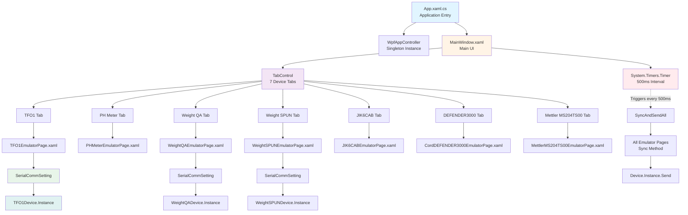
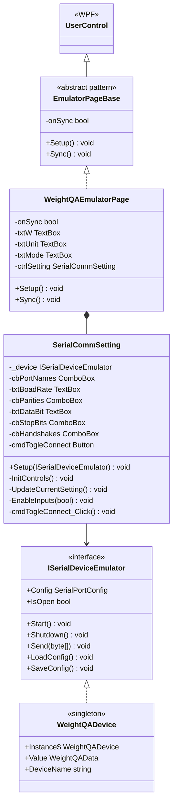
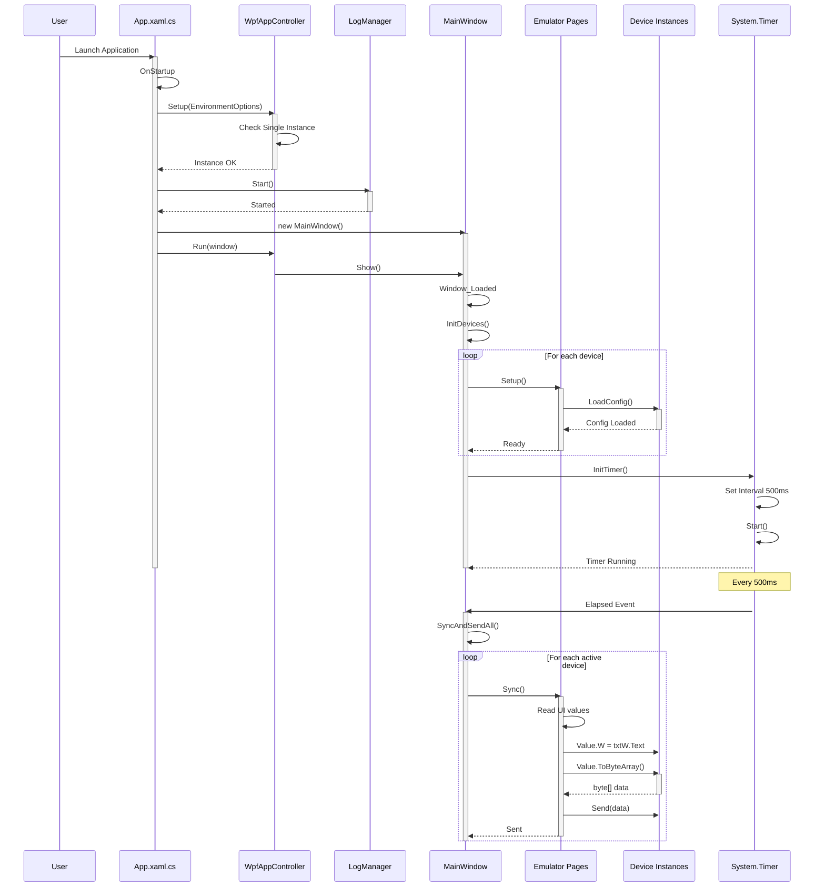
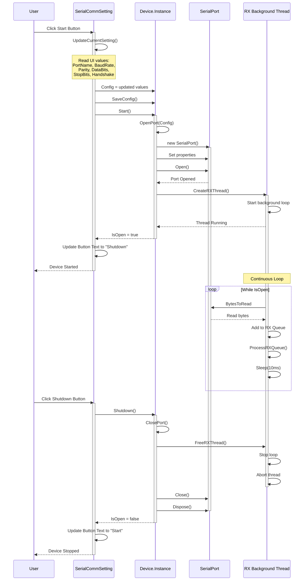
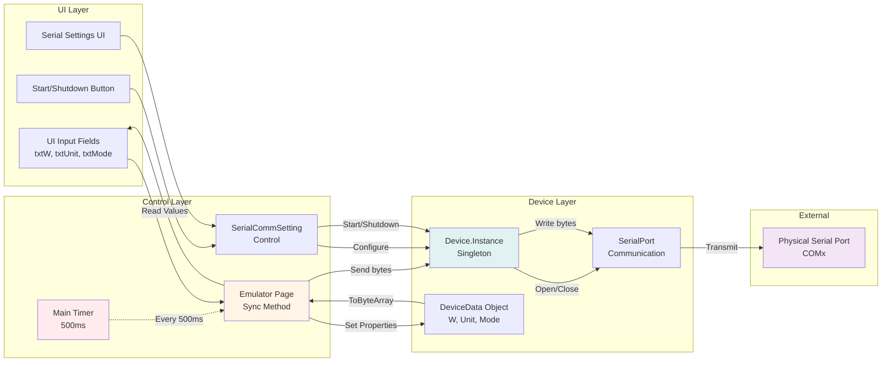
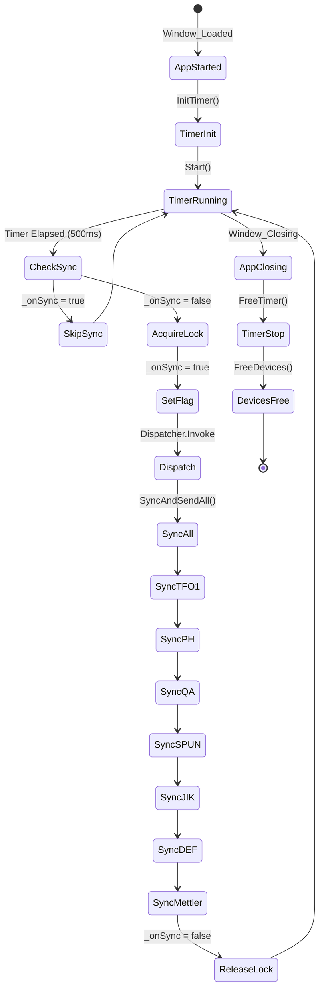

# NLib Serial Emulator App - Architecture Analysis

**Application Type:** WPF Desktop Application (.NET Framework 4.7.x)
**Purpose:** Serial device emulator for testing and development
**Location:** `09.App/NLib.Serial.Emulator.App/`

---

## Overview

The Serial Emulator App is a WPF-based desktop application that simulates serial devices for testing purposes. It allows developers to test serial communication without physical hardware by emulating device protocols.

### Key Features

- **Multi-Device Support:** Emulates 7 different serial devices simultaneously
- **Tabbed Interface:** Separate tab for each device emulator
- **Real-time Data Transmission:** Timer-based continuous data sending (500ms intervals)
- **Configurable Serial Settings:** Port, baud rate, parity, data bits, stop bits, handshake
- **Independent Device Control:** Each device can be started/stopped independently
- **Data Input UI:** Input fields for device-specific parameters

---

## Application Architecture



---

## Class Diagram - Emulator Page Structure



---

## Sequence Diagram - Application Startup



---

## Sequence Diagram - Device Start/Stop Flow



---

## Component Structure

### 1. Application Entry (App.xaml.cs)

**Responsibilities:**
- Application initialization
- Environment setup
- Log manager lifecycle
- Single instance enforcement
- Main window creation

**Key Code:**
```csharp
protected override void OnStartup(StartupEventArgs e)
{
    EnvironmentOptions option = new EnvironmentOptions()
    {
        AppInfo = new NAppInformation()
        {
            CompanyName = "Vseg",
            ProductName = "NLib Device Emulator",
            Version = "1.1.115"
        },
        Behaviors = new NAppBehaviors()
        {
            IsSingleAppInstance = true,
            EnableDebuggers = true
        }
    };

    WpfAppContoller.Instance.Setup(option);
    LogManager.Instance.Start();

    Window window = new MainWindow();
    WpfAppContoller.Instance.Run(window);
}
```

### 2. Main Window (MainWindow.xaml.cs)

**Responsibilities:**
- Central coordinator for all device emulators
- Timer management for periodic data transmission
- Device lifecycle management (Init/Free)
- UI composition with TabControl

**Key Features:**
- **Timer-based Sync:** 500ms interval timer triggers `SyncAndSendAll()`
- **Symmetric Init/Free:** Each device has matching Init/Free methods
- **Sequential Sync:** Calls Sync() on each page in order

**Key Code:**
```csharp
private void InitTimer()
{
    _timer = new Timer();
    _timer.Interval = 500; // 500 ms
    _timer.Elapsed += _timer_Elapsed;
    _timer.Start();
}

private void _timer_Elapsed(object sender, ElapsedEventArgs e)
{
    if (_onSync) return;
    _onSync = true;
    Dispatcher.Invoke(new Action(() => { SyncAndSendAll(); }));
    _onSync = false;
}

private void SyncAndSendAll()
{
    SendTFO1();
    SendPHMeter();
    SendWeightQA();
    SendWeightSPUN();
    SendJIK6CAB();
    SendDEFENDER3000();
    SendMettlerMS204TS00();
}
```

### 3. Emulator Pages (e.g., WeightQAEmulatorPage.xaml.cs)

**Responsibilities:**
- Device-specific UI inputs
- Data synchronization from UI to device
- Integration with SerialCommSetting control

**Pattern:**
```csharp
public void Setup()
{
    WeightQADevice.Instance.LoadConfig();
    ctrlSetting.Setup(WeightQADevice.Instance);
}

public void Sync()
{
    if (!WeightQADevice.Instance.IsOpen) return;
    if (onSync) return;

    onSync = true;
    var data = WeightQADevice.Instance.Value;

    data.W = decimal.Parse(txtW.Text);
    data.Unit = txtUnit.Text.Trim().ToUpper();
    data.Mode = txtMode.Text.Trim().ToUpper();

    var buffers = data.ToByteArray();
    WeightQADevice.Instance.Send(buffers);

    onSync = false;
}
```

### 4. Serial Communication Setting Control (SerialCommSetting.xaml.cs)

**Responsibilities:**
- Serial port configuration UI
- Device start/stop control
- Config persistence (load/save)

**UI Elements:**
- Port Name dropdown
- Baud Rate textbox
- Parity dropdown
- Data Bits textbox
- Stop Bits dropdown
- Handshake dropdown
- Start/Shutdown toggle button

**Key Code:**
```csharp
private void cmdTogleConnect_Click(object sender, RoutedEventArgs e)
{
    if (!_device.IsOpen)
    {
        UpdateCurrentSetting();
        _device.Start();
    }
    else
    {
        _device.Shutdown();
    }

    cmdTogleConnect.Content = (!_device.IsOpen) ? "Start" : "Shutdown";
}
```

---

## Data Flow Diagram



---

## Supported Devices

| # | Device Name | Tab Header | Page Class | Device Class |
|---|-------------|------------|------------|--------------|
| 1 | TFO1 | TFO1 | TFO1EmulatorPage | TFO1Device |
| 2 | PH Meter | PH Meter | PHMeterEmulatorPage | PHMeterDevice |
| 3 | Weight QA | Weight QA | WeightQAEmulatorPage | WeightQADevice |
| 4 | Weight SPUN | Weight SPUN | WeightSPUNEmulatorPage | WeightSPUNDevice |
| 5 | JIK6CAB | JIK6CAB | JIK6CABEmulatorPage | JIK6CABDevice |
| 6 | DEFENDER3000 | DEFENDER3000 | CordDEFENDER3000EmulatorPage | CordDEFENDER3000Device |
| 7 | Mettler MS204TS00 | Mettler MS204TS00 | MettlerMS204TS00EmulatorPage | MettlerMS204TS00Device |

---

## Timer-Based Synchronization Flow



---

## Configuration Management

### Config File Storage

**Location:** `{AppPath}/Configs/Devices/{DeviceName}.config.json`

**Example:** `WeightQA.config.json`
```json
{
  "DeviceName": "WeightQA",
  "PortName": "COM3",
  "BaudRate": 9600,
  "Parity": "None",
  "DataBits": 8,
  "StopBits": "One",
  "Handshake": "None"
}
```

### Config Lifecycle

1. **Load:** `Setup()` → `Device.Instance.LoadConfig()`
2. **Modify:** UI changes → `UpdateCurrentSetting()`
3. **Save:** `Device.SaveConfig()` → JSON file written
4. **Restore:** Next app launch → `LoadConfig()`

---

## Thread Safety Considerations

### UI Thread Synchronization

- Timer elapsed event uses `Dispatcher.Invoke` to marshal calls to UI thread
- `_onSync` flag prevents re-entrant timer callbacks
- Each page has its own `onSync` flag to prevent concurrent Sync() calls

### Device Thread Safety

- Serial port operations use internal `_lock` object
- RX queue operations are synchronized with `lock (_lock)`
- Background RX thread runs independently from UI

---

## Error Handling Strategy

### Serial Port Errors

```csharp
try
{
    _comm.Open();
}
catch (Exception ex2)
{
    med.Err(ex2.ToString());
}

if (!_comm.IsOpen)
{
    // Cleanup and return
    _comm.Close();
    _comm.Dispose();
    _comm = null;
    return;
}
```

### Data Parsing Errors

```csharp
try
{
    data.W = decimal.Parse(txtW.Text);
    data.Unit = txtUnit.Text.Trim().ToUpper();
    data.Mode = txtMode.Text.Trim().ToUpper();
}
catch { }  // Silent failure - uses previous values
```

---

## Usage Workflow

### Typical User Workflow

1. **Launch Application**
   - App starts with all devices stopped
   - Previous configurations loaded from JSON

2. **Select Device Tab**
   - Click on desired device tab

3. **Configure Serial Settings**
   - Select COM port from dropdown
   - Adjust baud rate if needed (default 9600)
   - Set parity, data bits, stop bits, handshake

4. **Click Start Button**
   - Device opens serial port
   - Button changes to "Shutdown"
   - Device begins transmitting

5. **Modify Device Data**
   - Enter weight value
   - Change unit (G, kg, etc.)
   - Update mode/status

6. **Auto-Transmission**
   - Timer sends data every 500ms
   - Changes reflected immediately on connected terminal

7. **Stop Emulation**
   - Click "Shutdown" button
   - Port closes, transmission stops

---

## Key Design Patterns

### 1. Singleton Pattern
- All device instances use singleton pattern
- Accessed via `DeviceName.Instance`

### 2. Template Method Pattern
- All emulator pages follow same structure:
  - `Setup()` - Initialize device and UI
  - `Sync()` - Synchronize UI to device and send

### 3. Observer Pattern (Implicit)
- Timer → MainWindow → EmulatorPages
- Event-driven architecture

### 4. Strategy Pattern
- Each device has its own `ToByteArray()` implementation
- Protocol-specific encoding strategies

---

## Testing Scenarios

### 1. Single Device Emulation
- Start one device
- Verify data transmission
- Change values in UI
- Confirm updates sent

### 2. Multi-Device Emulation
- Start multiple devices on different ports
- Verify no interference between devices
- Check timer cycles through all devices

### 3. Configuration Persistence
- Configure settings
- Close app
- Reopen app
- Verify settings restored

### 4. Error Conditions
- Invalid COM port
- Port already in use
- Invalid baud rate
- Disconnected cable

---

## Related Files

- **Application:** `09.App/NLib.Serial.Emulator.App/`
- **Core Devices:** `01.Core/NLib.Serial.Devices/`
- **Device Documentation:** `Documents/Design/Device-*.md`
- **Terminal App:** `09.App/NLib.Serial.Terminal.App/` (counterpart application)

---

## See Also

- [NLib.Serial.Devices Core Library](CODE_ANALYSIS_NLib.Serial.Devices.md)
- [Serial Terminal App Analysis](App-Terminal-Analysis.md)
- [Device Protocol Documentation](Device-01-CordDEFENDER3000.md)
