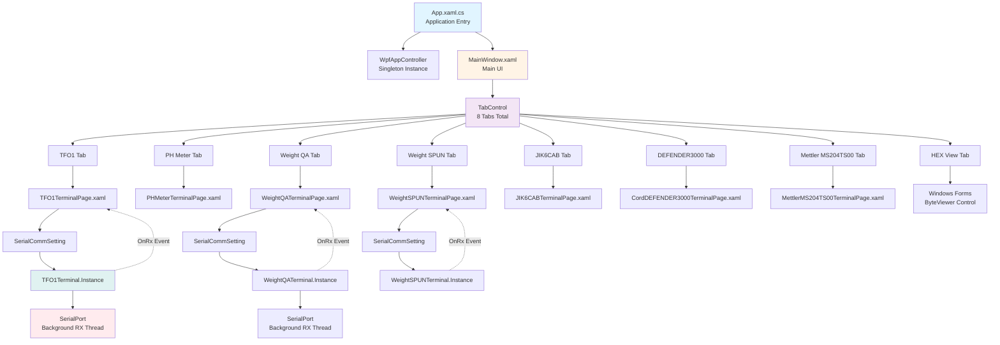
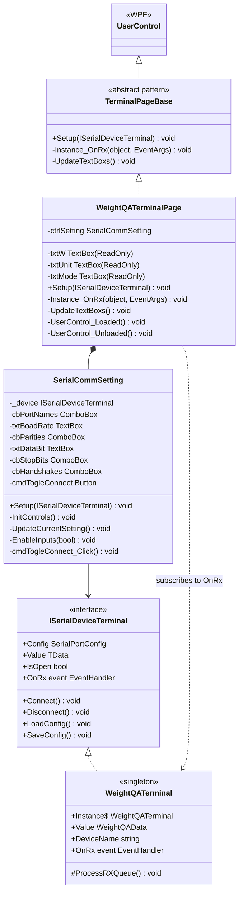
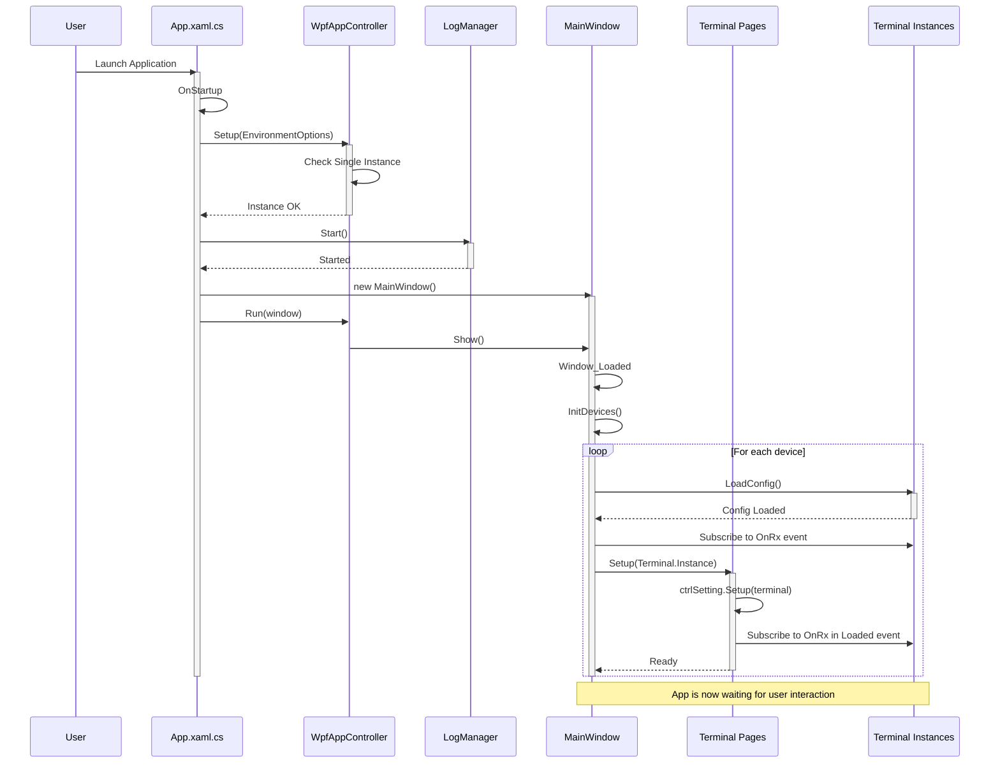
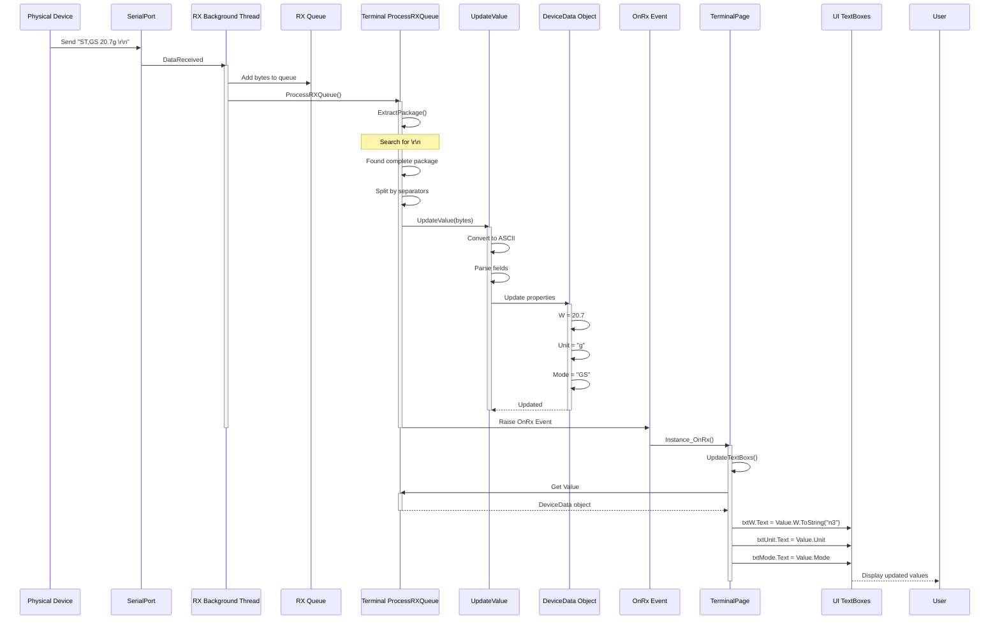
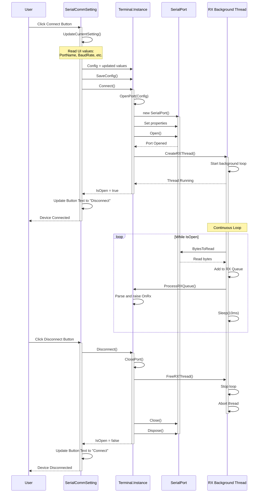
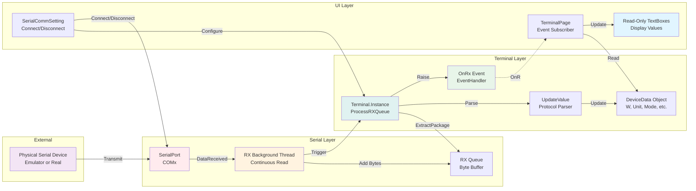
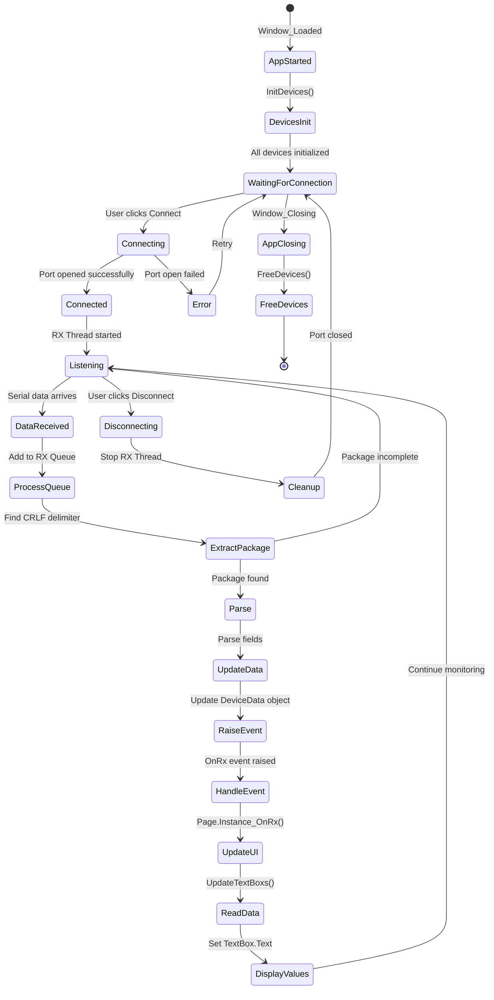

# NLib Serial Terminal App - Architecture Analysis

**Application Type:** WPF Desktop Application (.NET Framework 4.7.x)
**Purpose:** Serial device terminal for receiving and displaying data from serial devices
**Location:** `09.App/NLib.Serial.Terminal.App/`

---

## Overview

The Serial Terminal App is a WPF-based desktop application that receives and displays data from serial devices. It's the **counterpart to the Emulator App** - while the Emulator sends data, the Terminal receives and displays it.

### Key Features

- **Multi-Device Support:** Receives data from 7 different serial device types simultaneously
- **Tabbed Interface:** Separate tab for each device terminal
- **Event-Driven Updates:** OnRx event handler updates UI when data is received
- **Read-Only Display:** TextBoxes display received data (not editable)
- **HEX Viewer Tab:** Special tab with ByteViewer control for raw HEX data inspection
- **Configurable Serial Settings:** Port, baud rate, parity, data bits, stop bits, handshake
- **Independent Device Control:** Each device can be connected/disconnected independently

---

## Application Architecture



---

## Class Diagram - Terminal Page Structure



---

## Sequence Diagram - Application Startup



---

## Sequence Diagram - Data Reception Flow



---

## Sequence Diagram - Connect/Disconnect Flow



---

## Component Structure

### 1. Application Entry (App.xaml.cs)

**Responsibilities:**
- Application initialization
- Environment setup
- Log manager lifecycle
- Single instance enforcement
- Main window creation

**Key Code:**
```csharp
protected override void OnStartup(StartupEventArgs e)
{
    EnvironmentOptions option = new EnvironmentOptions()
    {
        AppInfo = new NAppInformation()
        {
            CompanyName = "Vseg",
            ProductName = "NLib Device Terminal",
            Version = "1.1.115"
        },
        Behaviors = new NAppBehaviors()
        {
            IsSingleAppInstance = true,
            EnableDebuggers = true
        }
    };

    WpfAppContoller.Instance.Setup(option);
    LogManager.Instance.Start();

    Window window = new MainWindow();
    WpfAppContoller.Instance.Run(window);
}
```

### 2. Main Window (MainWindow.xaml.cs)

**Responsibilities:**
- Central coordinator for all device terminals
- Device lifecycle management (Init/Free)
- Event handler registration
- UI composition with TabControl

**Key Differences from Emulator App:**
- **No Timer:** Terminal is event-driven (OnRx events), not timer-based
- **Event Subscription:** Each device has OnRx event handler
- **No Sync Methods:** Data flows from device to UI via events

**Key Code:**
```csharp
private void InitWeightQA()
{
    WeightQATerminal.Instance.LoadConfig();
    WeightQATerminal.Instance.OnRx += WeightQA_OnRx;  // Subscribe to OnRx
    WeightQAPage.Setup(WeightQATerminal.Instance);
}

private void FreeWeightQA()
{
    WeightQATerminal.Instance.Disconnect();
    WeightQATerminal.Instance.OnRx -= WeightQA_OnRx;  // Unsubscribe
}

private void WeightQA_OnRx(object sender, EventArgs e)
{
    // Event handler - can process data here if needed
    // Currently empty, as page handles its own updates
}
```

### 3. Terminal Pages (e.g., WeightQATerminalPage.xaml.cs)

**Responsibilities:**
- Display received data in read-only TextBoxes
- Subscribe to terminal's OnRx event
- Update UI when new data arrives
- Integration with SerialCommSetting control

**Key Pattern:**
```csharp
private void UserControl_Loaded(object sender, RoutedEventArgs e)
{
    WeightQATerminal.Instance.OnRx += Instance_OnRx;
}

private void UserControl_Unloaded(object sender, RoutedEventArgs e)
{
    WeightQATerminal.Instance.OnRx -= Instance_OnRx;
}

private void Instance_OnRx(object sender, EventArgs e)
{
    UpdateTextBoxs();
}

private void UpdateTextBoxs()
{
    var val = WeightQATerminal.Instance.Value;
    txtW.Text = val.W.ToString("n3");
    txtUnit.Text = val.Unit.ToString();
    txtMode.Text = val.Mode.ToString();
}

public void Setup(ISerialDeviceTerminal device)
{
    ctrlSetting.Setup(device);
}
```

### 4. Serial Communication Setting Control (SerialCommSetting.xaml.cs)

**Responsibilities:**
- Serial port configuration UI
- Device connect/disconnect control
- Config persistence (load/save)

**Key Difference from Emulator:**
- Button text: "Connect" / "Disconnect" (vs "Start" / "Shutdown")
- Uses `Connect()` / `Disconnect()` methods (vs `Start()` / `Shutdown()`)

**Key Code:**
```csharp
private void cmdTogleConnect_Click(object sender, RoutedEventArgs e)
{
    if (!_device.IsOpen)
    {
        UpdateCurrentSetting();
        _device.Connect();  // Connect to device
    }
    else
    {
        _device.Disconnect();  // Disconnect from device
    }

    cmdTogleConnect.Content = (!_device.IsOpen) ? "Connect" : "Disconnect";
}
```

### 5. HEX View Tab (Special Feature)

**Unique Component:**
- Uses Windows Forms `ByteViewer` control hosted in WPF
- Displays raw HEX data from serial port
- Useful for debugging protocol issues

**XAML:**
```xml
<WindowsFormsHost>
    <winformCtrl:ByteViewer x:Name="viewer" Dock="Fill" />
</WindowsFormsHost>
```

---

## Data Flow Diagram



---

## Supported Devices

| # | Device Name | Tab Header | Page Class | Terminal Class |
|---|-------------|------------|------------|----------------|
| 1 | TFO1 | TFO1 | TFO1TerminalPage | TFO1Terminal |
| 2 | PH Meter | PH Meter | PHMeterTerminalPage | PHMeterTerminal |
| 3 | Weight QA | Weight QA | WeightQATerminalPage | WeightQATerminal |
| 4 | Weight SPUN | Weight SPUN | WeightSPUNTerminalPage | WeightSPUNTerminal |
| 5 | JIK6CAB | JIK6CAB | JIK6CABTerminalPage | JIK6CABTerminal |
| 6 | DEFENDER3000 | DEFENDER3000 | CordDEFENDER3000TerminalPage | CordDEFENDER3000Terminal |
| 7 | Mettler MS204TS00 | Mettler MS204TS00 | MettlerMS204TS00TerminalPage | MettlerMS204TS00Terminal |
| 8 | HEX View | HEX View | N/A (ByteViewer) | N/A |

---

## Event-Driven Architecture



---

## Key Differences: Terminal vs Emulator App

| Aspect | Terminal App | Emulator App |
|--------|--------------|--------------|
| **Purpose** | Receive & Display data | Send data |
| **Data Flow** | Device → App → UI | UI → App → Device |
| **UI Fields** | Read-only TextBoxes | Editable TextBoxes |
| **Update Mechanism** | Event-driven (OnRx) | Timer-driven (500ms) |
| **Timer** | None | Yes (500ms interval) |
| **Button Text** | Connect / Disconnect | Start / Shutdown |
| **Methods** | Connect() / Disconnect() | Start() / Shutdown() |
| **Sync Method** | None (event updates UI) | Sync() reads UI values |
| **Event Handlers** | Subscribe to OnRx | No event subscriptions |
| **HEX View Tab** | Yes (ByteViewer) | No |
| **Total Tabs** | 8 (7 devices + HEX) | 7 (devices only) |

---

## Thread Safety Considerations

### Event Marshalling

**Terminal events are raised from RX background thread**, so UI updates must be marshalled to UI thread:

```csharp
// Terminal raises OnRx from RX thread
private void Instance_OnRx(object sender, EventArgs e)
{
    // This is called from background thread
    // WPF automatically marshals to UI thread for control updates
    UpdateTextBoxs();  // Safe because WPF handles marshalling
}
```

### Queue Synchronization

- RX queue operations use `lock (_lock)` for thread safety
- Background thread reads from serial port
- ProcessRXQueue accesses queue with lock protection

---

## Configuration Management

### Config File Storage

**Location:** `{AppPath}/Configs/Terminals/{DeviceName}.config.json`

**Example:** `WeightQATerminal.config.json`
```json
{
  "DeviceName": "WeightQA",
  "PortName": "COM3",
  "BaudRate": 9600,
  "Parity": "None",
  "DataBits": 8,
  "StopBits": "One",
  "Handshake": "None"
}
```

### Config Lifecycle

1. **Load:** `LoadConfig()` called during Init
2. **Modify:** UI changes → `UpdateCurrentSetting()`
3. **Save:** `SaveConfig()` → JSON file written
4. **Restore:** Next app launch → `LoadConfig()`

---

## Usage Workflow

### Typical User Workflow

1. **Launch Application**
   - App starts with all devices disconnected
   - Previous configurations loaded from JSON

2. **Select Device Tab**
   - Click on desired device tab

3. **Configure Serial Settings**
   - Select COM port from dropdown
   - Adjust baud rate if needed (default 9600)
   - Set parity, data bits, stop bits, handshake

4. **Click Connect Button**
   - Terminal opens serial port
   - Button changes to "Disconnect"
   - RX thread starts monitoring

5. **View Received Data**
   - Data automatically updates in TextBoxes
   - Real-time display as device sends data
   - OnRx event triggers UI updates

6. **Check HEX View (Optional)**
   - Switch to "HEX View" tab
   - View raw bytes in HEX format
   - Useful for debugging protocol issues

7. **Stop Reception**
   - Click "Disconnect" button
   - Port closes, reception stops

---

## Error Handling Strategy

### Serial Port Errors

```csharp
try
{
    _comm.Open();
}
catch (Exception ex2)
{
    med.Err(ex2.ToString());
}

if (!_comm.IsOpen)
{
    _comm.Close();
    _comm.Dispose();
    _comm = null;
    return;
}
```

### Data Parsing Errors

```csharp
try
{
    Value.W = decimal.Parse(weightStr, CultureInfo.InvariantCulture);
}
catch (Exception ex)
{
    med.Err(ex);  // Log error but continue
}
```

---

## Key Design Patterns

### 1. Singleton Pattern
- All terminal instances use singleton pattern
- Accessed via `TerminalName.Instance`

### 2. Observer Pattern
- OnRx event subscription mechanism
- Pages observe terminal data changes

### 3. Event-Driven Architecture
- No polling or timers
- Data reception triggers events
- UI updates in response to events

### 4. Facade Pattern
- SerialCommSetting provides unified interface to serial config
- Hides complexity of serial port setup

---

## Testing Scenarios

### 1. Single Device Reception
- Connect one terminal
- Verify data displays correctly
- Change values on emulator
- Confirm updates in terminal

### 2. Multi-Device Reception
- Connect multiple terminals on different ports
- Verify no interference between devices
- Check each receives correct data

### 3. Configuration Persistence
- Configure settings
- Close app
- Reopen app
- Verify settings restored

### 4. HEX View Verification
- Connect device
- Switch to HEX View tab
- Verify raw bytes match protocol specification

### 5. Error Conditions
- Invalid COM port
- Port already in use
- Disconnected cable during operation
- Malformed data packets

---

## Related Files

- **Application:** `09.App/NLib.Serial.Terminal.App/`
- **Core Terminals:** `01.Core/NLib.Serial.Devices/` (Terminal classes)
- **Device Documentation:** `Documents/Design/Device-*.md`
- **Emulator App:** `09.App/NLib.Serial.Emulator.App/` (counterpart application)

---

## See Also

- [NLib.Serial.Devices Core Library](CODE_ANALYSIS_NLib.Serial.Devices.md)
- [Serial Emulator App Analysis](App-Emulator-Analysis.md)
- [Device Protocol Documentation](Device-01-CordDEFENDER3000.md)
