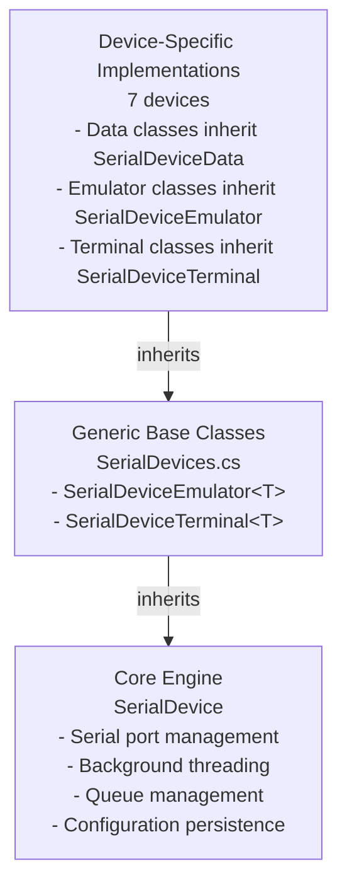
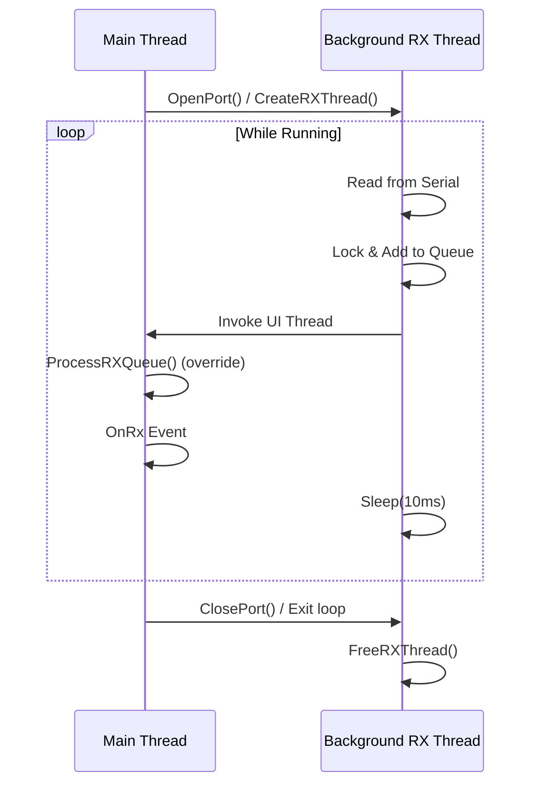

# NLib.Serial.Devices - Code Analysis

**Project:** NLib.Serial.Devices
**Technology:** .NET Framework 4.7.2
**Date:** 2025-10-08
**Location:** `01.Core\NLib.Serial.Devices\`

---

## Table of Contents
1. [Architecture Overview](#architecture-overview)
2. [Base Class Framework](#base-class-framework)
3. [Device Implementations](#device-implementations)
4. [Common Patterns](#common-patterns)
5. [Protocol Implementations](#protocol-implementations)

---

## Architecture Overview

### Three-Layer Architecture

The NLib.Serial.Devices library implements a **three-layer architecture** with clear separation of concerns:



### Key Namespaces

1. **NLib.Serial.Devices**
   - Device-specific data classes (e.g., `CordDEFENDER3000Data`, `JIK6CABData`)
   - All inherit from `SerialDeviceData`

2. **NLib.Serial.Emulators**
   - Device emulator classes (e.g., `CordDEFENDER3000Device`, `JIK6CABDevice`)
   - All inherit from `SerialDeviceEmulator<T>`
   - Simulate device behavior for testing

3. **NLib.Serial.Terminals**
   - Device terminal classes (e.g., `CordDEFENDER3000Terminal`, `JIK6CABTerminal`)
   - All inherit from `SerialDeviceTerminal<T>`
   - Connect to real physical devices

---

## Base Class Framework

### 1. SerialDeviceData (Abstract Base)
**File:** SerialDevices.cs (lines 679-797)

**Purpose:** Base class for all device-specific data models with property change notification.

**Key Features:**
- Implements `INotifyPropertyChanged` for data binding
- ASCII helper constants (`ascii.x0D`, `ascii.x0A`)
- Lambda-based property change notification

**Abstract Methods:**
```csharp
public abstract byte[] ToByteArray();    // Serialize data for transmission
public abstract void Parse(byte[] buffers); // Parse received data
```

**Usage Pattern:**
```csharp
public class MyDeviceData : SerialDeviceData
{
    private decimal _weight;

    public decimal Weight
    {
        get { return _weight; }
        set
        {
            if (_weight != value)
            {
                _weight = value;
                Raise(() => this.Weight); // Notify UI
            }
        }
    }
}
```

---

### 2. SerialDevice (Abstract Core Engine)
**File:** SerialDevices.cs (lines 834-1361)

**Purpose:** Core serial communication engine with background thread processing.

**Architecture:** Template Method Pattern

#### Threading Model



#### Key Methods

**Port Management:**
- `OpenPort()` - Opens serial port with configuration
- `ClosePort()` - Closes port and stops background thread
- `Send(byte[] data)` - Thread-safe data transmission

**Queue Management:**
- `ProcessRXQueue()` - **Abstract** - Must be implemented by derived classes
- `ClearQueue()` - Clear receive buffer
- `MaxRxQueueSize` - Queue size limit (default: 1000 bytes)

**Helper Methods:**
- `IndexOf(byte[] source, byte[] pattern)` - Find byte pattern
- `Split(byte[] source, byte[] separator)` - Split byte array

**Configuration:**
- `LoadConfig()` - Load from JSON: `{AppConfigPath}\Devices\{DeviceName}.config.json`
- `SaveConfig()` - Save configuration to JSON

---

### 3. SerialDeviceEmulator<T>
**File:** SerialDevices.cs (lines 1385-1434)

**Purpose:** Base class for device emulators (simulate hardware).

**Generic Constraint:** `where T : SerialDeviceData, new()`

**Key Methods:**
- `Start()` - Start emulation (opens virtual port)
- `Shutdown()` - Stop emulation (closes port)
- `Value` - Strongly-typed data container

**Usage:** Create virtual devices for testing without hardware.

---

### 4. SerialDeviceTerminal<T>
**File:** SerialDevices.cs (lines 1458-1507)

**Purpose:** Base class for device terminals (connect to real hardware).

**Generic Constraint:** `where T : SerialDeviceData, new()`

**Key Methods:**
- `Connect()` - Connect to device (opens port)
- `Disconnect()` - Disconnect (closes port)
- `Value` - Strongly-typed data container

**Usage:** Communicate with physical devices.

---

## Device Implementations

### Summary Table

| Device | Protocol Complexity | Data Fields | Special Features |
|--------|-------------------|-------------|------------------|
| **CordDEFENDER3000** | Simple | W, Unit, O | Single-line weight |
| **JIK6CAB** | Complex | TW, NW, GW, PCS, Date | Multi-line package parser |
| **MettlerMS204TS00** | Simple | W, Unit, Mode | High precision (0.0001g) |
| **PHMeter** | Medium | pH, TempC, Date | Temperature compensation |
| **TFO1** | Very Complex | F, H, Q, X, A, W0-W4, W1-W2, B, C, V | Binary + ASCII mixed |
| **WeightQA** | Medium | W, Unit, Mode | Stability index (/0-8) |
| **WeightSPUN** | Simple | W, Unit, O | Similar to DEFENDER3000 |

---

### Device 1: CordDEFENDER3000
**File:** CordDEFENDER3000.cs

#### Protocol
- **Format:** `[spaces][weight] kg [spaces][status]\r\n`
- **Example:** `   0.360 kg    G\r\n`
- **Line Terminator:** `\r\n` (0x0D 0x0A)

#### Data Class: CordDEFENDER3000Data
**Properties:**
- `decimal W` - Weight value
- `string Unit` - Unit (default: "kg")
- `string O` - Status (G=Gross, N=Net, ?G/?N=Unstable)

**ToByteArray() Implementation:**
```csharp
// Format: "   0.360 kg    G\r\n"
output = ((double)W).ToString("F3").PadLeft(8, ' ');
output += " " + unit.PadLeft(2, ' ');
output += " " + O.PadLeft(4, ' ');
output += ascii.x0D + ascii.x0A;
```

#### Terminal Class: CordDEFENDER3000Terminal
**Parsing Logic:**
1. Extract package ending with `\r\n`
2. Split by spaces (RemoveEmptyEntries)
3. Parse elements: `[0]=weight, [1]=unit, [2]=status`
4. Handle exceptions with error logging

**Key Methods:**
- `ExtractPackage()` - Extract data ending with `\r\n`
- `UpdateValue()` - Parse single line of weight data

---

### Device 2: JIK6CAB (Most Complex)
**File:** CordJIK6CAB.cs

#### Protocol
- **Format:** Multi-line structured response (14 lines)
- **Package Markers:** Starts with `^KJIK000`, ends with `~P1`

```
^KJIK000
2023-11-07
17:19:38
  0.00 kg    (Tare Weight)
  1.94 kg    (Gross Weight)
0
0
  1.94 kg    (Net Weight)
  1.94 kg    (Display Weight)
    0 pcs    (Piece Count)


E
~P1
```

#### Data Class: JIK6CABData
**Properties:**
- `DateTime Date` - Timestamp
- `decimal TW` - Tare weight
- `decimal GW` - Gross weight
- `decimal NW` - Net weight
- `decimal PCS` - Piece count
- `string TUnit, NUnit, GUnit` - Units for each weight

**ToByteArray() Implementation:**
Constructs 14-line response with proper formatting:
- Date format: `dd-MM-yyyy`
- Time format: `HH:mm:ss`
- Weight format: `F2` (2 decimal places), padded left 6 chars

#### Terminal Class: JIK6CABTerminal
**Parsing Logic - State Machine:**
```csharp
private bool bCompleted = true;     // Package completion flag
private DateTime? date = null;
private decimal? tw, nw, gw, pcs = null;
private string tu, nu, gu = null;

States:
1. Idle (bCompleted = true)
2. Package Started (detected "KJIK")
   - Set bCompleted = false
   - Clear all temp variables
3. Parsing Lines
   - Lines with "g" → Weight values (TW, GW, NW sequence)
   - Lines with "pcs" → Piece count
   - Lines with "-" or "/" → Date parsing
   - Lines with ":" → Time parsing
4. Package Complete (detected "P1")
   - Assign all temp values to Value object
   - Set bCompleted = true
```

**Key Methods:**
- `ExtractPackage()` - Extract data ending with `\r\n`
- `UpdateValue()` - State machine parser for multi-line protocol
- Uses nullable types to track parsing progress

---

### Device 3: MettlerMS204TS00 (Precision Balance)
**File:** MettlerMS204TS00.cs

#### Protocol
- **Format:** `[mode][spaces][weight] g[spaces]\r\n`
- **Example:** `     N       0.3746 g   \r\n`
- **Precision:** 4 decimal places (0.0001 g)

#### Data Class: MettlerMS204TS00Data
**Properties:**
- `string Mode` - Mode indicator (N, G, T)
- `decimal W` - Weight (high precision)
- `string Unit` - Unit (default: "g")

**ToByteArray() Implementation:**
```csharp
output += " " + mode.PadLeft(5, ' ');
output += " " + ((double)W).ToString("0.0000").PadLeft(12, ' ');
output += " " + unit.PadRight(4, ' ');
output += ascii.x0D + ascii.x0A;
```

#### Terminal Class: MettlerMS204TS00Terminal
**Parsing Logic:**
1. Check first char for mode (N/G/T or numeric)
2. Extract mode character if present
3. Split remaining line by unit ("KG" or "G")
4. Parse weight value with error handling

---

### Device 4: PHMeter
**File:** PHMeter.cs

#### Protocol
- **Format:** Multi-line with pH, temperature, date/time
- **Example:**
```
3.01pH 25.5°C ATC
20-Feb-2023
11:12

3.01pH
25.5°C ATC
Auto EP Standard
Blank


```

#### Data Class: PHMeterData
**Properties:**
- `decimal pH` - pH value
- `decimal TempC` - Temperature in Celsius
- `DateTime Date` - Timestamp

**ToByteArray() Implementation:**
- Uses `0xF8` byte for degree symbol (°)
- Includes multiple "ATC" lines (configurable count)
- Date format: `dd-MMM-yyyy`
- Time format: `HH:mm`

#### Terminal Class: PHMeterTerminal
**Parsing Logic - Pattern Matching:**
```csharp
if (line.Contains("ATC") && line.Contains("pH"))
    // Parse both pH and temperature: "3.01pH 25.5°C ATC"
else if (line.Contains("ATC") && !line.Contains("pH"))
    // Parse temperature only: "25.5°C ATC"
else if (!line.Contains("ATC") && line.Contains("pH"))
    // Parse pH only: "3.01pH"
else if (line.Contains("-"))
    // Parse date: "20-Feb-2023"
else if (line.Contains(":"))
    // Parse time: "11:12"
```

**Temperature Parsing:**
```csharp
int iTmp = line.IndexOf("C ATC");
string sTmp = line.Substring(0, iTmp - 1); // Skip °C symbol
Value.TempC = decimal.Parse(sTmp);
```

---

### Device 5: TFO1 (Industrial System)
**File:** TFO1.cs

#### Protocol
- **Format:** Mixed binary and ASCII, field-identifier based
- **Field Identifiers:** Single character (F, H, Q, X, A, 0-4, B, C, V)
- **Line Separator:** `\r` (0x0D) only (not \r\n)

**Example:**
```
F      0.0\r
H      0.0\r
Q      0.0\r
X      0.0\r
A    366.0\r
0     23.0\r
4    343.5\r
1      0.0\r
2        0\r
B[0x83]\r
C20[0xF4] 02[0xF3] 2023[0xF2] MON 09:20AM\r
V[0x31]\r\n
```

#### Data Class: TFO1Data
**Properties:**
- `decimal F, H, Q, X, A` - Unknown parameters (likely sensor readings)
- `decimal W0, W4, W1` - Weight channels
- `int W2` - Counter
- `byte B` - Status byte (default: 0x83)
- `DateTime C` - Timestamp
- `byte V` - Version (default: 0x31 = '1')

**ToByteArray() Implementation:**
- Custom date encoding with special bytes (0xF4, 0xF3, 0xF2)
- Mixed ASCII and binary data
- Format: `C20[ô] 02[ó] 2023[ò] MON 09:20AM`

#### Terminal Class: TFO1Terminal
**Parsing Logic - Switch Statement:**
```csharp
char hdr = (char)content[0];
switch (hdr)
{
    case 'F': // 11 bytes: "F      0.0\r"
        string val = Encoding.ASCII.GetString(content, 1, 9);
        Value.F = decimal.Parse(val);
        break;
    case 'H': // Similar pattern
    case 'Q':
    case 'X':
    case 'A':
    case '0': // W0
    case '4': // W4
    case '1': // W1
    case '2': // W2 (8 chars, integer)
    case 'B': // 3 bytes: "B[byte]\r"
        Value.B = content[1];
        break;
    case 'C': // 27 bytes: Date/time with special encoding
        // Extract positions: dd(1-2), mm(5-6), yyyy(9-12), hh(19-20), mi(22-23), am/pm(24-25)
        break;
    case 'V': // 4 bytes: "V1\r\n"
        Value.V = content[1];
        break;
}
```

**Date Parsing Bug Found:**
```csharp
// Line 663: Logic error in AM/PM handling
if (_ampm == "AM") mi += 12;  // Should be PM that adds 12, not AM!
```

---

### Device 6: WeightQA (Quality Assurance Scale)
**File:** WeightQA.cs

#### Protocol
- **Format:** `[sign][weight]/[stability] [unit] [mode]\r\n`
- **Example:** `+007.12/3 G S\r\n`
- **Stability Index:** 0 (stable) to 8 (unstable)

#### Data Class: WeightQAData
**Properties:**
- `decimal W` - Weight value
- `string Unit` - Unit (default: "G")
- `string Mode` - Mode (default: "S")

**ToByteArray() Implementation:**
```csharp
// Unique encoding: Last digit of weight becomes stability index
string actualW = ((double)W).ToString("F3").PadLeft(7, '0');
string firstPart = actualW.Substring(0, actualW.Length - 1); // "007.12"
string lastDigit = actualW.Substring(actualW.Length - 1, 1); // "3"
output = "+" + firstPart + "/" + lastDigit + " " + unit + " " + mode;
```

**Example:** Weight 7.123 → `+007.12/3`

#### Terminal Class: WeightQATerminal
**Parsing Logic:**
```csharp
// Split by '/' to separate weight and stability
string[] parts = line.Split(new char[] { '/' });
if (parts.Length >= 2)
{
    string weightPart = parts[0].Trim('+'); // Remove sign
    Value.W = decimal.Parse(weightPart);

    // Extract stability, unit, mode from second part
    string[] rest = parts[1].Split(new char[] { ' ' });
    // rest[0] = stability index
    // rest[1] = unit
    // rest[2] = mode
}
```

---

### Device 7: WeightSPUN (Dynamic Weight Scale)
**File:** WeightSPUN.cs

#### Protocol
- **Format:** `[spaces][weight] kg [spaces][status]\r\n`
- **Example:** `    20.0 kg    G\r\n`
- **Very similar to DEFENDER3000** but different precision

#### Data Class: WeightSPUNData
**Properties:**
- `decimal W` - Weight value
- `string Unit` - Unit (default: "kg")
- `string O` - Status (G, ?G)

**ToByteArray() Implementation:**
```csharp
// F1 = 1 decimal place (vs F3 for DEFENDER3000)
output = ((double)W).ToString("F1").PadLeft(8, ' ');
output += " " + unit.PadLeft(2, ' ');
output += " " + O.PadLeft(4, ' ');
output += ascii.x0D + ascii.x0A;
```

**Differences from DEFENDER3000:**
- Precision: F1 (0.1 kg) vs F3 (0.005 kg)
- Higher capacity range (observed up to 94.6 kg)

#### Terminal Class: WeightSPUNTerminal
**Parsing Logic:** Identical to DEFENDER3000Terminal
- Split by spaces
- Extract weight, unit, status
- Same error handling

---

## Common Patterns

### Pattern 1: Package Extraction
**All terminals use similar extraction logic:**

```csharp
private byte[] ExtractPackage()
{
    if (null == this.Queues || this.Queues.Count <= 0)
        return null;

    byte[] buffers;
    byte[] endPatterns = new byte[] { 0x0D, 0x0A }; // \r\n

    lock (_lock)
    {
        buffers = this.Queues.ToArray(); // Thread-safe copy
    }

    int idx = this.IndexOf(buffers, endPatterns);

    if (idx != -1)
    {
        int len = idx + endPatterns.Length;
        byte[] rawPackages = new byte[len];
        Array.Copy(buffers, rawPackages, len);

        lock (_lock)
        {
            this.Queues.RemoveRange(0, len); // Remove extracted data
        }
        return rawPackages;
    }

    return null;
}
```

**Key Points:**
- Thread-safe queue access with locks
- Non-destructive pattern search (IndexOf)
- Removes only successfully extracted packages

---

### Pattern 2: ProcessRXQueue Override
**All terminals implement this template:**

```csharp
protected override void ProcessRXQueue()
{
    byte[] rawPackage = ExtractPackage();
    if (null == rawPackage)
        return; // No complete package available

    byte[] separaters = new byte[] { 0x0D, 0x0A };
    byte[][] contents = Split(rawPackage, separaters);
    UpdateValues(contents); // or UpdateValue(contents)
}
```

**Variations:**
- **TFO1:** Uses `{ 0x0D }` only (no 0x0A)
- **Most others:** Use `{ 0x0D, 0x0A }`

---

### Pattern 3: Singleton Access
**All device emulators and terminals use singleton pattern:**

```csharp
private static MyDeviceTerminal _instance = null;

public static MyDeviceTerminal Instance
{
    get
    {
        if (null == _instance)
        {
            lock (typeof(MyDeviceTerminal))
            {
                _instance = new MyDeviceTerminal();
            }
        }
        return _instance;
    }
}

private MyDeviceTerminal() { } // Private constructor
```

**Benefits:**
- Single instance per device type
- Thread-safe initialization
- Prevents multiple connections to same device

---

### Pattern 4: Property Change Notification
**All data classes follow this pattern:**

```csharp
private decimal _W = decimal.Zero;

public decimal W
{
    get { return _W; }
    set
    {
        if (_W != value)
        {
            _W = value;
            Raise(() => this.W); // Lambda-based notification
        }
    }
}
```

**Benefits:**
- Automatic UI updates via data binding
- Prevents unnecessary notifications
- Type-safe property names via lambda

---

### Pattern 5: Error Handling
**All parsing methods use reflection-based error logging:**

```csharp
private void UpdateValue(byte[] content)
{
    MethodBase med = MethodBase.GetCurrentMethod();

    try
    {
        // Parsing logic
        Value.W = decimal.Parse(weightString);
    }
    catch (Exception ex)
    {
        med.Err(ex); // NLib extension method for logging
    }
}
```

**Benefits:**
- Automatic method name in error log
- Non-critical errors don't crash application
- Continues processing next data

---

## Protocol Implementations

### Complexity Comparison

#### Simple Protocols (Single-Line)
**DEFENDER3000, WeightSPUN, MettlerMS204TS00**
- Single line per reading
- Fixed-width formatting
- Simple space-delimited parsing
- Direct string-to-decimal conversion

**Pros:**
- Easy to implement
- Fast parsing
- Low memory usage

**Cons:**
- Limited information per reading
- No built-in error detection

---

#### Medium Complexity (Multi-Line)
**PHMeter, WeightQA**
- Multiple lines of related data
- Pattern matching required
- Some special encoding (degree symbol)

**PHMeter Challenges:**
- Multiple formats for pH/temperature
- Optional fields
- Embedded special characters (0xF8 for °)

**WeightQA Challenges:**
- Stability index encoding (last digit)
- Reconstruction of full weight value

---

#### High Complexity (Structured Packets)
**JIK6CAB**
- 14-line structured response
- Package markers (^KJIK000, ~P1)
- Multiple weight types (T, G, N)
- Date/time included
- Piece counting

**Parsing Strategy:** State machine
- Track package boundaries
- Sequential parsing of known line positions
- Nullable types for incomplete data
- Commit all values at package end

---

#### Very High Complexity (Binary/ASCII Mixed)
**TFO1**
- Field-identifier protocol
- Mixed binary and ASCII
- Custom date encoding
- Multiple channels/parameters
- Version tracking

**Parsing Strategy:** Switch on header byte
- Each field has unique identifier character
- Fixed field lengths
- Special byte sequences for date/time
- Binary status bytes

---

## Design Strengths

### 1. **Separation of Concerns**
- **Data layer** (SerialDeviceData): Pure data models
- **Communication layer** (SerialDevice): Port management, threading
- **Application layer** (Emulator/Terminal): Usage patterns

### 2. **Extensibility**
- Add new device: Inherit from base classes
- Override only device-specific methods
- Reuse all infrastructure code

### 3. **Type Safety**
- Generic constraints enforce SerialDeviceData inheritance
- Compile-time type checking
- IntelliSense support for device data

### 4. **Thread Safety**
- Lock-protected queue access
- Background RX thread
- UI thread invocation for notifications

### 5. **Maintainability**
- Consistent patterns across devices
- Well-documented protocol specifications in comments
- Error logging throughout

---

## Areas for Improvement

### 1. **Error Recovery**
Some devices lack robust error recovery:
- Partial package handling
- Corrupted data detection
- Timeout mechanisms

### 2. **Protocol Validation**
Missing checksum/CRC validation:
- No data integrity checking
- Assumes clean serial communication

### 3. **Configuration**
Limited runtime configuration:
- Baud rate hardcoded in some cases
- No protocol negotiation

### 4. **Testing**
No unit tests visible:
- Protocol parsing could benefit from unit tests
- Edge cases not explicitly handled

### 5. **Documentation**
Code comments are minimal:
- Protocol specifications in ToByteArray() are helpful
- But parsing logic could use more comments

### 6. **Bug Found**
TFO1.cs line 663: AM/PM logic error
```csharp
// CURRENT (WRONG):
if (_ampm == "AM") mi += 12;

// SHOULD BE:
if (_ampm == "PM") mi += 12;
```

---

## Usage Patterns

### Emulator Usage (Testing)
```csharp
// Start virtual device
var emulator = CordDEFENDER3000Device.Instance;
emulator.LoadConfig(); // Load COM port settings
emulator.Start();      // Open port

// Simulate device sending data
emulator.Value.W = 12.345m;
emulator.Value.Unit = "kg";
emulator.Value.O = "G";
byte[] data = emulator.Value.ToByteArray();
// Data is sent automatically via background thread
```

### Terminal Usage (Real Device)
```csharp
// Connect to physical device
var terminal = CordDEFENDER3000Terminal.Instance;
terminal.LoadConfig(); // Load COM port settings
terminal.Connect();    // Open port and start RX thread

// Listen for updates
terminal.OnRx += (s, e) => {
    Console.WriteLine($"Weight: {terminal.Value.W} {terminal.Value.Unit}");
};

// Send command (if needed)
byte[] command = Encoding.ASCII.GetBytes("READ\r\n");
terminal.Send(command);

// Disconnect
terminal.Disconnect();
```

---

## Performance Characteristics

### Threading
- **Background RX Thread:** 10ms polling interval
- **Queue Processing:** On UI thread via Invoke
- **Maximum Queue Size:** 1000 bytes (configurable)

### Memory Usage
- **Queue Buffer:** Up to 1KB per device instance
- **Data Objects:** Minimal (few decimal/string fields)
- **Singletons:** One instance per device type

### Throughput
- Depends on baud rate (typically 9600-19200)
- ~100 weight readings/second possible (simple protocols)
- Multi-line protocols slower (JIK6CAB: ~10 readings/second)

---

## Summary

The NLib.Serial.Devices library demonstrates **excellent software architecture principles**:

✅ **Template Method Pattern** for consistent device implementation
✅ **Generic type constraints** for type safety
✅ **Singleton pattern** for device instance management
✅ **Observer pattern** for data binding
✅ **Thread-safe** queue and port management
✅ **Extensible** design for adding new devices
✅ **Configuration persistence** via JSON

The library successfully abstracts away the complexity of serial communication while providing device-specific parsing implementations for 7 different industrial devices with varying protocol complexities.
