# Device Implementation - Detailed Diagrams

**Project:** NLib.Serial.Devices
**Technology:** .NET Framework 4.7.2
**Date:** 2025-10-08

This document provides detailed Mermaid diagrams for each device implementation, including state diagrams, sequence diagrams, and flowcharts.

---

## Table of Contents
1. [Device 1: CordDEFENDER3000](#device-1-corddefender3000)
2. [Device 2: JIK6CAB](#device-2-jik6cab)
3. [Device 3: MettlerMS204TS00](#device-3-mettlerms204ts00)
4. [Device 4: PHMeter](#device-4-phmeter)
5. [Device 5: TFO1](#device-5-tfo1)
6. [Device 6: WeightQA](#device-6-weightqa)
7. [Device 7: WeightSPUN](#device-7-weightspun)

---

## Device 1: CordDEFENDER3000

### Overview
Simple weight scale with continuous streaming protocol.

**Protocol:** `[spaces][weight] kg [spaces][status]\r\n`
**Example:** `   0.360 kg    G\r\n`

### Class Diagram

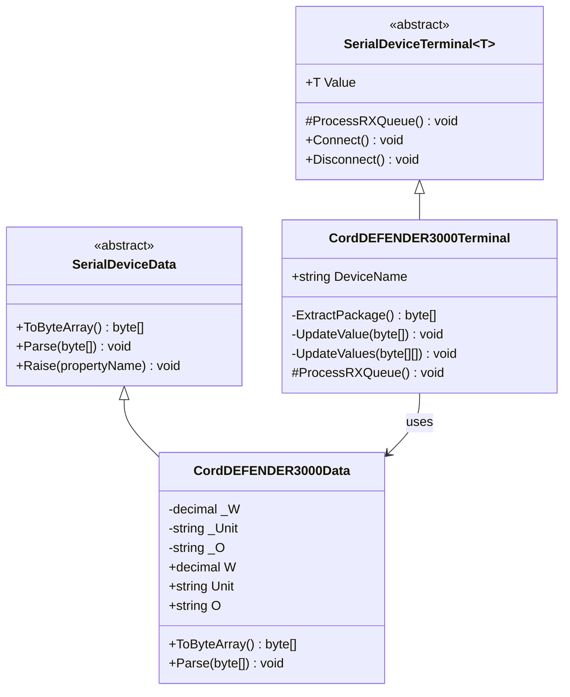
```mermaid
classDiagram
    class SerialDeviceData {
        <<abstract>>
        +ToByteArray() byte[]
        +Parse(byte[]) void
        +Raise(propertyName) void
    }

    class CordDEFENDER3000Data {
        -decimal _W
        -string _Unit
        -string _O
        +decimal W
        +string Unit
        +string O
        +ToByteArray() byte[]
        +Parse(byte[]) void
    }

    class SerialDeviceTerminal~T~ {
        <<abstract>>
        #ProcessRXQueue() void
        +Connect() void
        +Disconnect() void
        +T Value
    }

    class CordDEFENDER3000Terminal {
        -ExtractPackage() byte[]
        -UpdateValue(byte[]) void
        -UpdateValues(byte[][]) void
        #ProcessRXQueue() void
        +string DeviceName
    }

    SerialDeviceData <|-- CordDEFENDER3000Data
    SerialDeviceTerminal <|-- CordDEFENDER3000Terminal
    CordDEFENDER3000Terminal --> CordDEFENDER3000Data : uses
```

### Sequence Diagram - Data Reception

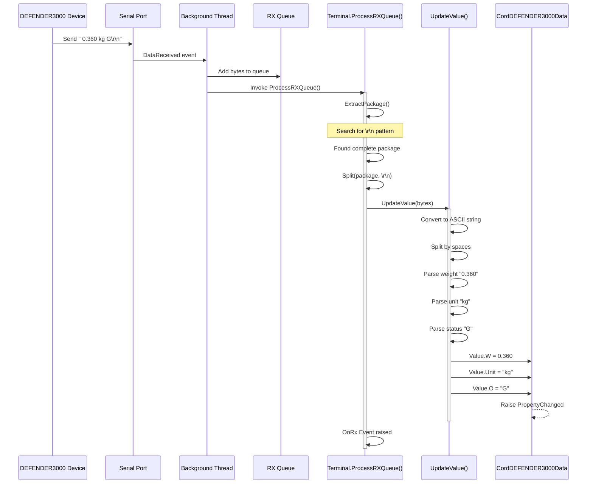
```mermaid
sequenceDiagram
    participant Device as DEFENDER3000 Device
    participant Serial as Serial Port
    participant BG as Background Thread
    participant Queue as RX Queue
    participant Terminal as Terminal.ProcessRXQueue()
    participant Parser as UpdateValue()
    participant Data as CordDEFENDER3000Data

    Device->>Serial: Send "   0.360 kg    G\r\n"
    Serial->>BG: DataReceived event
    BG->>Queue: Add bytes to queue
    BG->>Terminal: Invoke ProcessRXQueue()
    activate Terminal

    Terminal->>Terminal: ExtractPackage()
    Note over Terminal: Search for \r\n pattern
    Terminal->>Terminal: Found complete package
    Terminal->>Terminal: Split(package, \r\n)

    Terminal->>Parser: UpdateValue(bytes)
    activate Parser
    Parser->>Parser: Convert to ASCII string
    Parser->>Parser: Split by spaces
    Parser->>Parser: Parse weight "0.360"
    Parser->>Parser: Parse unit "kg"
    Parser->>Parser: Parse status "G"

    Parser->>Data: Value.W = 0.360
    Parser->>Data: Value.Unit = "kg"
    Parser->>Data: Value.O = "G"
    Data-->>Data: Raise PropertyChanged
    deactivate Parser

    Terminal->>Terminal: OnRx Event raised
    deactivate Terminal
```

### Flowchart - Parsing Logic

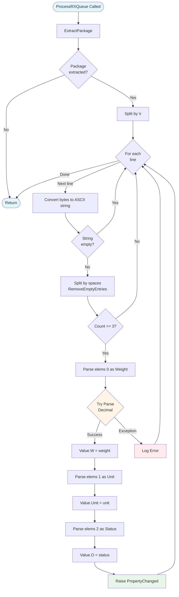
```mermaid
flowchart TD
    Start([ProcessRXQueue Called]) --> Extract[ExtractPackage]
    Extract --> CheckNull{Package<br/>extracted?}
    CheckNull -->|No| End([Return])
    CheckNull -->|Yes| Split[Split by \r\n]

    Split --> Loop{For each<br/>line}
    Loop -->|Next line| Convert[Convert bytes to ASCII string]
    Convert --> CheckEmpty{String<br/>empty?}
    CheckEmpty -->|Yes| Loop
    CheckEmpty -->|No| SplitSpaces[Split by spaces<br/>RemoveEmptyEntries]

    SplitSpaces --> CheckCount{Count >= 3?}
    CheckCount -->|No| Loop
    CheckCount -->|Yes| ParseWeight[Parse elems 0 as Weight]

    ParseWeight --> TryCatch{Try Parse<br/>Decimal}
    TryCatch -->|Success| SetW[Value.W = weight]
    TryCatch -->|Exception| LogError[Log Error]
    LogError --> Loop

    SetW --> ParseUnit[Parse elems 1 as Unit]
    ParseUnit --> SetUnit[Value.Unit = unit]
    SetUnit --> ParseStatus[Parse elems 2 as Status]
    ParseStatus --> SetStatus[Value.O = status]
    SetStatus --> Notify[Raise PropertyChanged]
    Notify --> Loop

    Loop -->|Done| End

    style Start fill:#e1f5ff
    style End fill:#e1f5ff
    style TryCatch fill:#fff4e6
    style LogError fill:#ffebee
    style Notify fill:#e8f5e9
```

### State Diagram - Device Status

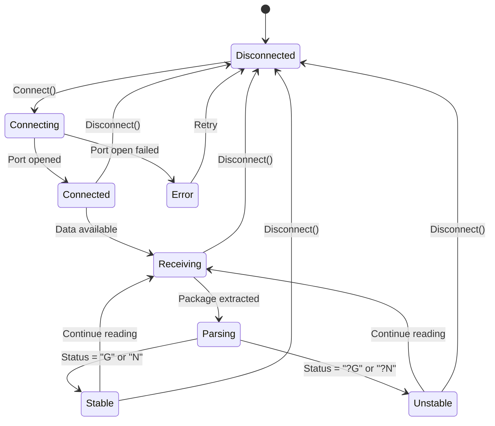
```mermaid
stateDiagram-v2
    [*] --> Disconnected

    Disconnected --> Connecting: Connect()
    Connecting --> Connected: Port opened
    Connecting --> Error: Port open failed
    Error --> Disconnected: Retry

    Connected --> Receiving: Data available
    Receiving --> Parsing: Package extracted
    Parsing --> Stable: Status = "G" or "N"
    Parsing --> Unstable: Status = "?G" or "?N"

    Stable --> Receiving: Continue reading
    Unstable --> Receiving: Continue reading

    Stable --> Disconnected: Disconnect()
    Unstable --> Disconnected: Disconnect()
    Connected --> Disconnected: Disconnect()
    Receiving --> Disconnected: Disconnect()
```

---

## Device 2: JIK6CAB

### Overview
Complex multi-line weight scale with package markers and state machine parser.

**Protocol:** 14-line structured package
**Markers:** Start=`^KJIK000`, End=`~P1`

### Class Diagram

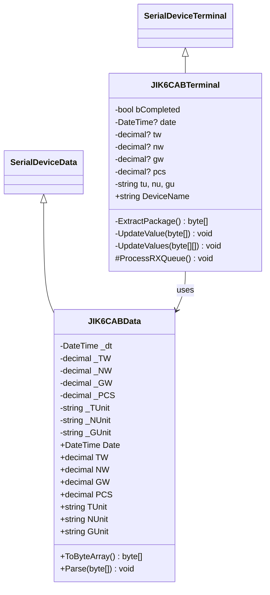
```mermaid
classDiagram
    class JIK6CABData {
        -DateTime _dt
        -decimal _TW
        -decimal _NW
        -decimal _GW
        -decimal _PCS
        -string _TUnit
        -string _NUnit
        -string _GUnit
        +DateTime Date
        +decimal TW
        +decimal NW
        +decimal GW
        +decimal PCS
        +string TUnit
        +string NUnit
        +string GUnit
        +ToByteArray() byte[]
        +Parse(byte[]) void
    }

    class JIK6CABTerminal {
        -bool bCompleted
        -DateTime? date
        -decimal? tw
        -decimal? nw
        -decimal? gw
        -decimal? pcs
        -string tu, nu, gu
        -ExtractPackage() byte[]
        -UpdateValue(byte[]) void
        -UpdateValues(byte[][]) void
        #ProcessRXQueue() void
        +string DeviceName
    }

    SerialDeviceData <|-- JIK6CABData
    SerialDeviceTerminal <|-- JIK6CABTerminal
    JIK6CABTerminal --> JIK6CABData : uses
```

### State Diagram - Parsing State Machine

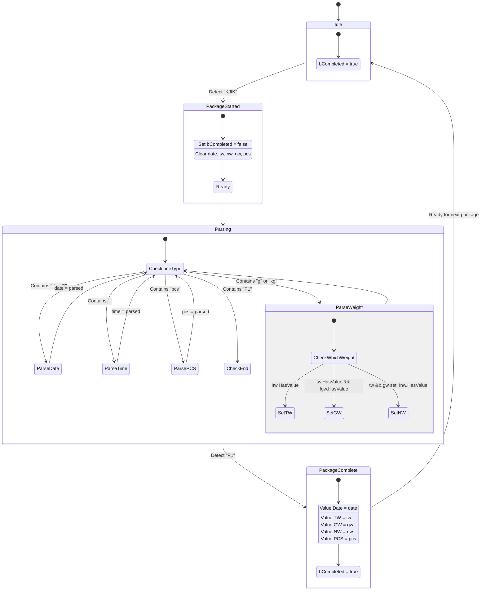
```mermaid
stateDiagram-v2
    [*] --> Idle

    state Idle {
        [*] --> WaitingForStart
        WaitingForStart: bCompleted = true
    }

    Idle --> PackageStarted: Detect "KJIK"

    state PackageStarted {
        [*] --> ClearVariables
        ClearVariables: Set bCompleted = false
        ClearVariables: Clear date, tw, nw, gw, pcs
        ClearVariables --> Ready
    }

    PackageStarted --> Parsing

    state Parsing {
        [*] --> CheckLineType

        CheckLineType --> ParseDate: Contains "-" or "/"
        CheckLineType --> ParseTime: Contains ":"
        CheckLineType --> ParseWeight: Contains "g" or "kg"
        CheckLineType --> ParsePCS: Contains "pcs"
        CheckLineType --> CheckEnd: Contains "P1"

        ParseDate --> CheckLineType: date = parsed
        ParseTime --> CheckLineType: time = parsed

        state ParseWeight {
            [*] --> CheckWhichWeight
            CheckWhichWeight --> SetTW: !tw.HasValue
            CheckWhichWeight --> SetGW: tw.HasValue && !gw.HasValue
            CheckWhichWeight --> SetNW: tw && gw set, !nw.HasValue
        }

        ParseWeight --> CheckLineType
        ParsePCS --> CheckLineType: pcs = parsed
    }

    Parsing --> PackageComplete: Detect "P1"

    state PackageComplete {
        [*] --> AssignValues
        AssignValues: Value.Date = date
        AssignValues: Value.TW = tw
        AssignValues: Value.GW = gw
        AssignValues: Value.NW = nw
        AssignValues: Value.PCS = pcs
        AssignValues --> SetCompleted
        SetCompleted: bCompleted = true
    }

    PackageComplete --> Idle: Ready for next package
```

### Sequence Diagram - Multi-Line Package Processing

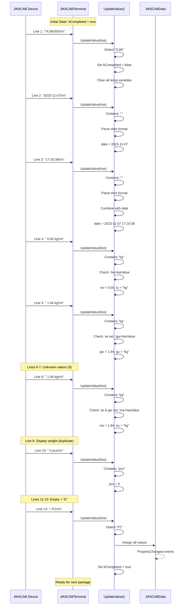
```mermaid
sequenceDiagram
    participant Device as JIK6CAB Device
    participant Terminal as JIK6CABTerminal
    participant Parser as UpdateValue()
    participant Data as JIK6CABData

    Note over Terminal: Initial State: bCompleted = true

    Device->>Terminal: Line 1: "^KJIK000\r\n"
    Terminal->>Parser: UpdateValue(line)
    Parser->>Parser: Detect "KJIK"
    Parser->>Parser: Set bCompleted = false
    Parser->>Parser: Clear all temp variables

    Device->>Terminal: Line 2: "2023-11-07\r\n"
    Terminal->>Parser: UpdateValue(line)
    Parser->>Parser: Contains "-"
    Parser->>Parser: Parse date format
    Parser->>Parser: date = 2023-11-07

    Device->>Terminal: Line 3: "17:19:38\r\n"
    Terminal->>Parser: UpdateValue(line)
    Parser->>Parser: Contains ":"
    Parser->>Parser: Parse time format
    Parser->>Parser: Combine with date
    Parser->>Parser: date = 2023-11-07 17:19:38

    Device->>Terminal: Line 4: "  0.00 kg\r\n"
    Terminal->>Parser: UpdateValue(line)
    Parser->>Parser: Contains "kg"
    Parser->>Parser: Check: !tw.HasValue
    Parser->>Parser: tw = 0.00, tu = "kg"

    Device->>Terminal: Line 5: "  1.94 kg\r\n"
    Terminal->>Parser: UpdateValue(line)
    Parser->>Parser: Contains "kg"
    Parser->>Parser: Check: tw set, !gw.HasValue
    Parser->>Parser: gw = 1.94, gu = "kg"

    Note over Device,Terminal: Lines 6-7: Unknown values (0)

    Device->>Terminal: Line 8: "  1.94 kg\r\n"
    Terminal->>Parser: UpdateValue(line)
    Parser->>Parser: Contains "kg"
    Parser->>Parser: Check: tw & gw set, !nw.HasValue
    Parser->>Parser: nw = 1.94, nu = "kg"

    Note over Device,Terminal: Line 9: Display weight (duplicate)

    Device->>Terminal: Line 10: "    0 pcs\r\n"
    Terminal->>Parser: UpdateValue(line)
    Parser->>Parser: Contains "pcs"
    Parser->>Parser: pcs = 0

    Note over Device,Terminal: Lines 11-13: Empty + "E"

    Device->>Terminal: Line 14: "~P1\r\n"
    Terminal->>Parser: UpdateValue(line)
    Parser->>Parser: Detect "P1"
    Parser->>Data: Assign all values
    Data-->>Data: PropertyChanged events
    Parser->>Parser: Set bCompleted = true

    Note over Terminal: Ready for next package
```

### Flowchart - Line Type Detection

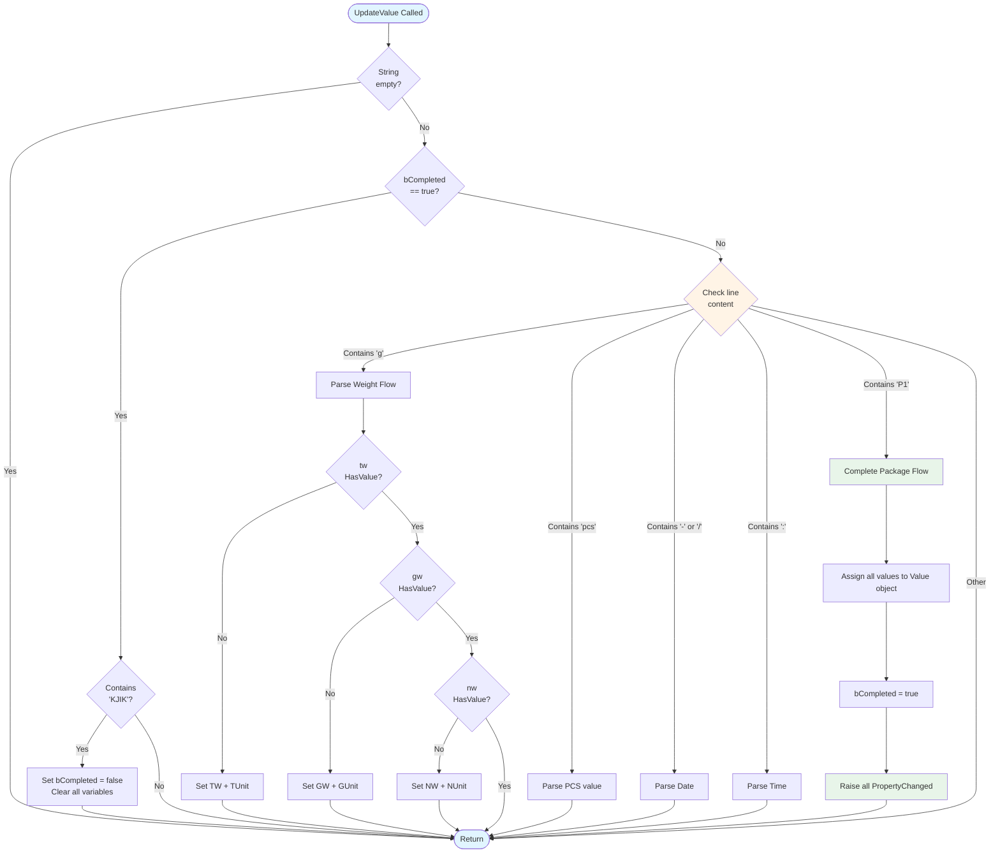
```mermaid
flowchart TD
    Start([UpdateValue Called]) --> CheckEmpty{String<br/>empty?}
    CheckEmpty -->|Yes| End([Return])
    CheckEmpty -->|No| CheckCompleted{bCompleted<br/>== true?}

    CheckCompleted -->|Yes| CheckKJIK{Contains<br/>'KJIK'?}
    CheckKJIK -->|Yes| StartPackage[Set bCompleted = false<br/>Clear all variables]
    StartPackage --> End
    CheckKJIK -->|No| End

    CheckCompleted -->|No| CheckType{Check line<br/>content}

    CheckType -->|Contains 'g'| ParseWeightFlow[Parse Weight Flow]
    CheckType -->|Contains 'pcs'| ParsePCS[Parse PCS value]
    CheckType -->|Contains '-' or '/'| ParseDate[Parse Date]
    CheckType -->|Contains ':'| ParseTime[Parse Time]
    CheckType -->|Contains 'P1'| CompletePackage[Complete Package Flow]
    CheckType -->|Other| End

    ParseWeightFlow --> CheckTW{tw<br/>HasValue?}
    CheckTW -->|No| SetTW[Set TW + TUnit]
    CheckTW -->|Yes| CheckGW{gw<br/>HasValue?}
    CheckGW -->|No| SetGW[Set GW + GUnit]
    CheckGW -->|Yes| CheckNW{nw<br/>HasValue?}
    CheckNW -->|No| SetNW[Set NW + NUnit]
    CheckNW -->|Yes| End

    SetTW --> End
    SetGW --> End
    SetNW --> End
    ParsePCS --> End
    ParseDate --> End
    ParseTime --> End

    CompletePackage --> Assign[Assign all values to Value object]
    Assign --> SetCompleted[bCompleted = true]
    SetCompleted --> NotifyAll[Raise all PropertyChanged]
    NotifyAll --> End

    style Start fill:#e1f5ff
    style End fill:#e1f5ff
    style CheckType fill:#fff4e6
    style CompletePackage fill:#e8f5e9
    style NotifyAll fill:#e8f5e9
```

---

## Device 3: MettlerMS204TS00

### Overview
High-precision laboratory balance (0.0001g resolution).

**Protocol:** `[mode][spaces][weight] g[spaces]\r\n`
**Example:** `     N       0.3746 g   \r\n`

### Class Diagram

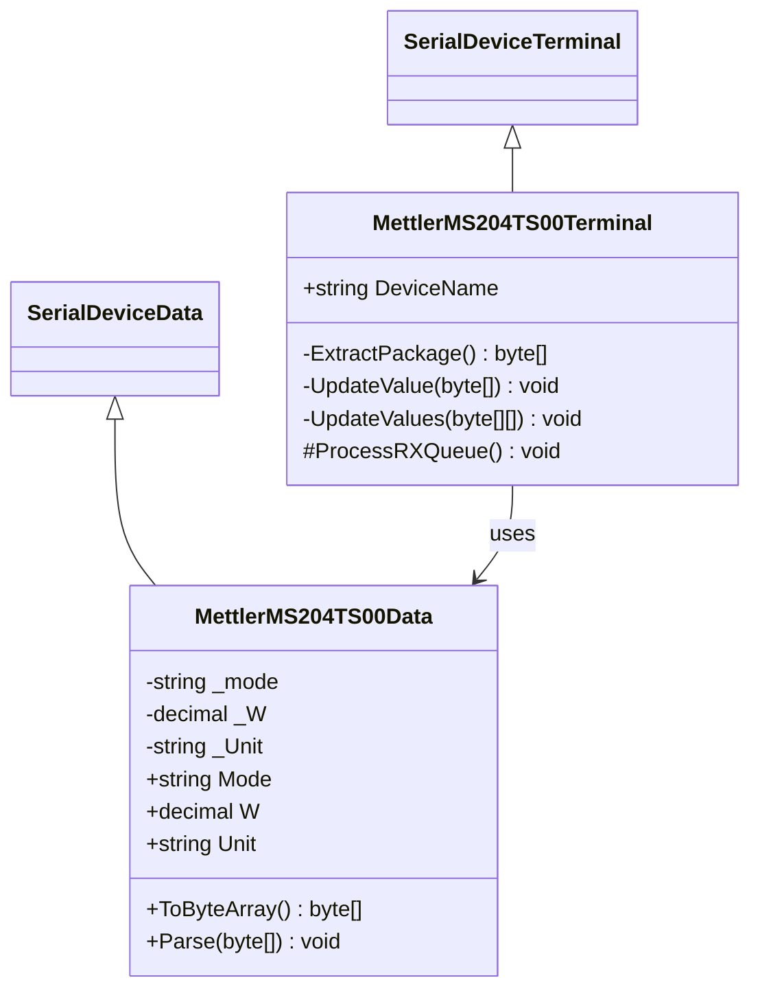
```mermaid
classDiagram
    class MettlerMS204TS00Data {
        -string _mode
        -decimal _W
        -string _Unit
        +string Mode
        +decimal W
        +string Unit
        +ToByteArray() byte[]
        +Parse(byte[]) void
    }

    class MettlerMS204TS00Terminal {
        -ExtractPackage() byte[]
        -UpdateValue(byte[]) void
        -UpdateValues(byte[][]) void
        #ProcessRXQueue() void
        +string DeviceName
    }

    SerialDeviceData <|-- MettlerMS204TS00Data
    SerialDeviceTerminal <|-- MettlerMS204TS00Terminal
    MettlerMS204TS00Terminal --> MettlerMS204TS00Data : uses
```

### Flowchart - Mode and Weight Parsing

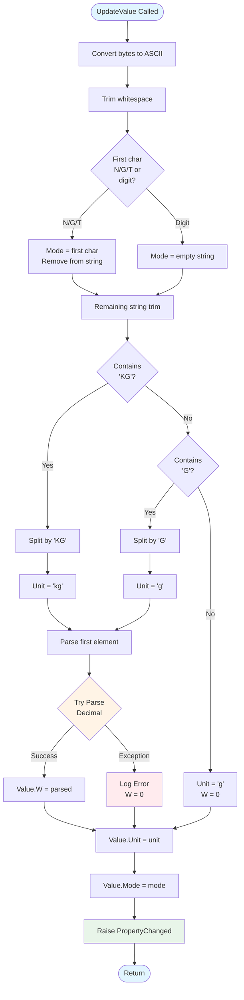
```mermaid
flowchart TD
    Start([UpdateValue Called]) --> Convert[Convert bytes to ASCII]
    Convert --> Trim[Trim whitespace]
    Trim --> CheckFirst{First char<br/>N/G/T or<br/>digit?}

    CheckFirst -->|N/G/T| ExtractMode[Mode = first char<br/>Remove from string]
    CheckFirst -->|Digit| NoMode[Mode = empty string]

    ExtractMode --> ParseWeight
    NoMode --> ParseWeight

    ParseWeight[Remaining string trim] --> CheckUnit{Contains<br/>'KG'?}
    CheckUnit -->|Yes| SplitKG[Split by 'KG']
    CheckUnit -->|No| CheckG{Contains<br/>'G'?}
    CheckG -->|Yes| SplitG[Split by 'G']
    CheckG -->|No| DefaultUnit[Unit = 'g'<br/>W = 0]

    SplitKG --> SetUnitKG[Unit = 'kg']
    SplitG --> SetUnitG[Unit = 'g']

    SetUnitKG --> ParseValue[Parse first element]
    SetUnitG --> ParseValue

    ParseValue --> TryParse{Try Parse<br/>Decimal}
    TryParse -->|Success| SetWeight[Value.W = parsed]
    TryParse -->|Exception| LogError[Log Error<br/>W = 0]

    SetWeight --> SetUnit[Value.Unit = unit]
    LogError --> SetUnit
    DefaultUnit --> SetUnit
    SetUnit --> SetMode[Value.Mode = mode]
    SetMode --> Notify[Raise PropertyChanged]
    Notify --> End([Return])

    style Start fill:#e1f5ff
    style End fill:#e1f5ff
    style TryParse fill:#fff4e6
    style LogError fill:#ffebee
    style Notify fill:#e8f5e9
```

### Sequence Diagram - High Precision Reading

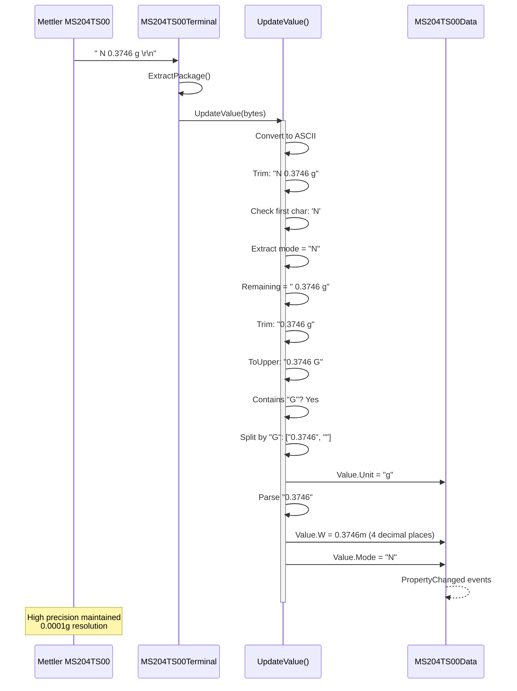
```mermaid
sequenceDiagram
    participant Balance as Mettler MS204TS00
    participant Terminal as MS204TS00Terminal
    participant Parser as UpdateValue()
    participant Data as MS204TS00Data

    Balance->>Terminal: "     N       0.3746 g   \r\n"
    Terminal->>Terminal: ExtractPackage()
    Terminal->>Parser: UpdateValue(bytes)

    activate Parser
    Parser->>Parser: Convert to ASCII
    Parser->>Parser: Trim: "N       0.3746 g"
    Parser->>Parser: Check first char: 'N'
    Parser->>Parser: Extract mode = "N"
    Parser->>Parser: Remaining = "       0.3746 g"
    Parser->>Parser: Trim: "0.3746 g"
    Parser->>Parser: ToUpper: "0.3746 G"
    Parser->>Parser: Contains "G"? Yes
    Parser->>Parser: Split by "G": ["0.3746", ""]

    Parser->>Data: Value.Unit = "g"
    Parser->>Parser: Parse "0.3746"
    Parser->>Data: Value.W = 0.3746m (4 decimal places)
    Parser->>Data: Value.Mode = "N"

    Data-->>Data: PropertyChanged events
    deactivate Parser

    Note over Balance: High precision maintained<br/>0.0001g resolution
```

---

## Device 4: PHMeter

### Overview
pH meter with temperature compensation.

**Protocol:** Multi-line with pH, temperature, date/time
**Special:** Uses 0xF8 byte for degree symbol (°)

### Class Diagram

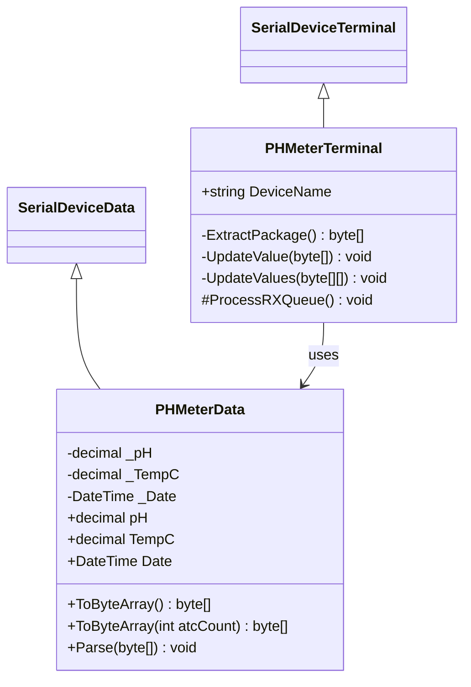
```mermaid
classDiagram
    class PHMeterData {
        -decimal _pH
        -decimal _TempC
        -DateTime _Date
        +decimal pH
        +decimal TempC
        +DateTime Date
        +ToByteArray() byte[]
        +ToByteArray(int atcCount) byte[]
        +Parse(byte[]) void
    }

    class PHMeterTerminal {
        -ExtractPackage() byte[]
        -UpdateValue(byte[]) void
        -UpdateValues(byte[][]) void
        #ProcessRXQueue() void
        +string DeviceName
    }

    SerialDeviceData <|-- PHMeterData
    SerialDeviceTerminal <|-- PHMeterTerminal
    PHMeterTerminal --> PHMeterData : uses
```

### Flowchart - Multi-Pattern Parsing

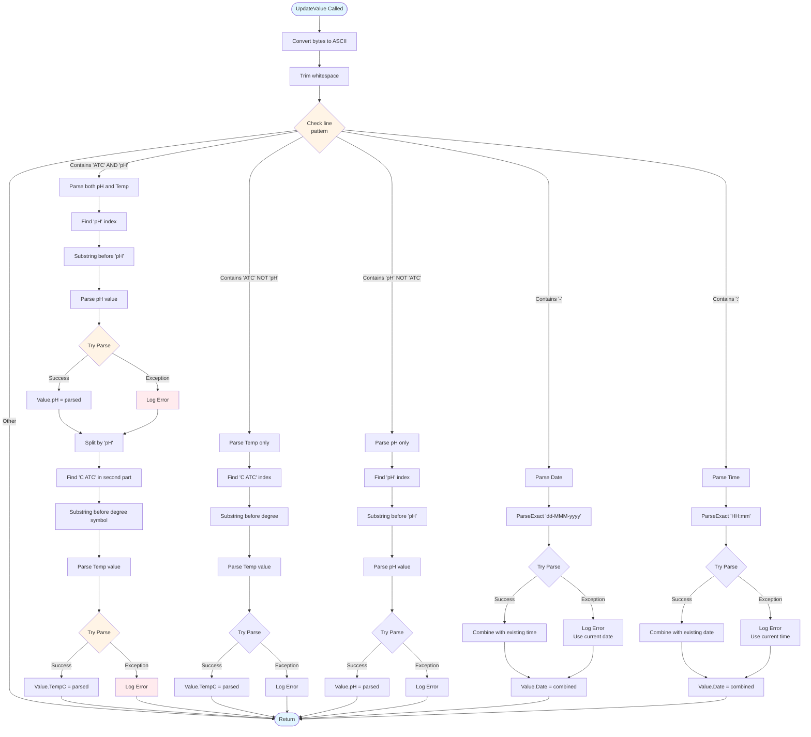
```mermaid
flowchart TD
    Start([UpdateValue Called]) --> Convert[Convert bytes to ASCII]
    Convert --> Trim[Trim whitespace]
    Trim --> CheckPattern{Check line<br/>pattern}

    CheckPattern -->|Contains 'ATC' AND 'pH'| BothValues[Parse both pH and Temp]
    CheckPattern -->|Contains 'ATC' NOT 'pH'| TempOnly[Parse Temp only]
    CheckPattern -->|Contains 'pH' NOT 'ATC'| PHOnly[Parse pH only]
    CheckPattern -->|Contains '-'| DatePattern[Parse Date]
    CheckPattern -->|Contains ':'| TimePattern[Parse Time]
    CheckPattern -->|Other| End([Return])

    BothValues --> FindPH[Find 'pH' index]
    FindPH --> SubstringPH[Substring before 'pH']
    SubstringPH --> ParsePH[Parse pH value]
    ParsePH --> TryParsePH{Try Parse}
    TryParsePH -->|Success| SetPH[Value.pH = parsed]
    TryParsePH -->|Exception| LogPHError[Log Error]

    SetPH --> SplitByPH[Split by 'pH']
    LogPHError --> SplitByPH
    SplitByPH --> FindATC[Find 'C ATC' in second part]
    FindATC --> SubstringTemp[Substring before degree symbol]
    SubstringTemp --> ParseTemp[Parse Temp value]
    ParseTemp --> TryParseTemp{Try Parse}
    TryParseTemp -->|Success| SetTemp[Value.TempC = parsed]
    TryParseTemp -->|Exception| LogTempError[Log Error]
    SetTemp --> End
    LogTempError --> End

    TempOnly --> FindATC2[Find 'C ATC' index]
    FindATC2 --> SubstringTemp2[Substring before degree]
    SubstringTemp2 --> ParseTemp2[Parse Temp value]
    ParseTemp2 --> TryParseTemp2{Try Parse}
    TryParseTemp2 -->|Success| SetTemp2[Value.TempC = parsed]
    TryParseTemp2 -->|Exception| LogTemp2Error[Log Error]
    SetTemp2 --> End
    LogTemp2Error --> End

    PHOnly --> FindPH2[Find 'pH' index]
    FindPH2 --> SubstringPH2[Substring before 'pH']
    SubstringPH2 --> ParsePH2[Parse pH value]
    ParsePH2 --> TryParsePH2{Try Parse}
    TryParsePH2 -->|Success| SetPH2[Value.pH = parsed]
    TryParsePH2 -->|Exception| LogPH2Error[Log Error]
    SetPH2 --> End
    LogPH2Error --> End

    DatePattern --> ParseDateFormat[ParseExact 'dd-MMM-yyyy']
    ParseDateFormat --> TryParseDate{Try Parse}
    TryParseDate -->|Success| CombineDate[Combine with existing time]
    TryParseDate -->|Exception| LogDateError[Log Error<br/>Use current date]
    CombineDate --> SetDate[Value.Date = combined]
    LogDateError --> SetDate
    SetDate --> End

    TimePattern --> ParseTimeFormat[ParseExact 'HH:mm']
    ParseTimeFormat --> TryParseTime{Try Parse}
    TryParseTime -->|Success| CombineTime[Combine with existing date]
    TryParseTime -->|Exception| LogTimeError[Log Error<br/>Use current time]
    CombineTime --> SetTime[Value.Date = combined]
    LogTimeError --> SetTime
    SetTime --> End

    style Start fill:#e1f5ff
    style End fill:#e1f5ff
    style CheckPattern fill:#fff4e6
    style TryParsePH fill:#fff4e6
    style TryParseTemp fill:#fff4e6
    style LogPHError fill:#ffebee
    style LogTempError fill:#ffebee
```

### Sequence Diagram - pH and Temperature Reading

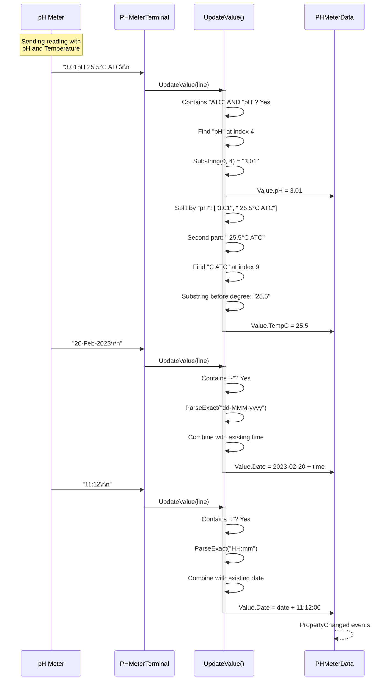
```mermaid
sequenceDiagram
    participant Meter as pH Meter
    participant Terminal as PHMeterTerminal
    participant Parser as UpdateValue()
    participant Data as PHMeterData

    Note over Meter: Sending reading with<br/>pH and Temperature

    Meter->>Terminal: "3.01pH 25.5°C ATC\r\n"
    Terminal->>Parser: UpdateValue(line)

    activate Parser
    Parser->>Parser: Contains "ATC" AND "pH"? Yes
    Parser->>Parser: Find "pH" at index 4
    Parser->>Parser: Substring(0, 4) = "3.01"
    Parser->>Data: Value.pH = 3.01

    Parser->>Parser: Split by "pH": ["3.01", " 25.5°C ATC"]
    Parser->>Parser: Second part: " 25.5°C ATC"
    Parser->>Parser: Find "C ATC" at index 9
    Parser->>Parser: Substring before degree: "25.5"
    Parser->>Data: Value.TempC = 25.5
    deactivate Parser

    Meter->>Terminal: "20-Feb-2023\r\n"
    Terminal->>Parser: UpdateValue(line)
    activate Parser
    Parser->>Parser: Contains "-"? Yes
    Parser->>Parser: ParseExact("dd-MMM-yyyy")
    Parser->>Parser: Combine with existing time
    Parser->>Data: Value.Date = 2023-02-20 + time
    deactivate Parser

    Meter->>Terminal: "11:12\r\n"
    Terminal->>Parser: UpdateValue(line)
    activate Parser
    Parser->>Parser: Contains ":"? Yes
    Parser->>Parser: ParseExact("HH:mm")
    Parser->>Parser: Combine with existing date
    Parser->>Data: Value.Date = date + 11:12:00
    deactivate Parser

    Data-->>Data: PropertyChanged events
```

---

## Device 5: TFO1

### Overview
Industrial system with mixed binary/ASCII protocol and field identifiers.

**Protocol:** Field-based with single char identifiers (F, H, Q, X, A, 0-4, B, C, V)
**Special:** Custom date encoding with special bytes (0xF4, 0xF3, 0xF2)

### Class Diagram

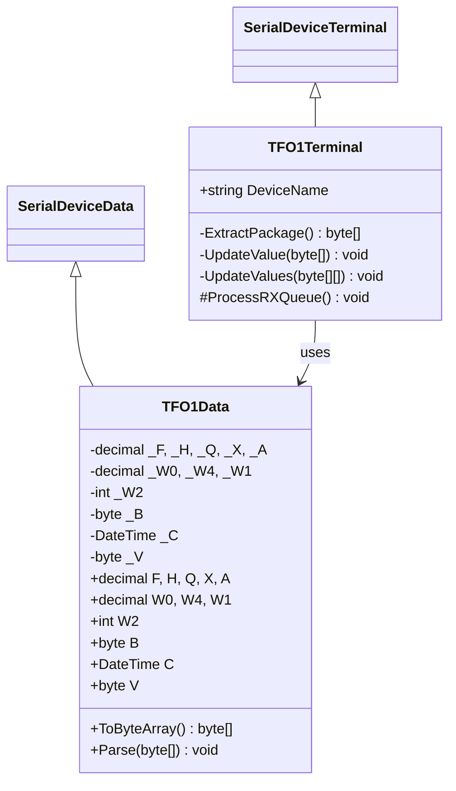
```mermaid
classDiagram
    class TFO1Data {
        -decimal _F, _H, _Q, _X, _A
        -decimal _W0, _W4, _W1
        -int _W2
        -byte _B
        -DateTime _C
        -byte _V
        +decimal F, H, Q, X, A
        +decimal W0, W4, W1
        +int W2
        +byte B
        +DateTime C
        +byte V
        +ToByteArray() byte[]
        +Parse(byte[]) void
    }

    class TFO1Terminal {
        -ExtractPackage() byte[]
        -UpdateValue(byte[]) void
        -UpdateValues(byte[][]) void
        #ProcessRXQueue() void
        +string DeviceName
    }

    SerialDeviceData <|-- TFO1Data
    SerialDeviceTerminal <|-- TFO1Terminal
    TFO1Terminal --> TFO1Data : uses
```

### Flowchart - Field Identifier Switching

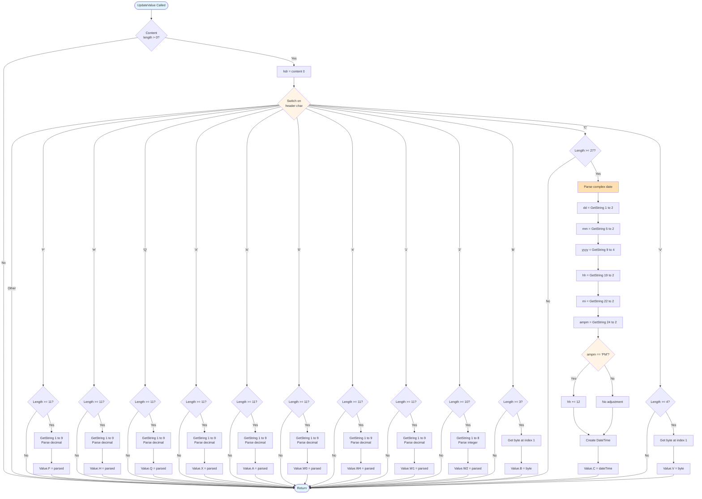
```mermaid
flowchart TD
    Start([UpdateValue Called]) --> CheckLength{Content<br/>length > 0?}
    CheckLength -->|No| End([Return])
    CheckLength -->|Yes| GetHeader[hdr = content 0]

    GetHeader --> Switch{Switch on<br/>header char}

    Switch -->|'F'| CheckF{Length >= 11?}
    Switch -->|'H'| CheckH{Length >= 11?}
    Switch -->|'Q'| CheckQ{Length >= 11?}
    Switch -->|'X'| CheckX{Length >= 11?}
    Switch -->|'A'| CheckA{Length >= 11?}
    Switch -->|'0'| Check0{Length >= 11?}
    Switch -->|'4'| Check4{Length >= 11?}
    Switch -->|'1'| Check1{Length >= 11?}
    Switch -->|'2'| Check2{Length >= 10?}
    Switch -->|'B'| CheckB{Length >= 3?}
    Switch -->|'C'| CheckC{Length >= 27?}
    Switch -->|'V'| CheckV{Length >= 4?}
    Switch -->|Other| End

    CheckF -->|Yes| ParseF[GetString 1 to 9<br/>Parse decimal]
    CheckF -->|No| End
    ParseF --> SetF[Value.F = parsed]
    SetF --> End

    CheckH -->|Yes| ParseH[GetString 1 to 9<br/>Parse decimal]
    CheckH -->|No| End
    ParseH --> SetH[Value.H = parsed]
    SetH --> End

    CheckQ -->|Yes| ParseQ[GetString 1 to 9<br/>Parse decimal]
    CheckQ -->|No| End
    ParseQ --> SetQ[Value.Q = parsed]
    SetQ --> End

    CheckX -->|Yes| ParseX[GetString 1 to 9<br/>Parse decimal]
    CheckX -->|No| End
    ParseX --> SetX[Value.X = parsed]
    SetX --> End

    CheckA -->|Yes| ParseA[GetString 1 to 9<br/>Parse decimal]
    CheckA -->|No| End
    ParseA --> SetA[Value.A = parsed]
    SetA --> End

    Check0 -->|Yes| Parse0[GetString 1 to 9<br/>Parse decimal]
    Check0 -->|No| End
    Parse0 --> SetW0[Value.W0 = parsed]
    SetW0 --> End

    Check4 -->|Yes| Parse4[GetString 1 to 9<br/>Parse decimal]
    Check4 -->|No| End
    Parse4 --> SetW4[Value.W4 = parsed]
    SetW4 --> End

    Check1 -->|Yes| Parse1[GetString 1 to 9<br/>Parse decimal]
    Check1 -->|No| End
    Parse1 --> SetW1[Value.W1 = parsed]
    SetW1 --> End

    Check2 -->|Yes| Parse2[GetString 1 to 8<br/>Parse integer]
    Check2 -->|No| End
    Parse2 --> SetW2[Value.W2 = parsed]
    SetW2 --> End

    CheckB -->|Yes| ParseB[Get byte at index 1]
    CheckB -->|No| End
    ParseB --> SetB[Value.B = byte]
    SetB --> End

    CheckC -->|Yes| ParseC[Parse complex date]
    CheckC -->|No| End
    ParseC --> ExtractDD[dd = GetString 1 to 2]
    ExtractDD --> ExtractMM[mm = GetString 5 to 2]
    ExtractMM --> ExtractYYYY[yyyy = GetString 9 to 4]
    ExtractYYYY --> ExtractHH[hh = GetString 19 to 2]
    ExtractHH --> ExtractMI[mi = GetString 22 to 2]
    ExtractMI --> ExtractAMPM[ampm = GetString 24 to 2]
    ExtractAMPM --> CheckAMPM{ampm == 'PM'?}
    CheckAMPM -->|Yes| AddHours[hh += 12]
    CheckAMPM -->|No| SkipAdd[No adjustment]
    AddHours --> CreateDate[Create DateTime]
    SkipAdd --> CreateDate
    CreateDate --> SetC[Value.C = dateTime]
    SetC --> End

    CheckV -->|Yes| ParseV[Get byte at index 1]
    CheckV -->|No| End
    ParseV --> SetV[Value.V = byte]
    SetV --> End

    style Start fill:#e1f5ff
    style End fill:#e1f5ff
    style Switch fill:#fff4e6
    style ParseC fill:#ffe0b2
    style CheckAMPM fill:#fff4e6
```

### Sequence Diagram - Multi-Field Package

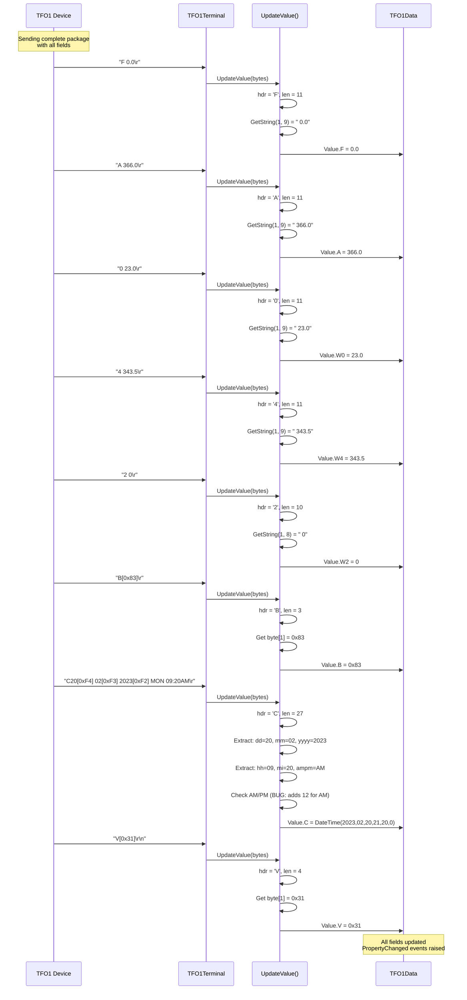
```mermaid
sequenceDiagram
    participant Device as TFO1 Device
    participant Terminal as TFO1Terminal
    participant Parser as UpdateValue()
    participant Data as TFO1Data

    Note over Device: Sending complete package<br/>with all fields

    Device->>Terminal: "F      0.0\r"
    Terminal->>Parser: UpdateValue(bytes)
    Parser->>Parser: hdr = 'F', len = 11
    Parser->>Parser: GetString(1, 9) = "      0.0"
    Parser->>Data: Value.F = 0.0

    Device->>Terminal: "A    366.0\r"
    Terminal->>Parser: UpdateValue(bytes)
    Parser->>Parser: hdr = 'A', len = 11
    Parser->>Parser: GetString(1, 9) = "    366.0"
    Parser->>Data: Value.A = 366.0

    Device->>Terminal: "0     23.0\r"
    Terminal->>Parser: UpdateValue(bytes)
    Parser->>Parser: hdr = '0', len = 11
    Parser->>Parser: GetString(1, 9) = "     23.0"
    Parser->>Data: Value.W0 = 23.0

    Device->>Terminal: "4    343.5\r"
    Terminal->>Parser: UpdateValue(bytes)
    Parser->>Parser: hdr = '4', len = 11
    Parser->>Parser: GetString(1, 9) = "    343.5"
    Parser->>Data: Value.W4 = 343.5

    Device->>Terminal: "2        0\r"
    Terminal->>Parser: UpdateValue(bytes)
    Parser->>Parser: hdr = '2', len = 10
    Parser->>Parser: GetString(1, 8) = "       0"
    Parser->>Data: Value.W2 = 0

    Device->>Terminal: "B[0x83]\r"
    Terminal->>Parser: UpdateValue(bytes)
    Parser->>Parser: hdr = 'B', len = 3
    Parser->>Parser: Get byte[1] = 0x83
    Parser->>Data: Value.B = 0x83

    Device->>Terminal: "C20[0xF4] 02[0xF3] 2023[0xF2] MON 09:20AM\r"
    Terminal->>Parser: UpdateValue(bytes)
    Parser->>Parser: hdr = 'C', len = 27
    Parser->>Parser: Extract: dd=20, mm=02, yyyy=2023
    Parser->>Parser: Extract: hh=09, mi=20, ampm=AM
    Parser->>Parser: Check AM/PM (BUG: adds 12 for AM)
    Parser->>Data: Value.C = DateTime(2023,02,20,21,20,0)

    Device->>Terminal: "V[0x31]\r\n"
    Terminal->>Parser: UpdateValue(bytes)
    Parser->>Parser: hdr = 'V', len = 4
    Parser->>Parser: Get byte[1] = 0x31
    Parser->>Data: Value.V = 0x31

    Note over Data: All fields updated<br/>PropertyChanged events raised
```

### State Diagram - Field Processing

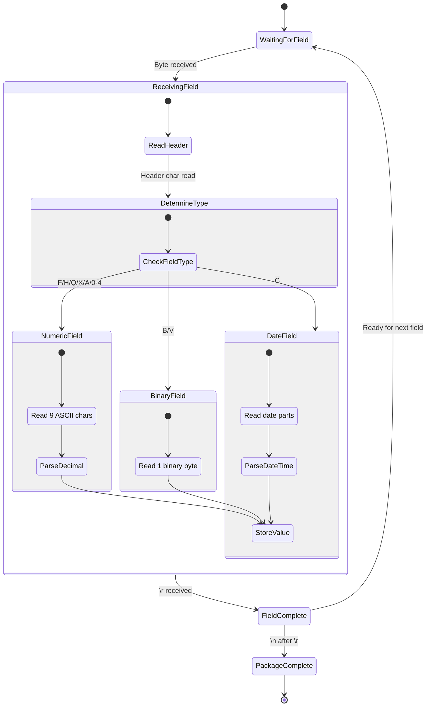
```mermaid
stateDiagram-v2
    [*] --> WaitingForField

    WaitingForField --> ReceivingField: Byte received

    state ReceivingField {
        [*] --> ReadHeader
        ReadHeader --> DetermineType: Header char read

        state DetermineType {
            [*] --> CheckFieldType
            CheckFieldType --> NumericField: F/H/Q/X/A/0-4
            CheckFieldType --> BinaryField: B/V
            CheckFieldType --> DateField: C
        }

        state NumericField {
            [*] --> ReadValue
            ReadValue: Read 9 ASCII chars
            ReadValue --> ParseDecimal
            ParseDecimal --> StoreValue
        }

        state BinaryField {
            [*] --> ReadByte
            ReadByte: Read 1 binary byte
            ReadByte --> StoreValue
        }

        state DateField {
            [*] --> ReadComponents
            ReadComponents: Read date parts
            ReadComponents --> ParseDateTime
            ParseDateTime --> StoreValue
        }
    }

    ReceivingField --> FieldComplete: \r received
    FieldComplete --> WaitingForField: Ready for next field

    FieldComplete --> PackageComplete: \n after \r
    PackageComplete --> [*]
```

---

## Device 6: WeightQA

### Overview
Quality assurance scale with stability index encoding.

**Protocol:** `[sign][weight]/[stability] [unit] [mode]\r\n`
**Example:** `+007.12/3 G S\r\n`
**Stability:** 0 (stable) to 8 (unstable)

### Class Diagram

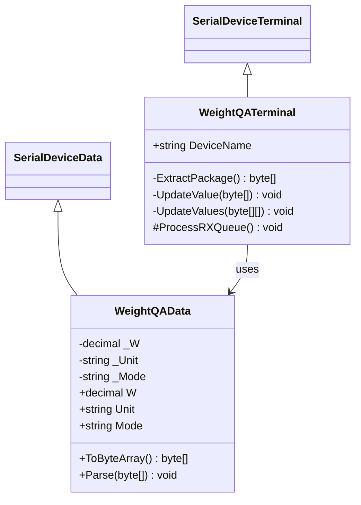
```mermaid
classDiagram
    class WeightQAData {
        -decimal _W
        -string _Unit
        -string _Mode
        +decimal W
        +string Unit
        +string Mode
        +ToByteArray() byte[]
        +Parse(byte[]) void
    }

    class WeightQATerminal {
        -ExtractPackage() byte[]
        -UpdateValue(byte[]) void
        -UpdateValues(byte[][]) void
        #ProcessRXQueue() void
        +string DeviceName
    }

    SerialDeviceData <|-- WeightQAData
    SerialDeviceTerminal <|-- WeightQATerminal
    WeightQATerminal --> WeightQAData : uses
```

### Flowchart - Stability Index Decoding

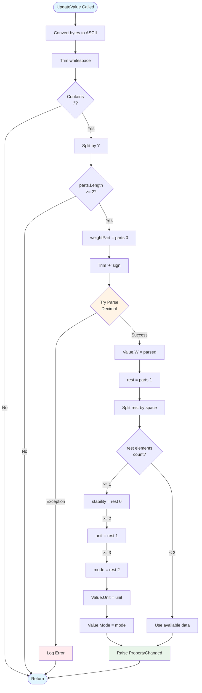
```mermaid
flowchart TD
    Start([UpdateValue Called]) --> Convert[Convert bytes to ASCII]
    Convert --> Trim[Trim whitespace]
    Trim --> CheckSlash{Contains<br/>'/'?}

    CheckSlash -->|No| End([Return])
    CheckSlash -->|Yes| Split[Split by '/']

    Split --> CheckCount{parts.Length<br/>>= 2?}
    CheckCount -->|No| End
    CheckCount -->|Yes| GetWeight[weightPart = parts 0]

    GetWeight --> TrimSign[Trim '+' sign]
    TrimSign --> ParseWeight{Try Parse<br/>Decimal}
    ParseWeight -->|Success| SetWeight[Value.W = parsed]
    ParseWeight -->|Exception| LogError[Log Error]
    LogError --> End

    SetWeight --> GetRest[rest = parts 1]
    GetRest --> SplitRest[Split rest by space]

    SplitRest --> CheckRest{rest elements<br/>count?}
    CheckRest -->|>= 1| GetStability[stability = rest 0]
    GetStability -->|>= 2| GetUnit[unit = rest 1]
    GetUnit -->|>= 3| GetMode[mode = rest 2]
    GetMode --> SetUnit[Value.Unit = unit]
    SetUnit --> SetMode[Value.Mode = mode]
    SetMode --> Notify[Raise PropertyChanged]

    CheckRest -->|< 3| PartialData[Use available data]
    PartialData --> Notify

    Notify --> End

    style Start fill:#e1f5ff
    style End fill:#e1f5ff
    style ParseWeight fill:#fff4e6
    style LogError fill:#ffebee
    style Notify fill:#e8f5e9
```

### Sequence Diagram - Stability Tracking

```mermaid
sequenceDiagram
    participant Scale as WeightQA Scale
    participant Terminal as WeightQATerminal
    participant Parser as UpdateValue()
    participant Data as WeightQAData
    participant UI as User Interface

    Note over Scale,UI: Weight stabilizing sequence

    Scale->>Terminal: "+007.12/8 G S\r\n"
    Terminal->>Parser: UpdateValue(bytes)
    Parser->>Parser: Split by '/': ["007.12", "8 G S"]
    Parser->>Parser: stability = 8 (very unstable)
    Parser->>Data: Value.W = 7.12
    Data->>UI: Update display (Unstable indicator)

    Note over Scale: Weight settling...

    Scale->>Terminal: "+007.12/5 G S\r\n"
    Terminal->>Parser: UpdateValue(bytes)
    Parser->>Parser: stability = 5 (medium)
    Parser->>Data: Value.W = 7.12
    Data->>UI: Update display (Medium stability)

    Note over Scale: Weight settling...

    Scale->>Terminal: "+007.12/2 G S\r\n"
    Terminal->>Parser: UpdateValue(bytes)
    Parser->>Parser: stability = 2 (good)
    Parser->>Data: Value.W = 7.12
    Data->>UI: Update display (Good stability)

    Note over Scale: Weight stable

    Scale->>Terminal: "+007.12/0 G S\r\n"
    Terminal->>Parser: UpdateValue(bytes)
    Parser->>Parser: stability = 0 (perfectly stable)
    Parser->>Data: Value.W = 7.12
    Data->>UI: Update display (Stable ✓)

    Note over UI: Ready to accept measurement
```

### State Diagram - Stability States

```mermaid
stateDiagram-v2
    [*] --> Idle

    Idle --> Weighing: Weight detected

    state Weighing {
        [*] --> VeryUnstable
        VeryUnstable: Stability = 6-8
        VeryUnstable --> Unstable: Settling

        Unstable: Stability = 4-5
        Unstable --> Stabilizing: Settling

        Stabilizing: Stability = 2-3
        Stabilizing --> NearStable: Settling

        NearStable: Stability = 1
        NearStable --> Stable: Final settle

        Stable: Stability = 0
    }

    Weighing --> Idle: Weight removed
    Stable --> Accepted: User confirms
    Accepted --> [*]

    note right of VeryUnstable
        Rapid weight changes
        Display warning
    end note

    note right of Stable
        Ready to record
        Display checkmark
    end note
```

---

## Device 7: WeightSPUN

### Overview
Dynamic weighing scale for spinning/moving loads, similar to DEFENDER3000 but higher capacity.

**Protocol:** `[spaces][weight] kg [spaces][status]\r\n`
**Example:** `    20.0 kg    G\r\n`

### Class Diagram

```mermaid
classDiagram
    class WeightSPUNData {
        -decimal _W
        -string _Unit
        -string _O
        +decimal W
        +string Unit
        +string O
        +ToByteArray() byte[]
        +Parse(byte[]) void
    }

    class WeightSPUNTerminal {
        -ExtractPackage() byte[]
        -UpdateValue(byte[]) void
        -UpdateValues(byte[][]) void
        #ProcessRXQueue() void
        +string DeviceName
    }

    SerialDeviceData <|-- WeightSPUNData
    SerialDeviceTerminal <|-- WeightSPUNTerminal
    WeightSPUNTerminal --> WeightSPUNData : uses
```

### Flowchart - Same as DEFENDER3000

```mermaid
flowchart TD
    Start([ProcessRXQueue Called]) --> Extract[ExtractPackage]
    Extract --> CheckNull{Package<br/>extracted?}
    CheckNull -->|No| End([Return])
    CheckNull -->|Yes| Split[Split by \r\n]

    Split --> Loop{For each<br/>line}
    Loop -->|Next line| Convert[Convert bytes to ASCII string]
    Convert --> CheckEmpty{String<br/>empty?}
    CheckEmpty -->|Yes| Loop
    CheckEmpty -->|No| SplitSpaces[Split by spaces<br/>RemoveEmptyEntries]

    SplitSpaces --> CheckCount{Count >= 3?}
    CheckCount -->|No| Loop
    CheckCount -->|Yes| ParseWeight[Parse elems 0 as Weight]

    ParseWeight --> TryCatch{Try Parse<br/>Decimal}
    TryCatch -->|Success| SetW[Value.W = weight]
    TryCatch -->|Exception| LogError[Log Error]
    LogError --> Loop

    SetW --> ParseUnit[Parse elems 1 as Unit]
    ParseUnit --> SetUnit[Value.Unit = unit]
    SetUnit --> ParseStatus[Parse elems 2 as Status]
    ParseStatus --> SetStatus[Value.O = status]
    SetStatus --> Notify[Raise PropertyChanged]
    Notify --> Loop

    Loop -->|Done| End

    style Start fill:#e1f5ff
    style End fill:#e1f5ff
    style TryCatch fill:#fff4e6
    style LogError fill:#ffebee
    style Notify fill:#e8f5e9
```

### Sequence Diagram - Dynamic Weight Loading

```mermaid
sequenceDiagram
    participant Scale as WeightSPUN Scale
    participant Terminal as WeightSPUNTerminal
    participant Parser as UpdateValue()
    participant Data as WeightSPUNData
    participant UI as User Interface

    Note over Scale,UI: Dynamic loading scenario

    Scale->>Terminal: "    19.8 kg    G\r\n"
    Terminal->>Parser: UpdateValue(bytes)
    Parser->>Data: Value.W = 19.8 (Tare)
    Data->>UI: Display: 19.8 kg Stable

    Note over Scale: Start adding weight...

    Scale->>Terminal: "    25.3 kg   ?G\r\n"
    Terminal->>Parser: UpdateValue(bytes)
    Parser->>Data: Value.W = 25.3, O = "?G"
    Data->>UI: Display: 25.3 kg UNSTABLE

    Scale->>Terminal: "    45.7 kg   ?G\r\n"
    Terminal->>Parser: UpdateValue(bytes)
    Parser->>Data: Value.W = 45.7, O = "?G"
    Data->>UI: Display: 45.7 kg UNSTABLE

    Scale->>Terminal: "    78.2 kg   ?G\r\n"
    Terminal->>Parser: UpdateValue(bytes)
    Parser->>Data: Value.W = 78.2, O = "?G"
    Data->>UI: Display: 78.2 kg UNSTABLE

    Scale->>Terminal: "    94.6 kg   ?G\r\n"
    Terminal->>Parser: UpdateValue(bytes)
    Parser->>Data: Value.W = 94.6, O = "?G"
    Data->>UI: Display: 94.6 kg UNSTABLE

    Note over Scale: Loading complete, stabilizing...

    Scale->>Terminal: "    91.3 kg   ?G\r\n"
    Terminal->>Parser: UpdateValue(bytes)
    Parser->>Data: Value.W = 91.3, O = "?G"
    Data->>UI: Display: 91.3 kg UNSTABLE

    Scale->>Terminal: "    90.5 kg    G\r\n"
    Terminal->>Parser: UpdateValue(bytes)
    Parser->>Data: Value.W = 90.5, O = "G"
    Data->>UI: Display: 90.5 kg STABLE ✓

    Note over UI: Final weight accepted
```

### State Diagram - Dynamic vs Static

```mermaid
stateDiagram-v2
    [*] --> Idle

    Idle --> Static: No movement
    Idle --> Dynamic: Movement detected

    state Static {
        [*] --> TareWeight
        TareWeight: Status = G (Stable)
        TareWeight: Weight = 19.8 kg

        TareWeight --> WaitingForLoad
        WaitingForLoad --> Loaded: Weight added
        Loaded: Status = G
        Loaded --> WaitingForLoad: Weight removed
    }

    state Dynamic {
        [*] --> Loading
        Loading: Status = ?G (Unstable)
        Loading: Weight increasing

        Loading --> Settling: Loading stopped
        Settling: Status = ?G
        Settling: Weight oscillating

        Settling --> Stabilized: Movement ceased
        Stabilized: Status = G
        Stabilized: Final weight
    }

    Static --> Dynamic: Movement starts
    Dynamic --> Static: Movement stops and stable

    Stabilized --> Recorded: User accepts weight
    Recorded --> [*]

    note right of Dynamic
        High capacity scale
        100+ kg range
        ?G indicates dynamic state
    end note

    note right of Static
        G indicates stable
        Ready for measurement
    end note
```

---

## Summary - Comparison of Device Complexities

### Parsing Complexity Matrix

```mermaid
graph LR
    subgraph Simple["Simple (Single Line)"]
        D1[DEFENDER3000<br/>Split spaces]
        D7[WeightSPUN<br/>Split spaces]
        D3[MettlerMS204TS00<br/>Mode + Split]
    end

    subgraph Medium["Medium (Multi-Pattern)"]
        D6[WeightQA<br/>Stability decode]
        D4[PHMeter<br/>Pattern matching]
    end

    subgraph Complex["Complex (Multi-Line)"]
        D2[JIK6CAB<br/>State machine<br/>14 lines]
    end

    subgraph VeryComplex["Very Complex (Binary)"]
        D5[TFO1<br/>Field identifiers<br/>Binary mixed]
    end

    style Simple fill:#c8e6c9
    style Medium fill:#fff9c4
    style Complex fill:#ffcc80
    style VeryComplex fill:#ef9a9a
```

### Protocol Features Comparison

| Device | Lines | Encoding | Special Features | Difficulty |
|--------|-------|----------|------------------|------------|
| DEFENDER3000 | 1 | ASCII | Stability prefix | ⭐ |
| WeightSPUN | 1 | ASCII | High capacity | ⭐ |
| MettlerMS204TS00 | 1 | ASCII | High precision | ⭐⭐ |
| WeightQA | 1 | ASCII | Stability index | ⭐⭐ |
| PHMeter | 4+ | ASCII+Binary | 0xF8 for ° | ⭐⭐⭐ |
| JIK6CAB | 14 | ASCII | Package markers | ⭐⭐⭐⭐ |
| TFO1 | 12 | Binary+ASCII | Field IDs | ⭐⭐⭐⭐⭐ |

---

## End of Detailed Device Diagrams

For implementation details and code samples, see [CODE_ANALYSIS_NLib.Serial.Devices.md](CODE_ANALYSIS_NLib.Serial.Devices.md)
