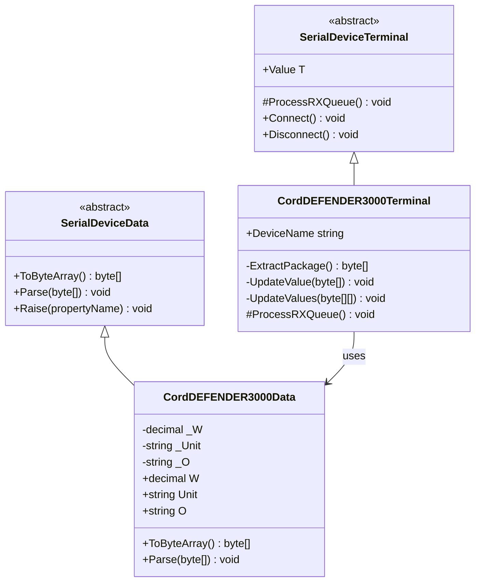
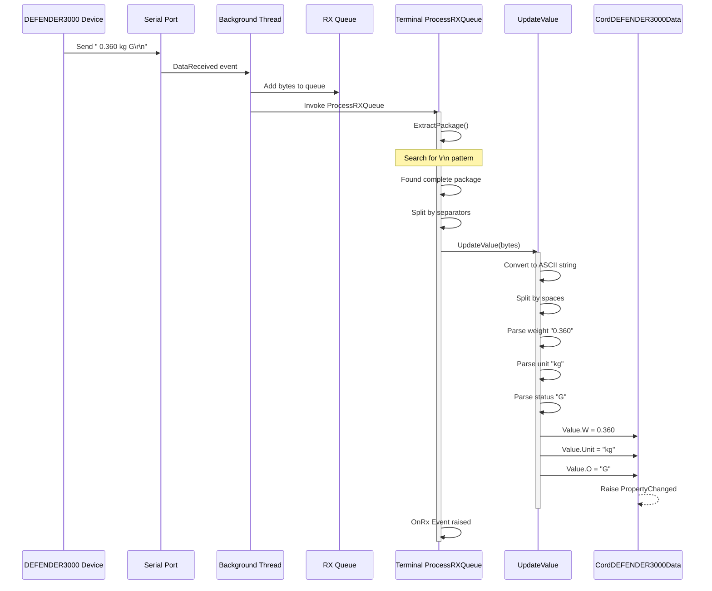
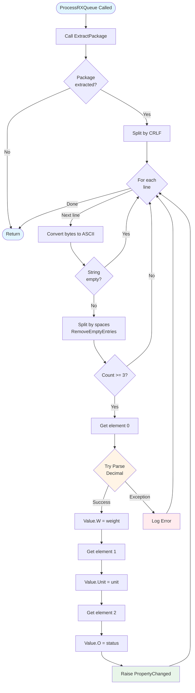
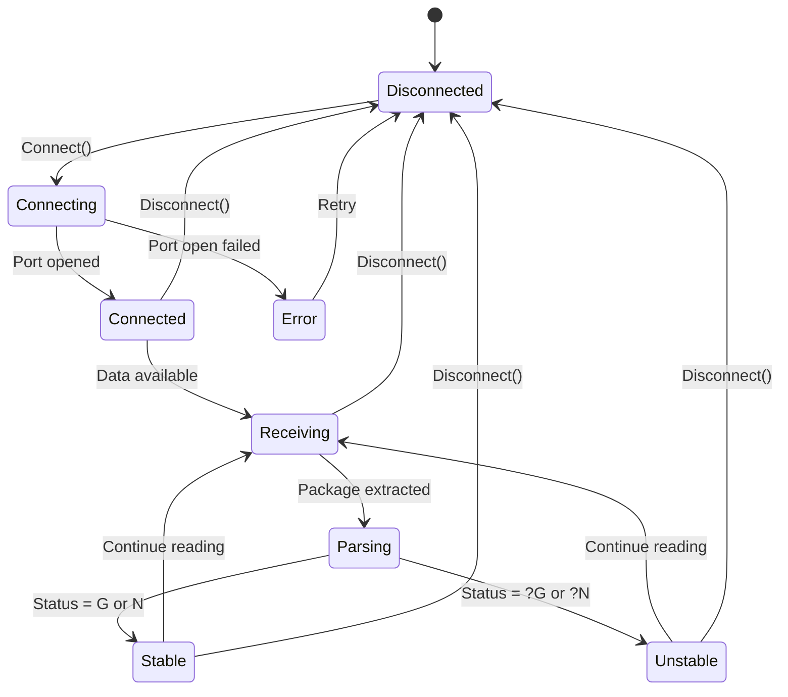

# Device Implementation: CordDEFENDER3000

**Device Type:** Weight Scale
**Complexity:** ⭐ Simple
**Protocol:** Single-line continuous streaming
**File:** `CordDEFENDER3000.cs`

---

## Overview

Simple weight scale with continuous streaming protocol. Sends weight readings continuously with stability indicators.

### Protocol Specification

**Format:** `[spaces][weight] kg [spaces][status]\r\n`

**Example:**
```
   0.360 kg    G
```

**Field Description:**
- **Weight:** 8 characters, right-aligned, 3 decimal places (F3 format)
- **Unit:** 2 characters, padded left (typically "kg")
- **Status:** 4 characters, padded left
  - `G` = Gross weight (stable)
  - `N` = Net weight (stable)
  - `?G` = Gross weight (unstable)
  - `?N` = Net weight (unstable)
- **Terminator:** `\r\n` (0x0D 0x0A)

**Update Rate:** Continuous (multiple readings per second)
**Precision:** 0.005 kg (5 grams)

---

## Class Diagram



---

## Data Class Properties

### CordDEFENDER3000Data

| Property | Type | Default | Description |
|----------|------|---------|-------------|
| `W` | decimal | 0 | Weight value |
| `Unit` | string | "kg" | Measurement unit |
| `O` | string | "G" | Status/Mode (G, N, ?G, ?N) |

### ToByteArray() Implementation

```csharp
public override byte[] ToByteArray()
{
    string output = ((double)W).ToString("F3").PadLeft(8, ' ');
    output += " " + Unit.PadLeft(2, ' ');
    output += " " + O.PadLeft(4, ' ');
    output += ascii.x0D + ascii.x0A;
    return Encoding.ASCII.GetBytes(output);
}
```

**Example Output:**
- Weight: 0.360 kg, Status: G
- Bytes: `20 20 20 30 2E 33 36 30 20 6B 67 20 20 20 20 47 0D 0A`
- String: `"   0.360 kg    G\r\n"`

---

## Sequence Diagram - Data Reception Flow



---

## Flowchart - Parsing Logic



---

## State Diagram - Device Status



---

## Implementation Details

### Key Methods

#### ExtractPackage()
```csharp
private byte[] ExtractPackage()
{
    if (Queues == null || Queues.Count <= 0) return null;

    byte[] endPatterns = new byte[] { 0x0D, 0x0A }; // \r\n
    byte[] buffers = Queues.ToArray();

    int idx = IndexOf(buffers, endPatterns);
    if (idx != -1)
    {
        int len = idx + endPatterns.Length;
        byte[] package = new byte[len];
        Array.Copy(buffers, package, len);
        Queues.RemoveRange(0, len);
        return package;
    }
    return null;
}
```

#### UpdateValue()
```csharp
private void UpdateValue(byte[] content)
{
    string line = Encoding.ASCII.GetString(content);
    string[] elems = line.Split(new string[] { " " },
                                  StringSplitOptions.RemoveEmptyEntries);

    if (elems.Length < 3) return;

    try
    {
        Value.W = decimal.Parse(elems[0].Trim());
        Value.Unit = elems[1].Trim();
        Value.O = elems[2].Trim();
    }
    catch (Exception ex)
    {
        MethodBase.GetCurrentMethod().Err(ex);
    }
}
```

---

## Usage Example

### Emulator (Sending Data)
```csharp
var emulator = CordDEFENDER3000Device.Instance;
emulator.LoadConfig();
emulator.Start();

// Simulate device sending weight
emulator.Value.W = 0.360m;
emulator.Value.Unit = "kg";
emulator.Value.O = "G";
byte[] data = emulator.Value.ToByteArray();
// Automatically transmitted via background thread
```

### Terminal (Receiving Data)
```csharp
var terminal = CordDEFENDER3000Terminal.Instance;
terminal.LoadConfig();
terminal.Connect();

// Listen for weight updates
terminal.OnRx += (s, e) => {
    Console.WriteLine($"Weight: {terminal.Value.W} {terminal.Value.Unit}");
    Console.WriteLine($"Status: {terminal.Value.O}");

    if (terminal.Value.O == "G" || terminal.Value.O == "N")
        Console.WriteLine("STABLE");
    else
        Console.WriteLine("UNSTABLE");
};
```

---

## Protocol Examples

### Stable Readings
```
   0.000 kg    G    # Zero, Gross mode, Stable
   0.360 kg    G    # 360 grams, Gross, Stable
   1.645 kg    N    # 1.645 kg, Net mode, Stable
```

### Unstable Readings
```
   0.355 kg   ?G    # Unstable, weight changing
   0.365 kg   ?G    # Still unstable
   0.360 kg    G    # Stabilized
```

---

## Testing Notes

- **Stability Detection:** The `?` prefix indicates weight is still changing
- **Mode Switching:** Device can switch between Gross (G) and Net (N)
- **Continuous Stream:** No commands needed, device sends continuously
- **Error Handling:** Invalid decimal format is caught and logged

---

## HEX Dump from Log Files

Raw serial data captured from the DEFENDER3000 device. This data was captured using third-party serial monitoring tools and serves as reference for protocol implementation.

**Source:** `Documents/LuckyTex Devices/DEFENDER3000/DEFENDER3000_hex.txt`

### Sample Data Format

**ASCII Text:**
```
   0.360 kg    G
```

**HEX Dump:**
```
20 20 20 30 2E 33 36 30 20 6B 67 20 20 20 20 47 0D 0A
```

**Byte Breakdown:**
- `20 20 20` - 3 spaces (padding)
- `30 2E 33 36 30` - "0.360" (weight value)
- `20` - space separator
- `6B 67` - "kg" (unit)
- `20 20 20 20` - 4 spaces (padding)
- `47` - "G" (status indicator)
- `0D 0A` - CR+LF terminator

### Example Continuous Stream

```
// Multiple continuous readings (HEX format)
20 20 20 30 2E 33 36 30 20 6B 67 20 20 20 20 47 0D 0A
20 20 20 30 2E 33 36 30 20 6B 67 20 20 20 20 47 0D 0A
20 20 20 30 2E 33 36 30 20 6B 67 20 20 20 20 47 0D 0A
```

Each line represents one complete weight reading transmission. The device sends these readings continuously without requiring any request commands.

### Protocol Observations from Logs

1. **Fixed Width Format:** Every transmission is exactly 18 bytes
2. **Consistent Padding:** Leading spaces ensure right-alignment of weight
3. **Stable Pattern:** Status field consistently shows "G" for stable gross weight
4. **Continuous Output:** Device streams data at high frequency
5. **No Handshaking:** No command-response pattern observed

---

## Related Files

- **Data Class:** `NLib.Serial.Devices.CordDEFENDER3000Data`
- **Emulator:** `NLib.Serial.Emulators.CordDEFENDER3000Device`
- **Terminal:** `NLib.Serial.Terminals.CordDEFENDER3000Terminal`
- **Log Reference:** `Documents/LuckyTex Devices/DEFENDER3000/`

---

## See Also

- [Device Comparison](CODE_ANALYSIS_NLib.Serial.Devices.md#device-implementations)
- [Base Classes](CODE_ANALYSIS_NLib.Serial.Devices.md#base-class-framework)
- [WeightSPUN Device](Device-07-WeightSPUN.md) - Similar protocol
