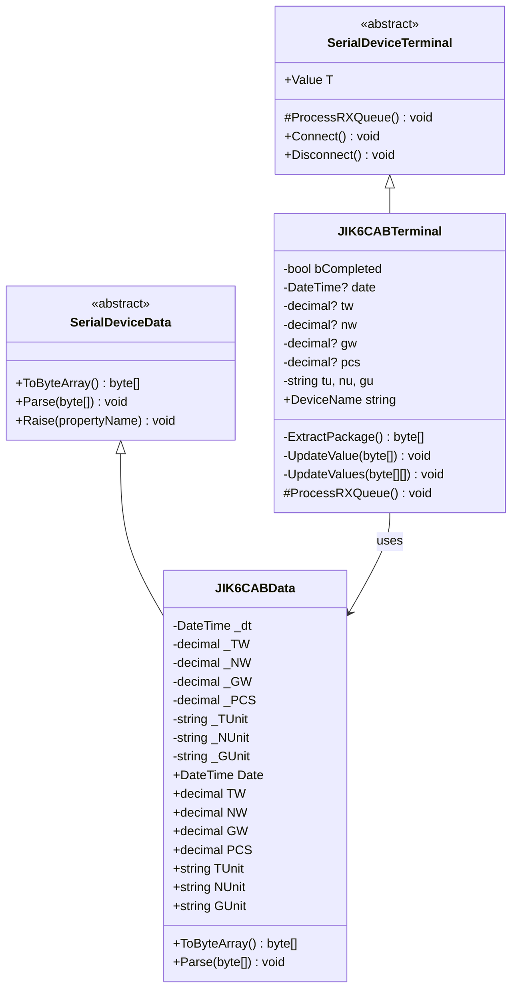
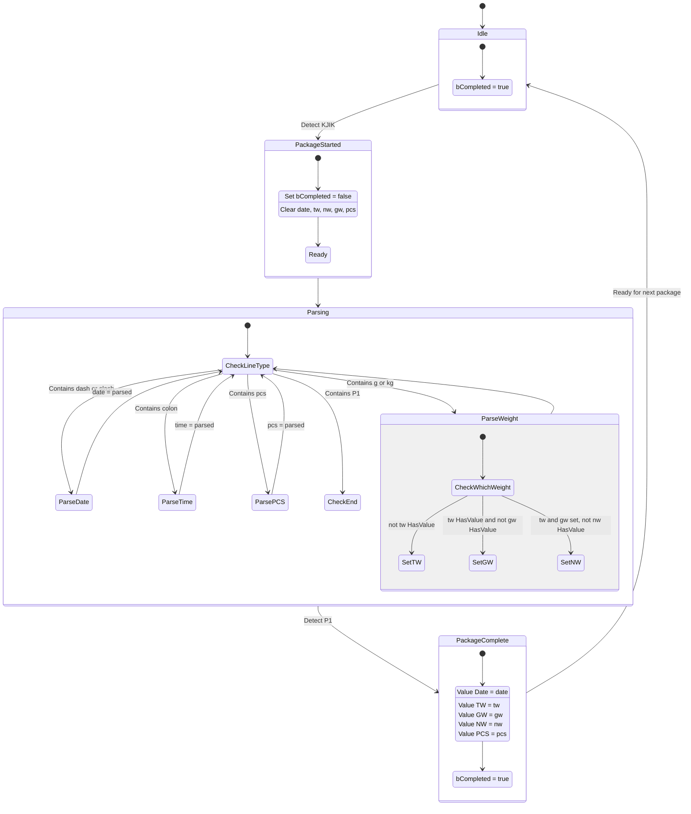
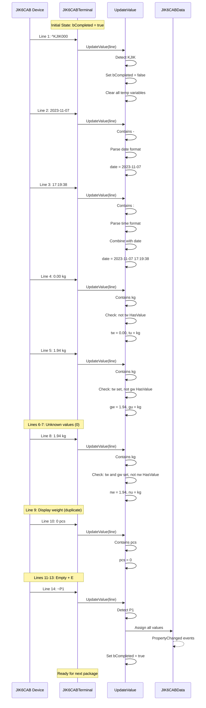
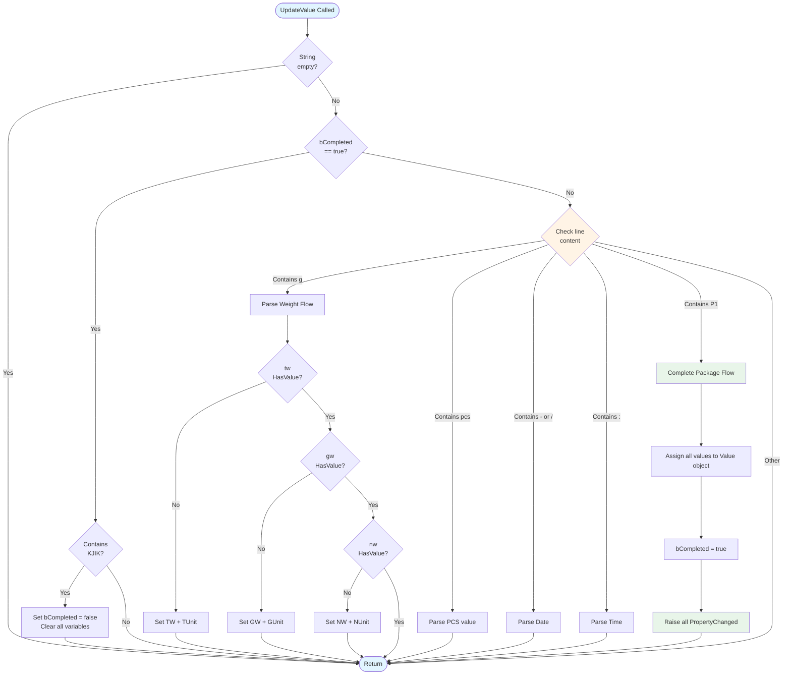

# Device Implementation: JIK6CAB

**Device Type:** Weight Scale
**Complexity:** ⭐⭐⭐⭐ Complex
**Protocol:** Multi-line structured package with state machine parser
**File:** `JIK6CAB.cs`

---

## Overview

Complex multi-line weight scale with package markers and state machine parser. Sends structured 14-line packages with date, time, and multiple weight measurements.

### Protocol Specification

**Format:** 14-line structured package

**Markers:**
- **Start:** `^KJIK000`
- **End:** `~P1`

**Example Package:**
```
^KJIK000
2023-11-07
17:19:38
  0.00 kg
  1.94 kg
  0.00 kg
  0.00 kg
  1.94 kg
  1.94 kg
    0 pcs
(empty line)
E
(empty line)
~P1
```

**Field Description:**
- **Line 1:** Start marker with device ID
- **Line 2:** Date (YYYY-MM-DD format)
- **Line 3:** Time (HH:mm:ss format)
- **Line 4:** Tare Weight (TW)
- **Line 5:** Gross Weight (GW)
- **Lines 6-7:** Unknown values (typically 0)
- **Line 8:** Net Weight (NW)
- **Line 9:** Display weight (duplicate)
- **Line 10:** Piece count (pcs)
- **Lines 11-13:** Empty or status characters
- **Line 14:** End marker

**Update Rate:** On-demand (when weight is captured)

---

## Class Diagram



---

## Data Class Properties

### JIK6CABData

| Property | Type | Default | Description |
|----------|------|---------|-------------|
| `Date` | DateTime | DateTime.Now | Date and time of measurement |
| `TW` | decimal | 0 | Tare Weight |
| `NW` | decimal | 0 | Net Weight |
| `GW` | decimal | 0 | Gross Weight |
| `PCS` | decimal | 0 | Piece count |
| `TUnit` | string | "kg" | Tare weight unit |
| `NUnit` | string | "kg" | Net weight unit |
| `GUnit` | string | "kg" | Gross weight unit |

---

## State Diagram - Parsing State Machine



---

## Sequence Diagram - Multi-Line Package Processing



---

## Flowchart - Line Type Detection



---

## Implementation Details

### State Machine Variables

```csharp
private bool bCompleted = true;
private DateTime? date = null;
private decimal? tw = null;
private decimal? nw = null;
private decimal? gw = null;
private decimal? pcs = null;
private string tu = "kg", nu = "kg", gu = "kg";
```

### Key Parsing Logic

The parser uses a state machine approach:

1. **Idle State:** `bCompleted = true`, waiting for start marker
2. **Start Detection:** When "KJIK" is found, clear all temp variables
3. **Line-by-Line Parsing:** Each line is examined for specific patterns
4. **Weight Assignment:** Weights are assigned in order (TW, GW, NW)
5. **Completion:** When "P1" is detected, assign all values and set `bCompleted = true`

### UpdateValue() Core Logic

```csharp
private void UpdateValue(byte[] content)
{
    string line = Encoding.ASCII.GetString(content).Trim();

    if (string.IsNullOrEmpty(line)) return;

    if (bCompleted)
    {
        // Looking for package start
        if (line.Contains("KJIK"))
        {
            bCompleted = false;
            date = null;
            tw = nw = gw = pcs = null;
            tu = nu = gu = "kg";
        }
        return;
    }

    // Process line based on content
    if (line.Contains("g") || line.Contains("G"))
    {
        // Parse weight
        ParseWeight(line);
    }
    else if (line.Contains("pcs"))
    {
        // Parse piece count
        ParsePCS(line);
    }
    else if (line.Contains("-") || line.Contains("/"))
    {
        // Parse date
        ParseDate(line);
    }
    else if (line.Contains(":"))
    {
        // Parse time
        ParseTime(line);
    }
    else if (line.Contains("P1"))
    {
        // Complete package
        CompletePackage();
    }
}
```

---

## Usage Example

### Emulator (Sending Data)
```csharp
var emulator = JIK6CABDevice.Instance;
emulator.LoadConfig();
emulator.Start();

// Simulate complete weighing
emulator.Value.Date = DateTime.Now;
emulator.Value.TW = 0.00m;
emulator.Value.GW = 1.94m;
emulator.Value.NW = 1.94m;
emulator.Value.PCS = 0;
byte[] data = emulator.Value.ToByteArray();
// Automatically transmitted via background thread
```

### Terminal (Receiving Data)
```csharp
var terminal = JIK6CABTerminal.Instance;
terminal.LoadConfig();
terminal.Connect();

// Listen for complete package
terminal.OnRx += (s, e) => {
    Console.WriteLine($"Date/Time: {terminal.Value.Date}");
    Console.WriteLine($"Tare: {terminal.Value.TW} {terminal.Value.TUnit}");
    Console.WriteLine($"Gross: {terminal.Value.GW} {terminal.Value.GUnit}");
    Console.WriteLine($"Net: {terminal.Value.NW} {terminal.Value.NUnit}");
    Console.WriteLine($"Pieces: {terminal.Value.PCS}");
};
```

---

## Protocol Examples

### Complete Package
```
^KJIK000
2023-11-07
17:19:38
  0.00 kg    # Tare Weight
  1.94 kg    # Gross Weight
  0.00 kg    # Unknown
  0.00 kg    # Unknown
  1.94 kg    # Net Weight
  1.94 kg    # Display (duplicate)
    0 pcs    # Piece count
               # Empty line
E              # Status
               # Empty line
~P1            # End marker
```

---

## Testing Notes

- **State Machine:** Must receive complete 14-line package
- **Line Order:** Critical for correct weight assignment
- **Package Markers:** Both start and end markers must be present
- **Partial Packages:** Incomplete packages are discarded
- **Thread Safety:** State machine is not thread-safe, ensure single thread access

---

## HEX Dump from Log Files

Raw serial data captured from the JIK6CAB device. This data was captured using third-party serial monitoring tools and serves as reference for protocol implementation.

**Source:** `Documents/LuckyTex Devices/JIK6CAB/jik_hex_1.txt`

### Complete Package HEX Dump

```
5E 4B 4A 49 4B 30 30 30 0D 0A    ^KJIK000..
32 30 32 33 2D 31 31 2D 30 37    2023-11-07
   0D 0A                          ..
31 37 3A 31 39 3A 32 36 0D 0A    17:19:26..
20 20 30 2E 30 30 20 6B 67 0D      0.00 kg.
   0A                             .
20 20 31 2E 39 34 20 6B 67 0D      1.94 kg.
   0A                             .
30 0D 0A                         0..
30 0D 0A                         0..
20 20 31 2E 39 34 20 6B 67 0D      1.94 kg.
   0A                             .
20 20 31 2E 39 34 20 6B 67 0D      1.94 kg.
   0A                             .
20 20 20 20 30 20 70 63 73 0D        0 pcs.
   0A                             .
20 0D 0A                          ..
20 0D 0A                          ..
45 0D 0A                         E..
7E 50 31 0D 0A                   ~P1..
```

### Byte-by-Byte Breakdown

**Start Marker (Line 1):**
- `5E 4B 4A 49 4B 30 30 30` - "^KJIK000" (device identifier)
- `0D 0A` - CR+LF

**Date (Line 2):**
- `32 30 32 33 2D 31 31 2D 30 37` - "2023-11-07"
- `0D 0A` - CR+LF

**Time (Line 3):**
- `31 37 3A 31 39 3A 32 36` - "17:19:26"
- `0D 0A` - CR+LF

**Tare Weight (Line 4):**
- `20 20 30 2E 30 30 20 6B 67` - "  0.00 kg" (2 spaces + value + unit)
- `0D 0A` - CR+LF

**Gross Weight (Line 5):**
- `20 20 31 2E 39 34 20 6B 67` - "  1.94 kg"
- `0D 0A` - CR+LF

**Unknown Values (Lines 6-7):**
- `30 0D 0A` - "0" + CR+LF
- `30 0D 0A` - "0" + CR+LF

**Net Weight (Line 8):**
- `20 20 31 2E 39 34 20 6B 67` - "  1.94 kg"
- `0D 0A` - CR+LF

**Display Weight (Line 9):**
- `20 20 31 2E 39 34 20 6B 67` - "  1.94 kg" (duplicate of net)
- `0D 0A` - CR+LF

**Piece Count (Line 10):**
- `20 20 20 20 30 20 70 63 73` - "    0 pcs" (4 spaces + value + unit)
- `0D 0A` - CR+LF

**Empty/Status Lines (11-13):**
- `20 0D 0A` - space + CR+LF
- `20 0D 0A` - space + CR+LF
- `45 0D 0A` - "E" + CR+LF (status character)

**End Marker (Line 14):**
- `7E 50 31` - "~P1"
- `0D 0A` - CR+LF

### Protocol Observations from Logs

1. **Fixed Structure:** Always 14 lines with specific order
2. **Package Markers:** Start with `^KJIK000`, end with `~P1`
3. **Date Format:** ISO format YYYY-MM-DD
4. **Time Format:** HH:mm:ss (24-hour)
5. **Weight Padding:** Leading spaces for alignment
6. **Unit Indicators:** "kg" for weight, "pcs" for count
7. **Total Length:** Approximately 150-180 bytes per package
8. **Termination:** Every line ends with CR+LF (0x0D 0x0A)

### State Machine Verification

The log data confirms the need for a state machine parser:
- Package boundaries are clearly marked
- Multi-line structure requires line counting
- Each line has specific meaning based on position
- Incomplete packages would cause data corruption without state tracking

---

## Related Files

- **Data Class:** `NLib.Serial.Devices.JIK6CABData`
- **Emulator:** `NLib.Serial.Emulators.JIK6CABDevice`
- **Terminal:** `NLib.Serial.Terminals.JIK6CABTerminal`
- **Log Reference:** `Documents/LuckyTex Devices/JIK6CAB/`

---

## Log Data Reference

### Captured Log Data (from LuckyTex Devices)

These log dumps were captured from actual JIK6CAB devices and used as reference for implementing the serial communication protocol.

#### Text Format Log (jik_txt_1.txt)
```
^KJIK000
2023-11-07
17:19:38
  0.00 kg
  1.94 kg
0
0
  1.94 kg
  1.94 kg
    0 pcs


E
~P1
```

#### Hexadecimal Format Log (jik_hex_1.txt)
```
5E 4B 4A 49 4B 30 30 30 0D 0A 32 30 32 33 2D 31    ^KJIK000..2023-1
31 2D 30 37 0D 0A 31 37 3A 31 39 3A 32 36 0D 0A    1-07..17:19:26..
20 20 30 2E 30 30 20 6B 67 0D 0A 20 20 31 2E 39      0.00 kg..  1.9
34 20 6B 67 0D 0A 30 0D 0A 30 0D 0A 20 20 31 2E    4 kg..0..0..  1.
39 34 20 6B 67 0D 0A 20 20 31 2E 39 34 20 6B 67    94 kg..  1.94 kg
0D 0A 20 20 20 20 30 20 70 63 73 0D 0A 20 0D 0A    ..    0 pcs.. ..
20 0D 0A 45 0D 0A 7E 50 31 0D 0A                    ..E..~P1..
```

**Key Hex Observations:**
- `5E` = `^` (Start marker prefix)
- `4B 4A 49 4B` = `KJIK` (Device identifier)
- `0D 0A` = CR+LF (Line endings)
- `7E 50 31` = `~P1` (End marker)
- Spaces = `20` (Padding for alignment)

**Protocol Notes:**
- 14-line structured package format
- Each line terminated with CR+LF (0D 0A)
- Weight values right-aligned with spaces
- Empty lines contain only space character before CR+LF

---

## See Also

- [Device Comparison](CODE_ANALYSIS_NLib.Serial.Devices.md#device-implementations)
- [Base Classes](CODE_ANALYSIS_NLib.Serial.Devices.md#base-class-framework)
- [TFO1 Device](Device-05-TFO1.md) - Another complex multi-field device
