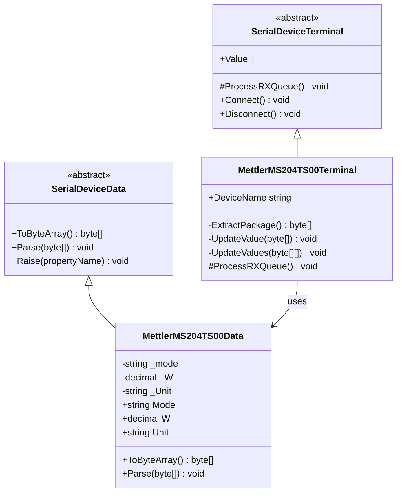
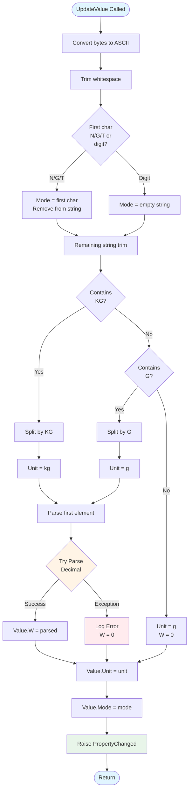
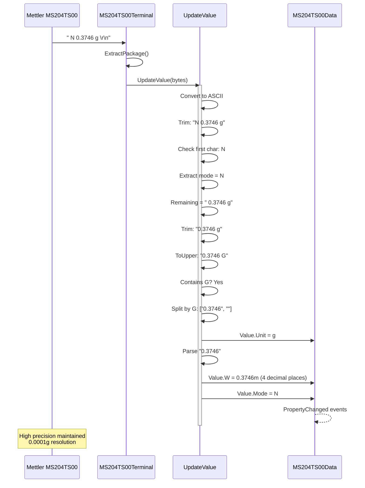

# Device Implementation: MettlerMS204TS00

**Device Type:** Laboratory Balance
**Complexity:** ⭐⭐ Medium
**Protocol:** Single-line with mode prefix
**File:** `MettlerMS204TS00.cs`

---

## Overview

High-precision laboratory balance with 0.0001g resolution. Used for precise measurements in laboratory environments with temperature compensation.

### Protocol Specification

**Format:** `[mode][spaces][weight] g[spaces]\r\n`

**Example:**
```
     N       0.3746 g
```

**Field Description:**
- **Mode:** Single character (optional)
  - `N` = Net weight mode
  - `G` = Gross weight mode
  - `T` = Tare mode
  - (empty) = Standard mode
- **Weight:** Variable length, right-aligned with spaces, 4 decimal places
- **Unit:** `g` or `kg` (typically grams for high precision)
- **Terminator:** `\r\n` (0x0D 0x0A)

**Update Rate:** Continuous (when weight changes)
**Precision:** 0.0001 g (0.1 mg)
**Capacity:** 220 g

---

## Class Diagram



---

## Data Class Properties

### MettlerMS204TS00Data

| Property | Type | Default | Description |
|----------|------|---------|-------------|
| `Mode` | string | "" | Operating mode (N/G/T or empty) |
| `W` | decimal | 0 | Weight value (4 decimal places) |
| `Unit` | string | "g" | Measurement unit |

---

## Flowchart - Mode and Weight Parsing



---

## Sequence Diagram - High Precision Reading



---

## Implementation Details

### Key Methods

#### UpdateValue()
```csharp
private void UpdateValue(byte[] content)
{
    string line = Encoding.ASCII.GetString(content).Trim();
    if (string.IsNullOrEmpty(line)) return;

    string mode = "";

    // Check if first char is mode indicator
    char firstChar = line[0];
    if (firstChar == 'N' || firstChar == 'G' || firstChar == 'T')
    {
        mode = firstChar.ToString();
        line = line.Substring(1).Trim();
    }

    // Parse weight and unit
    line = line.ToUpper();
    string unit = "g";
    decimal weight = 0m;

    try
    {
        if (line.Contains("KG"))
        {
            string[] parts = line.Split(new[] { "KG" }, StringSplitOptions.None);
            unit = "kg";
            weight = decimal.Parse(parts[0].Trim());
        }
        else if (line.Contains("G"))
        {
            string[] parts = line.Split(new[] { "G" }, StringSplitOptions.None);
            unit = "g";
            weight = decimal.Parse(parts[0].Trim());
        }

        Value.W = weight;
        Value.Unit = unit;
        Value.Mode = mode;
    }
    catch (Exception ex)
    {
        MethodBase.GetCurrentMethod().Err(ex);
    }
}
```

### Precision Handling

The balance maintains 4 decimal places (0.0001 g) precision:
- Uses `decimal` type to avoid floating-point errors
- Preserves trailing zeros in display
- Temperature-compensated measurements

---

## Usage Example

### Emulator (Sending Data)
```csharp
var emulator = MettlerMS204TS00Device.Instance;
emulator.LoadConfig();
emulator.Start();

// Simulate precise measurement
emulator.Value.Mode = "N";
emulator.Value.W = 0.3746m;
emulator.Value.Unit = "g";
byte[] data = emulator.Value.ToByteArray();
// Automatically transmitted
```

### Terminal (Receiving Data)
```csharp
var terminal = MettlerMS204TS00Terminal.Instance;
terminal.LoadConfig();
terminal.Connect();

// Listen for high-precision readings
terminal.OnRx += (s, e) => {
    string modeText = terminal.Value.Mode == "N" ? "NET" :
                      terminal.Value.Mode == "G" ? "GROSS" :
                      terminal.Value.Mode == "T" ? "TARE" : "STANDARD";

    Console.WriteLine($"Mode: {modeText}");
    Console.WriteLine($"Weight: {terminal.Value.W:F4} {terminal.Value.Unit}");
};
```

---

## Protocol Examples

### Different Modes
```
     N       0.3746 g      # Net mode, 0.3746 grams
     G      12.5834 g      # Gross mode, 12.5834 grams
     T       0.0000 g      # Tare mode, zero
            50.1234 g      # Standard mode (no prefix)
```

### Unit Variations
```
     N       0.3746 g      # Grams
     N       0.0003746 kg  # Kilograms (same weight)
```

### Edge Cases
```
     N       0.0000 g      # Zero weight
     N     220.0000 g      # Maximum capacity
     N      -0.0001 g      # Negative (tare exceeded)
```

---

## Testing Notes

- **Precision:** Always display 4 decimal places
- **Mode Detection:** Handle optional mode character correctly
- **Unit Parsing:** Support both g and kg units
- **Temperature:** Balance auto-compensates for temperature
- **Stability:** Device only sends when reading is stable
- **Calibration:** Regular calibration required for accuracy

---

## Technical Specifications

- **Model:** Mettler Toledo MS204TS00
- **Capacity:** 220 g
- **Readability:** 0.0001 g (0.1 mg)
- **Repeatability:** 0.0001 g
- **Linearity:** ±0.0002 g
- **Stabilization Time:** ~2 seconds
- **Operating Temperature:** 10-30°C

---

## HEX Dump from Log Files

Raw serial data captured from the Mettler Toledo MS204TS00 analytical balance. This data was captured using third-party serial monitoring tools and serves as reference for protocol implementation.

**Source:** `Documents/LuckyTex Devices/MS204TS00/Mettler Toledo (MS204TS00) - NPT Mettler QDMS Hex.txt`

### Sample Data Format

**ASCII Text:**
```
     N          0.3746 g
```

**HEX Dump:**
```
20 20 20 20 20 4E 20 20 20 20 20 20 20 30 2E 33 37 34 36 20 67 20 20 20 0D 0A
```

### Byte-by-Byte Breakdown

```
20 20 20 20 20    5 spaces (padding)
4E                "N" - status character (Net weight, stable)
20 20 20 20 20    5 spaces (separator)
20 20             2 spaces (value padding)
30 2E 33 37 34 36 "0.3746" - weight value (6 characters)
20                space
67                "g" - unit character
20 20 20          3 spaces (trailing)
0D 0A             CR+LF terminator
```

**Total Length:** 26 bytes per reading

### Field Analysis

**Status Character (Position 6):**
- `4E` = 'N' (Net weight, stable)
- Other possible values: 'S' (Gross stable), 'G' (Gross unstable)

**Weight Value (Positions 13-18):**
- Always 6 characters for the numeric value
- Format: X.XXXX (4 decimal places)
- Right-aligned within field

**Unit (Position 20):**
- `67` = 'g' (grams)
- Can also be 'kg' for kilograms

### Example Continuous Readings

```
// HEX format showing stable weight readings
20 20 20 20 20 4E 20 20 20 20 20 20 20 30 2E 33 37 34 39 20 67 20 20 20 0D 0A
20 20 20 20 20 4E 20 20 20 20 20 20 20 30 2E 33 37 34 37 20 67 20 20 20 0D 0A
20 20 20 20 20 4E 20 20 20 20 20 20 20 30 2E 33 37 34 36 20 67 20 20 20 0D 0A
20 20 20 20 20 4E 20 20 20 20 20 20 20 30 2E 33 37 34 36 20 67 20 20 20 0D 0A
```

**ASCII Representation:**
```
     N          0.3749 g
     N          0.3747 g
     N          0.3746 g
     N          0.3746 g
```

### Protocol Observations from Logs

1. **Fixed Width Format:** Every transmission is exactly 26 bytes
2. **High Precision:** 4 decimal places (0.1 mg resolution)
3. **Stable Only:** Device only transmits when reading is stable
4. **Consistent Layout:** Fixed field positions for parsing
5. **Status First:** Mode/status character appears before weight
6. **Padding Strategy:** Both leading and trailing spaces for alignment
7. **Unit Flexibility:** Supports both 'g' and 'kg' units
8. **Update Rate:** Continuous stream when stable weight detected

### Parsing Strategy

The fixed 26-byte format allows for reliable parsing:
1. Extract bytes 0-25 (complete line)
2. Convert to ASCII string
3. Split by spaces (RemoveEmptyEntries)
4. Element[0] = Status character
5. Element[1] = Weight value (decimal)
6. Element[2] = Unit string

### Comparison with Other Devices

Unlike simpler scales (DEFENDER3000), the Mettler balance:
- Places status character BEFORE weight value
- Uses higher precision (4 decimals vs 3)
- Only transmits stable readings
- Includes temperature compensation
- Uses scientific/laboratory format

---

## Related Files

- **Data Class:** `NLib.Serial.Devices.MettlerMS204TS00Data`
- **Emulator:** `NLib.Serial.Emulators.MettlerMS204TS00Device`
- **Terminal:** `NLib.Serial.Terminals.MettlerMS204TS00Terminal`
- **Log Reference:** `Documents/LuckyTex Devices/MettlerMS204TS00/`

---

## See Also

- [Device Comparison](CODE_ANALYSIS_NLib.Serial.Devices.md#device-implementations)
- [Base Classes](CODE_ANALYSIS_NLib.Serial.Devices.md#base-class-framework)
- [CordDEFENDER3000 Device](Device-01-CordDEFENDER3000.md) - Similar simple protocol
