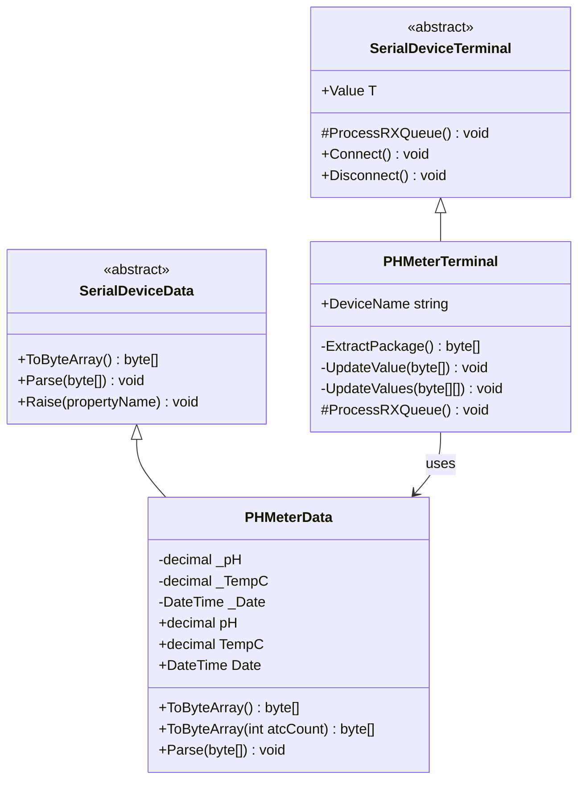
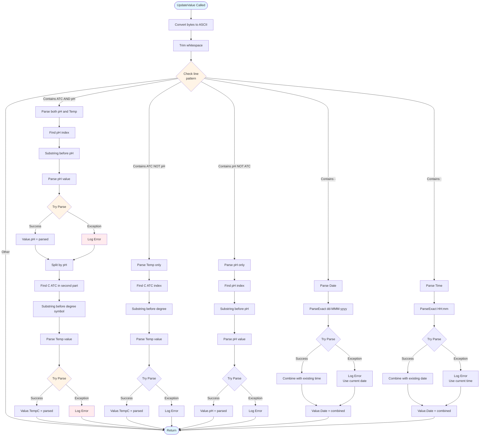
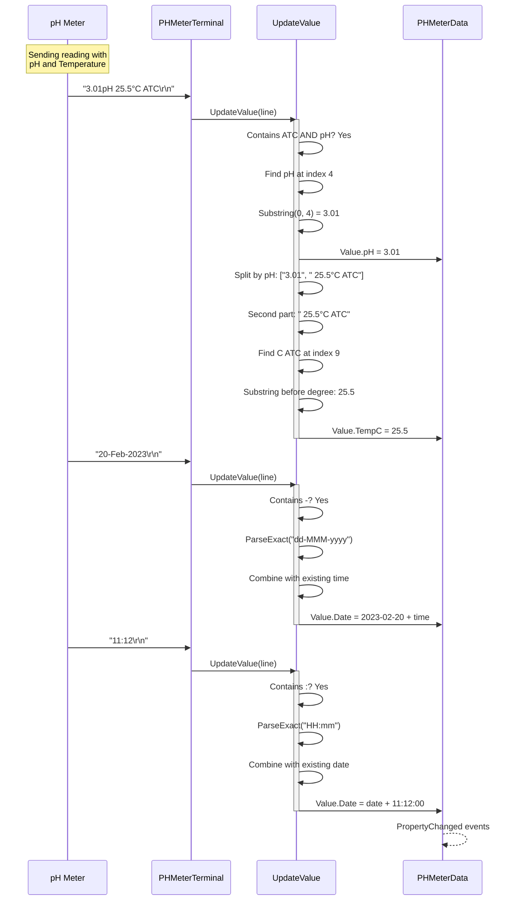

# Device Implementation: PHMeter

**Device Type:** pH Meter with Temperature
**Complexity:** ⭐⭐⭐ Medium-Complex
**Protocol:** Multi-line with pH, temperature, and date/time
**File:** `PHMeter.cs`

---

## Overview

pH meter with temperature compensation. Sends multiple lines including pH value, temperature, date, and time. Uses special encoding for degree symbol.

### Protocol Specification

**Format:** Multi-line with varying patterns

**Example:**
```
3.01pH 25.5°C ATC
20-Feb-2023
11:12
```

**Field Description:**
- **pH Line:** `[pH value]pH [temp]°C ATC`
  - pH value: decimal with 2 decimal places
  - Temperature: decimal in Celsius
  - 0xF8 byte for degree symbol (°)
  - ATC: Automatic Temperature Compensation indicator
- **Date Line:** `dd-MMM-yyyy` format (e.g., 20-Feb-2023)
- **Time Line:** `HH:mm` format (24-hour)

**Special Bytes:**
- `0xF8` = Degree symbol (°)

**Update Rate:** On-demand or periodic
**Precision:** pH ±0.01, Temperature ±0.1°C

---

## Class Diagram



---

## Data Class Properties

### PHMeterData

| Property | Type | Default | Description |
|----------|------|---------|-------------|
| `pH` | decimal | 7.0 | pH value (0-14 range) |
| `TempC` | decimal | 25.0 | Temperature in Celsius |
| `Date` | DateTime | DateTime.Now | Date and time of measurement |

### ToByteArray() Overloads

```csharp
// Standard output (3 lines)
public override byte[] ToByteArray()

// Custom ATC count for testing
public byte[] ToByteArray(int atcCount)
```

---

## Flowchart - Multi-Pattern Parsing



---

## Sequence Diagram - pH and Temperature Reading



---

## Implementation Details

### Key Parsing Methods

#### Parse pH and Temperature Together
```csharp
if (content.Contains("ATC") && content.Contains("pH"))
{
    // Parse pH
    int idxPH = content.IndexOf("pH");
    string phStr = content.Substring(0, idxPH);
    try
    {
        Value.pH = decimal.Parse(phStr.Trim());
    }
    catch (Exception ex)
    {
        MethodBase.GetCurrentMethod().Err(ex);
    }

    // Parse Temperature
    string[] parts = content.Split(new[] { "pH" }, StringSplitOptions.None);
    if (parts.Length > 1)
    {
        string tempPart = parts[1];
        int idxATC = tempPart.IndexOf("C ATC");
        if (idxATC > 0)
        {
            // Extract temperature before degree symbol
            string tempStr = "";
            for (int i = 0; i < idxATC; i++)
            {
                if (char.IsDigit(tempPart[i]) || tempPart[i] == '.' || tempPart[i] == '-')
                    tempStr += tempPart[i];
            }
            try
            {
                Value.TempC = decimal.Parse(tempStr.Trim());
            }
            catch (Exception ex)
            {
                MethodBase.GetCurrentMethod().Err(ex);
            }
        }
    }
}
```

#### Parse Date
```csharp
if (content.Contains("-") && !content.Contains(":"))
{
    try
    {
        DateTime date = DateTime.ParseExact(content, "dd-MMM-yyyy",
                                            CultureInfo.InvariantCulture);
        // Combine with existing time
        Value.Date = new DateTime(date.Year, date.Month, date.Day,
                                  Value.Date.Hour, Value.Date.Minute, 0);
    }
    catch (Exception ex)
    {
        MethodBase.GetCurrentMethod().Err(ex);
    }
}
```

#### Parse Time
```csharp
if (content.Contains(":") && !content.Contains("-"))
{
    try
    {
        DateTime time = DateTime.ParseExact(content, "HH:mm",
                                            CultureInfo.InvariantCulture);
        // Combine with existing date
        Value.Date = new DateTime(Value.Date.Year, Value.Date.Month, Value.Date.Day,
                                  time.Hour, time.Minute, 0);
    }
    catch (Exception ex)
    {
        MethodBase.GetCurrentMethod().Err(ex);
    }
}
```

### Degree Symbol Handling

The device uses byte `0xF8` for the degree symbol (°). This is not standard ASCII but is handled correctly when converting to/from byte arrays.

---

## Usage Example

### Emulator (Sending Data)
```csharp
var emulator = PHMeterDevice.Instance;
emulator.LoadConfig();
emulator.Start();

// Simulate pH measurement
emulator.Value.pH = 3.01m;
emulator.Value.TempC = 25.5m;
emulator.Value.Date = DateTime.Now;
byte[] data = emulator.Value.ToByteArray();
// Automatically transmitted
```

### Terminal (Receiving Data)
```csharp
var terminal = PHMeterTerminal.Instance;
terminal.LoadConfig();
terminal.Connect();

// Listen for pH readings
terminal.OnRx += (s, e) => {
    Console.WriteLine($"pH: {terminal.Value.pH:F2}");
    Console.WriteLine($"Temperature: {terminal.Value.TempC:F1}°C");
    Console.WriteLine($"Measured: {terminal.Value.Date:yyyy-MM-dd HH:mm}");

    // pH classification
    string classification = terminal.Value.pH < 7 ? "ACIDIC" :
                           terminal.Value.pH > 7 ? "ALKALINE" : "NEUTRAL";
    Console.WriteLine($"Classification: {classification}");
};
```

---

## Protocol Examples

### Complete Reading
```
3.01pH 25.5°C ATC
20-Feb-2023
11:12
```

### pH Only
```
7.42pH
```

### Temperature Only
```
24.8°C ATC
```

### Different pH Values
```
1.23pH 25.0°C ATC    # Strong acid
7.00pH 25.0°C ATC    # Neutral
13.45pH 25.0°C ATC   # Strong base
```

---

## Testing Notes

- **Pattern Matching:** Parser checks for different line patterns
- **ATC:** Automatic Temperature Compensation always present
- **Date Format:** Uses 3-letter month abbreviation (Feb, Mar, etc.)
- **Time Format:** 24-hour format (HH:mm)
- **Temperature Effect:** pH is temperature-dependent, hence ATC
- **Calibration:** Regular calibration with pH 4.01, 7.00, and 10.01 buffers

---

## pH Ranges Reference

| pH Range | Classification | Examples |
|----------|---------------|----------|
| 0-3 | Strong Acid | Battery acid, stomach acid |
| 3-6 | Weak Acid | Orange juice, coffee |
| 6-8 | Neutral | Pure water, milk |
| 8-11 | Weak Base | Baking soda, seawater |
| 11-14 | Strong Base | Bleach, drain cleaner |

---

## HEX Dump from Log Files

Raw serial data captured from the pH Meter device. This data was captured using third-party serial monitoring tools and serves as reference for protocol implementation.

**Source:** `Documents/LuckyTex Devices/PH Meter/Serial_Log PH.txt`

### Complete Measurement Package

**ASCII Text:**
```
3.01pH 25.5°C ATC
3.01pH 25.5°C ATC
20-Feb-2023
11:11

3.01pH
25.5°C ATC
Auto EP Standard
Blank
```

**HEX Dump:**
```
33 2E 30 31 70 48 20 32 35 2E 35 F8 43 20 41 54    3.01pH 25.5.C AT
43 0D 0A 33 2E 30 31 70 48 20 32 35 2E 35 F8 43    C..3.01pH 25.5.C
20 41 54 43 0D 0A 32 30 2D 46 65 62 2D 32 30 32     ATC..20-Feb-202
33 0D 0A 31 31 3A 31 31 0D 0A 20 0D 0A 33 2E 30    3..11:11.. ..3.0
31 70 48 0D 0A 32 35 2E 35 F8 43 20 41 54 43 0D    1pH..25.5.C ATC.
0A 41 75 74 6F 20 45 50 20 53 74 61 6E 64 61 72    .Auto EP Standar
64 0D 0A 42 6C 61 6E 6B 0D 0A 0D 0A 0D 0A          d..Blank........
```

### Byte-by-Byte Breakdown

**pH Reading (Line 1 & 2):**
```
33 2E 30 31       "3.01" - pH value
70 48             "pH" - unit
20                space
32 35 2E 35       "25.5" - temperature
F8                degree symbol (°) - special character
43                "C" - Celsius
20                space
41 54 43          "ATC" - Automatic Temperature Compensation
0D 0A             CR+LF
```

**Date (Line 3):**
```
32 30 2D          "20-"
46 65 62          "Feb" - month abbreviation
2D 32 30 32 33    "-2023"
0D 0A             CR+LF
```

**Time (Line 4):**
```
31 31 3A 31 31    "11:11" - HH:mm format
0D 0A             CR+LF
```

**Empty Line:**
```
20 0D 0A          space + CR+LF
```

**pH Value Only:**
```
33 2E 30 31 70 48 "3.01pH"
0D 0A             CR+LF
```

**Temperature with ATC:**
```
32 35 2E 35       "25.5"
F8                degree symbol (°)
43 20 41 54 43    "C ATC"
0D 0A             CR+LF
```

**Measurement Mode:**
```
41 75 74 6F 20 45 50 20 53 74 61 6E 64 61 72 64    "Auto EP Standard"
0D 0A                                              CR+LF
```

**Sample ID:**
```
42 6C 61 6E 6B    "Blank"
0D 0A 0D 0A 0D 0A CR+LF (multiple line terminators)
```

### Example pH Range Readings

**Acidic Sample (pH 3.46):**
```
// HEX format
34 2E 35 34 70 48 20 32 34 2E 37 F8 43 20 41 54    4.54pH 24.7.C AT
43 0D 0A 34 2E 35 37 70 48 20 32 34 2E 37 F8 43    C..4.57pH 24.7.C
20 41 54 43 0D 0A 34 2E 35 38 70 48 20 32 34 2E     ATC..4.58pH 24.
37 F8 43 20 41 54 43 0D 0A                         7.C ATC..
```

**ASCII:**
```
4.54pH 24.7°C ATC
4.57pH 24.7°C ATC
4.58pH 24.7°C ATC
```

### Special Character Notes

**Degree Symbol (0xF8):**
- Non-standard ASCII character
- Represents the degree symbol (°)
- Must be handled specially in parsing
- Alternative: Use Unicode \u00B0 for display

### Protocol Observations from Logs

1. **Multi-Line Format:** Each measurement produces multiple lines
2. **Duplicate Lines:** pH reading appears twice at start
3. **Special Characters:** Uses 0xF8 for degree symbol
4. **ATC Always Present:** Temperature compensation is standard
5. **Date Format:** DD-MMM-YYYY (3-letter month)
6. **Time Format:** HH:mm (24-hour, no seconds in some outputs)
7. **Metadata Lines:** Includes measurement mode and sample ID
8. **Variable Length:** Package length varies based on sample name
9. **Multiple Terminators:** Some lines end with multiple CR+LF pairs

### Parsing Challenges

1. **Variable Structure:** Not all measurements have the same number of lines
2. **Special Characters:** 0xF8 degree symbol requires special handling
3. **Line Identification:** Must detect line type by pattern matching
4. **Continuous Stream:** Multiple measurements can arrive back-to-back
5. **Empty Lines:** Must handle blank lines properly

### Measurement Types Observed

**Pattern 1 - Simple Reading:**
```
3.01pH 25.5°C ATC
```

**Pattern 2 - With Date/Time:**
```
3.01pH 25.5°C ATC
20-Feb-2023
11:11
```

**Pattern 3 - Full Package:**
```
3.01pH 25.5°C ATC
20-Feb-2023
11:11

3.01pH
25.5°C ATC
Auto EP Standard
Blank
```

The parser must handle all three patterns flexibly.

---

## Related Files

- **Data Class:** `NLib.Serial.Devices.PHMeterData`
- **Emulator:** `NLib.Serial.Emulators.PHMeterDevice`
- **Terminal:** `NLib.Serial.Terminals.PHMeterTerminal`
- **Log Reference:** `Documents/LuckyTex Devices/PHMeter/`

---

## See Also

- [Device Comparison](CODE_ANALYSIS_NLib.Serial.Devices.md#device-implementations)
- [Base Classes](CODE_ANALYSIS_NLib.Serial.Devices.md#base-class-framework)
- [JIK6CAB Device](Device-02-JIK6CAB.md) - Another multi-line protocol
