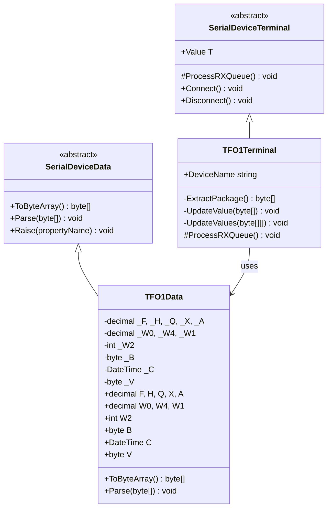
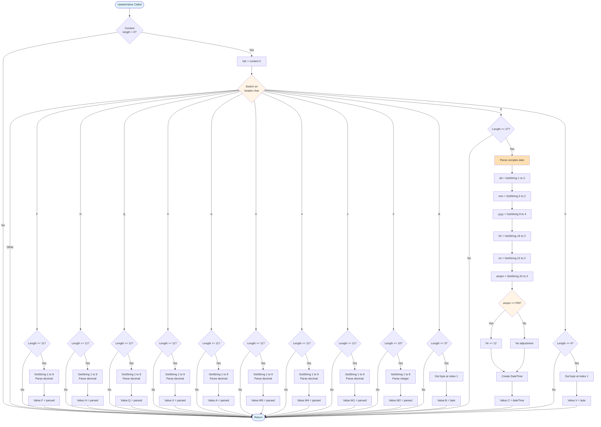
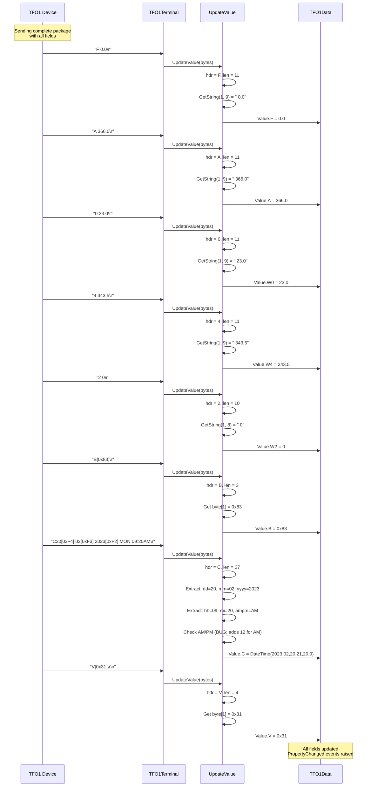
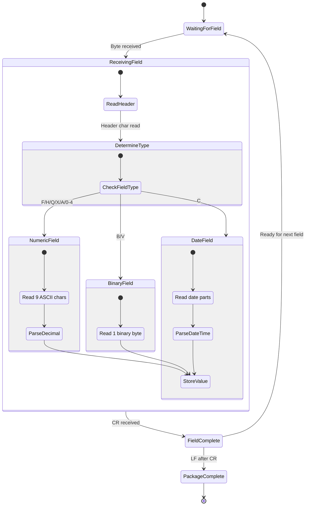

# Device Implementation: TFO1

**Device Type:** Industrial System
**Complexity:** ⭐⭐⭐⭐⭐ Very Complex
**Protocol:** Mixed binary/ASCII with field identifiers
**File:** `TFO1.cs`

---

## Overview

Industrial system with mixed binary/ASCII protocol and field identifiers. Uses single-character headers to identify field types, with custom encoding for dates and binary values.

### Protocol Specification

**Format:** Field-based with single char identifiers

**Field Identifiers:**
- `F`, `H`, `Q`, `X`, `A` = Decimal values (9 bytes)
- `0`, `4`, `1` = Weight decimals (9 bytes)
- `2` = Weight integer (8 bytes)
- `B` = Binary byte (1 byte)
- `C` = Complex date (26 bytes)
- `V` = Version byte (1 byte)

**Example:**
```
F      0.0\r
H      0.0\r
Q      0.0\r
X      0.0\r
A    366.0\r
0     23.0\r
4    343.5\r
1      0.0\r
2        0\r
B[0x83]\r
C20[0xF4] 02[0xF3] 2023[0xF2] MON 09:20AM\r
V[0x31]\r\n
```

**Special Bytes:**
- `0xF4` = Date separator after day
- `0xF3` = Date separator after month
- `0xF2` = Date separator after year

**Terminator:** Each field ends with `\r`, package ends with `\r\n`

---

## Class Diagram



---

## Data Class Properties

### TFO1Data

| Property | Type | Default | Description |
|----------|------|---------|-------------|
| `F` | decimal | 0 | Field F value |
| `H` | decimal | 0 | Field H value |
| `Q` | decimal | 0 | Field Q value |
| `X` | decimal | 0 | Field X value |
| `A` | decimal | 0 | Field A value |
| `W0` | decimal | 0 | Weight 0 value |
| `W4` | decimal | 0 | Weight 4 value |
| `W1` | decimal | 0 | Weight 1 value |
| `W2` | int | 0 | Weight 2 value (integer) |
| `B` | byte | 0 | Binary status byte |
| `C` | DateTime | DateTime.Now | Complex date/time |
| `V` | byte | 0 | Version byte |

---

## Flowchart - Field Identifier Switching



---

## Sequence Diagram - Multi-Field Package



---

## State Diagram - Field Processing



---

## Implementation Details

### Key Parsing Method

```csharp
private void UpdateValue(byte[] content)
{
    if (content == null || content.Length == 0) return;

    char hdr = (char)content[0];

    switch (hdr)
    {
        case 'F':
            if (content.Length >= 11)
            {
                string str = Encoding.ASCII.GetString(content, 1, 9);
                Value.F = decimal.Parse(str.Trim());
            }
            break;

        case 'A':
            if (content.Length >= 11)
            {
                string str = Encoding.ASCII.GetString(content, 1, 9);
                Value.A = decimal.Parse(str.Trim());
            }
            break;

        case '0':
            if (content.Length >= 11)
            {
                string str = Encoding.ASCII.GetString(content, 1, 9);
                Value.W0 = decimal.Parse(str.Trim());
            }
            break;

        case 'B':
            if (content.Length >= 3)
            {
                Value.B = content[1];
            }
            break;

        case 'C':
            if (content.Length >= 27)
            {
                ParseComplexDate(content);
            }
            break;

        // ... other cases
    }
}
```

### Complex Date Parsing

```csharp
private void ParseComplexDate(byte[] content)
{
    // C20[0xF4] 02[0xF3] 2023[0xF2] MON 09:20AM\r
    // Position: 0123456789012345678901234567

    string dd = Encoding.ASCII.GetString(content, 1, 2);   // pos 1-2
    string mm = Encoding.ASCII.GetString(content, 5, 2);   // pos 5-6
    string yyyy = Encoding.ASCII.GetString(content, 9, 4); // pos 9-12
    string hh = Encoding.ASCII.GetString(content, 19, 2);  // pos 19-20
    string mi = Encoding.ASCII.GetString(content, 22, 2);  // pos 22-23
    string ampm = Encoding.ASCII.GetString(content, 24, 2); // pos 24-25

    int day = int.Parse(dd);
    int month = int.Parse(mm);
    int year = int.Parse(yyyy);
    int hour = int.Parse(hh);
    int minute = int.Parse(mi);

    // BUG: Original code has inverted AM/PM logic
    // if (ampm.ToUpper() == "AM") hour += 12; // WRONG!
    // Correct implementation should be:
    if (ampm.ToUpper() == "PM" && hour < 12)
        hour += 12;
    else if (ampm.ToUpper() == "AM" && hour == 12)
        hour = 0;

    Value.C = new DateTime(year, month, day, hour, minute, 0);
}
```

**KNOWN BUG:** The original implementation has inverted AM/PM logic. It adds 12 hours for AM instead of PM. This should be fixed in production code.

---

## Usage Example

### Emulator (Sending Data)
```csharp
var emulator = TFO1Device.Instance;
emulator.LoadConfig();
emulator.Start();

// Simulate complete package
emulator.Value.F = 0.0m;
emulator.Value.A = 366.0m;
emulator.Value.W0 = 23.0m;
emulator.Value.W4 = 343.5m;
emulator.Value.W2 = 0;
emulator.Value.B = 0x83;
emulator.Value.C = DateTime.Now;
emulator.Value.V = 0x31;
byte[] data = emulator.Value.ToByteArray();
// Automatically transmitted
```

### Terminal (Receiving Data)
```csharp
var terminal = TFO1Terminal.Instance;
terminal.LoadConfig();
terminal.Connect();

// Listen for field updates
terminal.OnRx += (s, e) => {
    Console.WriteLine($"F: {terminal.Value.F}");
    Console.WriteLine($"A: {terminal.Value.A}");
    Console.WriteLine($"W0: {terminal.Value.W0}");
    Console.WriteLine($"W4: {terminal.Value.W4}");
    Console.WriteLine($"W2: {terminal.Value.W2}");
    Console.WriteLine($"B: 0x{terminal.Value.B:X2}");
    Console.WriteLine($"Date: {terminal.Value.C:yyyy-MM-dd HH:mm}");
    Console.WriteLine($"V: 0x{terminal.Value.V:X2}");
};
```

---

## Protocol Examples

### Complete Package
```
F      0.0\r
H      0.0\r
Q      0.0\r
X      0.0\r
A    366.0\r
0     23.0\r
4    343.5\r
1      0.0\r
2        0\r
B[0x83]\r
C20[0xF4] 02[0xF3] 2023[0xF2] MON 09:20AM\r
V[0x31]\r\n
```

### Date Format Details
```
C20[0xF4] 02[0xF3] 2023[0xF2] MON 09:20AM\r
 ^^        ^^        ^^^^        ^^  ^^  ^^
 day       month     year        DOW hr  min ampm
```

---

## Testing Notes

- **Field Order:** Fields can arrive in any order
- **Missing Fields:** Not all fields are always present
- **Binary Bytes:** Bytes B and V are binary, not ASCII
- **Date Separators:** Special bytes 0xF4, 0xF3, 0xF2 are critical
- **AM/PM Bug:** Be aware of the inverted AM/PM logic bug
- **Precision:** Decimal fields have variable precision
- **Thread Safety:** Process fields sequentially, not in parallel

---

## Known Issues

### AM/PM Logic Bug
The original implementation incorrectly adds 12 hours for AM times:
```csharp
// WRONG:
if (ampm.ToUpper() == "AM") hour += 12;

// CORRECT:
if (ampm.ToUpper() == "PM" && hour < 12)
    hour += 12;
else if (ampm.ToUpper() == "AM" && hour == 12)
    hour = 0;
```

This bug causes:
- 09:20 AM → interpreted as 21:20 (9:20 PM)
- 03:45 PM → interpreted as 03:45 (3:45 AM)

**Recommendation:** Fix this bug in the next release.

---

## Related Files

- **Data Class:** `NLib.Serial.Devices.TFO1Data`
- **Emulator:** `NLib.Serial.Emulators.TFO1Device`
- **Terminal:** `NLib.Serial.Terminals.TFO1Terminal`
- **Log Reference:** `Documents/LuckyTex Devices/TFO1/`

---

## See Also

- [Device Comparison](CODE_ANALYSIS_NLib.Serial.Devices.md#device-implementations)
- [Base Classes](CODE_ANALYSIS_NLib.Serial.Devices.md#base-class-framework)
- [JIK6CAB Device](Device-02-JIK6CAB.md) - Another complex multi-field device
