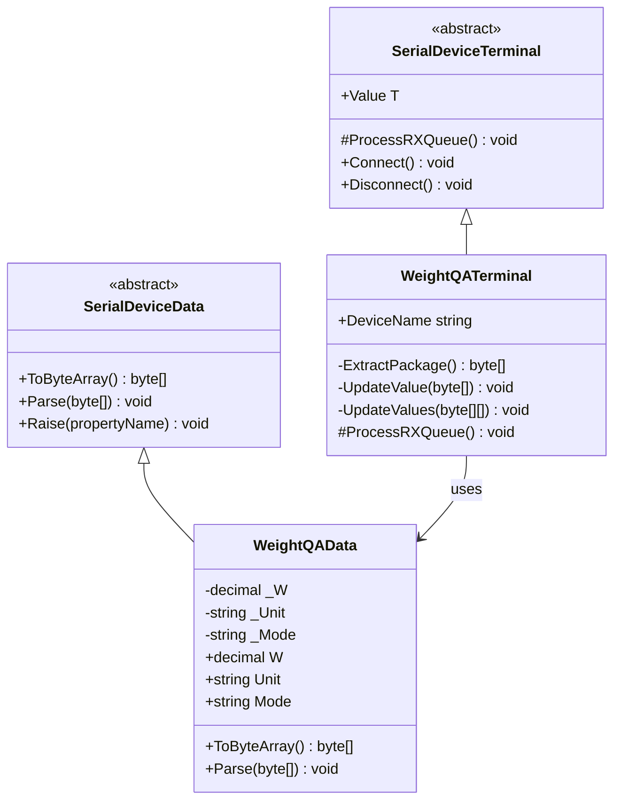
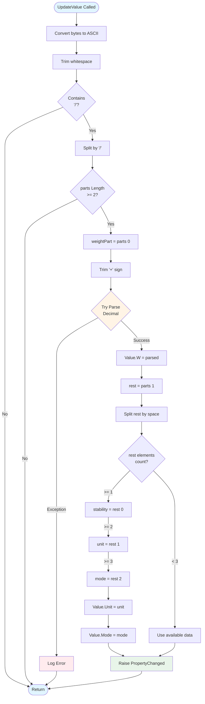
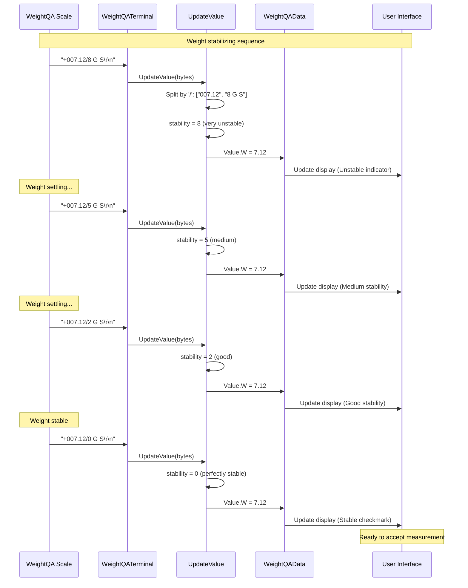
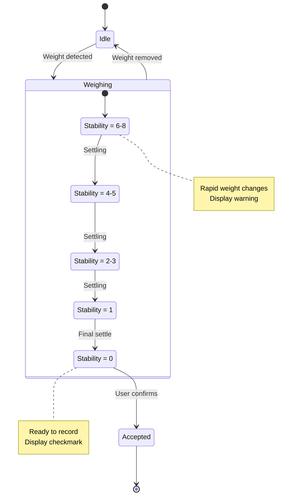

# Device Implementation: WeightQA

**Device Type:** Quality Assurance Scale
**Complexity:** ⭐⭐ Medium
**Protocol:** Single-line with stability index
**File:** `WeightQA.cs`

---

## Overview

Quality assurance scale with stability index encoding. Provides weight readings with a numerical stability indicator (0-8) for quality control purposes.

### Protocol Specification

**Format:** `[sign][weight]/[stability] [unit] [mode]\r\n`

**Example:**
```
+007.12/3 G S
```

**Field Description:**
- **Sign:** `+` or `-` (always present)
- **Weight:** Fixed format with leading zeros
- **Stability:** Single digit (0-8)
  - `0` = Perfectly stable
  - `1` = Near stable
  - `2-3` = Stabilizing
  - `4-5` = Unstable
  - `6-8` = Very unstable
- **Unit:** Weight unit (G, kg, etc.)
- **Mode:** Operating mode (S, N, T, etc.)
- **Terminator:** `\r\n` (0x0D 0x0A)

**Update Rate:** Continuous (changes with stability)
**Precision:** 0.01 units

---

## Class Diagram



---

## Data Class Properties

### WeightQAData

| Property | Type | Default | Description |
|----------|------|---------|-------------|
| `W` | decimal | 0 | Weight value |
| `Unit` | string | "G" | Measurement unit |
| `Mode` | string | "S" | Operating mode |

**Note:** The stability index is parsed but not stored in the data class. It is used during parsing to determine data quality but discarded after validation.

---

## Flowchart - Stability Index Decoding



---

## Sequence Diagram - Stability Tracking



---

## State Diagram - Stability States



---

## Implementation Details

### Key Parsing Method

```csharp
private void UpdateValue(byte[] content)
{
    string line = Encoding.ASCII.GetString(content).Trim();

    if (string.IsNullOrEmpty(line) || !line.Contains("/"))
        return;

    // Split by '/' to separate weight and stability
    string[] parts = line.Split('/');
    if (parts.Length < 2) return;

    try
    {
        // Parse weight (remove '+' sign if present)
        string weightStr = parts[0].TrimStart('+');
        Value.W = decimal.Parse(weightStr);

        // Parse rest: "stability unit mode"
        string rest = parts[1];
        string[] restParts = rest.Split(new[] { ' ' },
                                        StringSplitOptions.RemoveEmptyEntries);

        if (restParts.Length >= 1)
        {
            // Stability index at position 0 (not stored)
            int stability = int.Parse(restParts[0]);
            // Could use stability for UI feedback
        }

        if (restParts.Length >= 2)
            Value.Unit = restParts[1];

        if (restParts.Length >= 3)
            Value.Mode = restParts[2];
    }
    catch (Exception ex)
    {
        MethodBase.GetCurrentMethod().Err(ex);
    }
}
```

### Stability Index Interpretation

```csharp
public string GetStabilityText(int stability)
{
    switch (stability)
    {
        case 0: return "Perfectly Stable";
        case 1: return "Near Stable";
        case 2:
        case 3: return "Stabilizing";
        case 4:
        case 5: return "Unstable";
        case 6:
        case 7:
        case 8: return "Very Unstable";
        default: return "Unknown";
    }
}

public bool IsAcceptable(int stability)
{
    return stability <= 1; // Only accept perfectly stable or near stable
}
```

---

## Usage Example

### Emulator (Sending Data)
```csharp
var emulator = WeightQADevice.Instance;
emulator.LoadConfig();
emulator.Start();

// Simulate QA measurement with stability
emulator.Value.W = 7.12m;
emulator.Value.Unit = "G";
emulator.Value.Mode = "S";
// Note: Stability is added during ToByteArray()
byte[] data = emulator.Value.ToByteArray();
// Automatically transmitted
```

### Terminal (Receiving Data)
```csharp
var terminal = WeightQATerminal.Instance;
terminal.LoadConfig();
terminal.Connect();

// Listen for weight with stability tracking
terminal.OnRx += (s, e) => {
    Console.WriteLine($"Weight: {terminal.Value.W} {terminal.Value.Unit}");
    Console.WriteLine($"Mode: {terminal.Value.Mode}");

    // Parse stability from raw data if needed
    // (not stored in Value object)
};
```

### Quality Control Application
```csharp
private int lastStability = -1;

terminal.OnRx += (s, e) => {
    // Extract stability from protocol
    string line = GetLastReceivedLine();
    int stability = ExtractStability(line);

    // Update UI based on stability
    UpdateStabilityIndicator(stability);

    // Only accept stable readings
    if (stability == 0)
    {
        AcceptWeight(terminal.Value.W);
        PlaySuccessSound();
    }
    else if (stability >= 6)
    {
        ShowWarning("Weight very unstable - please wait");
    }
};
```

---

## Protocol Examples

### Stabilization Sequence
```
+007.12/8 G S    # Very unstable (just placed)
+007.15/7 G S    # Still very unstable
+007.10/6 G S    # Very unstable
+007.12/5 G S    # Unstable
+007.11/4 G S    # Unstable
+007.12/3 G S    # Stabilizing
+007.12/2 G S    # Stabilizing
+007.12/1 G S    # Near stable
+007.12/0 G S    # Perfectly stable - ACCEPT
```

### Different Units and Modes
```
+007.12/0 G S    # Grams, Standard mode
+123.45/0 G N    # Grams, Net mode
+000.12/0 kg T   # Kilograms, Tare mode
-005.00/0 G S    # Negative (tare exceeded)
```

### Edge Cases
```
+000.00/0 G S    # Zero weight, stable
+007.12/8 G S    # Stable weight but moving
+999.99/0 G S    # Maximum reading
```

---

## Testing Notes

- **Stability Threshold:** Quality applications should only accept stability 0 or 1
- **Update Rate:** Scale sends frequent updates during stabilization
- **Sign Handling:** Always includes + or - sign
- **Leading Zeros:** Weight includes leading zeros for fixed format
- **Stability Progression:** Usually decreases from 8 to 0
- **Environmental Factors:** Vibration, air currents affect stability
- **Timeout:** Consider timeout if stability never reaches 0

---

## Quality Assurance Guidelines

### Acceptance Criteria
- Stability must be 0 (some applications accept 1)
- Weight must be within expected range
- Must maintain stability for minimum duration (e.g., 2 seconds)

### Rejection Criteria
- Stability > 1
- Weight outside tolerance
- Stability fluctuating (indicates environmental issues)

### User Feedback
- **Stability 0-1:** Green indicator, ready to accept
- **Stability 2-3:** Yellow indicator, "Stabilizing..."
- **Stability 4-5:** Orange indicator, "Unstable"
- **Stability 6-8:** Red indicator, "Very Unstable - Check environment"

---

## Related Files

- **Data Class:** `NLib.Serial.Devices.WeightQAData`
- **Emulator:** `NLib.Serial.Emulators.WeightQADevice`
- **Terminal:** `NLib.Serial.Terminals.WeightQATerminal`
- **Log Reference:** `Documents/LuckyTex Devices/WeightQA/`

---

## See Also

- [Device Comparison](CODE_ANALYSIS_NLib.Serial.Devices.md#device-implementations)
- [Base Classes](CODE_ANALYSIS_NLib.Serial.Devices.md#base-class-framework)
- [WeightSPUN Device](Device-07-WeightSPUN.md) - Similar weight scale
- [CordDEFENDER3000 Device](Device-01-CordDEFENDER3000.md) - Another scale with stability indicator
