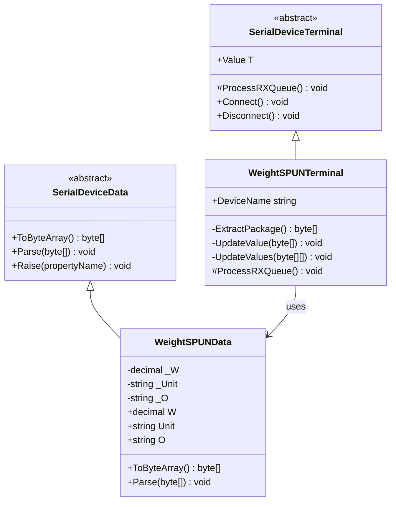
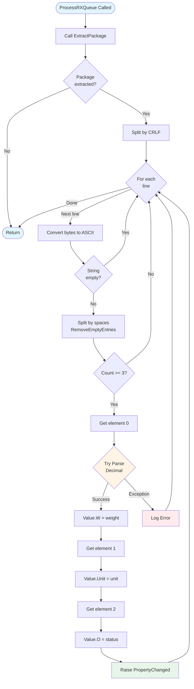
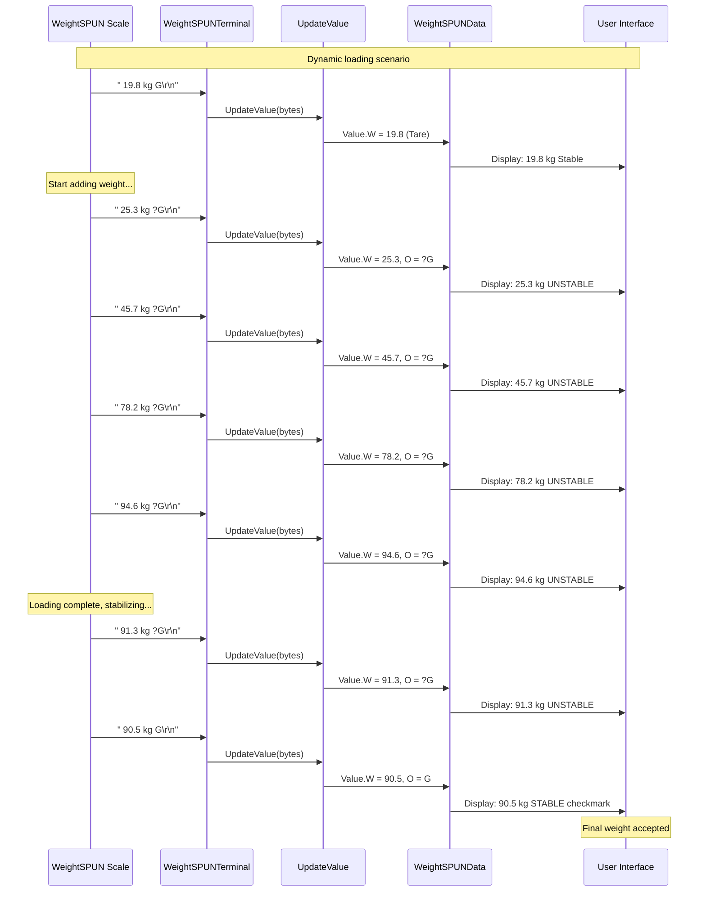
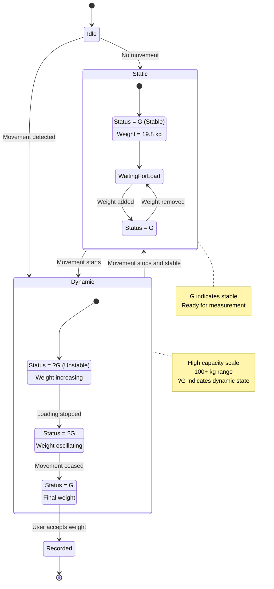

# Device Implementation: WeightSPUN

**Device Type:** Dynamic Weight Scale
**Complexity:** ⭐ Simple
**Protocol:** Single-line continuous streaming (similar to DEFENDER3000)
**File:** `WeightSPUN.cs`

---

## Overview

Dynamic weighing scale for spinning/moving loads, similar to DEFENDER3000 but with higher capacity. Used for weighing objects in motion or on rotating platforms.

### Protocol Specification

**Format:** `[spaces][weight] kg [spaces][status]\r\n`

**Example:**
```
    20.0 kg    G
```

**Field Description:**
- **Weight:** Variable length, right-aligned with spaces
- **Unit:** Typically "kg" for higher capacity
- **Status:** 4 characters, padded left
  - `G` = Gross weight (stable)
  - `N` = Net weight (stable)
  - `?G` = Gross weight (unstable/dynamic)
  - `?N` = Net weight (unstable/dynamic)
- **Terminator:** `\r\n` (0x0D 0x0A)

**Update Rate:** Continuous (high frequency during motion)
**Precision:** 0.1 kg
**Capacity:** 100+ kg (high capacity for industrial use)

---

## Class Diagram



---

## Data Class Properties

### WeightSPUNData

| Property | Type | Default | Description |
|----------|------|---------|-------------|
| `W` | decimal | 0 | Weight value |
| `Unit` | string | "kg" | Measurement unit |
| `O` | string | "G" | Status/Mode (G, N, ?G, ?N) |

---

## Flowchart - Parsing Logic (Same as DEFENDER3000)



---

## Sequence Diagram - Dynamic Weight Loading



---

## State Diagram - Dynamic vs Static Weighing



---

## Implementation Details

### Key Methods

#### ExtractPackage()
```csharp
private byte[] ExtractPackage()
{
    if (Queues == null || Queues.Count <= 0) return null;

    byte[] endPatterns = new byte[] { 0x0D, 0x0A }; // \r\n
    byte[] buffers = Queues.ToArray();

    int idx = IndexOf(buffers, endPatterns);
    if (idx != -1)
    {
        int len = idx + endPatterns.Length;
        byte[] package = new byte[len];
        Array.Copy(buffers, package, len);
        Queues.RemoveRange(0, len);
        return package;
    }
    return null;
}
```

#### UpdateValue()
```csharp
private void UpdateValue(byte[] content)
{
    string line = Encoding.ASCII.GetString(content);
    string[] elems = line.Split(new string[] { " " },
                                  StringSplitOptions.RemoveEmptyEntries);

    if (elems.Length < 3) return;

    try
    {
        Value.W = decimal.Parse(elems[0].Trim());
        Value.Unit = elems[1].Trim();
        Value.O = elems[2].Trim();
    }
    catch (Exception ex)
    {
        MethodBase.GetCurrentMethod().Err(ex);
    }
}
```

**Note:** Implementation is identical to CordDEFENDER3000, only difference is device capacity and typical usage scenario.

---

## Usage Example

### Emulator (Sending Data)
```csharp
var emulator = WeightSPUNDevice.Instance;
emulator.LoadConfig();
emulator.Start();

// Simulate dynamic weighing
emulator.Value.W = 45.7m;
emulator.Value.Unit = "kg";
emulator.Value.O = "?G"; // Unstable/dynamic
byte[] data = emulator.Value.ToByteArray();
// Automatically transmitted
```

### Terminal (Receiving Data)
```csharp
var terminal = WeightSPUNTerminal.Instance;
terminal.LoadConfig();
terminal.Connect();

// Listen for weight updates
terminal.OnRx += (s, e) => {
    Console.WriteLine($"Weight: {terminal.Value.W} {terminal.Value.Unit}");
    Console.WriteLine($"Status: {terminal.Value.O}");

    bool isStable = terminal.Value.O == "G" || terminal.Value.O == "N";
    bool isDynamic = terminal.Value.O.Contains("?");

    if (isStable)
        Console.WriteLine("STABLE - Ready to record");
    else if (isDynamic)
        Console.WriteLine("DYNAMIC - Weight changing");
};
```

### Dynamic Weighing Application
```csharp
private decimal maxWeight = 0;
private List<decimal> weightHistory = new List<decimal>();

terminal.OnRx += (s, e) => {
    decimal currentWeight = terminal.Value.W;
    bool isDynamic = terminal.Value.O.Contains("?");

    if (isDynamic)
    {
        // Track maximum weight during dynamic loading
        if (currentWeight > maxWeight)
            maxWeight = currentWeight;

        // Record weight history for analysis
        weightHistory.Add(currentWeight);

        UpdateDynamicChart(weightHistory);
    }
    else
    {
        // Stable reading - finalize
        Console.WriteLine($"Final Weight: {currentWeight} kg");
        Console.WriteLine($"Max During Loading: {maxWeight} kg");

        // Reset for next measurement
        maxWeight = 0;
        weightHistory.Clear();
    }
};
```

---

## Protocol Examples

### Static Weighing
```
    19.8 kg    G    # Tare, stable
    45.0 kg    G    # Loaded, stable
    19.8 kg    G    # Unloaded, stable
```

### Dynamic Weighing (Loading)
```
    19.8 kg    G    # Initial tare
    25.3 kg   ?G    # Adding weight (unstable)
    45.7 kg   ?G    # Still adding (unstable)
    78.2 kg   ?G    # Continue adding (unstable)
    94.6 kg   ?G    # Near complete (unstable)
    91.3 kg   ?G    # Settling (unstable)
    90.5 kg    G    # Stabilized - FINAL
```

### Spinning Platform
```
    15.0 kg    G    # Empty platform, stable
    85.0 kg   ?G    # Platform spinning with load
    87.0 kg   ?G    # Oscillating while spinning
    84.0 kg   ?G    # Still spinning
    86.0 kg   ?G    # Slowing down
    85.5 kg    G    # Stopped and stable
```

---

## Testing Notes

- **Dynamic Detection:** `?` prefix indicates unstable/moving weight
- **High Capacity:** Designed for 100+ kg loads
- **Update Frequency:** High during dynamic weighing
- **Peak Detection:** Application can track max weight during loading
- **Settling Time:** May take several seconds after motion stops
- **Environmental:** Sensitive to vibration and platform movement

---

## Comparison with CordDEFENDER3000

| Feature | CordDEFENDER3000 | WeightSPUN |
|---------|------------------|------------|
| Protocol | Identical | Identical |
| Capacity | Low (< 10 kg) | High (100+ kg) |
| Precision | 0.005 kg (5g) | 0.1 kg (100g) |
| Use Case | Small items | Large/dynamic loads |
| Typical Unit | kg | kg |
| Dynamic Range | Limited | Wide |

**Key Difference:** WeightSPUN is designed for industrial applications with heavier loads and more dynamic weighing scenarios (spinning platforms, moving conveyors, etc.).

---

## Application Scenarios

### 1. Spinning Platform
- Measure weight of objects on rotating platform
- Track weight changes during rotation
- Detect imbalance or load shift

### 2. Conveyor Belt
- Weigh items moving on conveyor
- High-speed weight capture
- Quality control in production line

### 3. Dynamic Loading
- Measure weight as material is being added
- Track loading rate
- Detect completion of loading

### 4. Bulk Material
- Weigh large quantities
- Handle weight oscillations
- Average multiple readings for accuracy

---

## Related Files

- **Data Class:** `NLib.Serial.Devices.WeightSPUNData`
- **Emulator:** `NLib.Serial.Emulators.WeightSPUNDevice`
- **Terminal:** `NLib.Serial.Terminals.WeightSPUNTerminal`
- **Log Reference:** `Documents/LuckyTex Devices/WeightSPUN/`

---

## See Also

- [Device Comparison](CODE_ANALYSIS_NLib.Serial.Devices.md#device-implementations)
- [Base Classes](CODE_ANALYSIS_NLib.Serial.Devices.md#base-class-framework)
- [CordDEFENDER3000 Device](Device-01-CordDEFENDER3000.md) - Identical protocol, different capacity
- [WeightQA Device](Device-06-WeightQA.md) - Another quality scale with stability indicator
