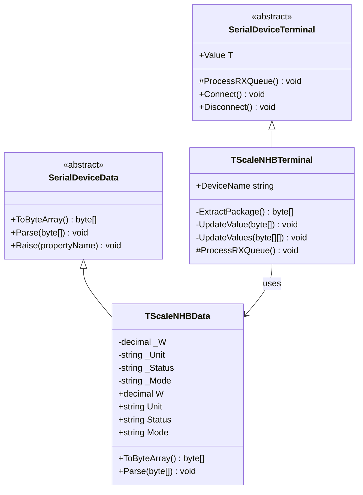
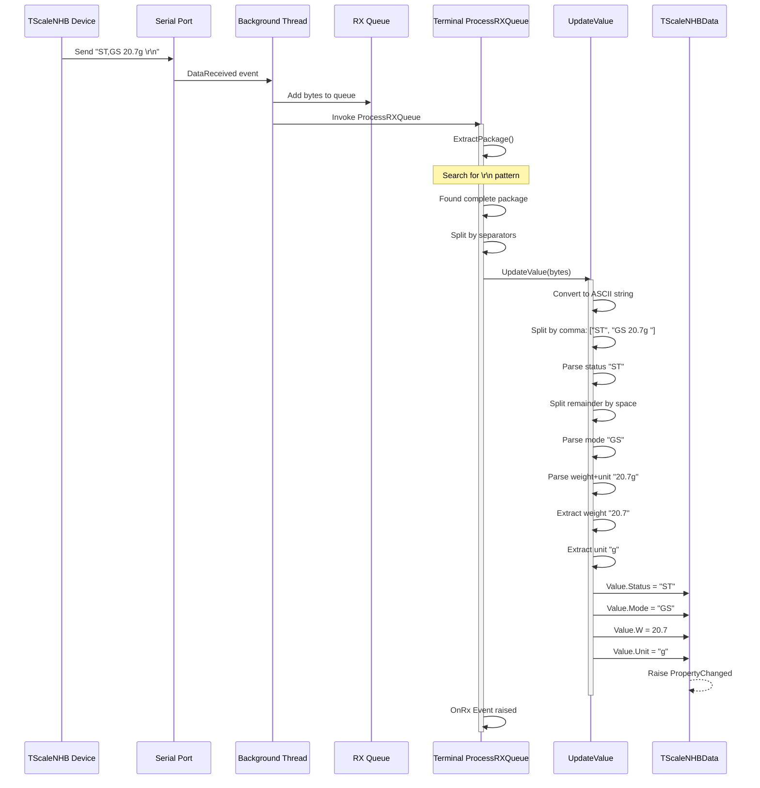
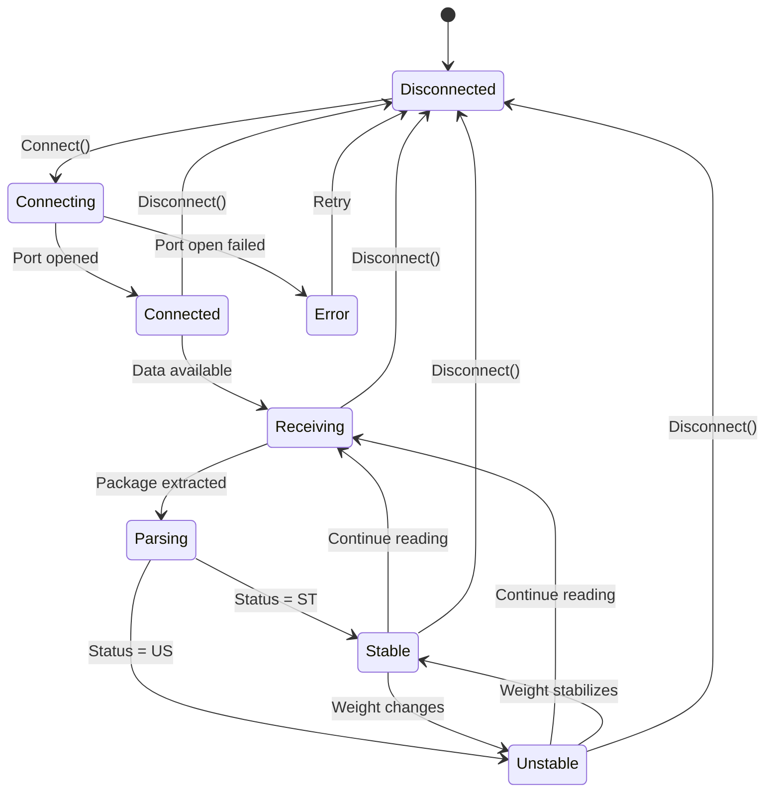

# Device Implementation: TScaleNHB

**Device Type:** Weight Scale
**Complexity:** ⭐ Simple
**Protocol:** Single-line continuous streaming with CSV-like format
**File:** `TScaleNHB.cs`

---

## Overview

Weight scale with continuous streaming CSV-like protocol. Sends weight readings continuously with stability and mode indicators using a comma-separated format.

### Protocol Specification

**Format:** `STATUS,MODE [spaces][weight]unit[spaces]\r\n`

**Example:**
```
ST,GS    20.7g
```

**Field Description:**
- **Status:** 2 characters
  - `ST` = Stable
  - `US` = Unstable
- **Mode:** 2 characters (after first comma)
  - `GS` = Gross/Stable mode
- **Weight:** Variable width, right-aligned with leading spaces (1 decimal place)
- **Unit:** 1-2 characters, directly attached to weight value (typically "g")
- **Terminator:** `\r\n` (0x0D 0x0A)

**Key Protocol Feature:** Single comma separator `ST,GS ` (note: one comma only)

**Update Rate:** Continuous (multiple readings per second)
**Precision:** 0.1 g (one decimal place)

---

## Class Diagram



---

## Data Class Properties

### TScaleNHBData

| Property | Type | Default | Description |
|----------|------|---------|-------------|
| `W` | decimal | 0 | Weight value |
| `Unit` | string | "g" | Measurement unit (grams) |
| `Status` | string | "ST" | Stability status (ST/US) |
| `Mode` | string | "GS" | Mode indicator (GS) |

### ToByteArray() Implementation

```csharp
public override byte[] ToByteArray()
{
    string status = string.IsNullOrWhiteSpace(Status) ? "ST" : Status.Trim().ToUpper();
    string mode = string.IsNullOrWhiteSpace(Mode) ? "GS" : Mode.Trim().ToUpper();
    string unit = string.IsNullOrWhiteSpace(Unit) ? "g" : Unit.Trim();

    string actualW = ((double)W).ToString("F1");
    string output = status + "," + mode + " ";
    output += actualW.PadLeft(8, ' ');
    output += unit + "  ";
    output += ascii.x0D + ascii.x0A;

    return Encoding.ASCII.GetBytes(output);
}
```

**Example Output:**
- Weight: 20.7 g, Status: ST, Mode: GS
- Bytes: `53 54 2C 47 53 20 20 20 20 32 30 2E 37 67 20 20 0D 0A`
- String: `"ST,GS    20.7g  \r\n"`

---

## Sequence Diagram - Data Reception Flow



---

## Flowchart - Parsing Logic

```mermaid
flowchart TD
    Start([ProcessRXQueue Called]) --> Extract[Call ExtractPackage]
    Extract --> CheckNull{Package<br/>extracted?}
    CheckNull -->|No| End([Return])
    CheckNull -->|Yes| Split[Split by CRLF]

    Split --> Loop{For each<br/>line}
    Loop -->|Next line| Convert[Convert bytes to ASCII]
    Convert --> CheckEmpty{String<br/>empty?}
    CheckEmpty -->|Yes| Loop
    CheckEmpty -->|No| SplitComma[Split by comma]

    SplitComma --> CheckCommaCount{Count >= 2?}
    CheckCommaCount -->|No| Loop
    CheckCommaCount -->|Yes| GetStatus[status = parts[0]]

    GetStatus --> GetRemainder[remainder = parts[1]]
    GetRemainder --> SplitSpaces[Split remainder by spaces<br/>RemoveEmptyEntries]

    SplitSpaces --> CheckSpaceCount{Count >= 2?}
    CheckSpaceCount -->|No| Loop
    CheckSpaceCount -->|Yes| GetMode[mode = spaceParts[0]]

    GetMode --> GetWeightUnit[weightWithUnit = spaceParts[1]]
    GetWeightUnit --> FindUnitStart[Find where digits end]

    FindUnitStart --> ExtractWeight[Extract weight string]
    ExtractWeight --> ExtractUnit[Extract unit string]

    ExtractUnit --> TryCatch{Try Parse<br/>Decimal}
    TryCatch -->|Success| SetValues[Set Status, Mode, W, Unit]
    TryCatch -->|Exception| LogError[Log Error]
    LogError --> Loop

    SetValues --> Notify[Raise PropertyChanged]
    Notify --> Loop

    Loop -->|Done| End

    style Start fill:#e1f5ff
    style End fill:#e1f5ff
    style TryCatch fill:#fff4e6
    style LogError fill:#ffebee
    style Notify fill:#e8f5e9
```

---

## State Diagram - Device Status



---

## Implementation Details

### Key Methods

#### ExtractPackage()
```csharp
private byte[] ExtractPackage()
{
    if (Queues == null || Queues.Count <= 0) return null;

    byte[] endPatterns = new byte[] { 0x0D, 0x0A }; // \r\n
    byte[] buffers = Queues.ToArray();

    int idx = IndexOf(buffers, endPatterns);
    if (idx != -1)
    {
        int len = idx + endPatterns.Length;
        byte[] package = new byte[len];
        Array.Copy(buffers, package, len);
        Queues.RemoveRange(0, len);
        return package;
    }
    return null;
}
```

#### UpdateValue()
```csharp
private void UpdateValue(byte[] content)
{
    string line = Encoding.ASCII.GetString(content);

    // Split by comma: ["ST", "GS    20.7g  "]
    string[] parts = line.Split(new char[] { ',' }, StringSplitOptions.None);
    if (parts.Length < 2) return;

    string status = parts[0].Trim();
    string remainder = parts[1]; // "GS    20.7g  "

    // Split by space: ["GS", "20.7g"]
    string[] spaceParts = remainder.Split(new char[] { ' ' },
                                           StringSplitOptions.RemoveEmptyEntries);
    if (spaceParts.Length < 2) return;

    string mode = spaceParts[0].Trim();
    string weightWithUnit = spaceParts[1].Trim(); // "20.7g"

    // Extract weight and unit
    int unitStartIdx = -1;
    for (int i = weightWithUnit.Length - 1; i >= 0; i--)
    {
        if (char.IsDigit(weightWithUnit[i]) || weightWithUnit[i] == '.')
        {
            unitStartIdx = i + 1;
            break;
        }
    }

    string weightStr = weightWithUnit.Substring(0, unitStartIdx);
    string unit = weightWithUnit.Substring(unitStartIdx);

    Value.Status = status;
    Value.Mode = mode;
    Value.Unit = unit;
    Value.W = decimal.Parse(weightStr, CultureInfo.InvariantCulture);
}
```

---

## Usage Example

### Emulator (Sending Data)
```csharp
var emulator = TScaleNHBDevice.Instance;
emulator.LoadConfig();
emulator.Start();

// Simulate device sending weight
emulator.Value.W = 20.7m;
emulator.Value.Unit = "g";
emulator.Value.Status = "ST";
emulator.Value.Mode = "GS";
byte[] data = emulator.Value.ToByteArray();
// Automatically transmitted via background thread
```

### Terminal (Receiving Data)
```csharp
var terminal = TScaleNHBTerminal.Instance;
terminal.LoadConfig();
terminal.Connect();

// Listen for weight updates
terminal.OnRx += (s, e) => {
    Console.WriteLine($"Weight: {terminal.Value.W} {terminal.Value.Unit}");
    Console.WriteLine($"Status: {terminal.Value.Status}");
    Console.WriteLine($"Mode: {terminal.Value.Mode}");

    if (terminal.Value.Status == "ST")
        Console.WriteLine("STABLE");
    else if (terminal.Value.Status == "US")
        Console.WriteLine("UNSTABLE");
};
```

---

## Protocol Examples

### Stable Readings
```
ST,GS     0.0g      # Zero, Stable
ST,GS    20.7g      # 20.7 grams, Stable
ST,GS   156.3g      # 156.3 grams, Stable
```

### Unstable Readings
```
US,GS    20.5g      # Unstable, weight changing
US,GS    20.8g      # Still unstable
ST,GS    20.7g      # Stabilized
```

### Status Transitions
```
ST,GS    20.7g      # Stable reading
US,GS    20.9g      # Weight changes → Unstable
US,GS    21.1g      # Still changing
US,GS    21.0g      # Still changing
ST,GS    21.0g      # Stabilized at new value
```

---

## Testing Notes

- **Stability Detection:** Status changes between `ST` (stable) and `US` (unstable)
- **Comma Count:** Protocol uses **single comma** `ST,GS ` (critical difference from TScaleQHW)
- **Unit Attachment:** Unit is directly attached to weight value (no space): `20.7g`
- **Continuous Stream:** No commands needed, device sends continuously
- **Precision:** 1 decimal place (0.1 g resolution)
- **Error Handling:** Invalid decimal format is caught and logged

---

## HEX Dump from Log Files

Raw serial data captured from the TScaleNHB device. This data was captured using third-party serial monitoring tools and serves as reference for protocol implementation.

**Source:** `Documents/LuckyTex Devices/TScaleNHB/NHB.log`, `NHB2.log`

### Sample Data Format

**ASCII Text:**
```
ST,GS    20.7g
```

**HEX Dump:**
```
53 54 2C 47 53 20 20 20 20 32 30 2E 37 67 20 20 0D 0A
```

**Byte Breakdown:**
- `53 54` - "ST" (status: stable)
- `2C` - "," (comma separator)
- `47 53` - "GS" (mode)
- `20 20 20 20` - 4 spaces (padding before weight)
- `32 30 2E 37` - "20.7" (weight value)
- `67` - "g" (unit)
- `20 20` - 2 spaces (trailing padding)
- `0D 0A` - CR+LF terminator

### Example Continuous Stream

```
// Multiple continuous readings (HEX + ASCII format)
53 54 2C 47 53 20 20 20 20 32 30 2E 37 67 20 20 0D 0A    ST,GS    20.7g  ..
53 54 2C 47 53 20 20 20 20 32 30 2E 37 67 20 20 0D 0A    ST,GS    20.7g  ..
55 53 2C 47 53 20 20 20 20 32 30 2E 39 67 20 20 0D 0A    US,GS    20.9g  ..
55 53 2C 47 53 20 20 20 20 32 31 2E 30 67 20 20 0D 0A    US,GS    21.0g  ..
53 54 2C 47 53 20 20 20 20 32 31 2E 30 67 20 20 0D 0A    ST,GS    21.0g  ..
```

Each line represents one complete weight reading transmission. The device sends these readings continuously without requiring any request commands.

### Protocol Observations from Logs

1. **CSV-Like Format:** Uses comma-separated status and mode fields
2. **Single Comma:** Only ONE comma after status: `ST,GS ` (vs TScaleQHW's double comma)
3. **Variable Width:** Weight value is right-aligned with leading spaces
4. **Unit Attachment:** Unit character directly follows weight with no space: `20.7g`
5. **Status Transitions:** Frequent transitions between ST and US observed in logs
6. **Continuous Output:** Device streams data at high frequency
7. **No Handshaking:** No command-response pattern observed

### Sample Log Statistics (NHB.log)

- **Total readings analyzed:** ~100 samples
- **Stable (ST) readings:** ~60%
- **Unstable (US) readings:** ~40%
- **Weight range:** 0.0g to 25.0g
- **Status change frequency:** Multiple ST ↔ US transitions per second

### Parsing Strategy

The key parsing challenge is handling the attached unit:

1. **Split by comma** to separate STATUS from remainder
2. **Split remainder by space** (RemoveEmptyEntries) to get MODE and WEIGHT+UNIT
3. **Scan backward** from end of weight+unit string to find where digits end
4. **Extract** weight substring and unit substring separately
5. **Parse** weight as decimal using InvariantCulture

**Example:**
```
Input:     "ST,GS    20.7g  \r\n"
Step 1:    ["ST", "GS    20.7g  "]
Step 2:    ["GS", "20.7g"]
Step 3:    Find 'g' at position 4, digits end at position 3
Step 4:    weight="20.7", unit="g"
Step 5:    Parse 20.7 as decimal
```

---

## Protocol Comparison: TScaleNHB vs TScaleQHW

| Feature | TScaleNHB | TScaleQHW |
|---------|-----------|-----------|
| Comma count | 1 comma: `ST,GS ` | 2 commas: `ST,GS,` |
| Unit separator | Attached: `20.7g` | Space: `245.6 g` |
| Format | `ST,GS    20.7g  ` | `ST,GS,   245.6 g` |
| Parsing | Split comma, scan for unit | Split comma twice, space-separated |
| Complexity | Medium (unit attached) | Simple (all space-separated) |

**Key Difference:** The single vs double comma is the primary protocol distinction.

---

## Related Files

- **Data Class:** `NLib.Serial.Devices.TScaleNHBData`
- **Emulator:** `NLib.Serial.Emulators.TScaleNHBDevice`
- **Terminal:** `NLib.Serial.Terminals.TScaleNHBTerminal`
- **Log Reference:** `Documents/LuckyTex Devices/TScaleNHB/`
- **Implementation:** `01.Core/NLib.Serial.Devices/Serial/TScaleNHB.cs`

---

## See Also

- [TScaleQHW Device](Device-09-TScaleQHW.md) - Similar device with double-comma protocol
- [TScale Analysis](TScale-Analysis.md) - Detailed comparison of both TScale variants
- [Device Comparison](CODE_ANALYSIS_NLib.Serial.Devices.md#device-implementations)
- [Base Classes](CODE_ANALYSIS_NLib.Serial.Devices.md#base-class-framework)
