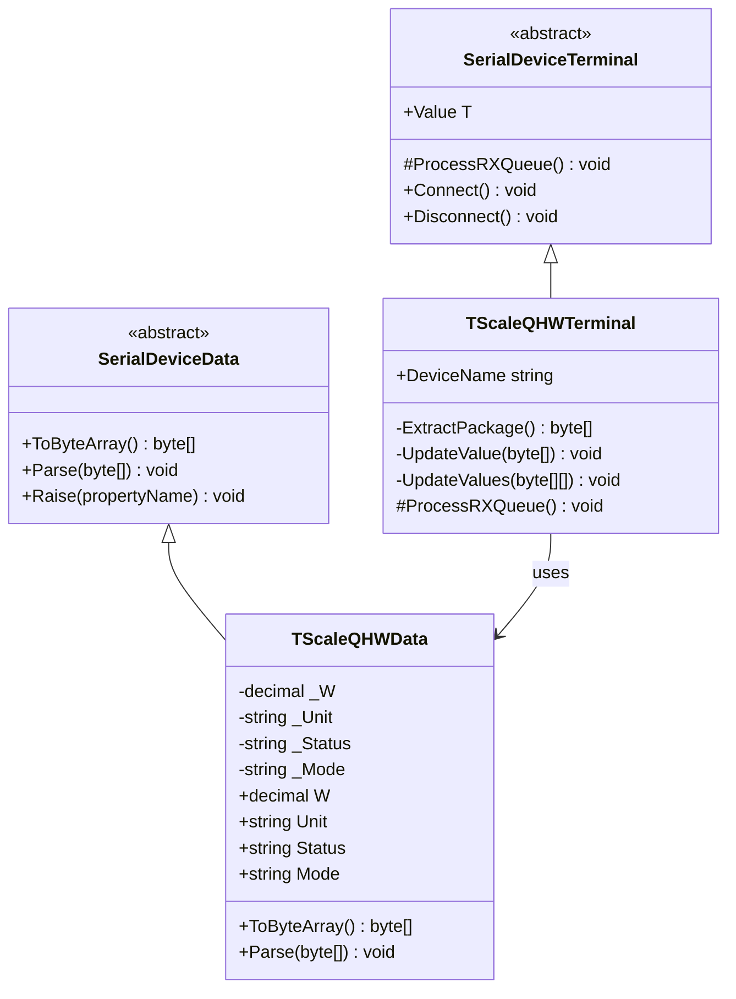
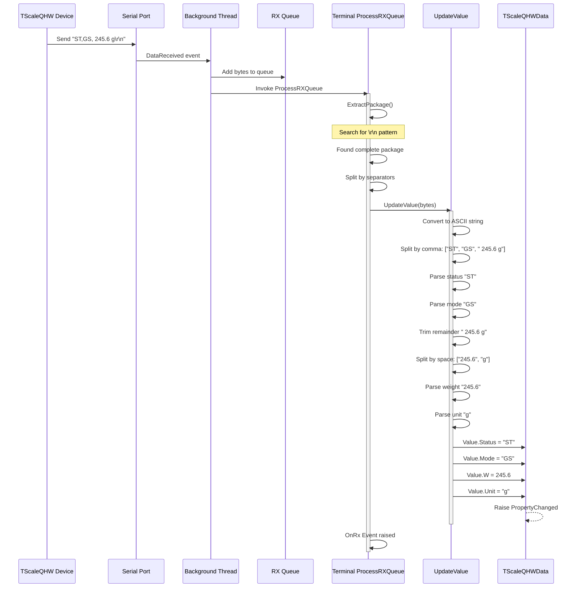
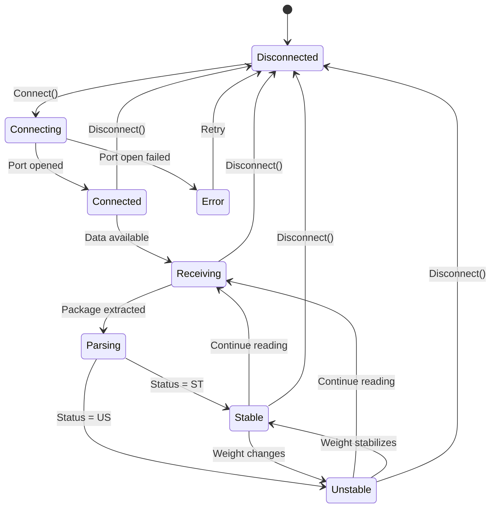

# Device Implementation: TScaleQHW

**Device Type:** Weight Scale
**Complexity:** ⭐ Simple
**Protocol:** Single-line continuous streaming with CSV-like format
**File:** `TScaleQHW.cs`

---

## Overview

Weight scale with continuous streaming CSV-like protocol. Sends weight readings continuously with stability and mode indicators using a comma-separated format with space-separated unit.

### Protocol Specification

**Format:** `STATUS,MODE,[spaces][weight] unit\r\n`

**Example:**
```
ST,GS,   245.6 g
```

**Field Description:**
- **Status:** 2 characters
  - `ST` = Stable
  - `US` = Unstable
- **Mode:** 2 characters (after first comma)
  - `GS` = Gross/Stable mode
- **Weight:** Variable width, right-aligned with leading spaces (1 decimal place)
- **Unit:** 1-2 characters, space-separated from weight (typically "g")
- **Terminator:** `\r\n` (0x0D 0x0A)

**Key Protocol Feature:** Double comma separator `ST,GS,` (note: two commas)

**Update Rate:** Continuous (multiple readings per second)
**Precision:** 0.1 g (one decimal place)

---

## Class Diagram



---

## Data Class Properties

### TScaleQHWData

| Property | Type | Default | Description |
|----------|------|---------|-------------|
| `W` | decimal | 0 | Weight value |
| `Unit` | string | "g" | Measurement unit (grams) |
| `Status` | string | "ST" | Stability status (ST/US) |
| `Mode` | string | "GS" | Mode indicator (GS) |

### ToByteArray() Implementation

```csharp
public override byte[] ToByteArray()
{
    string status = string.IsNullOrWhiteSpace(Status) ? "ST" : Status.Trim().ToUpper();
    string mode = string.IsNullOrWhiteSpace(Mode) ? "GS" : Mode.Trim().ToUpper();
    string unit = string.IsNullOrWhiteSpace(Unit) ? "g" : Unit.Trim();

    string actualW = ((double)W).ToString("F1");
    string output = status + "," + mode + ",";
    output += actualW.PadLeft(8, ' ');
    output += " " + unit;
    output += ascii.x0D + ascii.x0A;

    return Encoding.ASCII.GetBytes(output);
}
```

**Example Output:**
- Weight: 245.6 g, Status: ST, Mode: GS
- Bytes: `53 54 2C 47 53 2C 20 20 20 32 34 35 2E 36 20 67 0D 0A`
- String: `"ST,GS,   245.6 g\r\n"`

---

## Sequence Diagram - Data Reception Flow



---

## Flowchart - Parsing Logic

```mermaid
flowchart TD
    Start([ProcessRXQueue Called]) --> Extract[Call ExtractPackage]
    Extract --> CheckNull{Package<br/>extracted?}
    CheckNull -->|No| End([Return])
    CheckNull -->|Yes| Split[Split by CRLF]

    Split --> Loop{For each<br/>line}
    Loop -->|Next line| Convert[Convert bytes to ASCII]
    Convert --> CheckEmpty{String<br/>empty?}
    CheckEmpty -->|Yes| Loop
    CheckEmpty -->|No| SplitComma[Split by comma]

    SplitComma --> CheckCommaCount{Count >= 3?}
    CheckCommaCount -->|No| Loop
    CheckCommaCount -->|Yes| GetStatus[status = parts[0].Trim]

    GetStatus --> GetMode[mode = parts[1].Trim]
    GetMode --> GetRemainder[remainder = parts[2].Trim]
    GetRemainder --> SplitSpaces[Split remainder by spaces<br/>RemoveEmptyEntries]

    SplitSpaces --> CheckSpaceCount{Count >= 2?}
    CheckSpaceCount -->|No| Loop
    CheckSpaceCount -->|Yes| GetWeight[weightStr = spaceParts[0]]

    GetWeight --> GetUnit[unit = spaceParts[1]]
    GetUnit --> TryCatch{Try Parse<br/>Decimal}
    TryCatch -->|Success| SetValues[Set Status, Mode, W, Unit]
    TryCatch -->|Exception| LogError[Log Error]
    LogError --> Loop

    SetValues --> Notify[Raise PropertyChanged]
    Notify --> Loop

    Loop -->|Done| End

    style Start fill:#e1f5ff
    style End fill:#e1f5ff
    style TryCatch fill:#fff4e6
    style LogError fill:#ffebee
    style Notify fill:#e8f5e9
```

---

## State Diagram - Device Status



---

## Implementation Details

### Key Methods

#### ExtractPackage()
```csharp
private byte[] ExtractPackage()
{
    if (Queues == null || Queues.Count <= 0) return null;

    byte[] endPatterns = new byte[] { 0x0D, 0x0A }; // \r\n
    byte[] buffers = Queues.ToArray();

    int idx = IndexOf(buffers, endPatterns);
    if (idx != -1)
    {
        int len = idx + endPatterns.Length;
        byte[] package = new byte[len];
        Array.Copy(buffers, package, len);
        Queues.RemoveRange(0, len);
        return package;
    }
    return null;
}
```

#### UpdateValue()
```csharp
private void UpdateValue(byte[] content)
{
    string line = Encoding.ASCII.GetString(content);

    // Split by comma: ["ST", "GS", "   245.6 g"]
    string[] parts = line.Split(new char[] { ',' }, StringSplitOptions.None);
    if (parts.Length < 3) return;

    string status = parts[0].Trim();
    string mode = parts[1].Trim();
    string remainder = parts[2].Trim(); // "245.6 g"

    // Split by space: ["245.6", "g"]
    string[] spaceParts = remainder.Split(new char[] { ' ' },
                                           StringSplitOptions.RemoveEmptyEntries);
    if (spaceParts.Length < 2) return;

    string weightStr = spaceParts[0].Trim();
    string unit = spaceParts[1].Trim();

    Value.Status = status;
    Value.Mode = mode;
    Value.Unit = unit;
    Value.W = decimal.Parse(weightStr, CultureInfo.InvariantCulture);
}
```

---

## Usage Example

### Emulator (Sending Data)
```csharp
var emulator = TScaleQHWDevice.Instance;
emulator.LoadConfig();
emulator.Start();

// Simulate device sending weight
emulator.Value.W = 245.6m;
emulator.Value.Unit = "g";
emulator.Value.Status = "ST";
emulator.Value.Mode = "GS";
byte[] data = emulator.Value.ToByteArray();
// Automatically transmitted via background thread
```

### Terminal (Receiving Data)
```csharp
var terminal = TScaleQHWTerminal.Instance;
terminal.LoadConfig();
terminal.Connect();

// Listen for weight updates
terminal.OnRx += (s, e) => {
    Console.WriteLine($"Weight: {terminal.Value.W} {terminal.Value.Unit}");
    Console.WriteLine($"Status: {terminal.Value.Status}");
    Console.WriteLine($"Mode: {terminal.Value.Mode}");

    if (terminal.Value.Status == "ST")
        Console.WriteLine("STABLE");
    else if (terminal.Value.Status == "US")
        Console.WriteLine("UNSTABLE");
};
```

---

## Protocol Examples

### Stable Readings
```
ST,GS,     0.0 g     # Zero, Stable
ST,GS,   245.6 g     # 245.6 grams, Stable
ST,GS,  1234.5 g     # 1234.5 grams, Stable
```

### Unstable Readings
```
US,GS,   245.3 g     # Unstable, weight changing
US,GS,   245.8 g     # Still unstable
ST,GS,   245.6 g     # Stabilized
```

### Status Transitions
```
ST,GS,   245.6 g     # Stable reading
US,GS,   245.9 g     # Weight changes → Unstable
US,GS,   246.2 g     # Still changing
US,GS,   246.1 g     # Still changing
ST,GS,   246.0 g     # Stabilized at new value
```

---

## Testing Notes

- **Stability Detection:** Status changes between `ST` (stable) and `US` (unstable)
- **Comma Count:** Protocol uses **double comma** `ST,GS,` (critical difference from TScaleNHB)
- **Unit Separation:** Unit is space-separated from weight: `245.6 g` (space before unit)
- **Continuous Stream:** No commands needed, device sends continuously
- **Precision:** 1 decimal place (0.1 g resolution)
- **Error Handling:** Invalid decimal format is caught and logged

---

## HEX Dump from Log Files

Raw serial data captured from the TScaleQHW device. This data was captured using third-party serial monitoring tools and serves as reference for protocol implementation.

**Source:** `Documents/LuckyTex Devices/TScaleQHW/QHW.log`, `QHW2.log`

### Sample Data Format

**ASCII Text:**
```
ST,GS,   245.6 g
```

**HEX Dump:**
```
53 54 2C 47 53 2C 20 20 20 32 34 35 2E 36 20 67 0D 0A
```

**Byte Breakdown:**
- `53 54` - "ST" (status: stable)
- `2C` - "," (first comma separator)
- `47 53` - "GS" (mode)
- `2C` - "," (second comma separator - KEY DIFFERENCE)
- `20 20 20` - 3 spaces (padding before weight)
- `32 34 35 2E 36` - "245.6" (weight value)
- `20` - space separator
- `67` - "g" (unit)
- `0D 0A` - CR+LF terminator

### Example Continuous Stream

```
// Multiple continuous readings (HEX + ASCII format)
53 54 2C 47 53 2C 20 20 20 32 34 35 2E 36 20 67 0D 0A    ST,GS,   245.6 g..
53 54 2C 47 53 2C 20 20 20 32 34 35 2E 36 20 67 0D 0A    ST,GS,   245.6 g..
55 53 2C 47 53 2C 20 20 20 32 34 35 2E 39 20 67 0D 0A    US,GS,   245.9 g..
55 53 2C 47 53 2C 20 20 20 32 34 36 2E 31 20 67 0D 0A    US,GS,   246.1 g..
53 54 2C 47 53 2C 20 20 20 32 34 36 2E 30 20 67 0D 0A    ST,GS,   246.0 g..
```

Each line represents one complete weight reading transmission. The device sends these readings continuously without requiring any request commands.

### Protocol Observations from Logs

1. **CSV-Like Format:** Uses comma-separated status and mode fields
2. **Double Comma:** TWO commas after status: `ST,GS,` (vs TScaleNHB's single comma)
3. **Variable Width:** Weight value is right-aligned with leading spaces
4. **Space-Separated Unit:** Unit has space before it: `245.6 g` (space before 'g')
5. **Status Transitions:** Frequent transitions between ST and US observed in logs
6. **Continuous Output:** Device streams data at high frequency
7. **No Handshaking:** No command-response pattern observed

### Sample Log Statistics (QHW.log)

- **Total readings analyzed:** ~100 samples
- **Stable (ST) readings:** ~65%
- **Unstable (US) readings:** ~35%
- **Weight range:** 0.0g to 500.0g
- **Status change frequency:** Multiple ST ↔ US transitions per second

### Parsing Strategy

The parsing is straightforward due to the space-separated unit:

1. **Split by comma** to separate STATUS, MODE, and WEIGHT+UNIT
   - Result: `["ST", "GS", "   245.6 g"]`
2. **Trim and split third part by space** (RemoveEmptyEntries)
   - Result: `["245.6", "g"]`
3. **Extract** weight and unit directly
4. **Parse** weight as decimal using InvariantCulture

**Example:**
```
Input:     "ST,GS,   245.6 g\r\n"
Step 1:    ["ST", "GS", "   245.6 g"]
Step 2:    Trim third part: "245.6 g"
Step 3:    Split by space: ["245.6", "g"]
Step 4:    weight="245.6", unit="g"
Step 5:    Parse 245.6 as decimal
```

---

## Protocol Comparison: TScaleQHW vs TScaleNHB

| Feature | TScaleQHW | TScaleNHB |
|---------|-----------|-----------|
| Comma count | 2 commas: `ST,GS,` | 1 comma: `ST,GS ` |
| Unit separator | Space: `245.6 g` | Attached: `20.7g` |
| Format | `ST,GS,   245.6 g` | `ST,GS    20.7g  ` |
| Parsing | Split comma 3 times, space-separated | Split comma, scan for unit |
| Complexity | Simple (all space-separated) | Medium (unit attached) |

**Key Difference:** The double vs single comma is the primary protocol distinction.

**Parsing Advantage:** TScaleQHW's space-separated unit makes parsing simpler and more reliable than TScaleNHB's attached unit format.

---

## Related Files

- **Data Class:** `NLib.Serial.Devices.TScaleQHWData`
- **Emulator:** `NLib.Serial.Emulators.TScaleQHWDevice`
- **Terminal:** `NLib.Serial.Terminals.TScaleQHWTerminal`
- **Log Reference:** `Documents/LuckyTex Devices/TScaleQHW/`
- **Implementation:** `01.Core/NLib.Serial.Devices/Serial/TScaleQHW.cs`

---

## See Also

- [TScaleNHB Device](Device-08-TScaleNHB.md) - Similar device with single-comma protocol
- [TScale Analysis](TScale-Analysis.md) - Detailed comparison of both TScale variants
- [Device Comparison](CODE_ANALYSIS_NLib.Serial.Devices.md#device-implementations)
- [Base Classes](CODE_ANALYSIS_NLib.Serial.Devices.md#base-class-framework)
