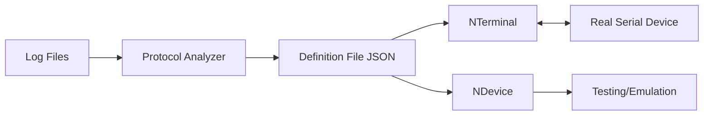

# Requirements Specification

## NSerialCommTools - Protocol Analyzer & Definition System

**Document Version**: 1.0
**Last Updated**: 2025-10-19
**Status**: Requirements Phase

---

## Table of Contents

1. [Project Overview](#project-overview)
2. [Target Use Cases](#target-use-cases)
3. [System Components](#system-components)
4. [Protocol Definition File Requirements](#protocol-definition-file-requirements)
5. [Technical Constraints](#technical-constraints)
6. [Success Criteria](#success-criteria)
7. [Sample Data](#sample-data)

---

## Project Overview

### Purpose
Create a protocol analyzer tool that:
1. Loads serial device log files (captured from third-party tools)
2. Automatically analyzes protocol structure
3. Generates protocol definition files
4. Definition files are used by NTerminal<T> and NDevice<T> classes

### Key Workflow


---

## Target Use Cases

### Use Case 1: NTerminal<T> - Device Communication

**Purpose**: Communicate with real serial devices using generated definition

```csharp
// User code
public class TFO1Data
{
    public decimal F { get; set; }  // Field F value
    public decimal H { get; set; }  // Field H value
    public decimal Q { get; set; }  // Field Q value
    public decimal X { get; set; }  // Field X value
    public decimal A { get; set; }  // Field A value
    // ... other fields
}

// Usage
var terminal = new NTerminal<TFO1Data>("TFO1-definition.json");
terminal.Connect("COM3", 9600);

// Receive data from device
terminal.OnDataReceived += (sender, data) => {
    Console.WriteLine($"F: {data.F}, H: {data.H}, A: {data.A}");
};

// Send command to device
terminal.SendCommand("REQUEST_DATA");
```

**Requirements for Definition File**:
- ✓ How to parse received bytes into T instance properties
- ✓ Field mappings (byte position → property name)
- ✓ Data type conversions (bytes → decimal, int, string)
- ✓ Message terminators (when message is complete)
- ✓ Message structure (header, body, footer)

---

### Use Case 2: NDevice<T> - Device Emulation

**Purpose**: Emulate serial device for testing terminal applications

```csharp
// User code
public class TFO1Data
{
    public decimal F { get; set; } = 0.0m;
    public decimal H { get; set; } = 0.0m;
    public decimal A { get; set; } = 349.0m;
    // ... other fields
}

// Usage
var device = new NDevice<TFO1Data>("TFO1-definition.json");
device.Listen("COM4", 9600);

// Update data and send to connected terminal
var data = new TFO1Data {
    F = 0.5m,
    H = 1.2m,
    A = 350.5m
};
device.SendData(data);

// Respond to commands
device.OnCommandReceived += (sender, command) => {
    if (command == "REQUEST_DATA")
        device.SendData(currentData);
};
```

**Requirements for Definition File**:
- ✓ How to serialize T instance into byte packets
- ✓ Field formatting (decimal → "  349.0", int → "001")
- ✓ Message construction (build complete message from fields)
- ✓ Terminators and delimiters
- ✓ Message sequencing (header → fields → footer)

---

### Use Case 3: Bidirectional Testing

**Purpose**: Verify protocol implementation

```csharp
// Terminal side (receives)
var terminal = new NTerminal<TFO1Data>("TFO1-definition.json");

// Device side (sends)
var device = new NDevice<TFO1Data>("TFO1-definition.json");

// Test: Device sends, Terminal receives
var testData = new TFO1Data { A = 123.4m };
device.SendData(testData);

// Terminal should receive and parse correctly
Assert.AreEqual(123.4m, terminal.CurrentData.A);
```

---

## System Components

### Component 1: Protocol Analyzer Application

**Project**: `@09.App\NLib.Serial.Protocol.Analyzer`

**Input**:
- Log files in 3 formats:
  - HEX/Text: `46 20 20 ... 0D    F      0.0.`
  - HEX Only: `46 20 20 ... 0D  // F      0.0.`
  - Text Only: `F      0.0`

**Output**:
- Protocol Definition JSON file
- Analysis report (confidence scores, patterns detected)

**User Workflow**:
1. Load log file
2. Auto-detect format
3. Analyze protocol (automatic)
4. Review detected patterns (with confidence scores)
5. Confirm or override
6. Generate definition file
7. Save definition

**Target**: < 5 clicks from load to save

---

### Component 2: NTerminal<T> Class

**Project**: `@01.Core\NLib.Serial.Devices` (future implementation)

**Responsibilities**:
- Load protocol definition file
- Open serial port connection
- Receive bytes from serial port
- Parse bytes using definition
- Populate T instance with parsed data
- Raise events when data received
- Send commands to device (if protocol supports)

**Key Methods**:
```csharp
public class NTerminal<T> where T : class, new()
{
    public NTerminal(string definitionFilePath);
    public void Connect(string portName, int baudRate);
    public void Disconnect();

    public event EventHandler<T> OnDataReceived;
    public event EventHandler<string> OnError;

    public void SendCommand(string command);
    public T CurrentData { get; }
}
```

---

### Component 3: NDevice<T> Class

**Project**: `@01.Core\NLib.Serial.Devices` (future implementation)

**Responsibilities**:
- Load protocol definition file
- Open serial port (listen mode)
- Serialize T instance to bytes using definition
- Send bytes to serial port
- Receive commands (if protocol supports)
- Emulate device behavior

**Key Methods**:
```csharp
public class NDevice<T> where T : class, new()
{
    public NDevice(string definitionFilePath);
    public void Listen(string portName, int baudRate);
    public void Stop();

    public void SendData(T data);
    public event EventHandler<string> OnCommandReceived;

    public T CurrentData { get; set; }
}
```

---

## Protocol Definition File Requirements

### Critical: Bidirectional Support

The definition file must support BOTH:
1. **Parsing** (bytes → T instance) for NTerminal<T>
2. **Serialization** (T instance → bytes) for NDevice<T>

### Required Information

#### 1. Device Metadata
```json
{
  "deviceName": "TFO1",
  "version": "1.0",
  "generatedDate": "2025-10-19T12:00:00Z",
  "encoding": "ASCII"
}
```

#### 2. Message Structure
```json
{
  "messageType": "multi-line-frame",
  "frameStart": "V1\\r\\n",
  "frameEnd": "~P1\\r\\n",
  "entryTerminator": "\\r"
}
```

#### 3. Field Definitions (Parsing Direction)

**For NTerminal<T>** - How to extract data from bytes:

```json
{
  "fields": [
    {
      "name": "F",                    // Maps to T.F property
      "parsePattern": "^F\\s+([\\d.]+)$",  // Regex to extract value
      "dataType": "decimal",          // Target type in T
      "position": "body",             // Where in message
      "order": 1,                     // Sequence order
      "required": true                // Must be present
    }
  ]
}
```

#### 4. Field Definitions (Serialization Direction)

**For NDevice<T>** - How to format data into bytes:

```json
{
  "fields": [
    {
      "name": "F",                    // Maps from T.F property
      "formatString": "F{0,10:F1}",   // String format
      "terminator": "\\r",            // After field
      "position": "body",
      "order": 1
    }
  ]
}
```

#### 5. Combined Field Definition (Both Directions)

```json
{
  "fields": [
    {
      "name": "A",

      // Parsing (bytes → T)
      "parsePattern": "^A\\s+([\\d.]+)$",
      "dataType": "decimal",

      // Serialization (T → bytes)
      "formatString": "A{0,10:F1}",
      "alignment": "right",
      "paddingChar": " ",
      "width": 10,

      // Common
      "terminator": "\\r",
      "position": "body",
      "order": 6,
      "required": true,
      "description": "Main weight value"
    }
  ]
}
```

#### 6. Message Sequence

```json
{
  "messageSequence": [
    {
      "type": "header",
      "value": "V1",
      "terminator": "\\r\\n"
    },
    {
      "type": "field-group",
      "fields": ["F", "H", "Q", "X", "A", "0", "4", "1", "2"]
    },
    {
      "type": "footer",
      "value": "B\\x83",
      "terminator": "\\r"
    }
  ]
}
```

#### 7. Commands (Optional)

If device supports commands:

```json
{
  "commands": [
    {
      "name": "REQUEST_DATA",
      "sendBytes": "52 45 51 0D",  // "REQ\r"
      "expectResponse": true,
      "responseTimeout": 1000
    }
  ]
}
```

---

## Technical Constraints

### 1. Framework
- **MUST**: .NET Framework 4.7.2 only
- **NO**: .NET Core / .NET 5+ allowed

### 2. Dependencies
- Allowed: Microsoft NuGet packages in `@References` folder
- Already available: System.Text.Json

### 3. Project Structure
```
@00.NLib\NLib                          - Foundation library (DO NOT MODIFY)
@01.Core\NLib.Serial.Devices           - Device implementations
@09.App\NLib.Serial.Protocol.Analyzer  - Protocol analyzer tool (CURRENT WORK)
@09.App\NLib.Serial.Terminal.App       - Terminal application
@09.App\NLib.Serial.Emulator.App       - Device emulator
```

### 4. Sample Data Location
```
@Documents\LuckyTex Devices\
  ├── DEFENDER3000\
  ├── JIK6CAB\
  ├── MS204TS00\
  ├── PH Meter\
  ├── TFO1\
  ├── TFO3\
  ├── WEIGHT QA\
  ├── WEIGHT SPUN\
  ├── TScaleNHB\
  └── TScaleQHW\
```

---

## Success Criteria

### 1. Protocol Analyzer Accuracy
- **95%+** correct pattern detection across all sample devices
- **95%+** terminator detection accuracy
- **95%+** field delimiter detection accuracy
- **95%+** field structure extraction accuracy
- **95%+** message pattern identification accuracy

### 2. Definition File Completeness
- **100%** of detected fields must have both parse and format definitions
- **100%** of terminators correctly identified
- **100%** of message structures properly defined
- Must work for ALL devices in `@Documents\LuckyTex Devices\`

### 3. Usability
- Load to save: **< 5 clicks**
- Process 10,000 lines: **< 5 seconds**
- Clear confidence scores shown to user
- Allow manual override for uncertain patterns

### 4. Bidirectional Validation
- Generated definition must work for:
  - NTerminal<T> parsing real device data
  - NDevice<T> serializing test data
  - Round-trip: NDevice → NTerminal → same values

### 5. Documentation
- Clear JSON schema for definition files
- Examples for all sample devices
- User guide for analyzer tool
- API documentation for NTerminal<T> and NDevice<T>

---

## Functional Requirements

### FR-1: Log File Loading
- **FR-1.1**: Support HEX/Text format files
- **FR-1.2**: Support HEX Only format files
- **FR-1.3**: Support Text Only format files
- **FR-1.4**: Auto-detect format
- **FR-1.5**: Handle mixed format files (sections)
- **FR-1.6**: Support files up to 100,000 lines

### FR-2: Protocol Analysis
- **FR-2.1**: Detect message terminators
- **FR-2.2**: Detect message boundaries (multi-line messages)
- **FR-2.3**: Detect field delimiters
- **FR-2.4**: Identify field positions
- **FR-2.5**: Classify field data types
- **FR-2.6**: Detect message headers/footers
- **FR-2.7**: Calculate confidence scores for all detections

### FR-3: Definition Generation
- **FR-3.1**: Generate parsing rules for each field
- **FR-3.2**: Generate formatting rules for each field
- **FR-3.3**: Generate message sequence
- **FR-3.4**: Include all metadata
- **FR-3.5**: Output valid JSON
- **FR-3.6**: Validate definition completeness

### FR-4: User Interface
- **FR-4.1**: File picker for log files
- **FR-4.2**: Display raw log data
- **FR-4.3**: Display parsed messages
- **FR-4.4**: Display detected patterns with confidence scores
- **FR-4.5**: Allow pattern override/manual edit
- **FR-4.6**: **Allow field renaming** (auto-generated names → user-defined names)
- **FR-4.7**: Preview generated definition
- **FR-4.8**: Save definition to file

#### FR-4.6 Field Renaming Details

**Problem**: Protocol data rarely contains field names. Analyzer must generate names automatically (e.g., "Field1", "Field2"), but users need meaningful names for their T class properties.

**Requirements**:
- Display auto-generated field names in editable grid/list
- Allow inline editing of field names
- Validate field names:
  - Must be valid C# identifier (no spaces, special chars except _)
  - Must be unique within definition
  - Suggest naming based on field content/type (e.g., "NumericField1" → "Weight")
- Show field preview with sample data
- Real-time update of JSON definition preview
- Preserve custom names when regenerating/refreshing analysis

**Example Workflow**:
```
1. Analyzer detects 3 fields → names them: "Field1", "Field2", "Field3"
2. User sees editable grid:
   | Name    | Type    | Sample Values |
   |---------|---------|---------------|
   | Field1  | decimal | 1.640, 1.645  |
   | Field2  | string  | kg, kg        |
   | Field3  | char    | N, G, S       |

3. User edits Name column directly:
   Field1 → NetWeight
   Field2 → Unit
   Field3 → Status

4. Generated JSON uses edited names:
   "fields": [
     { "name": "NetWeight", ... },
     { "name": "Unit", ... },
     { "name": "Status", ... }
   ]
```

**UI Suggestions**:
- Double-click to edit
- Tab to navigate between fields
- Auto-suggest names based on value patterns
- Bulk rename option (e.g., prefix all fields with device name)

### FR-5: Error Handling
- **FR-5.1**: Report parsing errors with line numbers
- **FR-5.2**: Warn on low confidence patterns (< 95%)
- **FR-5.3**: Handle corrupted log files
- **FR-5.4**: Validate definition file before save

---

## Non-Functional Requirements

### NFR-1: Performance
- Parse 10,000 line file in < 5 seconds
- UI responsive during analysis
- Memory usage < 500MB for typical files

### NFR-2: Reliability
- No crashes on malformed log files
- Graceful handling of unknown formats
- All operations reversible (undo)

### NFR-3: Maintainability
- Clean separation of concerns
- Well-documented code
- Unit testable components
- Extensible for new log formats

### NFR-4: Usability
- Simple, intuitive UI
- Clear error messages
- Helpful tooltips
- Progress indicators for long operations

---

## Data Model Requirements

### Generic Data Class (T)

User-defined class that represents device data:

```csharp
// Example for TFO1
public class TFO1Data
{
    // Weight data fields
    public decimal F { get; set; }
    public decimal H { get; set; }
    public decimal Q { get; set; }
    public decimal X { get; set; }
    public decimal A { get; set; }

    // Other fields
    public decimal Field0 { get; set; }
    public decimal Field4 { get; set; }
    public decimal Field1 { get; set; }
    public int Field2 { get; set; }

    // Metadata (optional)
    public DateTime? Timestamp { get; set; }
    public string Version { get; set; }
}

// Example for JIK6CAB
public class JIK6CABData
{
    public DateTime Date { get; set; }
    public TimeSpan Time { get; set; }
    public decimal TareWeight { get; set; }
    public decimal GrossWeight { get; set; }
    public int Status1 { get; set; }
    public int Status2 { get; set; }
    public decimal NetWeight1 { get; set; }
    public decimal NetWeight2 { get; set; }
    public int PieceCount { get; set; }
}
```

**Requirements**:
- Plain C# class with properties
- Properties must have getters and setters
- Supported types: int, decimal, double, string, DateTime, TimeSpan, bool
- Property names should match field names in definition
- Optional attributes for customization

---

## Definition File Schema Requirements

### JSON Schema Structure

```json
{
  "$schema": "https://json-schema.org/draft-07/schema#",
  "type": "object",
  "required": ["deviceName", "version", "encoding", "messages"],
  "properties": {
    "deviceName": { "type": "string" },
    "version": { "type": "string" },
    "generatedDate": { "type": "string", "format": "date-time" },
    "encoding": { "type": "string", "enum": ["ASCII", "UTF-8", "UTF-16"] },
    "messages": {
      "type": "array",
      "items": { "$ref": "#/definitions/message" }
    }
  }
}
```

### Validation Requirements
- Valid JSON syntax
- All required fields present
- All property names match T class properties
- All format strings valid
- All regex patterns valid
- All byte sequences valid hex

---

## Future Considerations

### Phase 2 Features (Not in Current Scope)
- AI/ML pattern detection
- Protocol versioning support
- Multi-protocol definitions in one file
- Conditional field parsing
- Checksum/CRC validation
- Binary protocol support (non-text)
- Web-based analyzer interface

### Extensibility Points
- Custom field parsers (plugins)
- Custom formatters (plugins)
- Protocol templates library
- Auto-update from device manufacturer

---

## Summary Checklist

### For This Session
- [x] Document complete requirements
- [x] Define NTerminal<T> use case
- [x] Define NDevice<T> use case
- [x] Specify bidirectional definition file needs
- [x] List all functional requirements
- [x] Define success criteria (95%+ accuracy)
- [ ] Create project tracker file

### For Next Session
- [ ] Design complete data models
- [ ] Design JSON schema for definition files
- [ ] Design NTerminal<T> implementation
- [ ] Design NDevice<T> implementation
- [ ] Design parser algorithms (5-stage)
- [ ] Design analyzer algorithms
- [ ] Design UI wireframes
- [ ] Create implementation plan

---

**Document Version**: 1.0
**Last Updated**: 2025-10-19
**Status**: Requirements Complete - Ready for Design Phase
