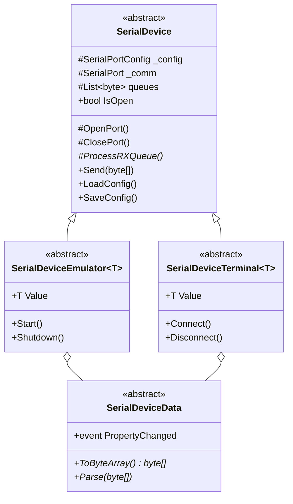
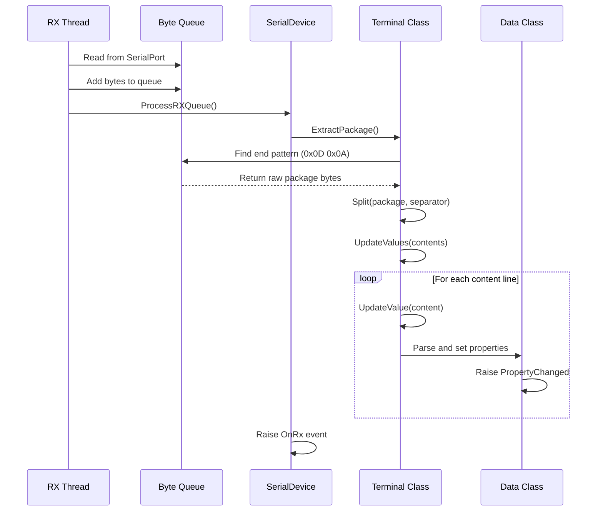
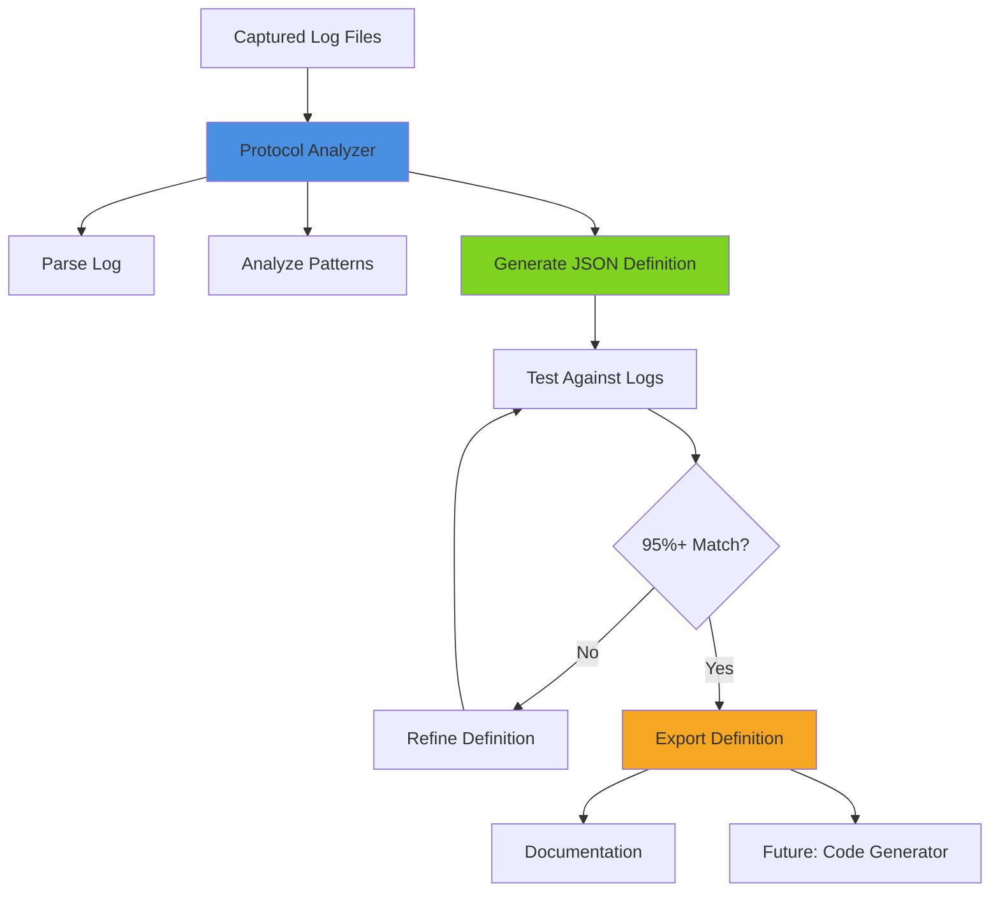

# Production Code Analysis

## Document Information
- **Created**: 2025-10-19
- **Purpose**: Analyze existing production serial communication code to understand what works and what the Protocol Analyzer should complement (not replace)
- **Related**: Requirements Specification, Project Tracker

---

## Executive Summary

The **existing production code is WORKING and PRODUCTION-READY**. It provides:
- Real-time serial communication (bi-directional)
- Device emulators for testing
- Terminal applications for actual device connection
- Hardcoded protocol implementations for specific devices

The **Protocol Analyzer is a SEPARATE TOOL** that will:
- Analyze captured log files (NOT real-time communication)
- Use JSON definition files (flexible, no recompilation needed)
- Generate protocol definitions from log analysis
- Support rapid device integration without coding

---

## Production Code Architecture

### Core Class Hierarchy



### Implementation Pattern

Each device has **3 classes**:

1. **Data Class** (`XxxData : SerialDeviceData`)
   - Properties for device values
   - `ToByteArray()` - Serializes data to bytes (for emulator TX)
   - `Parse()` - Not used in current implementations
   - INotifyPropertyChanged support

2. **Emulator Class** (`XxxDevice : SerialDeviceEmulator<XxxData>`)
   - Singleton pattern
   - Sends data via `Value.ToByteArray()`
   - `ProcessRXQueue()` - Usually empty (emulator doesn't receive)

3. **Terminal Class** (`XxxTerminal : SerialDeviceTerminal<XxxData>`)
   - Singleton pattern
   - `ProcessRXQueue()` - Parses incoming bytes
   - Updates `Value` properties
   - Raises `OnRx` event

---

## Device Implementations Analysis

### 1. WeightQA (Simple Text Protocol)

#### Protocol Format
```
+007.12/3 G S\r\n
```

#### Data Class (SerialDevices.cs:20-117)
```csharp
public class WeightQAData : SerialDeviceData
{
    decimal _W;      // Weight value
    string _Unit;    // "G" (grams)
    string _Mode;    // "S" (stable)

    public override byte[] ToByteArray() {
        // Format: +007.12/3 G S\r\n
        // Split weight into integer/decimal parts with "/" separator
    }
}
```

#### Terminal Parsing Logic (SerialDevices.cs:299-335)
```csharp
private void UpdateValue(byte[] content)
{
    string line = Encoding.ASCII.GetString(content);
    // Split by "/" to get weight parts
    string[] elems = line.Split("/");
    string sUM = elems[1].Trim();
    // Split by spaces to get unit and mode
    string[] elems2 = sUM.Split(" ");

    string w = elems[0].Trim() + elems2[0].Trim(); // Reconstruct weight
    Value.W = decimal.Parse(w);
    Value.Unit = elems2[1]; // "G"
    Value.Mode = elems2[2]; // "S"
}
```

#### Pattern Analysis
- **Delimiter**: `\r\n` (CR LF)
- **Parsing**: String splitting by "/" and " "
- **No validation**: Direct parsing, exception caught at higher level
- **Character-based**: Pure ASCII text

---

### 2. CordDEFENDER3000 (Space-Delimited Protocol)

#### Protocol Format
```
   0.360 kg    G\r\n
```

#### Data Class (CordDEFENDER3000.cs:26-117)
```csharp
public class CordDEFENDER3000Data : SerialDeviceData
{
    decimal _W;      // Weight
    string _Unit;    // "kg"
    string _O;       // "G" (gross/net indicator)

    public override byte[] ToByteArray() {
        // Format: "   0.360 kg    G\r\n"
        // Fixed-width fields with padding
    }
}
```

#### Terminal Parsing Logic (CordDEFENDER3000.cs:300-334)
```csharp
private void UpdateValue(byte[] content)
{
    string line = Encoding.ASCII.GetString(content);
    string[] elems = line.Split(" ", RemoveEmptyEntries);

    Value.W = decimal.Parse(elems[0]);    // Weight
    Value.Unit = elems[1];                // "kg"
    Value.O = elems[2];                   // "G"
}
```

#### Pattern Analysis
- **Delimiter**: `\r\n`
- **Parsing**: String splitting by spaces (removes empty entries)
- **Fixed-width output**: PadLeft used for consistent formatting
- **Simple structure**: 3 fields

---

### 3. PHMeter (Multi-Line Complex Protocol)

#### Protocol Format
```
3.01pH 25.5°C ATC\r\n
20-Feb-2023\r\n
11:11\r\n
 \r\n
3.01pH\r\n
25.5°C ATC\r\n
Auto EP Standard\r\n
Blank\r\n
\r\n
\r\n
\r\n
```

#### Data Class (PHMeter.cs:24-175)
```csharp
public class PHMeterData : SerialDeviceData
{
    decimal _pH;
    decimal _TempC;
    DateTime _Date;

    public override byte[] ToByteArray() {
        // Generates multi-line output
        // Uses special byte 0xF8 for degree symbol
    }
}
```

#### Terminal Parsing Logic (PHMeter.cs:358-462)
```csharp
private void UpdateValue(byte[] content)
{
    string line = Encoding.ASCII.GetString(content).Trim();

    if (line.Contains("ATC") && line.Contains("pH")) {
        // Parse both pH and temperature
        int iPh = line.IndexOf("pH");
        string sPh = line.Substring(0, iPh);
        Value.pH = decimal.Parse(sPh);

        int iTmp = lNext.IndexOf("C ATC");
        string sTmp = lNext.Substring(0, iTmp - 1);
        Value.TempC = decimal.Parse(sTmp);
    }
    else if (line.Contains("ATC") && !line.Contains("pH")) {
        // Parse temperature only
    }
    else if (!line.Contains("ATC") && line.Contains("pH")) {
        // Parse pH only
    }
    else if (line.Contains("-")) {
        // Parse date: "20-Feb-2023"
        Value.Date = DateTime.ParseExact(line, "dd-MMM-yyyy", ...);
    }
    else if (line.Contains(":")) {
        // Parse time: "11:11"
        Value.Date = DateTime.ParseExact(line, "HH:mm", ...);
    }
}
```

#### Pattern Analysis
- **Delimiter**: `\r\n` (line-by-line processing)
- **State-based**: Different patterns per line
- **Special bytes**: 0xF8 for degree symbol (°)
- **Multi-format**: DateTime, decimal, text
- **Context-sensitive**: Same delimiter, different content types

---

### 4. TFO1 (Binary + Text Hybrid)

#### Protocol Format
```
F      0.0\r
H      0.0\r
Q      0.0\r
X      0.0\r
A    366.0\r
0     23.0\r
4    343.5\r
1      0.0\r
2       0\r
B<0x83>\r
C20<0xF4> 02<0xF3> 2023<0xF2> MON 09:20AM\r
V<0x31>\r\n
```

#### Data Class (TFO1.cs:25-281)
```csharp
public class TFO1Data : SerialDeviceData
{
    decimal _F, _H, _Q, _X, _A, _W0, _W4, _W1;
    int _W2;
    byte _B;      // Binary value
    DateTime _C;
    byte _V;      // Version

    public override byte[] ToByteArray() {
        // Mix of ASCII text and binary bytes
        // Special bytes: 0xF4, 0xF3, 0xF2 for date separators
    }
}
```

#### Terminal Parsing Logic (TFO1.cs:464-685)
```csharp
private void UpdateValue(byte[] content)
{
    char hdr = (char)content[0];  // First byte is field identifier

    switch (hdr) {
        case 'F':
            string val = Encoding.ASCII.GetString(content, 1, 9);
            Value.F = decimal.Parse(val);
            break;
        case 'H':
            // Similar pattern...
            break;
        case 'B':
            Value.B = content[1];  // Direct binary byte
            break;
        case 'C':  // Complex date/time parsing
            string _dd = ASCII.GetString(content, 1, 2);
            // content[3] is 0xF4
            string _mm = ASCII.GetString(content, 5, 2);
            // content[7] is 0xF3
            // ...
            Value.C = new DateTime(yy, mm, dd, hh, mi, 0);
            break;
        case 'V':
            Value.V = content[1];  // Binary version byte
            break;
    }
}
```

#### Pattern Analysis
- **Delimiter**: `\r` (single CR, not CRLF)
- **Final delimiter**: `\r\n` (only on last line)
- **Header-based**: First byte identifies field type
- **Fixed positions**: Field values at specific byte offsets
- **Hybrid data**: ASCII text + binary bytes
- **Special bytes**: 0xF4, 0xF3, 0xF2 as separators (not text)

---

## Key Implementation Patterns

### 1. RX Processing Flow



### 2. Common Code Patterns

#### Package Extraction (Lines 248-286 in all Terminal classes)
```csharp
private byte[] ExtractPackage()
{
    if (Queues.Count <= 0) return null;

    byte[] endPatterns = new byte[] { 0x0D, 0x0A };  // \r\n

    lock (_lock) {
        buffers = Queues.ToArray();
    }

    int idx = IndexOf(buffers, endPatterns);

    if (idx != -1) {
        int len = idx + endPatterns.Length;
        rawPackages = new byte[len];
        Array.Copy(buffers, rawPackages, len);

        lock (_lock) {
            Queues.RemoveRange(0, len);  // Remove extracted data
        }
    }

    return rawPackages;
}
```

**Key Points**:
- Searches for end pattern in queue
- Extracts complete package
- Removes extracted bytes from queue
- Thread-safe with locks

#### Process RX Queue (Standard pattern)
```csharp
protected override void ProcessRXQueue()
{
    byte[] rawPackage = ExtractPackage();
    if (null == rawPackage) return;

    byte[] separators = new byte[] { 0x0D, 0x0A };  // or just { 0x0D }
    byte[][] contents = Split(rawPackage, separators);
    UpdateValues(contents);
}
```

### 3. Parsing Strategies Used

| Device | Strategy | Complexity |
|--------|----------|------------|
| **WeightQA** | String.Split() | Low |
| **CordDEFENDER3000** | String.Split() with RemoveEmptyEntries | Low |
| **PHMeter** | Conditional parsing (if/else on content) | Medium |
| **TFO1** | Switch on first byte + fixed positions | High |

---

## What Production Code Does Well

### ✅ Strengths

1. **Real-Time Performance**
   - Background thread for RX processing
   - Lock-free where possible
   - Efficient byte queue management

2. **Bidirectional Communication**
   - Both TX (ToByteArray) and RX (Parse) directions
   - Emulator sends, Terminal receives
   - Full duplex support

3. **Type Safety**
   - Strongly-typed data classes
   - INotifyPropertyChanged for UI binding
   - Compile-time validation

4. **Configuration Management**
   - JSON-based device configs
   - Port settings persistence
   - Easy deployment

5. **Production Proven**
   - Already working in production
   - Battle-tested error handling
   - Stable and reliable

---

## What Production Code Lacks (Protocol Analyzer's Role)

### ❌ Limitations

1. **Requires Recompilation**
   - New device = new code
   - Protocol change = recompile
   - No runtime flexibility

2. **No Log Analysis**
   - Cannot analyze captured logs
   - No protocol discovery from samples
   - Manual protocol reverse-engineering

3. **Hardcoded Parsing**
   - Fixed parsing logic per device
   - Cannot adapt to variations
   - No pattern learning

4. **No Definition Export**
   - Protocol knowledge in C# code only
   - Cannot share protocol specs
   - No documentation generation

5. **Limited Testing**
   - Must connect to real device or emulator
   - Cannot test against historical data
   - No regression testing from logs

---

## Protocol Analyzer Complementary Role

### What Protocol Analyzer WILL DO



### Key Differences from Production Code

| Aspect | Production Code | Protocol Analyzer |
|--------|----------------|-------------------|
| **Data Source** | Real-time SerialPort | Captured log files |
| **Direction** | Bidirectional | Analysis only (no TX) |
| **Flexibility** | Compiled C# | JSON definitions |
| **Speed** | Real-time critical | Offline processing |
| **Purpose** | Communication | Discovery & validation |
| **Output** | Device values | Protocol definitions |
| **Change Process** | Code → Compile → Deploy | Edit JSON → Test |

### Protocol Analyzer Use Cases

1. **New Device Integration**
   ```
   1. Capture logs from third-party tool (e.g., Eltima)
   2. Run Protocol Analyzer on logs
   3. Generate JSON definition file
   4. Validate against additional log samples
   5. Use definition for documentation
   6. (Future) Generate C# code from definition
   ```

2. **Protocol Documentation**
   ```
   1. Analyze existing device logs
   2. Extract message patterns
   3. Generate human-readable docs
   4. Export to Markdown/PDF
   ```

3. **Regression Testing**
   ```
   1. Keep historical log files
   2. Update protocol definition
   3. Re-run analyzer against old logs
   4. Verify backward compatibility
   ```

4. **Protocol Comparison**
   ```
   1. Analyze logs from different device versions
   2. Identify protocol changes
   3. Document differences
   4. Plan migration strategy
   ```

---

## Integration Strategy

### Current State: Production Code (Working)
```
[Serial Device] ←→ [SerialPort] ←→ [Terminal Class] → [Data Class] → [UI]
                                         ↓
                                    Hardcoded
                                    Parsing Logic
```

### Future State: Protocol Analyzer Integration
```
[Third-Party Tool] → [Capture Logs] → [Protocol Analyzer]
                                            ↓
                                      [JSON Definition]
                                            ↓
                                    ┌───────┴────────┐
                                    ↓                ↓
                              [Documentation]  [Code Generator]
                                                     ↓
                                            [New Terminal Class]
                                                     ↓
[Serial Device] ←→ [SerialPort] ←→ [Generated Terminal] → [Data Class] → [UI]
```

### No Changes to Existing Code
- ✅ Keep all current Terminal/Emulator classes
- ✅ Keep all current Data classes
- ✅ Keep SerialDevice base classes
- ✅ Production code continues working as-is

### Protocol Analyzer as Separate Tool
- Standalone application
- Reads log files (no real-time)
- Outputs JSON + Markdown
- No dependencies on NLib.Serial.Devices
- Can be used independently

---

## Concrete Examples from Production

### Example 1: WeightQA Log Analysis

**Input Log** (from Documents/LuckyTex Devices/WEIGHT QA/):
```
+007.12/3 G S\r\n
+007.15/4 G S\r\n
+007.20/0 G S\r\n
```

**Protocol Analyzer Would Generate**:
```json
{
  "device": "WeightQA",
  "protocol": {
    "delimiter": "0D 0A",
    "encoding": "ASCII",
    "fields": [
      {
        "name": "Weight_Integer",
        "type": "string",
        "pattern": "^[+-]\\d{3}\\.\\d{2}",
        "sample": "+007.12"
      },
      {
        "name": "Weight_Fraction",
        "type": "string",
        "pattern": "/\\d",
        "sample": "/3"
      },
      {
        "name": "Unit",
        "type": "string",
        "pattern": " [A-Z] ",
        "sample": " G "
      },
      {
        "name": "Mode",
        "type": "string",
        "pattern": "[A-Z]",
        "sample": "S"
      }
    ]
  }
}
```

**Current C# Code** (would continue working):
```csharp
// SerialDevices.cs:309-335 - UNCHANGED
string[] elems = line.Split("/");
Value.W = decimal.Parse(elems[0].Trim() + elems2[0].Trim());
Value.Unit = elems2[1];
Value.Mode = elems2[2];
```

---

### Example 2: TFO1 Binary Protocol

**Input Log** (hex representation):
```
46 20 20 20 20 20 20 30 2E 30 0D     F      0.0\r
48 20 20 20 20 20 20 30 2E 30 0D     H      0.0\r
42 83 0D                              B<0x83>\r
43 32 30 F4 20 30 32 F3 ...          C20<0xF4> 02<0xF3> ...
```

**Protocol Analyzer Would Generate**:
```json
{
  "device": "TFO1",
  "protocol": {
    "delimiter": "0D",
    "final_delimiter": "0D 0A",
    "encoding": "mixed",
    "message_type": "multi_line",
    "fields": [
      {
        "name": "F_Value",
        "header_byte": "0x46",
        "header_char": "F",
        "offset": 1,
        "length": 9,
        "type": "decimal",
        "encoding": "ASCII"
      },
      {
        "name": "B_Value",
        "header_byte": "0x42",
        "header_char": "B",
        "offset": 1,
        "length": 1,
        "type": "binary",
        "encoding": "hex"
      },
      {
        "name": "Date",
        "header_byte": "0x43",
        "header_char": "C",
        "type": "datetime",
        "encoding": "mixed",
        "special_bytes": ["0xF4", "0xF3", "0xF2"],
        "format": "dd<F4> MM<F3> yyyy<F2> ddd HH:mmtt"
      }
    ]
  }
}
```

**Current C# Code** (would continue working):
```csharp
// TFO1.cs:464-685 - UNCHANGED
switch (hdr) {
    case 'F':
        string val = Encoding.ASCII.GetString(content, 1, 9);
        Value.F = decimal.Parse(val);
        break;
    case 'B':
        Value.B = content[1];
        break;
    // ... etc
}
```

---

## Conclusion

### Production Code Status: ✅ WORKING - DO NOT CHANGE

The existing code is:
- Production-ready
- Battle-tested
- Performant
- Properly architected

### Protocol Analyzer Purpose: NEW TOOL - SEPARATE CONCERN

The Protocol Analyzer will:
- Analyze log files (not real-time)
- Generate protocol definitions (JSON)
- Enable rapid integration of new devices
- Document protocols automatically
- Validate protocol changes
- (Future) Generate code from definitions

### Integration Approach: COMPLEMENTARY, NOT REPLACEMENT

```
Production Code (Now)  →  Continue as-is
        +
Protocol Analyzer (New) → Add new capability
        ↓
Complete Solution → Better + Faster
```

---

## Next Steps

Based on this analysis, the Protocol Analyzer design should focus on:

1. **Log File Parsing** (3 formats supported)
   - Eltima Serial Port Monitor
   - Termite
   - Custom hex dump format

2. **Pattern Recognition**
   - Delimiter detection
   - Field extraction
   - Type inference (decimal, int, datetime, binary)
   - Special byte identification

3. **JSON Definition Generation**
   - Bidirectional (parse AND serialize)
   - Human-readable
   - Machine-processable
   - Versionable (Git-friendly)

4. **Validation Engine**
   - Re-parse logs with generated definition
   - Calculate match percentage
   - Identify failures for refinement

5. **Documentation Generation**
   - Markdown output
   - Protocol specifications
   - Field tables
   - Sample data

**The Protocol Analyzer does NOT need to**:
- Open SerialPorts
- Communicate in real-time
- Emit data
- Run as a background service
- Integrate with existing Terminal classes

This keeps it simple, focused, and complementary to the working production code.
