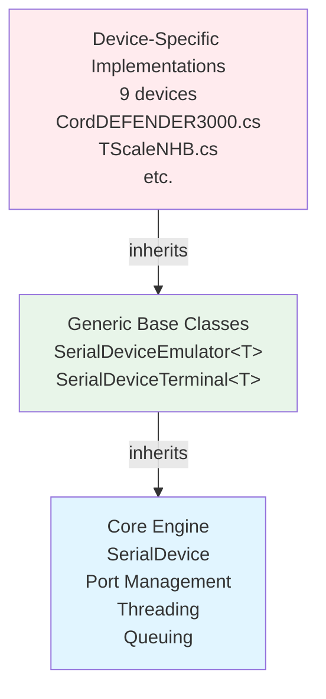
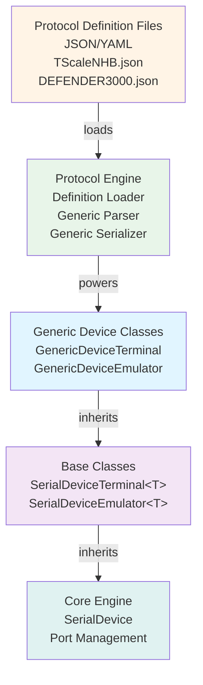
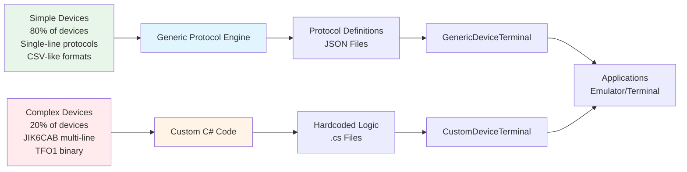
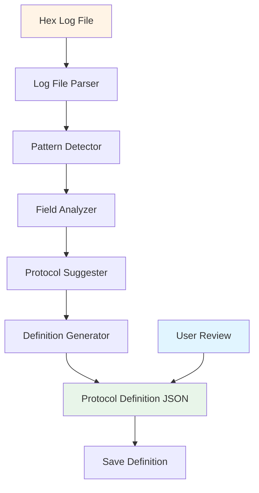
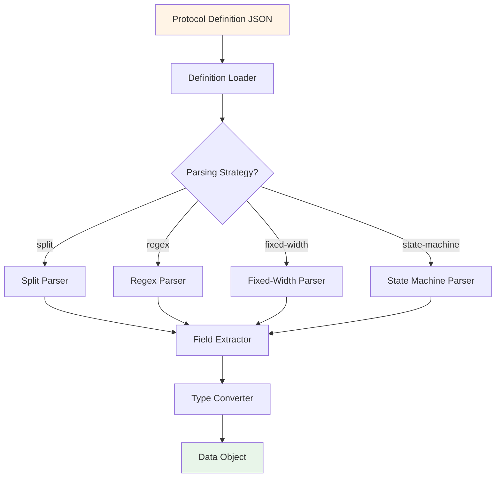
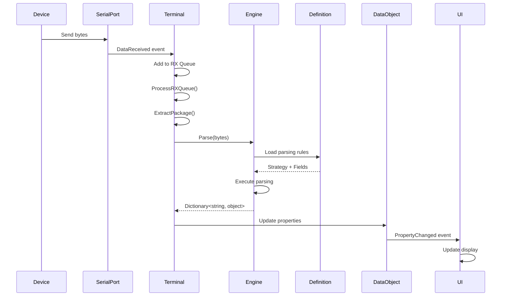
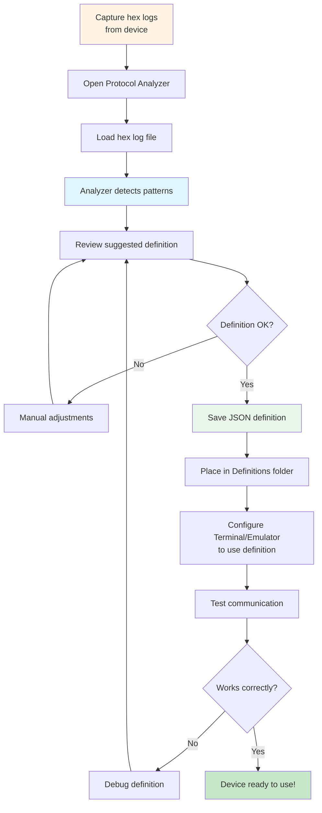
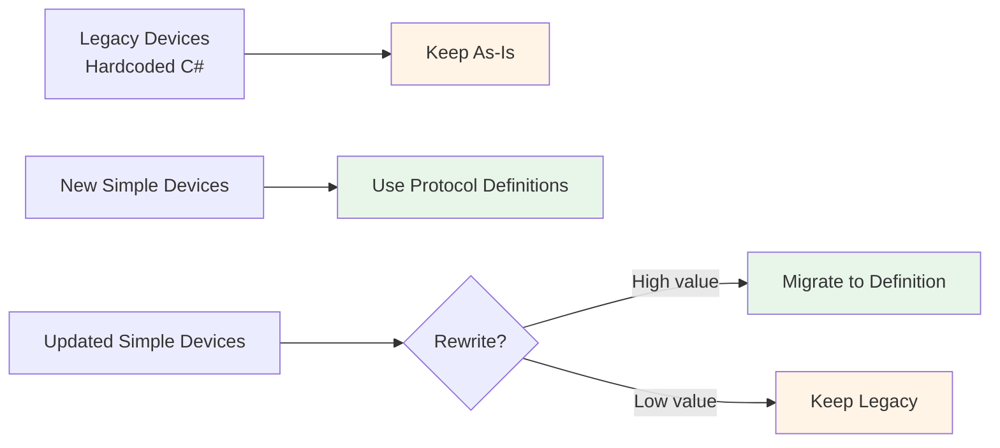

# Protocol Definition System - Architecture Design

**Document:** System Architecture
**Version:** 1.0
**Date:** 2025-10-18
**Status:** Design Phase

---

## Table of Contents
1. [Executive Summary](#executive-summary)
2. [Current Architecture Analysis](#current-architecture-analysis)
3. [Proposed Architecture](#proposed-architecture)
4. [Component Design](#component-design)
5. [Data Flow](#data-flow)
6. [Technology Stack](#technology-stack)

---

## Executive Summary

### Problem Statement

The current NSerialCommTools implementation requires:
- **150-400 lines of C# code** per device
- **Deep C# knowledge** to add new devices
- **Full recompilation** for protocol changes
- **Duplicate parsing logic** across similar devices
- **Protocol knowledge embedded in code** (not easily discoverable)

### Solution

A **Protocol Definition System** that:
- Defines protocols in **declarative JSON files**
- Uses **generic parsing engine** to process definitions
- Enables **hot-reload** without recompilation
- Allows **non-developers** to add simple devices
- Keeps **complex devices** in C# for performance

### Expected Impact

| Metric | Before | After | Improvement |
|--------|--------|-------|-------------|
| Time to add simple device | 2-4 days | 2-4 hours | **90% faster** |
| Code per device | 150-400 lines | 40-80 lines | **75% reduction** |
| Developer required | Always | Optional | **Democratized** |
| Protocol changes | Recompile | Edit JSON | **Instant** |
| Documentation | Separate | Built-in | **Self-documenting** |

---

## Current Architecture Analysis

### Existing Three-Layer Architecture



### Current Device Implementation Pattern

**For each device, we create:**
1. **Data Class** (inherits `SerialDeviceData`)
   - Properties for device fields
   - `ToByteArray()` - Serialization
   - `Parse()` - Deserialization

2. **Terminal Class** (inherits `SerialDeviceTerminal<T>`)
   - `ProcessRXQueue()` - Parse incoming data
   - `ExtractPackage()` - Extract complete packets
   - `UpdateValue()` - Update data object

3. **Emulator Class** (inherits `SerialDeviceEmulator<T>`)
   - `ProcessTXQueue()` - Send simulated data
   - Background thread transmission

### Analysis: Code Duplication

**Example: TScaleNHB vs TScaleQHW**

Both devices share 95% identical logic, differing only in:
- Comma count (1 vs 2)
- Unit separator (attached vs space-separated)

Yet both require **~150 lines of C# code each**.

**Common Pattern Identified:**
```
1. Extract package by terminator (\r\n)
2. Split by delimiter (space, comma, etc.)
3. Parse fields in sequence
4. Type conversion (string → decimal, etc.)
5. Error handling
```

This pattern repeats across 7+ devices with minor variations.

---

## Proposed Architecture

### New Four-Layer Architecture



### Hybrid Model: Data-Driven + Custom



**Decision Criteria:**

| Use Protocol Definition | Use Custom C# Code |
|-------------------------|-------------------|
| Single-line protocols | Multi-line state machines |
| CSV/Space delimited | Binary protocols |
| Fixed-width fields | Complex validation |
| Simple state machines | Performance critical |
| Regex patterns | Custom algorithms |

---

## Component Design

### Component 1: Protocol Analyzer Tool

**Purpose:** Analyze hex log files and suggest protocol definitions



**Key Algorithms:**
1. **Terminator Detection** - Find \r\n, \n, or custom terminators
2. **Delimiter Detection** - Identify comma, space, tab separators
3. **Field Boundary Analysis** - Detect where fields start/end
4. **Type Inference** - Determine if field is string, decimal, integer
5. **Pattern Recognition** - Identify repeating structures
6. **Unit Detection** - Find 'g', 'kg', 'pH', etc.

### Component 2: Protocol Definition Schema

**JSON Structure:**
```json
{
  "deviceInfo": { /* metadata */ },
  "protocol": {
    "type": "streaming | command-response",
    "format": "csv | fixed-width | binary | custom",
    "encoding": "ASCII | UTF-8",
    "terminator": "\r\n",
    "fields": [ /* field definitions */ ]
  },
  "parsing": {
    "strategy": "split | regex | fixed-width | state-machine",
    /* strategy-specific config */
  },
  "serialization": {
    /* how to build output */
  }
}
```

### Component 3: Protocol Engine

**Core Responsibilities:**



**Class Structure:**
```csharp
public class ProtocolEngine
{
    private ProtocolDefinition _definition;
    private IParsingStrategy _parser;

    public void LoadDefinition(string jsonPath);
    public Dictionary<string, object> Parse(byte[] data);
    public byte[] Serialize(Dictionary<string, object> data);
}

public interface IParsingStrategy
{
    Dictionary<string, object> Parse(string text, ProtocolDefinition def);
}

public class SplitParsingStrategy : IParsingStrategy { }
public class RegexParsingStrategy : IParsingStrategy { }
public class FixedWidthParsingStrategy : IParsingStrategy { }
public class StateMachineParsingStrategy : IParsingStrategy { }
```

### Component 4: Generic Device Classes

```csharp
// Generic Terminal - Works with any protocol definition
public class GenericDeviceTerminal : SerialDeviceTerminal<GenericDeviceData>
{
    private ProtocolEngine _engine;
    private string _definitionPath;

    public GenericDeviceTerminal(string protocolDefinitionPath)
    {
        _definitionPath = protocolDefinitionPath;
        _engine = new ProtocolEngine();
        _engine.LoadDefinition(_definitionPath);
    }

    protected override void ProcessRXQueue()
    {
        byte[] package = ExtractPackage();
        if (package != null)
        {
            var parsed = _engine.Parse(package);
            UpdateFromParsed(parsed);
        }
    }

    private void UpdateFromParsed(Dictionary<string, object> data)
    {
        // Update Value properties from dictionary
        foreach (var kvp in data)
        {
            Value.SetProperty(kvp.Key, kvp.Value);
        }
    }
}

// Generic Emulator - Works with any protocol definition
public class GenericDeviceEmulator : SerialDeviceEmulator<GenericDeviceData>
{
    private ProtocolEngine _engine;

    protected override void ProcessTXQueue()
    {
        var data = Value.ToDictionary();
        byte[] output = _engine.Serialize(data);
        SendToPort(output);
    }
}

// Generic Data - Dynamic properties from definition
public class GenericDeviceData : SerialDeviceData
{
    private Dictionary<string, object> _properties;

    public void SetProperty(string name, object value)
    {
        _properties[name] = value;
        RaisePropertyChanged(name);
    }

    public object GetProperty(string name)
    {
        return _properties.ContainsKey(name) ? _properties[name] : null;
    }
}
```

---

## Data Flow

### Device Communication Flow



### Adding New Device Flow



---

## Technology Stack

### Development Technologies

| Component | Technology | Reason |
|-----------|-----------|--------|
| **Protocol Definitions** | JSON | Human-readable, widely supported |
| **Alternative Format** | YAML | More readable for complex definitions |
| **Schema Validation** | JSON Schema | Validate definitions before use |
| **Protocol Analyzer UI** | WPF | Consistent with existing apps |
| **Protocol Engine** | C# .NET 4.7.2 | Match existing codebase |
| **Parsing Library** | System.Text.RegularExpressions | Built-in regex support |
| **Serialization** | Newtonsoft.Json | JSON parsing |
| **Testing** | NUnit / xUnit | Unit test definitions |

### File Organization

```
NSerialCommTools/
├── 01.Core/
│   └── NLib.Serial.ProtocolEngine/          [NEW]
│       ├── ProtocolEngine.cs
│       ├── ProtocolDefinition.cs
│       ├── Parsers/
│       │   ├── IParsingStrategy.cs
│       │   ├── SplitParser.cs
│       │   ├── RegexParser.cs
│       │   ├── FixedWidthParser.cs
│       │   └── StateMachineParser.cs
│       └── GenericDevice/
│           ├── GenericDeviceData.cs
│           ├── GenericDeviceTerminal.cs
│           └── GenericDeviceEmulator.cs
│
├── 09.App/
│   └── NLib.Serial.ProtocolAnalyzer.App/    [NEW]
│       ├── MainWindow.xaml
│       ├── LogFileLoader.cs
│       ├── PatternDetector.cs
│       └── DefinitionGenerator.cs
│
└── ProtocolDefinitions/                     [NEW]
    ├── Simple/
    │   ├── DEFENDER3000.json
    │   ├── TScaleNHB.json
    │   ├── TScaleQHW.json
    │   └── WeightSPUN.json
    ├── Medium/
    │   ├── WeightQA.json
    │   ├── MettlerMS204TS00.json
    │   └── PHMeter.json
    └── Complex/
        ├── JIK6CAB.json           (if possible)
        └── TFO1.json              (if possible)
```

---

## Performance Considerations

### Optimization Strategies

1. **Definition Caching**
   - Load JSON once, cache in memory
   - Reload only on file change

2. **Compiled Regex**
   - Pre-compile regex patterns
   - Use `RegexOptions.Compiled`

3. **Object Pooling**
   - Reuse byte arrays
   - Pool Dictionary objects

4. **Lazy Evaluation**
   - Parse only when needed
   - Skip validation in production

### Performance Targets

| Operation | Target | Notes |
|-----------|--------|-------|
| Definition Load | < 50ms | One-time cost |
| Parse Single Message | < 5ms | Per-message cost |
| Serialize Message | < 3ms | Per-message cost |
| Memory per Definition | < 100KB | Cached in memory |

### When to Use C# Instead

If protocol requires:
- **Sub-millisecond** parsing (TFO1 high-speed)
- **Complex algorithms** (checksum calculations)
- **Binary bit manipulation** (TFO1 byte flags)
- **Stateful processing** (JIK6CAB 14-line state machine)

Keep these in **custom C# implementations**.

---

## Migration Strategy

### Phase 1: Coexistence



### Backward Compatibility

- Existing devices continue working
- No breaking changes to public API
- Applications work with both old and new devices
- Gradual migration over time

---

## Security & Validation

### Definition Validation

1. **Schema Validation** - JSON Schema enforcement
2. **Field Type Checking** - Ensure types match
3. **Regex Safety** - Prevent ReDoS attacks
4. **Range Validation** - Min/max value checks
5. **Required Fields** - Enforce mandatory fields

### Error Handling

```csharp
public class ProtocolValidationResult
{
    public bool IsValid { get; set; }
    public List<string> Errors { get; set; }
    public List<string> Warnings { get; set; }
}

public class ProtocolValidator
{
    public ProtocolValidationResult Validate(ProtocolDefinition def)
    {
        // Check for required fields
        // Validate field types
        // Test regex patterns
        // Verify field count matches
        // etc.
    }
}
```

---

## Success Criteria

### Measurable Goals

| Goal | Target | Measurement |
|------|--------|-------------|
| **Developer Time Saved** | 90% reduction | Hours to add device |
| **Code Reduction** | 75% fewer lines | LOC per device |
| **Non-developer Success** | 80% success rate | Can add simple device |
| **Performance** | < 10% slower | vs hardcoded |
| **Reliability** | 99%+ match | vs legacy devices |
| **Adoption** | 50% devices | Within 6 months |

### Phase 1 Success: Prove Concept

- ✓ Protocol Analyzer generates valid definitions
- ✓ Generic Engine parses 3+ simple devices correctly
- ✓ Performance within 10% of hardcoded
- ✓ Non-developer successfully adds new device
- ✓ No regressions in existing functionality

---

## Risks & Mitigation

| Risk | Probability | Impact | Mitigation |
|------|-------------|--------|------------|
| **Performance too slow** | Medium | High | Hybrid model - keep complex in C# |
| **Complex protocols can't be defined** | High | Medium | Expected - use C# for these |
| **JSON too verbose** | Low | Low | Support YAML alternative |
| **Learning curve too steep** | Medium | Medium | Good docs + analyzer tool |
| **Bugs in engine** | Medium | High | Extensive unit testing |
| **Breaking changes needed** | Low | High | Maintain backward compatibility |

---

## Next Steps

1. ✅ Architecture design (this document)
2. → Design Protocol Analyzer Tool
3. → Create Protocol Definition JSON Schema
4. → Build prototype Protocol Engine
5. → Migrate 2-3 simple devices as proof-of-concept
6. → Evaluate results
7. → Decide: Full implementation or refine approach

---

## Appendix: Architecture Decision Records

### ADR-001: Why JSON over XML?

**Decision:** Use JSON for protocol definitions

**Reasoning:**
- More readable than XML
- Native C# support (Newtonsoft.Json)
- Smaller file size
- Industry standard for config
- Easier for non-developers

**Alternatives Considered:** XML, YAML, custom DSL

---

### ADR-002: Hybrid vs Pure Generic Approach

**Decision:** Hybrid model - both generic and custom

**Reasoning:**
- 80/20 rule: Most devices are simple
- Complex devices need optimization
- Lower risk - gradual migration
- Best of both worlds

**Alternatives Considered:** Pure generic (rejected - too risky)

---

### ADR-003: Runtime vs Compile-Time Code Generation

**Decision:** Runtime parsing of JSON

**Reasoning:**
- Hot-reload capability
- No build step needed
- Easier debugging
- More flexible

**Alternatives Considered:** T4 templates to generate C# (rejected - defeats purpose)

---

## Related Documents

- [Protocol Analyzer Tool Design](02-Protocol-Analyzer-Tool.md)
- [Protocol Definition Schema](03-Protocol-Definition-Schema.md)
- [Protocol Examples](04-Protocol-Examples.md)
- [Implementation Roadmap](05-Implementation-Roadmap.md)
