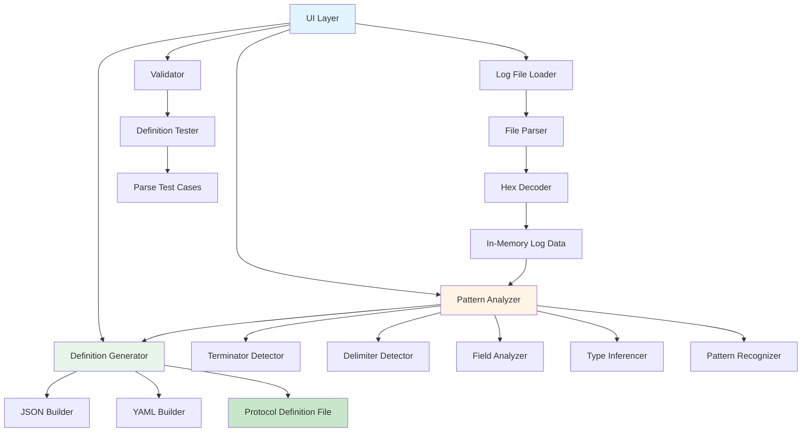
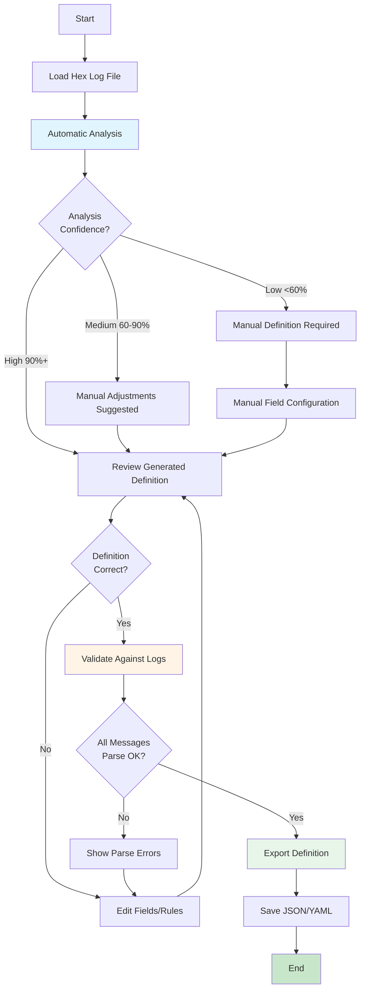

# Protocol Analyzer Tool - Design Specification

**Document:** Protocol Analyzer Tool Design
**Version:** 1.0
**Date:** 2025-10-18
**Status:** Design Phase

---

## Table of Contents
1. [Overview](#overview)
2. [Tool Architecture](#tool-architecture)
3. [Pattern Detection Algorithms](#pattern-detection-algorithms)
4. [User Interface Design](#user-interface-design)
5. [Output Generation](#output-generation)

---

## Overview

### Purpose

The **Protocol Analyzer Tool** automatically analyzes hex dump log files captured from serial devices and generates protocol definition files with minimal human intervention.

### Key Features

- 📁 Load hex log files (text or binary formats)
- 🔍 Automatic pattern detection
- 📊 Visual analysis and statistics
- 🤖 AI-suggested protocol definitions
- ✏️ Manual override and refinement
- 💾 Export to JSON/YAML protocol definitions
- ✅ Validation and testing

### Input/Output

**Input:**
- Hex dump files (e.g., `TScaleNHB/NHB.txt`)
- Text format: `53 54 2C 47 53 20 20 20 20 32 30 2E 37 67 20 20 0D 0A`
- Binary files with hex encoding

**Output:**
- Protocol definition JSON file
- Analysis report (statistics, patterns found)
- Test cases for validation

---

## Tool Architecture

### Component Diagram



### Class Structure

```csharp
namespace NLib.Serial.ProtocolAnalyzer
{
    // Main application entry
    public class MainWindow : Window
    {
        private LogFileLoader _loader;
        private PatternAnalyzer _analyzer;
        private DefinitionGenerator _generator;
        private ProtocolValidator _validator;
    }

    // Loads and parses hex log files
    public class LogFileLoader
    {
        public LogData LoadFile(string path);
        public LogData ParseHexDump(string content);
        public LogData ParseBinaryFile(string path);
    }

    // Represents loaded log data
    public class LogData
    {
        public List<byte[]> Messages { get; set; }
        public Dictionary<string, int> Statistics { get; set; }
        public byte[] MostCommonTerminator { get; set; }
    }

    // Analyzes patterns in log data
    public class PatternAnalyzer
    {
        public AnalysisResult Analyze(LogData data);

        private TerminatorInfo DetectTerminator(LogData data);
        private DelimiterInfo DetectDelimiters(LogData data);
        private List<FieldInfo> AnalyzeFields(LogData data);
        private Dictionary<string, TypeInfo> InferTypes(List<FieldInfo> fields);
    }

    // Results of pattern analysis
    public class AnalysisResult
    {
        public TerminatorInfo Terminator { get; set; }
        public List<DelimiterInfo> Delimiters { get; set; }
        public List<FieldInfo> Fields { get; set; }
        public int MessageCount { get; set; }
        public int AverageLength { get; set; }
        public double Confidence { get; set; }  // 0-100%
    }

    // Generates protocol definition from analysis
    public class DefinitionGenerator
    {
        public ProtocolDefinition Generate(AnalysisResult analysis);
        public string ToJson(ProtocolDefinition def);
        public string ToYaml(ProtocolDefinition def);
    }
}
```

---

## Pattern Detection Algorithms

### Algorithm 1: Terminator Detection

**Purpose:** Identify message boundary markers (CR, LF, CRLF, custom)

```csharp
public class TerminatorDetector
{
    public TerminatorInfo DetectTerminator(LogData data)
    {
        // Step 1: Find most common 1-4 byte sequences at end of messages
        var endSequences = new Dictionary<string, int>();

        foreach (var message in data.Messages)
        {
            // Check last 1-4 bytes
            for (int len = 1; len <= 4 && len <= message.Length; len++)
            {
                byte[] ending = message.Skip(message.Length - len).ToArray();
                string key = BitConverter.ToString(ending);

                if (!endSequences.ContainsKey(key))
                    endSequences[key] = 0;
                endSequences[key]++;
            }
        }

        // Step 2: Find most frequent ending
        var mostCommon = endSequences.OrderByDescending(x => x.Value).First();

        // Step 3: Validate (should appear in 90%+ of messages)
        double frequency = (double)mostCommon.Value / data.Messages.Count;

        if (frequency < 0.9)
            return new TerminatorInfo {
                Detected = false,
                Confidence = frequency
            };

        // Step 4: Decode common terminators
        byte[] terminatorBytes = ParseHexString(mostCommon.Key);
        string terminatorString = DecodeTerminator(terminatorBytes);

        return new TerminatorInfo
        {
            Detected = true,
            Bytes = terminatorBytes,
            String = terminatorString,  // e.g., "\r\n"
            Frequency = frequency,
            Confidence = frequency
        };
    }

    private string DecodeTerminator(byte[] bytes)
    {
        // Common patterns
        if (bytes.SequenceEqual(new byte[] { 0x0D, 0x0A }))
            return "\\r\\n";
        if (bytes.SequenceEqual(new byte[] { 0x0A }))
            return "\\n";
        if (bytes.SequenceEqual(new byte[] { 0x0D }))
            return "\\r";

        // Custom terminator
        return BitConverter.ToString(bytes);
    }
}
```

**Example Output:**
```json
{
  "terminator": {
    "detected": true,
    "bytes": "0D 0A",
    "string": "\\r\\n",
    "frequency": 1.0,
    "confidence": 100
  }
}
```

---

### Algorithm 2: Delimiter Detection

**Purpose:** Find field separators (comma, space, tab, semicolon)

```csharp
public class DelimiterDetector
{
    public List<DelimiterInfo> DetectDelimiters(LogData data)
    {
        // Common delimiters to check
        var candidates = new Dictionary<byte, string>
        {
            { 0x2C, "," },      // Comma
            { 0x20, " " },      // Space
            { 0x09, "\t" },     // Tab
            { 0x3B, ";" },      // Semicolon
            { 0x7C, "|" },      // Pipe
        };

        var results = new List<DelimiterInfo>();

        foreach (var candidate in candidates)
        {
            int totalCount = 0;
            int messagesWithDelimiter = 0;
            List<int> positionsInMessages = new List<int>();

            foreach (var message in data.Messages)
            {
                int count = message.Count(b => b == candidate.Key);
                if (count > 0)
                {
                    messagesWithDelimiter++;
                    totalCount += count;

                    // Find positions
                    for (int i = 0; i < message.Length; i++)
                    {
                        if (message[i] == candidate.Key)
                            positionsInMessages.Add(i);
                    }
                }
            }

            if (messagesWithDelimiter > data.Messages.Count * 0.5)
            {
                double frequency = (double)messagesWithDelimiter / data.Messages.Count;
                double avgPerMessage = (double)totalCount / data.Messages.Count;

                results.Add(new DelimiterInfo
                {
                    Character = candidate.Value,
                    Byte = candidate.Key,
                    Frequency = frequency,
                    AverageCount = avgPerMessage,
                    Confidence = frequency * 100,
                    IsConsistent = CheckConsistentPositions(positionsInMessages)
                });
            }
        }

        return results.OrderByDescending(x => x.Confidence).ToList();
    }

    private bool CheckConsistentPositions(List<int> positions)
    {
        // If delimiter appears at same position in 80%+ messages,
        // it's likely a structural delimiter
        var grouped = positions.GroupBy(x => x);
        return grouped.Any(g => (double)g.Count() / positions.Count > 0.8);
    }
}
```

**Example Output:**
```json
{
  "delimiters": [
    {
      "character": ",",
      "byte": "2C",
      "frequency": 1.0,
      "averageCount": 1.5,
      "confidence": 95,
      "isConsistent": true
    },
    {
      "character": " ",
      "byte": "20",
      "frequency": 1.0,
      "averageCount": 8.2,
      "confidence": 70,
      "isConsistent": false
    }
  ]
}
```

---

### Algorithm 3: Field Analyzer

**Purpose:** Identify distinct fields and their characteristics

```csharp
public class FieldAnalyzer
{
    public List<FieldInfo> AnalyzeFields(LogData data, DelimiterInfo primaryDelimiter)
    {
        var fields = new List<FieldInfo>();

        // Parse all messages using delimiter
        var parsedMessages = new List<string[]>();
        foreach (var message in data.Messages)
        {
            string text = Encoding.ASCII.GetString(message);
            string[] parts = text.Split(new[] { primaryDelimiter.Character },
                                        StringSplitOptions.None);
            parsedMessages.Add(parts);
        }

        // Analyze each field position
        int fieldCount = parsedMessages.Max(m => m.Length);

        for (int i = 0; i < fieldCount; i++)
        {
            var fieldValues = parsedMessages
                .Where(m => m.Length > i)
                .Select(m => m[i].Trim())
                .ToList();

            var fieldInfo = new FieldInfo
            {
                Position = i,
                Name = $"Field{i}",
                SampleValues = fieldValues.Take(10).ToList(),
                UniqueValues = fieldValues.Distinct().Count(),
                TotalValues = fieldValues.Count,
                MinLength = fieldValues.Min(v => v.Length),
                MaxLength = fieldValues.Max(v => v.Length),
                AverageLength = fieldValues.Average(v => v.Length),
                Type = InferType(fieldValues),
                IsConstant = IsConstant(fieldValues),
                IsNumeric = IsNumeric(fieldValues),
                ContainsUnit = DetectUnit(fieldValues)
            };

            fields.Add(fieldInfo);
        }

        return fields;
    }

    private string InferType(List<string> values)
    {
        // Check if all values are numeric
        if (values.All(v => decimal.TryParse(v.TrimEnd('g', 'k', ' '),
                                             NumberStyles.Any,
                                             CultureInfo.InvariantCulture,
                                             out _)))
            return "decimal";

        // Check if all values are integers
        if (values.All(v => int.TryParse(v, out _)))
            return "integer";

        // Check if datetime
        if (values.All(v => DateTime.TryParse(v, out _)))
            return "datetime";

        // Default to string
        return "string";
    }

    private bool IsConstant(List<string> values)
    {
        return values.Distinct().Count() == 1;
    }

    private bool IsNumeric(List<string> values)
    {
        return values.All(v => v.Any(char.IsDigit));
    }

    private string DetectUnit(List<string> values)
    {
        // Common units
        var units = new[] { "g", "kg", "pH", "°C", "pcs", "mm", "cm" };

        foreach (var unit in units)
        {
            if (values.Any(v => v.EndsWith(unit, StringComparison.OrdinalIgnoreCase)))
                return unit;
        }

        return null;
    }
}
```

**Example Output:**
```json
{
  "fields": [
    {
      "position": 0,
      "name": "Status",
      "type": "string",
      "isConstant": false,
      "uniqueValues": 2,
      "sampleValues": ["ST", "US", "ST", "ST"],
      "suggestedName": "StatusIndicator",
      "confidence": 90
    },
    {
      "position": 1,
      "name": "Mode",
      "type": "string",
      "isConstant": true,
      "uniqueValues": 1,
      "sampleValues": ["GS", "GS", "GS"],
      "confidence": 95
    },
    {
      "position": 2,
      "name": "Weight",
      "type": "decimal",
      "isNumeric": true,
      "unit": "g",
      "min": 0.0,
      "max": 250.0,
      "average": 125.3,
      "confidence": 85
    }
  ]
}
```

---

### Algorithm 4: Pattern Recognition

**Purpose:** Identify repeating patterns and protocol types

```csharp
public class PatternRecognizer
{
    public ProtocolType RecognizeProtocolType(AnalysisResult analysis)
    {
        // Single-line streaming (e.g., TScale, DEFENDER3000)
        if (analysis.MessageCount > 50 &&
            analysis.AverageLength < 50 &&
            analysis.Terminator.String == "\\r\\n")
        {
            return ProtocolType.StreamingSingleLine;
        }

        // Multi-line package (e.g., JIK6CAB)
        if (HasPackageMarkers(analysis))
        {
            return ProtocolType.MultiLinePackage;
        }

        // Command-response
        if (HasCommandResponsePattern(analysis))
        {
            return ProtocolType.CommandResponse;
        }

        return ProtocolType.Unknown;
    }

    private bool HasPackageMarkers(AnalysisResult analysis)
    {
        // Look for package start/end markers
        var firstMessages = analysis.Fields
            .FirstOrDefault()?
            .SampleValues
            .Take(5);

        if (firstMessages != null)
        {
            // Check if starts with special character
            return firstMessages.All(v => v.StartsWith("^") ||
                                          v.StartsWith("~") ||
                                          v.StartsWith("$"));
        }

        return false;
    }

    public ParsingStrategy SuggestParsingStrategy(AnalysisResult analysis)
    {
        // CSV-like (comma or semicolon delimited)
        if (analysis.Delimiters.Any(d => d.Character == "," || d.Character == ";"))
        {
            return new ParsingStrategy
            {
                Type = "split",
                Delimiter = analysis.Delimiters.First(d => d.Character == "," ||
                                                           d.Character == ";").Character
            };
        }

        // Space-delimited
        if (analysis.Delimiters.Any(d => d.Character == " " && d.IsConsistent))
        {
            return new ParsingStrategy
            {
                Type = "split",
                Delimiter = " ",
                RemoveEmptyEntries = true
            };
        }

        // Fixed-width (no clear delimiter, consistent positions)
        if (!analysis.Delimiters.Any())
        {
            return new ParsingStrategy
            {
                Type = "fixed-width",
                FieldPositions = CalculateFieldPositions(analysis)
            };
        }

        return new ParsingStrategy { Type = "regex" };
    }
}
```

---

## User Interface Design

### Main Window Layout

```
╔══════════════════════════════════════════════════════════════════╗
║  Protocol Analyzer                                    [ _ □ X ]  ║
╠══════════════════════════════════════════════════════════════════╣
║  ┌─────────────────────────────────────────────────────────────┐ ║
║  │  File: D:\...\TScaleNHB\NHB.txt            [Browse] [Load]  │ ║
║  └─────────────────────────────────────────────────────────────┘ ║
║                                                                   ║
║  ┌─ Log Data ────────────────────┐ ┌─ Analysis Results ────────┐║
║  │                                │ │                            │║
║  │ Messages: 460                  │ │ Protocol Type:             │║
║  │ Avg Length: 18 bytes           │ │ ☑ Single-line streaming   │║
║  │ Format: Hex dump               │ │ ☐ Multi-line package      │║
║  │                                │ │ ☐ Command-response        │║
║  │ Sample Message (1 of 460):     │ │                            │║
║  │ 53 54 2C 47 53 20 20 20 20    │ │ Terminator:                │║
║  │ 32 30 2E 37 67 20 20 0D 0A    │ │ Type: \r\n (CRLF)         │║
║  │                                │ │ Confidence: 100%           │║
║  │ ASCII:                         │ │                            │║
║  │ ST,GS    20.7g  ␍␊             │ │ Delimiters:                │║
║  │                                │ │ 1. Comma (,) - 100%        │║
║  │ [Prev] [Next] [Export]         │ │ 2. Space ( ) - 100%        │║
║  │                                │ │                            │║
║  └────────────────────────────────┘ │ Fields Detected: 3         │║
║                                     │                            │║
║  ┌─ Field Analysis ──────────────────────────────────────────┐  │║
║  │ ┌─────────────────────────────────────────────────────┐  │  │║
║  │ │ Pos │ Name    │ Type    │ Samples       │ Conf.    │  │  │║
║  │ ├─────┼─────────┼─────────┼───────────────┼──────────┤  │  │║
║  │ │  0  │ Status  │ string  │ ST, US        │ 95%      │  │  │║
║  │ │  1  │ Mode    │ string  │ GS            │ 98% (C)  │  │  │║
║  │ │  2  │ Weight  │ decimal │ 20.7g, 85.5g  │ 90%      │  │  │║
║  │ └─────────────────────────────────────────────────────┘  │  │║
║  │                                                           │  │║
║  │ [Edit Field] [Add Field] [Remove Field]                  │  │║
║  └───────────────────────────────────────────────────────────┘  │║
║                                                                   ║
║  ┌─ Generated Definition Preview ─────────────────────────────┐ ║
║  │ {                                                           │ ║
║  │   "deviceName": "TScaleNHB",                               │ ║
║  │   "protocol": {                                            │ ║
║  │     "type": "streaming",                                   │ ║
║  │     "terminator": "\\r\\n",                                │ ║
║  │     "fields": [                                            │ ║
║  │       {                                                    │ ║
║  │         "name": "Status",                                  │ ║
║  │         "type": "string",                                  │ ║
║  │         "values": ["ST", "US"]                             │ ║
║  │       },                                                   │ ║
║  │       ...                                                  │ ║
║  │     ]                                                      │ ║
║  │   }                                                        │ ║
║  │ }                                                          │ ║
║  └─────────────────────────────────────────────────────────────┘ ║
║                                                                   ║
║  [← Back] [Validate] [Test] [Export JSON] [Export YAML]          ║
╚══════════════════════════════════════════════════════════════════╝
```

### Workflow Steps



---

## Output Generation

### Generated Protocol Definition

**Example: TScaleNHB.json**

```json
{
  "_comment": "Generated by Protocol Analyzer v1.0 on 2025-10-18",
  "_sourceLog": "Documents/LuckyTex Devices/TScaleNHB/NHB.txt",
  "_analysisConfidence": 95,

  "deviceInfo": {
    "name": "TScaleNHB",
    "manufacturer": "T&T",
    "model": "NHB",
    "description": "Weight scale with CSV-like protocol"
  },

  "protocol": {
    "type": "streaming",
    "format": "csv-like",
    "encoding": "ASCII",
    "terminator": "\\r\\n",
    "terminatorBytes": "0D 0A",

    "fields": [
      {
        "name": "Status",
        "position": 0,
        "type": "string",
        "length": 2,
        "separator": ",",
        "values": ["ST", "US"],
        "description": "Stability indicator - ST=Stable, US=Unstable",
        "confidence": 95
      },
      {
        "name": "Mode",
        "position": 1,
        "type": "string",
        "length": 2,
        "separator": " ",
        "values": ["GS"],
        "isConstant": true,
        "description": "Mode indicator - GS=Gross/Stable",
        "confidence": 98
      },
      {
        "name": "Weight",
        "position": 2,
        "type": "decimal",
        "format": "F1",
        "alignment": "right",
        "padding": " ",
        "unit": "g",
        "unitAttached": true,
        "min": 0.0,
        "max": 250.0,
        "description": "Weight value in grams",
        "confidence": 90
      }
    ]
  },

  "parsing": {
    "strategy": "split",
    "delimiter": ",",
    "trim": true,
    "steps": [
      "Split line by comma",
      "Extract status from part[0]",
      "Split part[1] by space to get mode and weight",
      "Scan backward in weight string to separate unit",
      "Parse weight value as decimal"
    ],
    "errorHandling": {
      "onParseError": "log",
      "onInvalidValue": "useDefault",
      "onMissingField": "useDefault"
    }
  },

  "serialization": {
    "template": "{Status},{Mode}    {Weight:F1}{Unit}  \\r\\n",
    "padding": {
      "Weight": {
        "alignment": "right",
        "totalWidth": 8,
        "paddingChar": " "
      }
    }
  },

  "validation": {
    "required": ["Status", "Weight"],
    "constraints": {
      "Status": {
        "allowedValues": ["ST", "US"]
      },
      "Weight": {
        "min": 0,
        "max": 10000
      }
    }
  },

  "testCases": [
    {
      "input": "53 54 2C 47 53 20 20 20 20 32 30 2E 37 67 20 20 0D 0A",
      "expected": {
        "Status": "ST",
        "Mode": "GS",
        "Weight": 20.7,
        "Unit": "g"
      }
    },
    {
      "input": "55 53 2C 47 53 20 20 20 20 38 35 2E 35 67 20 20 0D 0A",
      "expected": {
        "Status": "US",
        "Mode": "GS",
        "Weight": 85.5,
        "Unit": "g"
      }
    }
  ]
}
```

### Analysis Report

**Example output from analyzing TScaleNHB log file:**

#### Protocol Analysis Report

**File:** TScaleNHB/NHB.txt
**Date:** 2025-10-18 15:30:00
**Tool Version:** 1.0

#### Summary

- **Messages Analyzed:** 460
- **Protocol Type:** Single-line streaming
- **Overall Confidence:** 95%
- **Recommended Strategy:** Split parsing

#### Terminator Analysis

- **Detected:** ✓ Yes
- **Type:** CRLF (\r\n)
- **Bytes:** 0x0D 0x0A
- **Frequency:** 460/460 (100%)
- **Confidence:** 100%

#### Delimiter Analysis

| Delimiter | Character | Frequency | Avg Count | Confidence | Structural |
|-----------|-----------|-----------|-----------|------------|------------|
| Comma | , | 100% | 1.0 | 100% | ✓ Yes |
| Space | (space) | 100% | 8.2 | 70% | ✗ No |

#### Field Analysis

**Field 0: Status**
- **Type:** String
- **Length:** 2 characters
- **Unique Values:** 2 (ST, US)
- **Frequency:** ST=98%, US=2%
- **Confidence:** 95%
- **Suggested Name:** StatusIndicator

**Field 1: Mode**
- **Type:** String (Constant)
- **Length:** 2 characters
- **Unique Values:** 1 (GS)
- **Frequency:** GS=100%
- **Confidence:** 98%
- **Suggested Name:** ModeIndicator

**Field 2: Weight**
- **Type:** Decimal
- **Unit:** g (attached)
- **Min:** 20.7
- **Max:** 106.2
- **Average:** 64.3
- **Std Dev:** 28.5
- **Confidence:** 90%
- **Suggested Name:** WeightValue

#### Recommendations

1. ✓ Use split parsing strategy with comma delimiter
2. ✓ Fields are well-defined and consistent
3. ⚠ Unit is attached to weight - requires post-processing
4. ✓ High confidence - minimal manual adjustment needed

#### Generated Definition

- **File:** TScaleNHB.json
- **Status:** ✓ Valid
- **Test Cases:** 2 generated
- **Validation:** ✓ All messages parse successfully

---

## Validation & Testing

### Definition Validator

```csharp
public class ProtocolValidator
{
    public ValidationResult Validate(ProtocolDefinition definition, LogData testData)
    {
        var result = new ValidationResult();

        // 1. Schema validation
        ValidateSchema(definition, result);

        // 2. Parse all test messages
        var engine = new ProtocolEngine(definition);
        int successCount = 0;

        foreach (var message in testData.Messages)
        {
            try
            {
                var parsed = engine.Parse(message);
                successCount++;

                // Validate field types
                foreach (var field in definition.Protocol.Fields)
                {
                    if (!ValidateFieldType(parsed[field.Name], field.Type))
                    {
                        result.Warnings.Add($"Field {field.Name} type mismatch");
                    }
                }
            }
            catch (Exception ex)
            {
                result.Errors.Add($"Parse error: {ex.Message}");
            }
        }

        result.ParseSuccessRate = (double)successCount / testData.Messages.Count;
        result.IsValid = result.Errors.Count == 0 && result.ParseSuccessRate > 0.95;

        return result;
    }
}

public class ValidationResult
{
    public bool IsValid { get; set; }
    public double ParseSuccessRate { get; set; }
    public List<string> Errors { get; set; } = new List<string>();
    public List<string> Warnings { get; set; } = new List<string>();
}
```

---

## Next Steps

1. → Implement Log File Loader
2. → Build pattern detection algorithms
3. → Create UI in WPF
4. → Add manual editing capabilities
5. → Implement validation engine
6. → Test with existing log files

---

## Related Documents

- [System Architecture](01-System-Architecture.md)
- [Protocol Definition Schema](03-Protocol-Definition-Schema.md)
- [Protocol Examples](04-Protocol-Examples.md)
