# System Architecture Analysis

## NLib.Serial.Protocol.Analyzer - Modern Design

**Related Documents**:
- **00-Requirements-Specification.md** - Complete requirements
- **01-Production-Code-Analysis.md** - Analysis of existing working code
- **03-Parsing-Strategy-Analysis.md** - Detailed parsing algorithms

---

## Context: Complementary Tool, Not Replacement

**IMPORTANT**: This Protocol Analyzer is a **SEPARATE TOOL** that complements the existing production code:

- **Existing Production Code** (01.Core/NLib.Serial.Devices/):
  - SerialDevice, SerialDeviceEmulator, SerialDeviceTerminal classes
  - Real-time serial communication (bidirectional)
  - Hardcoded protocol parsing per device
  - **Status**: ✅ WORKING - Production ready - DO NOT CHANGE

- **Protocol Analyzer** (This tool):
  - Offline log file analysis
  - Automatic protocol discovery
  - JSON definition file generation
  - Enables rapid new device integration
  - **Status**: 🔄 Design phase - NEW CAPABILITY

See **01-Production-Code-Analysis.md** for detailed analysis of existing code.

---

## Requirements Summary

**Primary Goal**: Create a protocol analyzer that can:
1. Load serial device log files in 3 formats (HEX/Text, HEX Only, Text Only)
2. Analyze the protocol structure automatically
3. Generate **bidirectional** protocol definition files (parse AND serialize)
4. Support future NTerminal<T> and NDevice<T> runtime classes

**Three User Scenarios**:
1. **Protocol Analyzer Users**: Developers analyzing log files to generate definitions
2. **NTerminal<T> Users** (Future): Applications receiving data using JSON definitions
3. **NDevice<T> Users** (Future): Testing tools emulating devices using JSON definitions

**Technical Constraints**:
- .NET Framework 4.7.2 only (no .NET Core)
- Working project: `@09.App\NLib.Serial.Protocol.Analyzer`
- Sample data: `@Documents\LuckyTex Devices\` folder

---

## Ecosystem Integration


**Key Points**:
- Protocol Analyzer does NOT touch existing production code
- Generates JSON definitions from captured log files
- Future runtime classes (NTerminal<T>, NDevice<T>) will use these definitions
- Optional: Could generate code for new Terminal classes

---

## System Architecture Overview (Protocol Analyzer Only)


---

## Core Components

### 1. File Loader & Format Detection

**Purpose**: Load log files and automatically detect format

**Input**: File path

**Output**: Raw file content + detected format type

**Detection Logic**:
- **HEX/Text**: File lines contain hex bytes followed by ASCII representation
  - Example: `46 20 20 20 20 20 20 30 2E 30 0D           F      0.0.`
  - Note: The `0D` is part of the protocol data, not the file line terminator
- **HEX Only**: File lines contain only hex bytes (with optional comments)
  - Example: `46 20 20 20 20 20 20 30 2E 30 0D  // F      0.0.`
  - Comments after `//` are for reference only
- **Text Only**: Plain ASCII text output (already decoded by logging tool)
  - Example: `SET P1(W)       0.0`
  - May or may not show protocol terminators explicitly

---

### 2. Format-Specific Parsers

#### HEX/Text Parser
```
Input:  "46 20 20 20 20 20 20 30 2E 30 0D           F      0.0."
Output:
  - Byte array: [0x46, 0x20, 0x20, 0x20, 0x20, 0x20, 0x20, 0x30, 0x2E, 0x30, 0x0D]
  - Text: "F      0.0."
```

**Parsing Strategy**:
1. Read each file line (separated by OS newlines - these are NOT protocol terminators)
2. Find the separator between hex and text sections (typically multiple spaces)
3. Left side: Parse hex bytes (2 hex chars = 1 byte, e.g., "46" = 0x46)
4. Right side: Extract ASCII text representation for reference
5. Validate: Converting bytes to ASCII should match text
6. Store raw bytes - protocol message boundaries determined by analyzer later

#### HEX Only Parser
```
Input:  "46 20 20 20 20 20 20 30 2E 30 0D  // F      0.0."
Output:
  - Byte array: [0x46, 0x20, 0x20, 0x20, 0x20, 0x20, 0x20, 0x30, 0x2E, 0x30, 0x0D]
  - Comment: "F      0.0."
```

**Parsing Strategy**:
1. Read each file line (separated by OS newlines)
2. Find comment delimiter (`//`, `#`, or similar)
3. Parse hex bytes before comment (2 hex chars = 1 byte)
4. Extract comment as reference text (optional, for validation)
5. Generate ASCII text from bytes for display
6. Store raw bytes - protocol message boundaries determined by analyzer later

#### Text Only Parser
```
Input:  "SET P1(W)       0.0"
Output:
  - Text: "SET P1(W)       0.0"
  - Byte array: ASCII/UTF8 encoding of text
```

**Parsing Strategy**:
1. Read each file line as-is (file lines are separated by OS-specific newlines)
2. Convert text to bytes using ASCII encoding (default)
3. Store original text + byte representation
4. Note: Protocol message terminators will be detected later by the analyzer

---

### 3. Normalized Data Model

All parsers output to a common structure:

```
LogEntry (Internal Analysis Model)
├── Bytes: byte[]           // Raw bytes extracted from log file - USED IN ANALYSIS
├── Text: string            // Human-readable representation - USED IN ANALYSIS
├── Timestamp: DateTime?    // If available in log - MAY BE IN PROTOCOL DEFINITION
├── Direction: enum         // TX/RX (if indicated) - ANALYSIS ONLY
├── FileLineNumber: int     // Original line number in log file - ANALYSIS/DEBUG ONLY
└── Metadata
    ├── Format: LogFileFormat enum    // ANALYSIS ONLY
    └── Encoding: Encoding            // WILL BE IN PROTOCOL DEFINITION
```

**Key Principle**: Once normalized, analyzer doesn't need to know original format.

**Important Distinction Between Analysis Data vs Protocol Definition**:

| Field | Used in Analysis | Goes in Protocol Definition | Purpose |
|-------|-----------------|----------------------------|---------|
| Bytes | ✓ | ✗ | Analyze patterns, detect terminators |
| Text | ✓ | ✗ | Display to user, validate patterns |
| Timestamp | ✓ | Maybe | If protocol includes timestamps as data |
| Direction | ✓ | ✗ | Understand TX vs RX patterns |
| FileLineNumber | ✓ | ✗ | Debugging, error reporting, pattern tracking |
| Format | ✓ | ✗ | Parser-specific, not protocol-related |
| Encoding | ✓ | ✓ | Needed to decode protocol bytes |

**Two-Stage Process**:
1. **File Lines → LogEntry** - How the log tool saved the data (with OS-specific newlines)
2. **LogEntry → Protocol Definition** - How the serial device actually sends data (with protocol-specific terminators)

- **Parsers** extract raw bytes from file lines into LogEntry objects (with FileLineNumber for tracking)
- **Analyzer** examines LogEntry objects to determine protocol characteristics (uses FileLineNumber for error reporting)
- **Generator** creates Protocol Definition from analysis results (excludes FileLineNumber and other log-file-specific data)

**Example Use of FileLineNumber**:
- User sees: "Pattern detected at lines 10, 20, 30, 40..."
- User sees: "Warning: Incomplete message at line 145"
- UI highlights: File line 50 → matches "WeightData" message pattern
- NOT in output: Protocol definition has no concept of "file lines"

---

### 4. Protocol Analyzer

The analyzer examines the normalized data to detect protocol characteristics:

#### a) Protocol Message Terminators

**Purpose**: Identify the bytes that mark the end of a protocol message (NOT file line breaks)

**Detection Strategy**:
- Analyze ending byte patterns across all entries
- Count frequency of terminator candidates
- Common patterns: `0x0D` (CR), `0x0A` (LF), `0x0D 0x0A` (CRLF), custom byte sequences
- Validate consistency across the dataset

**Example from TFO1**:
```
Pattern: 0x0D (CR)           - Frequency: 90%  (standard message terminator)
Pattern: 0x83 0x0D           - Frequency: 10%  (special footer marker)
```

**Note**: These are protocol-level terminators, independent of how the log file was formatted.

#### b) Field Delimiters

**Purpose**: Identify bytes/characters that separate fields within a protocol message

**Detection Strategy**:
- Analyze byte patterns within individual messages
- Detect consistent field separators
- Types: Fixed-width, space-delimited, tab-delimited, comma-separated, custom bytes

**Example from TFO1**:
```
Format: Fixed-width fields
Field separator: Multiple spaces (0x20)
Example: "F      0.0"
  - Field 1: "F" (identifier, position 0)
  - Padding: "      " (6 spaces)
  - Field 2: "0.0" (value, right-aligned)
```

#### c) Data Patterns

**Detection Strategy**:
- Statistical analysis of message structures
- Identify repeating patterns
- Classify fields (numeric, text, timestamp, identifier)

**Example from TFO3**:
```
Repeating structure (10-entry block):
  SET P1(W)       0.0
  SET P2          0.0
  SET P3          0.0
  SET P4          0.0
  GROSS WEIGHT    1138.0
  NET WEIGHT      21.5
  TARE            1116.5
  DATE & TIME     JAN. 14,2024  06:28AM
  SCALE NO        1
  STATUS          �*
```

**Detected Pattern**:
- Key-value pairs structure
- Keys: Fixed text labels (left side)
- Values: Variable (numeric or datetime, right side)
- Field delimiter: Multiple spaces
- Message structure: Multi-entry message block
- Each entry likely has protocol terminator (to be detected)

#### d) Message Structure

**Detection Strategy**:
- Identify headers (consistent starting bytes/patterns)
- Identify footers (consistent ending patterns)
- Detect checksums (if present)
- Determine message length (fixed vs variable)

**Example from TFO1**:
```
Message Frame Structure:
Header:  "V1" + 0x0D 0x0A (protocol header with CRLF terminator)
Body:    Multiple data entries (F, H, Q, X, A, 0, 4, 1, 2)
         Each entry: identifier + value + 0x0D (CR terminator)
Footer:  "B" + 0x83 0x0D (special footer marker)
         "C20. 02. 2023. MON 09:17AM" + 0x0D (timestamp)
```

**Note**: These are protocol-level message boundaries and terminators, not file formatting.

---

### 5. Protocol Definition Generator

**Purpose**: Generate a **bidirectional** protocol definition file that OTHER applications can use to communicate with the serial device.

**Bidirectional Support**:
- **Parse Direction** (Device → Application): How to parse incoming bytes into fields
- **Serialize Direction** (Application → Device): How to format fields into bytes

This enables both:
- **NTerminal<T>**: Parse received data using the definition
- **NDevice<T>**: Serialize T instance into protocol bytes

**Important**: The definition file contains ONLY protocol structure, NOT log-file-specific information.

**What Goes In**:
- ✓ Protocol terminators (e.g., `\r`, `\x83\r`)
- ✓ Field delimiters (e.g., spaces, tabs)
- ✓ Message patterns and structure
- ✓ Field definitions (name, type, position, format)
- ✓ Encoding (e.g., ASCII, UTF-8)
- ✓ Message sequences
- ✓ **Parse rules** (how to extract fields from bytes)
- ✓ **Format rules** (how to convert fields to bytes)

**What Does NOT Go In**:
- ✗ File line numbers (analysis/debug only)
- ✗ Log file format (HEX/Text, etc.)
- ✗ Direction markers (TX/RX - unless part of protocol)
- ✗ Any log-tool-specific formatting

**Output Format**: JSON

```json
{
  "deviceName": "TFO1",
  "version": "1.0",
  "generatedDate": "2025-10-19T12:00:00Z",
  "encoding": "ASCII",
  "messageTerminator": "\\r",
  "messageDelimiter": null,
  "messages": [
    {
      "messageId": "WeightData",
      "messageType": "Response",
      "pattern": "^[A-Z]\\s+[\\d.]+$",
      "fields": [
        {
          "name": "identifier",
          "position": 0,
          "length": 1,
          "type": "char",
          "description": "Field identifier (F/H/Q/X/A/0/4/1/2)",
          "parse": {
            "offset": 0,
            "length": 1,
            "encoding": "ASCII"
          },
          "serialize": {
            "position": 0,
            "required": true
          }
        },
        {
          "name": "value",
          "position": 2,
          "type": "decimal",
          "format": "fixed-width",
          "width": 10,
          "alignment": "right",
          "description": "Numeric value",
          "parse": {
            "offset": 1,
            "length": 9,
            "encoding": "ASCII",
            "trim": true,
            "decimalFormat": "F1"
          },
          "serialize": {
            "position": 1,
            "padding": "left",
            "padChar": " ",
            "width": 9,
            "decimalFormat": "F1"
          }
        }
      ],
      "terminator": "\\r"
    },
    {
      "messageId": "Header",
      "messageType": "FrameStart",
      "pattern": "^V\\d+$",
      "fields": [
        {
          "name": "version",
          "position": 1,
          "type": "integer",
          "description": "Protocol version"
        }
      ],
      "terminator": "\\r\\n"
    },
    {
      "messageId": "Footer",
      "messageType": "FrameEnd",
      "pattern": "^B",
      "fields": [
        {
          "name": "marker",
          "position": 0,
          "length": 1,
          "type": "char",
          "value": "B"
        }
      ],
      "terminator": "\\x83\\r"
    }
  ],
  "messageSequence": [
    "Header",
    "WeightData (F)",
    "WeightData (H)",
    "WeightData (Q)",
    "WeightData (X)",
    "WeightData (A)",
    "WeightData (0)",
    "WeightData (4)",
    "WeightData (1)",
    "WeightData (2)",
    "Footer",
    "DateTime"
  ]
}
```

---

## Data Flow Sequence

```mermaid
sequenceDiagram
    participant User
    participant UI
    participant Loader
    participant Parser
    participant Analyzer
    participant FieldEditor
    participant Generator

    User->>UI: Select log file
    UI->>Loader: Load file
    Loader->>Loader: Detect format
    Loader->>Parser: Parse with detected format
    Parser->>Parser: Extract bytes & text
    Parser-->>UI: Return normalized data
    UI->>Analyzer: Analyze protocol
    Analyzer->>Analyzer: Detect terminators
    Analyzer->>Analyzer: Detect delimiters
    Analyzer->>Analyzer: Identify patterns
    Analyzer->>Analyzer: Extract field structure
    Analyzer->>Analyzer: Generate auto field names
    Analyzer-->>UI: Return analysis results
    UI->>FieldEditor: Show fields with auto names
    FieldEditor->>User: Display editable field grid
    User->>FieldEditor: Rename fields (Field1→NetWeight)
    FieldEditor->>FieldEditor: Validate names
    FieldEditor-->>UI: Return updated field definitions
    User->>UI: Review & confirm
    UI->>Generator: Generate definition (with custom names)
    Generator-->>UI: Return JSON file
    UI->>User: Save definition file
```



---

## Component State Diagram


---

## Class Diagram Overview


---

## Key Design Decisions

### 1. Multi-Stage Pipeline Architecture
- **Why**: Separation of concerns - parsing, analysis, and generation are independent
- **Benefit**: Easy to test each stage, modify parsers without affecting analyzers
- **Trade-off**: More complexity, but better maintainability

### 2. Normalized Data Model
- **Why**: Different log formats need common representation
- **Benefit**: Analyzer doesn't care about original format
- **Implementation**: All parsers output `LogEntry` objects

### 3. Statistical Pattern Detection
- **Why**: Can't assume all protocols follow same rules
- **Benefit**: Automatically adapts to different device protocols
- **Approach**: Frequency analysis, pattern matching, heuristics

### 4. JSON Output Format
- **Why**: Human-readable, machine-parsable, extensible
- **Benefit**: Can be used by other tools in the ecosystem
- **Alternative considered**: XML (rejected - too verbose)

### 5. WPF for UI
- **Why**: Rich UI controls, data binding, .NET 4.7.2 compatible
- **Benefit**: Better user experience than Windows Forms
- **Features needed**: File picker, text display, tree view, export

---

## Expected Challenges

### 1. Ambiguous Patterns
**Problem**: Some devices may have irregular message formats
**Solution**:
- Provide manual override options
- Support multiple pattern matches
- Use confidence scoring

### 2. Mixed Content
**Problem**: Text and binary data in same protocol
**Solution**:
- Detect non-printable characters
- Support hybrid parsing
- Preserve raw bytes always

### 3. Timestamp Handling
**Problem**: Logs may have different timestamp formats
**Solution**:
- Flexible timestamp parsing
- Optional timestamp field
- Support multiple formats

### 4. Noise in Logs
**Problem**: Extra debug messages, connection errors
**Solution**:
- Filtering options
- Pattern validation
- User can exclude lines

### 5. Incomplete Messages
**Problem**: Truncated or partial messages in logs
**Solution**:
- Detect incomplete patterns
- Warning system
- Option to ignore

### 6. Field Naming
**Problem**: Protocols rarely include field names - analyzer must generate them automatically
**Solution**:
- Auto-generate field names based on pattern:
  - Position-based: "Field1", "Field2", "Field3"
  - Type-based: "NumericField1", "StringField1"
  - Content-based: "DateTimeField", "WeightValue" (if detectable)
- Provide field editor UI for user customization
- Validate custom names (C# identifier rules)
- Preserve custom names across re-analysis
- Show sample values to help user understand field purpose

**Example Workflow**:
```
1. Analyzer generates: Name = "Field1"
2. User edits: Name = "NetWeight"
3. Save to JSON: { "name": "NetWeight", ... }
```

**Note**: No need to track "auto-generated vs custom" - just one `Name` property that user edits directly.

---

## Technology Stack

- **Framework**: .NET Framework 4.7.2
- **UI**: WPF (Windows Presentation Foundation)
- **JSON**: System.Text.Json (already referenced)
- **File I/O**: System.IO
- **Regex**: System.Text.RegularExpressions
- **Data Binding**: INotifyPropertyChanged, ObservableCollection

---

## Success Criteria

1. **Accuracy**: 95%+ correct pattern detection for sample devices
   - Protocol terminator detection: 95%+ accuracy
   - Field delimiter detection: 95%+ accuracy
   - Message pattern identification: 95%+ accuracy
   - Field structure extraction: 95%+ accuracy
2. **Usability**: User can load file and generate definition in < 5 clicks
3. **Performance**: Process 10,000 line log file in < 5 seconds
4. **Extensibility**: Easy to add new log formats
5. **Documentation**: Clear JSON schema for definition files
6. **Validation**: All sample devices in @Documents\LuckyTex Devices\ should be correctly analyzed

---

## Next Steps

1. **Data Models Design** - Define all classes and interfaces
2. **Parser Design** - Detail parsing algorithms for each format
3. **Analyzer Design** - Design detection algorithms
4. **UI Design** - Wireframes and user workflow
5. **Implementation Plan** - Break down into development tasks

---

**Document Version**: 1.0
**Last Updated**: 2025-10-19
**Author**: Claude (AI Assistant)
**Status**: Design Phase
