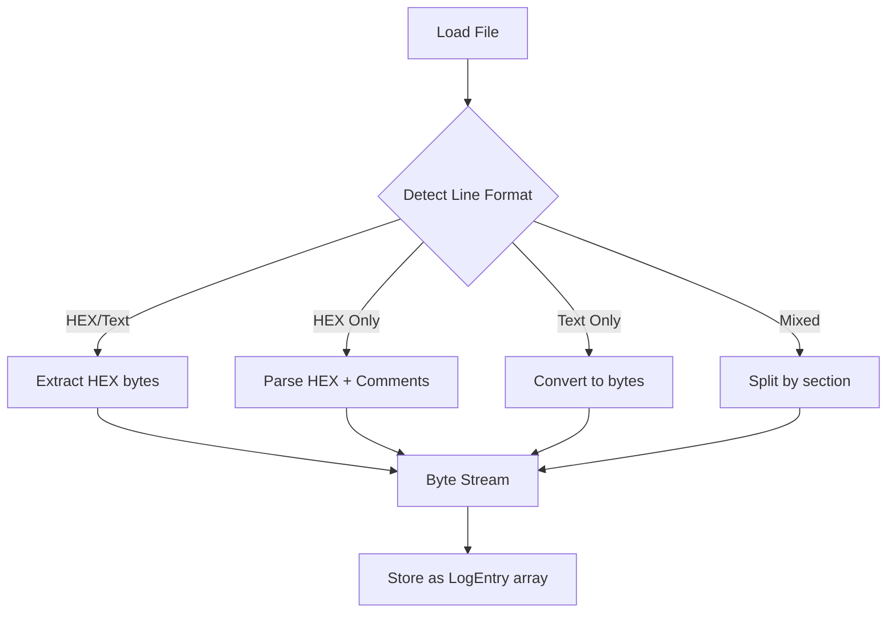
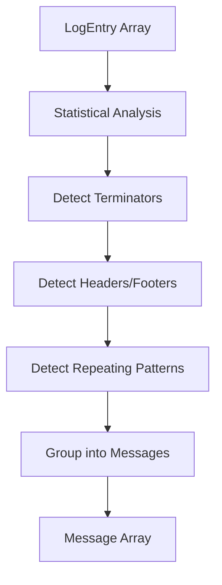
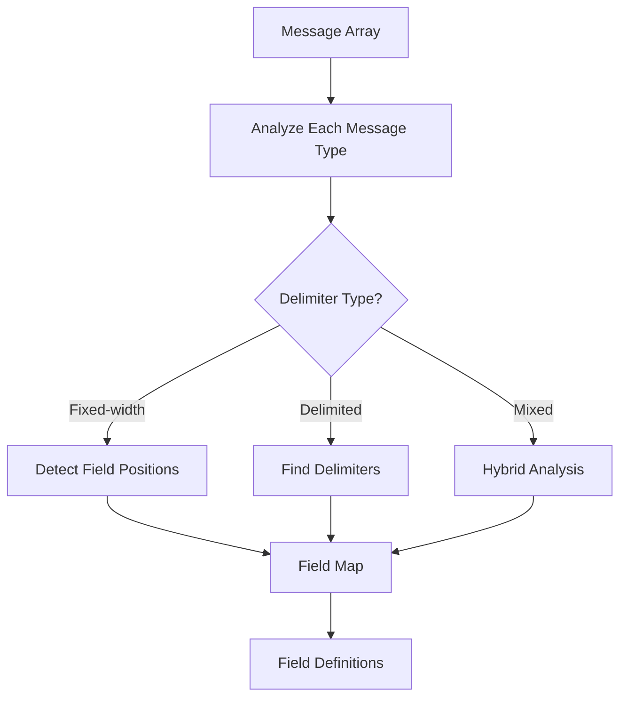
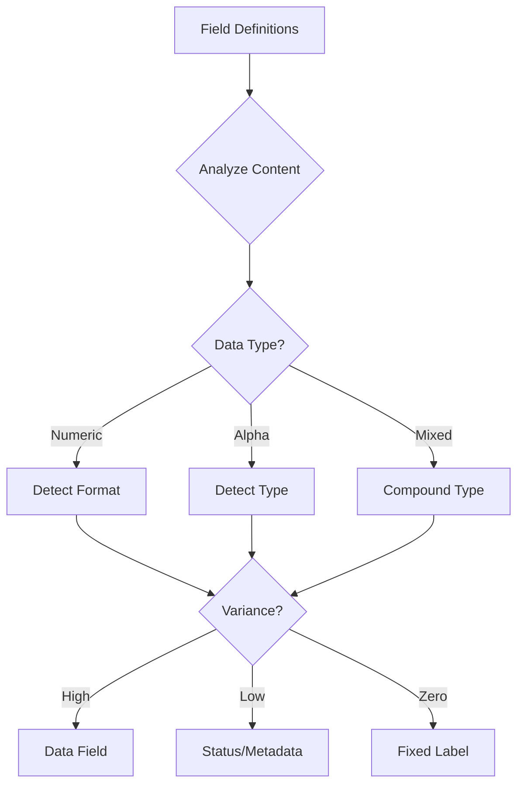
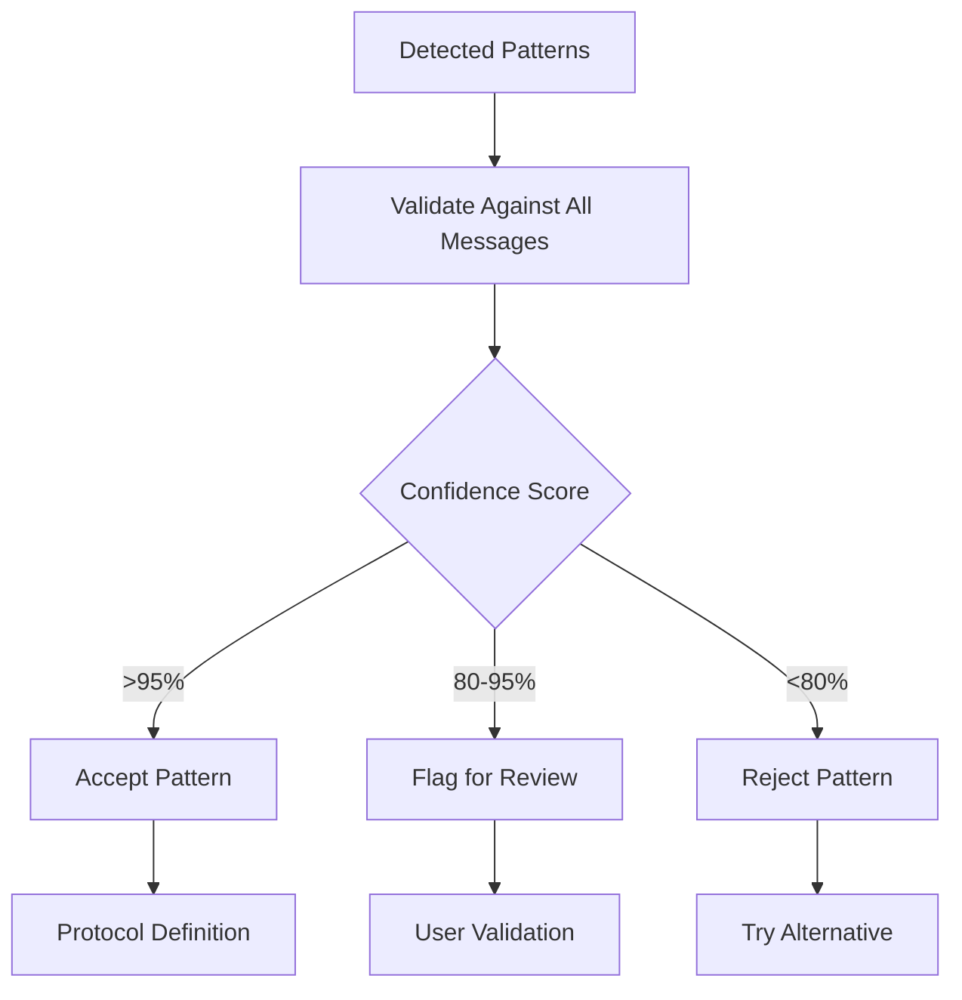

# Parsing Strategy Analysis

**Related Documents**:
- **00-Requirements-Specification.md** - Complete requirements
- **01-Production-Code-Analysis.md** - How production code handles these protocols
- **02-System-Architecture.md** - Overall system design

---

## Real-World Log Complexity Analysis

Based on examination of actual log files in `@Documents\LuckyTex Devices\` AND analysis of production parsing code in `01.Core\NLib.Serial.Devices\`, these are **NOT simple CSV formats**. They present significant parsing challenges.

**Key Insight from Production Code**: The existing Terminal classes (WeightQATerminal, CordDEFENDER3000Terminal, PHMeterTerminal, TFO1Terminal) each use DIFFERENT parsing strategies:
- String splitting (simple protocols)
- Fixed-position extraction (fixed-width fields)
- Switch/case on first byte (header-based)
- Conditional parsing (content-dependent)

The Protocol Analyzer must automatically detect which strategy applies to each device.

---

## Challenge Categories

### 1. **Simple Single-Line Repeating Messages**

**Example: DEFENDER3000 / CordDEFENDER3000**
```
-  1.640 kg    N
-  1.640 kg    N
-  1.640 kg    N
```

**Structure**:
- Fixed-width format
- Pattern: `sign` + `spaces` + `value` + `unit` + `spaces` + `status`
- Repeating same message

**Production Code Parsing Strategy** (CordDEFENDER3000.cs:300-334):
```csharp
string line = Encoding.ASCII.GetString(content);
string[] elems = line.Split(" ", RemoveEmptyEntries);
Value.W = decimal.Parse(elems[0]);    // "1.640"
Value.Unit = elems[1];                // "kg"
Value.O = elems[2];                   // "N"
```

**Challenges**:
- Leading spaces (variable or fixed?)
- Multiple spaces as delimiter
- Status code at end (`N`, `G`, etc.)

**Protocol Analyzer Must Detect**:
- Delimiter: Multiple spaces (0x20)
- Parsing strategy: String.Split with RemoveEmptyEntries
- Field count: 3 fields
- Data types: decimal, string, char

---

### 2. **Multi-Line Message Blocks**

**Example: JIK6CAB**
```
^KJIK000
2023-11-07
17:19:38
  0.00 kg
  1.94 kg
0
0
  1.94 kg
  1.94 kg
    0 pcs


E
~P1
```

**Structure**:
- Header marker: `^KJIK000`
- Date: `YYYY-MM-DD`
- Time: `HH:MM:SS`
- Multiple data fields (different formats)
- Footer markers: `E`, `~P1`

**Challenges**:
- **Multi-line message block** (not one line = one message!)
- Mixed data types (date, time, weight, count)
- Empty lines within message
- Start/end markers
- Variable number of fields

---

### 3. **Compact Binary-Style Format**

**Example: WEIGHT QA**
```
+007.12/3 G S
+008.12/2 G S
+009.36/0 G S
```

**Structure**:
- Sign: `+` or `-`
- Value: `007.12`
- Separator: `/`
- Counter/Status: `3`
- Unit: `G`
- Status: `S`
- Terminator: `0D 0A` (CRLF)

**Production Code Parsing Strategy** (WeightQA.cs:299-335):
```csharp
string line = Encoding.ASCII.GetString(content);
// Split by "/" to separate weight from metadata
string[] elems = line.Split("/");
string sUM = elems[1].Trim();  // "3 G S"
// Split by spaces to get individual fields
string[] elems2 = sUM.Split(" ", RemoveEmptyEntries);

string w = elems[0].Trim() + elems2[0].Trim(); // "+007.12" + "3"
Value.W = decimal.Parse(w);    // 007.123
Value.Unit = elems2[1];        // "G"
Value.Mode = elems2[2];        // "S"
```

**Challenges**:
- Compact format (no extra spaces)
- Multiple delimiters (`/`, spaces)
- Mixed numeric fields (value, counter)
- Status codes

**Protocol Analyzer Must Detect**:
- Primary delimiter: "/" (0x2F)
- Secondary delimiter: Space (0x20)
- Parsing strategy: Nested splitting
- Weight encoding: Integer part + "/" + fraction part
- Field reconstruction logic

---

### 4. **Mixed HEX and Text with Multi-Field Structure**

**Example: PH Meter**
```
Text view:
3.01pH 25.5°C ATC
20-Feb-2023
11:11

3.01pH
25.5°C ATC
Auto EP Standard
Blank
```

**HEX view shows:**
```
33 2E 30 31 70 48 20 32 35 2E 35 F8 43 20 41 54    3.01pH 25.5.C AT
43 0D 0A 33 2E 30 31 70 48 20 32 35 2E 35 F8 43    C..3.01pH 25.5.C
20 41 54 43 0D 0A 32 30 2D 46 65 62 2D 32 30 32     ATC..20-Feb-202
33 0D 0A 31 31 3A 31 31 0D 0A 20 0D 0A           3..11:11.. ..
```

**Structure**:
- Compound value: `3.01pH` (no space!)
- Temperature: `25.5°C` (special character `0xF8` for degree symbol)
- Mode: `ATC`
- Timestamp (multi-line)
- Mode description
- Sample type

**Production Code Parsing Strategy** (PHMeter.cs:358-462):
```csharp
string line = Encoding.ASCII.GetString(content).Trim();

if (line.Contains("ATC") && line.Contains("pH")) {
    // Parse both pH and temperature
    int iPh = line.IndexOf("pH");
    string sPh = line.Substring(0, iPh);
    Value.pH = decimal.Parse(sPh);

    int iTmp = lNext.IndexOf("C ATC");
    string sTmp = lNext.Substring(0, iTmp - 1);
    Value.TempC = decimal.Parse(sTmp);
}
else if (line.Contains("-")) {
    // Parse date: "20-Feb-2023"
    Value.Date = DateTime.ParseExact(line, "dd-MMM-yyyy", ...);
}
else if (line.Contains(":")) {
    // Parse time: "11:11"
    Value.Date = DateTime.ParseExact(line, "HH:mm", ...);
}
```

**Challenges**:
- **Non-ASCII characters** (`0xF8` = degree symbol)
- Compound values (number + unit together)
- Multi-line timestamp
- Mixed message types (reading vs print report)
- Empty line as field

**Protocol Analyzer Must Detect**:
- Content-based parsing (if/else on line content)
- Multiple line patterns in same message
- Special byte handling (0xF8)
- DateTime format detection ("dd-MMM-yyyy", "HH:mm")
- Compound field detection ("3.01pH", "25.5°C")

---

### 5. **Mettler Toledo Scientific Format**

**Example: MS204TS00**
```
     N       0.3749 g   ..
     N       0.3747 g   ..
```

**Structure**:
- Leading spaces
- Status: `N` (Net/Stable?)
- Value with precision
- Unit
- Suffix: `..` (stability indicator?)

**Challenges**:
- Fixed-width fields with leading spaces
- Multiple space delimiter
- Cryptic status codes
- Suffix indicators

---

## Core Problems Identified

### Problem 1: **Message Boundary Detection**
**NOT** one file line = one message!

Examples:
- **JIK6CAB**: 14 file lines = 1 message block
- **PH Meter**: Variable lines per message (simple reading vs print report)
- **TFO1**: Multi-line frame structure

**Solution Needed**:
1. Parse all bytes from all file lines
2. Build continuous byte stream
3. Detect message boundaries by:
   - Header/footer markers
   - Terminator patterns
   - Message length patterns
   - Repeating structures

---

### Problem 2: **Mixed File Formats**
Some logs mix format types!

**Example: WEIGHT QA**
```
Line 1-12:  Text only
Line 13:    Empty
Line 14:    Empty
Line 15-22: HEX/Text mixed
Line 23-28: Text only
Line 29:    Empty
Line 30:    Comment "-- Generate"
Line 31+:   HEX/Text mixed
```

**Solution Needed**:
- Detect format **per-section**, not per-file
- Handle format transitions
- Ignore comments and separators

---

### Problem 3: **Non-Printable and Special Characters**

**Examples**:
- `0xF8` = Degree symbol (°)
- `0x83` = Special marker in TFO1
- `0x0D 0x0A` = CRLF
- `^K` = Control character
- `~P1` = Command marker

**Solution Needed**:
- Preserve ALL bytes (don't assume ASCII)
- Detect non-printable characters
- Handle encoding variations
- Support custom character mappings

---

### Problem 4: **Variable Field Delimiters**

Different devices use different delimiters (from both log analysis AND production code):

| Device | Delimiter Type | Production Code Strategy | Example |
|--------|---------------|-------------------------|---------|
| DEFENDER3000 | Multiple spaces (variable count) | String.Split(" ", RemoveEmptyEntries) | `- 1.640 kg    N` |
| WEIGHT QA | Slash + space | Nested Split("/" then " ") | `+007.12/3 G S` |
| JIK6CAB | Line breaks | Each field on new line | Multi-line block |
| PH Meter | Space (but compound values!) | IndexOf + Substring | `25.5°C` no space |
| MS204TS00 | Multiple spaces (fixed width) | String.Split with padding | `     N       0.3749 g` |
| TFO1 | Spaces (fixed width) | Switch + GetString(offset, length) | `F      0.0` |

**TFO1's Advanced Parsing** (TFO1.cs:464-685):
```csharp
char hdr = (char)content[0];  // First byte identifies field type
switch (hdr) {
    case 'F':
        // Fixed position extraction
        string val = Encoding.ASCII.GetString(content, 1, 9);
        Value.F = decimal.Parse(val);
        break;
    case 'B':
        Value.B = content[1];  // Direct binary byte
        break;
    case 'C':  // Complex: mix of ASCII + special bytes
        string _dd = ASCII.GetString(content, 1, 2);
        // content[3] is 0xF4 (separator)
        string _mm = ASCII.GetString(content, 5, 2);
        // content[7] is 0xF3 (separator)
        Value.C = new DateTime(yy, mm, dd, hh, mi, 0);
        break;
}
```

**Solution Needed**:
- Statistical analysis of spacing patterns
- Detect fixed-width vs delimited
- Handle compound values (no delimiter)
- Multiple delimiter types in same message
- Support header-based field identification (first byte switch/case)
- Mix of ASCII text and binary bytes in same protocol

---

### Problem 5: **Embedded Metadata vs Data**

Some messages contain both:

**PH Meter Example**:
```
3.01pH              ← DATA (measurement)
25.5°C ATC          ← DATA (temperature + mode)
20-Feb-2023         ← METADATA (timestamp)
11:11               ← METADATA (time)
Auto EP Standard    ← METADATA (method)
Blank               ← METADATA (sample type)
```

**Solution Needed**:
- Classify fields as data vs metadata
- Metadata might not repeat in every message
- Data fields typically repeat/vary
- Statistical analysis of field variance

---

## Proposed Parsing Strategy

### Stage 1: **Byte Extraction**



**Key Points**:
- Each LogEntry = bytes from ONE file line
- Preserve FileLineNumber
- Don't assume message boundaries yet
- Handle mixed formats

---

### Stage 2: **Message Boundary Detection**



**Algorithms**:

#### A. **Terminator Detection**
```
For each LogEntry:
  - Check last 1-4 bytes
  - Count frequency of patterns
  - Common patterns: 0x0D, 0x0A, 0x0D0A, custom sequences
  - Score by consistency (95%+ = likely terminator)
```

#### B. **Header/Footer Detection**
```
For LogEntry array:
  - Find entries with unique starting bytes
  - Find entries with unique ending bytes
  - Check if they appear regularly
  - Pattern: Header -> Data -> Footer -> Header...
```

#### C. **Block Pattern Detection**
```
Analyze entry sequences:
  - Look for repeating N-line blocks
  - Example: Lines 1-14, 15-28, 29-42 (14-line blocks)
  - Validate structure consistency within blocks
```

---

### Stage 3: **Field Structure Analysis**



**Algorithms**:

#### A. **Fixed-Width Detection**
```
For each message:
  - Find positions where characters change
  - Detect space-padding patterns
  - Identify field boundaries by:
    - Consistent spacing
    - Data type transitions (alpha to numeric)
    - Alignment patterns (left/right)
```

#### B. **Delimiter Detection**
```
For each message:
  - Count byte frequency
  - High-frequency non-alphanumeric bytes = delimiter candidates
  - Common: 0x20 (space), 0x2F (slash), 0x2C (comma), 0x09 (tab)
  - Validate consistency across messages
```

#### C. **Compound Value Detection**
```
Detect patterns like "3.01pH" or "25.5°C":
  - Number immediately followed by alpha
  - No delimiter between
  - Treat as single field
```

---

### Stage 4: **Field Classification**



**Classification Rules**:

| Variance | Classification | Example |
|----------|---------------|---------|
| 0% (always same) | Fixed Label | "Auto EP Standard" |
| <10% | Status Code | "N", "G", "S" (few values) |
| 10-90% | Data Field | "1.640", "3.01pH" (many values) |
| >90% | Timestamp/ID | Always changing |

---

### Stage 5: **Pattern Validation**



**Confidence Scoring**:
```
Score = (Matching Messages / Total Messages) × 100

Examples:
- Terminator 0x0D found in 950/1000 messages = 95% → ACCEPT
- Delimiter "/" found in 850/1000 messages = 85% → REVIEW
- Pattern detected in 500/1000 messages = 50% → REJECT
```

---

## Implementation Considerations

### 1. **Multi-Pass Analysis**
Cannot determine everything in one pass:
- **Pass 1**: Extract bytes
- **Pass 2**: Detect message boundaries
- **Pass 3**: Analyze field structure
- **Pass 4**: Classify fields
- **Pass 5**: Validate and score

### 2. **Probabilistic Approach**
Use statistics, not rules:
- Frequency analysis
- Variance analysis
- Pattern matching
- Confidence scoring

### 3. **User Override**
For the 5% that can't be auto-detected:
- Show detected patterns with confidence scores
- Allow user to confirm/reject
- Manual field definition option
- Save user corrections for learning

### 4. **Incremental Processing**
Don't try to solve everything at once:
- Start with terminator detection (easiest)
- Then field delimiters
- Then field types
- Then metadata classification
- Each stage uses previous results

---

## Algorithm Priority

### High Priority (Must Solve)
1. ✓ **Byte extraction from all 3 file formats**
2. ✓ **Protocol terminator detection** (0x0D, 0x0A, etc.)
3. ✓ **Message boundary detection** (multi-line blocks)
4. ✓ **Field delimiter detection** (spaces, /, etc.)

### Medium Priority (Important)
5. ✓ **Fixed-width field detection**
6. ✓ **Field data type classification**
7. ✓ **Header/footer marker detection**

### Lower Priority (Nice to Have)
8. ◯ **Metadata vs data classification**
9. ◯ **Compound value detection** ("3.01pH")
10. ◯ **Non-ASCII character mapping** (0xF8 → °)

---

## Success Metrics

To achieve **95%+ accuracy**:

1. **Terminator Detection**: Must correctly identify in 95%+ of devices
2. **Message Boundaries**: Must group multi-line messages correctly
3. **Field Delimiters**: Must detect primary delimiter type
4. **Field Count**: Must identify correct number of fields ±1
5. **Data Type**: Must classify numeric vs text fields correctly

---

## Example: JIK6CAB Analysis

**Input (14 file lines)**:
```
^KJIK000
2023-11-07
17:19:38
  0.00 kg
  1.94 kg
0
0
  1.94 kg
  1.94 kg
    0 pcs


E
~P1
```

**Analysis Process**:

### Pass 1: Byte Extraction
```
14 LogEntry objects created
FileLineNumber: 1-14
Bytes extracted (ASCII encoding)
```

### Pass 2: Message Boundary Detection
```
Detected patterns:
- Starts with: ^KJIK000 (100% confidence)
- Ends with: ~P1 (100% confidence)
- Lines 11-12: Empty (0x0D0A only)
- Message = Lines 1-14 (one block)
```

### Pass 3: Field Structure
```
Line 1:  Header marker
Line 2:  Date (YYYY-MM-DD pattern)
Line 3:  Time (HH:MM:SS pattern)
Line 4-10: Data fields (mixed format)
Line 11-12: Empty lines
Line 13-14: Footer markers
```

### Pass 4: Field Classification
```
Field 1: Header (fixed: "^KJIK000")
Field 2: Date (metadata, format: YYYY-MM-DD)
Field 3: Time (metadata, format: HH:MM:SS)
Field 4: Tare weight (data: decimal + unit)
Field 5: Gross weight (data: decimal + unit)
Field 6-7: Status codes (data: integer)
Field 8-9: Net weight (data: decimal + unit)
Field 10: Count (data: integer + unit)
Field 11: Footer 1 (fixed: "E")
Field 12: Footer 2 (fixed: "~P1")
```

### Pass 5: Generate Definition
```json
{
  "deviceName": "JIK6CAB",
  "messageStructure": "multi-line-block",
  "messageStart": "^KJIK000",
  "messageEnd": "~P1",
  "lineTerminator": "\\r\\n",
  "fields": [...]
}
```

---

## Production Code Insights Summary

From analyzing the existing Terminal classes, we identified **four distinct parsing patterns**:

| Pattern | Devices | Characteristics | Auto-Detection Strategy |
|---------|---------|----------------|------------------------|
| **String Splitting** | WeightQA, CordDEFENDER3000 | Simple delimiters (/, spaces) | High delimiter frequency analysis |
| **Content-Based** | PHMeter | If/else on line content | Pattern variance across lines |
| **Fixed-Position** | TFO1 | Switch on header byte + byte offsets | Consistent field positions |
| **Hybrid** | JIK6CAB | Multi-line blocks with markers | Header/footer marker detection |

**Key Learning**: The Protocol Analyzer must automatically determine which pattern(s) apply to each device by:
1. Statistical analysis (frequency of delimiters, terminators)
2. Positional analysis (fixed vs variable width fields)
3. Content analysis (header bytes, markers, patterns)
4. Variance analysis (which fields change vs stay constant)

This validates the **5-stage parsing strategy** defined earlier in this document.

---

**Document Version**: 1.1
**Last Updated**: 2025-10-19
**Status**: Design Phase - Parsing Strategy
**Changes**: Added production code parsing examples and insights
