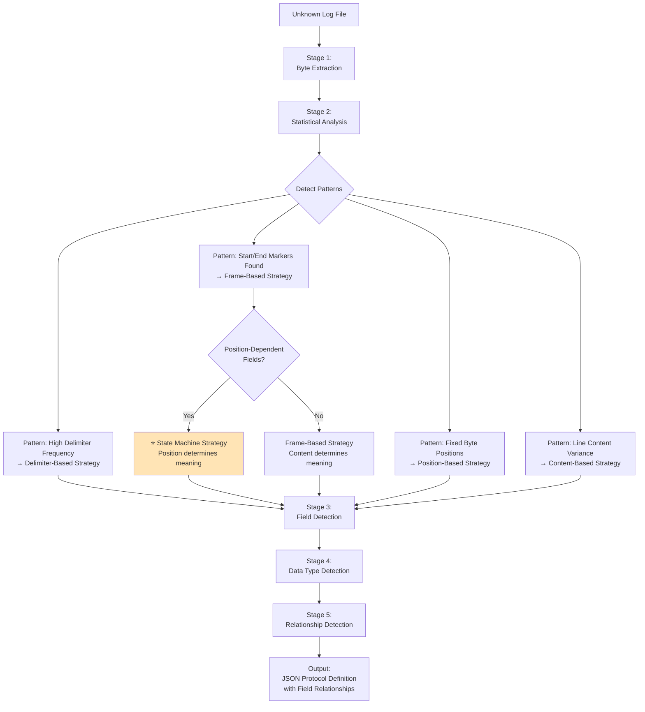
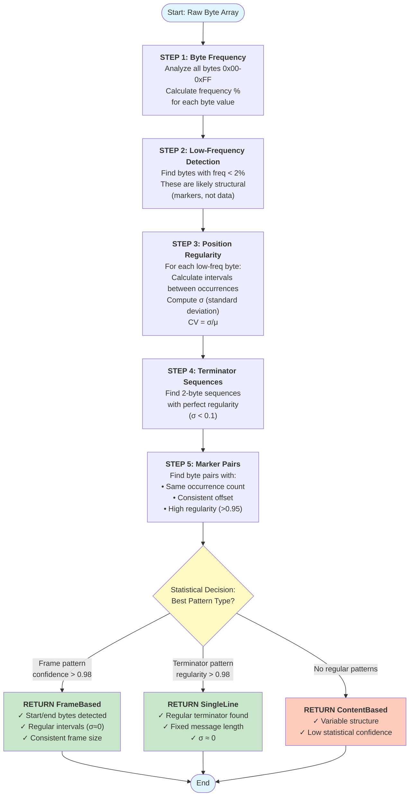
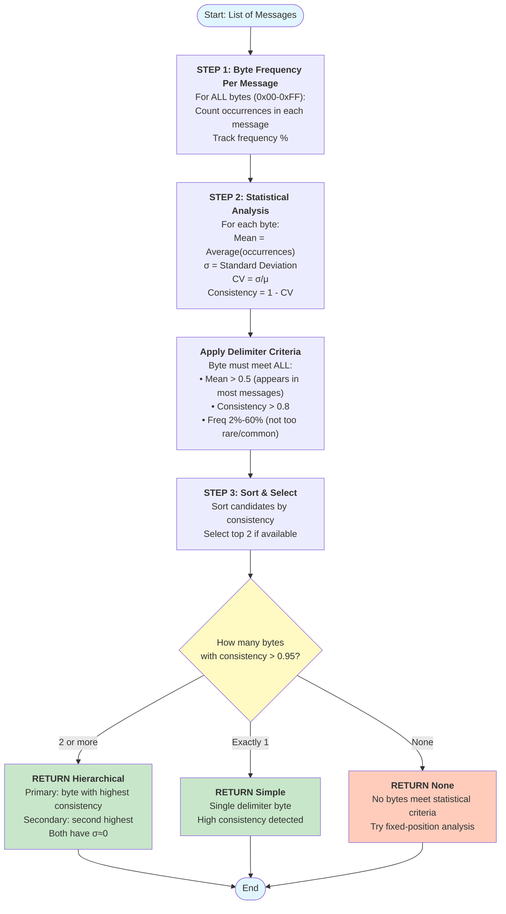
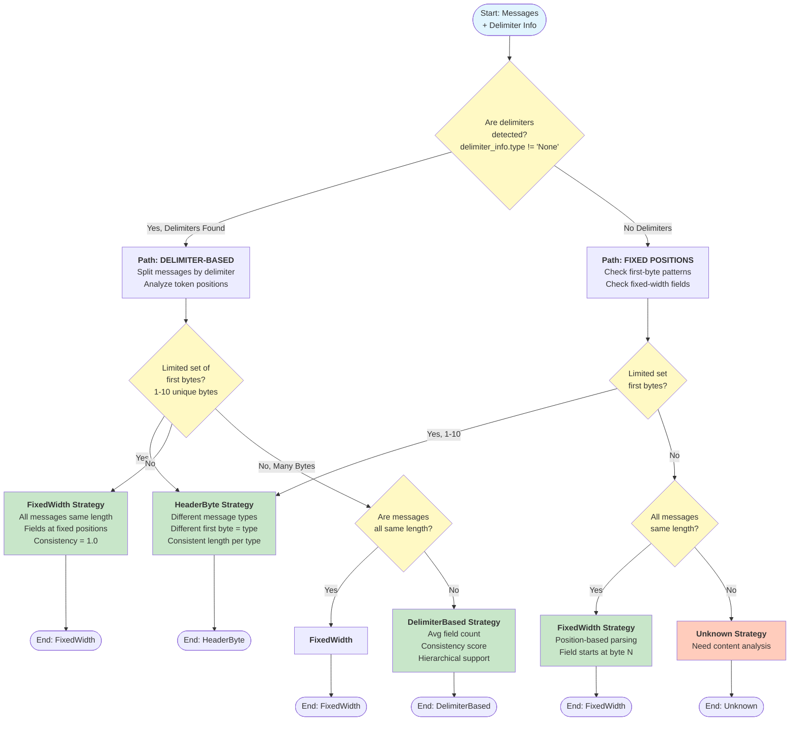
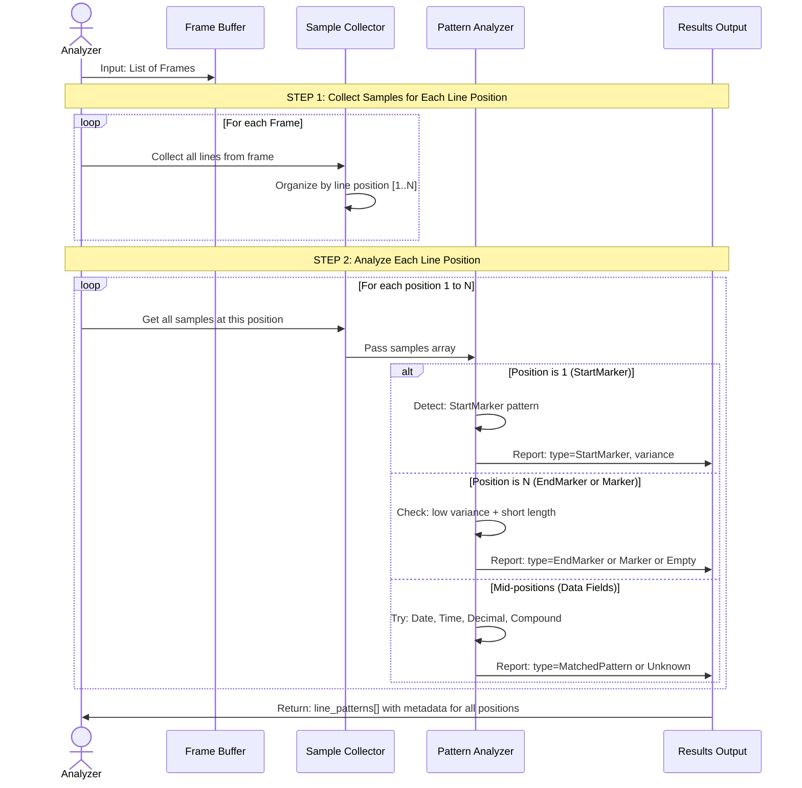
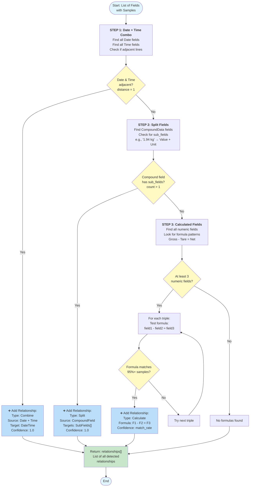
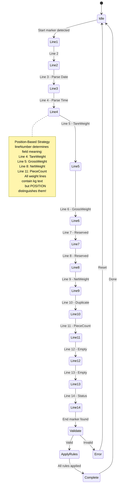
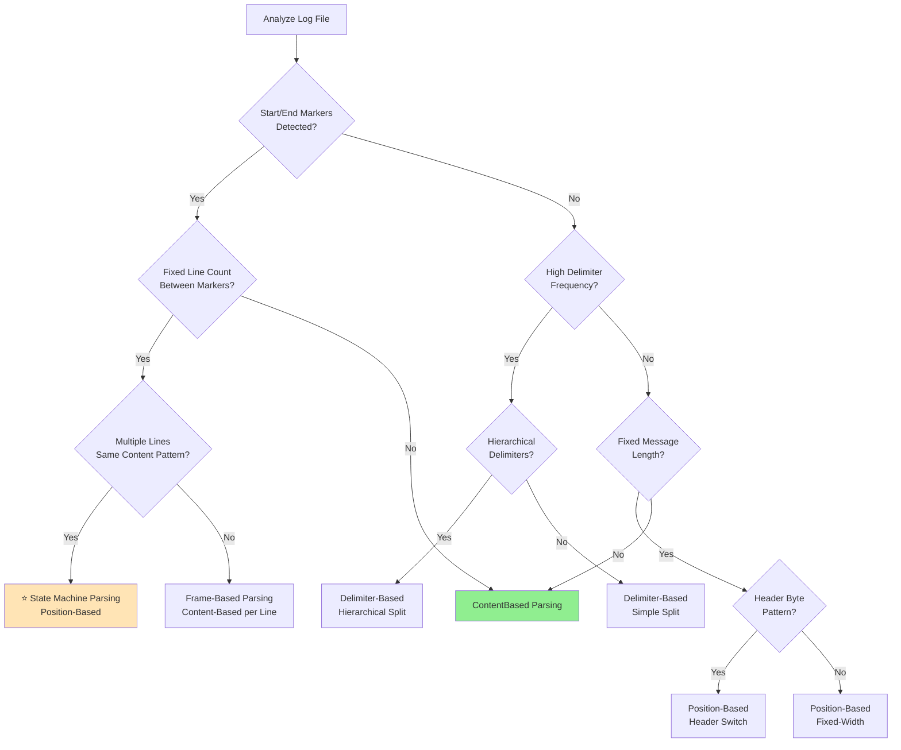

# Parsing Strategy Analysis

**Purpose**: Define algorithms to **automatically detect** parsing strategies from unknown log files using pure pattern analysis.

**Core Principle**: The Protocol Analyzer knows **nothing** about devices beforehand. All strategies must be derived from **pure statistical analysis** of raw byte data (0x00-0xFF). **NO hardcoded assumptions** about characters, terminators, or patterns.

**Related Documents**:
- **00-Requirements-Specification.md** - Requirements
- **02-System-Architecture.md** - System design
- **04-Data-Models-Design.md** - Data models
- **05-JSON-Schema-Design.md** - JSON examples (reference only)

---

## Table of Contents

1. [Overview](#overview)
2. [Input: Raw Log File Analysis](#input-raw-log-file-analysis)
3. [Pattern Detection Algorithms](#pattern-detection-algorithms)
4. [Proposed Parsing Strategy](#proposed-parsing-strategy)
5. [Implementation Considerations](#implementation-considerations)

---

## Overview

### The Challenge

Given an **unknown log file**, automatically:
1. Detect message boundaries
2. Identify field structure
3. Determine parsing strategy
4. Generate JSON protocol definition

**No prior knowledge allowed** - pure algorithm-based detection.

### Strategy Detection Pipeline



### Key Insight

Parsing strategies are detected through **pure statistical analysis**:
- **Byte Frequency Distribution** (0x00-0xFF) - identify delimiters, terminators, markers
- **Position Variance Analysis** (σ, CV) - detect fixed vs variable field locations
- **Interval Regularity** (σ ≈ 0) - find frame boundaries and repeating patterns
- **Low-Frequency Detection** (<2%) - identify structural markers vs data
- **Entropy Analysis** - distinguish fixed fields from variable data
- **No hardcoded assumptions** - all patterns discovered from data

---

## Input: Raw Log File Analysis

### Sample Log Files (Unknown Devices)

We have log files but **don't know** what devices they're from. All logs are in HEX/Text format:

**Log File 1** (Unknown Device A - Weight Scale):
```
HEX: 2D 20 20 31 2E 36 34 30 20 6B 67 20 20 20 20 4E 0D 0A
TEXT: -  1.640 kg    N\r\n

HEX: 2D 20 20 31 2E 36 34 32 20 6B 67 20 20 20 20 4E 0D 0A
TEXT: -  1.642 kg    N\r\n

HEX: 2D 20 20 31 2E 36 33 38 20 6B 67 20 20 20 20 4E 0D 0A
TEXT: -  1.638 kg    N\r\n
```

**Log File 2** (Unknown Device B - Multi-Line Frame Scale):
```
HEX: 5E 4B 4A 49 4B 30 30 30 0D 0A
TEXT: ^KJIK000\r\n

HEX: 32 30 32 33 2D 31 31 2D 30 37 0D 0A
TEXT: 2023-11-07\r\n

HEX: 31 37 3A 31 39 3A 33 38 0D 0A
TEXT: 17:19:38\r\n

HEX: 20 20 30 2E 30 30 20 6B 67 0D 0A
TEXT:   0.00 kg\r\n

HEX: 20 20 31 2E 39 34 20 6B 67 0D 0A
TEXT:   1.94 kg\r\n

HEX: 30 0D 0A
TEXT: 0\r\n

HEX: 30 0D 0A
TEXT: 0\r\n

HEX: 20 20 31 2E 39 34 20 6B 67 0D 0A
TEXT:   1.94 kg\r\n

HEX: 20 20 31 2E 39 34 20 6B 67 0D 0A
TEXT:   1.94 kg\r\n

HEX: 20 20 20 20 30 20 70 63 73 0D 0A
TEXT:     0 pcs\r\n

HEX: 0D 0A
TEXT: \r\n

HEX: 0D 0A
TEXT: \r\n

HEX: 45 0D 0A
TEXT: E\r\n

HEX: 7E 50 31 0D 0A
TEXT: ~P1\r\n
```

**Log File 3** (Unknown Device C - Compound Delimiter):
```
HEX: 2B 30 30 37 2E 31 32 2F 33 20 47 20 53 0D 0A
TEXT: +007.12/3 G S\r\n

HEX: 2B 30 30 38 2E 31 35 2F 32 20 47 20 53 0D 0A
TEXT: +008.15/2 G S\r\n

HEX: 2B 30 30 39 2E 32 30 2F 31 20 47 20 53 0D 0A
TEXT: +009.20/1 G S\r\n
```

**Question**: How do we automatically detect the parsing strategy for each?

**Note**: The HEX format is critical because:
- Binary terminators (0x0D, 0x0A) are visible
- Special markers (0x5E for ^, 0x7E for ~) are clearly shown
- Delimiters (0x20 for space, 0x2F for /) are identifiable
- Non-printable bytes can be detected

---

## Pattern Detection Algorithms

### Algorithm 1: Message Boundary Detection (Statistical)

**Goal**: Determine where one message ends and another begins using **pure byte statistics**

**Input**: Raw byte array (entire file as bytes 0x00-0xFF)

**Algorithm**:

```
FUNCTION DetectMessageBoundaries(byte_data):

    // ═══ STEP 1: Byte Frequency Analysis ═══

    byte_frequency = [256]  // Array for all possible byte values

    FOR each byte in byte_data:
        byte_frequency[byte]++

    total_bytes = byte_data.Length

    // Convert to percentages
    FOR i = 0 TO 255:
        byte_frequency[i] = byte_frequency[i] / total_bytes

    // ═══ STEP 2: Detect Low-Frequency Bytes (Potential Markers) ═══

    // Statistical Principle: Bytes appearing <2% are likely structural, NOT data
    low_frequency_threshold = 0.02  // 2%

    potential_marker_bytes = []

    FOR each byte_value = 0 TO 255:
        IF byte_frequency[byte_value] > 0 AND byte_frequency[byte_value] < low_frequency_threshold:
            // This byte is RARE - might be a marker
            potential_marker_bytes.Add({
                byte_value: byte_value,
                frequency: byte_frequency[byte_value],
                positions: FindAllPositions(byte_data, byte_value)
            })

    // ═══ STEP 3: Analyze Position Regularity (Interval Analysis) ═══

    FOR each marker_candidate in potential_marker_bytes:
        positions = marker_candidate.positions

        IF positions.Count < 2:
            CONTINUE  // Need at least 2 occurrences

        // Calculate intervals between occurrences
        intervals = []
        FOR i = 0 TO positions.Count - 2:
            gap = positions[i+1] - positions[i]
            intervals.Add(gap)

        // Statistical regularity test
        mean_interval = Average(intervals)
        stddev_interval = StandardDeviation(intervals)

        // Coefficient of Variation (CV) = σ/μ
        // Low CV means highly regular pattern
        IF mean_interval > 0:
            cv = stddev_interval / mean_interval
            marker_candidate.regularity = 1.0 - cv  // Higher = more regular
            marker_candidate.interval = mean_interval
        ELSE:
            marker_candidate.regularity = 0

    // ═══ STEP 4: Detect 2-Byte Sequence Terminators ═══

    sequence_patterns = {}

    FOR i = 0 TO byte_data.Length - 2:
        two_byte_seq = [byte_data[i], byte_data[i+1]]

        IF two_byte_seq NOT IN sequence_patterns:
            sequence_patterns[two_byte_seq] = {
                count: 0,
                positions: []
            }

        sequence_patterns[two_byte_seq].count++
        sequence_patterns[two_byte_seq].positions.Add(i)

    // Find sequences with perfect regularity (potential terminators)
    terminator_candidates = []

    FOR each sequence in sequence_patterns:
        IF sequence.count < 5:
            CONTINUE  // Need multiple samples

        positions = sequence.positions
        intervals = CalculateIntervals(positions)

        mean_interval = Average(intervals)
        stddev_interval = StandardDeviation(intervals)

        IF stddev_interval < 0.1:  // Nearly perfect regularity
            terminator_candidates.Add({
                bytes: sequence.bytes,
                count: sequence.count,
                interval: mean_interval,
                regularity: 1.0 - (stddev_interval / mean_interval),
                positions: positions
            })

    // ═══ STEP 5: Detect Start/End Marker Pairs ═══

    // Find low-frequency bytes that appear in pairs with consistent gaps
    frame_patterns = []

    FOR each start_candidate in potential_marker_bytes:
        IF start_candidate.regularity < 0.95:
            CONTINUE  // Not regular enough

        start_interval = start_candidate.interval

        // Look for potential end marker
        FOR each end_candidate in potential_marker_bytes:
            IF end_candidate.byte_value == start_candidate.byte_value:
                CONTINUE  // Must be different bytes

            IF end_candidate.regularity < 0.95:
                CONTINUE  // Not regular enough

            // Check if end marker appears at consistent offset from start
            start_positions = start_candidate.positions
            end_positions = end_candidate.positions

            IF start_positions.Count != end_positions.Count:
                CONTINUE  // Must have same number of occurrences

            // Calculate offsets between start and end
            offsets = []
            FOR i = 0 TO start_positions.Count - 1:
                offset = end_positions[i] - start_positions[i]
                offsets.Add(offset)

            offset_mean = Average(offsets)
            offset_stddev = StandardDeviation(offsets)

            IF offset_stddev < 1.0:  // Very consistent offset
                frame_patterns.Add({
                    start_byte: start_candidate.byte_value,
                    end_byte: end_candidate.byte_value,
                    frame_size: offset_mean,
                    frame_count: start_positions.Count,
                    confidence: 1.0 - (offset_stddev / offset_mean)
                })

    // ═══ STEP 6: Decision Tree (Statistical) ═══

    // Sort by confidence
    best_terminator = terminator_candidates.MaxBy(t => t.regularity)
    best_frame = frame_patterns.MaxBy(f => f.confidence)

    // Decision criteria based on STATISTICS ONLY
    IF best_frame != null AND best_frame.confidence > 0.98:
        // Frame-based protocol detected (high confidence)
        RETURN {
            structure: "FrameBased",
            start_byte: best_frame.start_byte,
            end_byte: best_frame.end_byte,
            frame_size: best_frame.frame_size,
            confidence: best_frame.confidence,
            reasoning: "Start/end bytes with regular intervals (σ≈0)"
        }

    ELSE IF best_terminator != null AND best_terminator.regularity > 0.98:
        // Single-line messages with regular terminator
        RETURN {
            structure: "SingleLine",
            terminator_bytes: best_terminator.bytes,
            message_length: best_terminator.interval,
            confidence: best_terminator.regularity,
            reasoning: "Regular terminator sequence detected"
        }

    ELSE:
        // Variable structure or content-based
        RETURN {
            structure: "ContentBased",
            confidence: 0.7,
            reasoning: "No regular patterns detected"
        }
```

**Example Results** (Statistical Analysis):

| Log File | Detected Structure | Confidence | Statistical Evidence |
|----------|-------------------|-----------|---------------------|
| Log 1 | SingleLine | 1.0 | 0x0D 0x0A at 16-byte intervals, σ=0 |
| Log 2 | FrameBased | 1.0 | 0x5E (freq=1%, regularity=1.0, interval=140), 0x7E at offset 137 |
| Log 3 | SingleLine | 1.0 | 0x0D 0x0A sequence, regularity >0.98 |

**Flowchart: Message Boundary Detection Algorithm (Statistical)**



---

### Algorithm 2: Delimiter Detection (Statistical)

**Goal**: Find what separates fields within a line/message using **byte frequency analysis**

**Input**: List of messages (byte arrays)

**Algorithm**:

```
FUNCTION DetectDelimiters(messages):

    // ═══ STEP 1: Byte Frequency Per Message ═══

    // Instead of hardcoded list, analyze ALL bytes (0x00-0xFF)
    byte_stats = [256]  // For each possible byte value

    FOR i = 0 TO 255:
        byte_stats[i] = {
            byte_value: i,
            total_count: 0,
            occurrences_per_message: [],
            frequency_percent: 0
        }

    // Count occurrences for each byte in each message
    FOR each message in messages:
        byte_counts_in_message = [256]  // Local count for this message

        FOR each byte in message:
            byte_counts_in_message[byte]++

        // Add to global stats
        FOR i = 0 TO 255:
            count = byte_counts_in_message[i]
            byte_stats[i].total_count += count
            byte_stats[i].occurrences_per_message.Add(count)

    total_bytes = Sum(byte_stats, s => s.total_count)

    // Calculate frequency percentages
    FOR i = 0 TO 255:
        byte_stats[i].frequency_percent = byte_stats[i].total_count / total_bytes

    // ═══ STEP 2: Statistical Consistency Analysis ═══

    delimiter_candidates = []

    FOR each byte_stat in byte_stats:
        IF byte_stat.total_count == 0:
            CONTINUE  // Byte never appears

        occurrences = byte_stat.occurrences_per_message

        // Calculate statistical measures
        mean = Average(occurrences)
        stddev = StandardDeviation(occurrences)

        // Consistency score (Coefficient of Variation inverse)
        // High consistency = low variation
        IF mean > 0:
            cv = stddev / mean  // Coefficient of Variation
            consistency = 1.0 - Min(cv, 1.0)  // Invert to get consistency score
        ELSE:
            consistency = 0

        // Delimiter criteria (statistical):
        // 1. Appears in most messages (mean > 0.5)
        // 2. Consistent occurrences (high consistency)
        // 3. Not too rare (frequency > 2%)
        // 4. Not too common (frequency < 60% - likely data, not delimiter)

        IF mean > 0.5 AND
           consistency > 0.8 AND
           byte_stat.frequency_percent > 0.02 AND
           byte_stat.frequency_percent < 0.60:

            delimiter_candidates.Add({
                byte_value: byte_stat.byte_value,
                mean_occurrences: mean,
                consistency: consistency,
                frequency_percent: byte_stat.frequency_percent
            })

    // Sort by consistency (most consistent first)
    delimiter_candidates.Sort(by: consistency, descending)

    // ═══ STEP 3: Detect Hierarchical Delimiters (Statistical) ═══

    // Multiple high-consistency bytes = hierarchical structure
    high_confidence = delimiter_candidates.Where(d => d.consistency > 0.95)

    IF high_confidence.Count >= 2:
        // Potential hierarchical delimiter structure
        // Primary = most consistent, Secondary = second most consistent
        RETURN {
            type: "Hierarchical",
            primary_byte: high_confidence[0].byte_value,
            secondary_byte: high_confidence[1].byte_value,
            primary_mean: high_confidence[0].mean_occurrences,
            secondary_mean: high_confidence[1].mean_occurrences,
            confidence: Min(high_confidence[0].consistency, high_confidence[1].consistency)
        }

    ELSE IF high_confidence.Count == 1:
        // Single delimiter
        RETURN {
            type: "Simple",
            delimiter_byte: high_confidence[0].byte_value,
            mean_occurrences: high_confidence[0].mean_occurrences,
            confidence: high_confidence[0].consistency
        }

    ELSE:
        // No delimiters with high confidence
        RETURN {
            type: "None",
            confidence: 0,
            reasoning: "No bytes meet delimiter criteria"
        }
```

**Example Results** (Statistical Analysis):

| Log File | Primary Delimiter | Secondary | Type | Statistical Evidence |
|----------|------------------|-----------|------|---------------------|
| Log 1 | 0x20 (space) | None | Simple | Mean=8, Consistency=0.95, Freq=40% |
| Log 2 | None detected | None | None | No bytes meet criteria |
| Log 3 | 0x2F ('/') | 0x20 (space) | Hierarchical | 0x2F: mean=1, σ=0; 0x20: mean=2, σ=0 |

**Flowchart: Delimiter Detection Algorithm (Statistical)**



---

### Algorithm 3: Field Position Analysis

**Goal**: Determine if fields are at fixed positions or delimiter-separated

**Input**: List of messages, delimiter info

**Algorithm**:

```
FUNCTION AnalyzeFieldPositions(messages, delimiter_info):

    IF delimiter_info.type == "None":
        // No delimiters - check for fixed positions
        RETURN AnalyzeFixedPositions(messages)
    ELSE:
        // Delimiters found - analyze token positions
        RETURN AnalyzeDelimiterBased(messages, delimiter_info)


FUNCTION AnalyzeFixedPositions(messages):

    // ═══ Check for First-Byte Pattern ═══

    first_bytes = []
    FOR each message in messages:
        first_bytes.Add(message[0])

    unique_first_bytes = first_bytes.Distinct().ToList()

    // If limited set of first bytes, might be header-byte protocol
    IF unique_first_bytes.Count <= 10 AND unique_first_bytes.Count > 1:

        // Analyze each header byte type
        header_patterns = {}

        FOR each first_byte in unique_first_bytes:
            messages_with_byte = messages.Where(m => m[0] == first_byte)

            // Check if messages with same first byte have consistent length
            lengths = messages_with_byte.Select(m => m.Length)
            avg_length = Average(lengths)
            stddev_length = StandardDeviation(lengths)

            header_patterns[first_byte] = {
                count: messages_with_byte.Count,
                avg_length: avg_length,
                length_consistency: 1.0 - (stddev_length / avg_length)
            }

        // If high consistency, this is header-byte based
        avg_consistency = Average(header_patterns.Values.Select(p => p.length_consistency))

        IF avg_consistency > 0.9:
            RETURN {
                strategy: "HeaderByte",
                header_bytes: unique_first_bytes,
                patterns: header_patterns,
                confidence: avg_consistency
            }

    // ═══ Check for Fixed-Width Fields ═══

    // Look for consistent byte positions across messages
    message_length = messages[0].Length
    all_same_length = messages.All(m => m.Length == message_length)

    IF all_same_length:
        // Fixed length messages - analyze positions
        RETURN {
            strategy: "FixedWidth",
            message_length: message_length,
            confidence: 1.0
        }

    RETURN {
        strategy: "Unknown",
        confidence: 0
    }
```

**Decision Tree: Field Position Analysis Algorithm**



```
FUNCTION AnalyzeDelimiterBased(messages, delimiter_info):

    delimiter = delimiter_info.delimiter

    field_counts = []
    fields_by_position = {}

    FOR each message in messages:

        IF delimiter_info.type == "Hierarchical":
            // Split by primary first
            parts1 = message.Split(delimiter_info.primary)

            // Then split each part by secondary
            all_fields = []
            FOR each part in parts1:
                parts2 = part.Split(delimiter_info.secondary)
                all_fields.AddRange(parts2)
        ELSE:
            // Simple split
            all_fields = message.Split(delimiter, RemoveEmptyEntries)

        field_counts.Add(all_fields.Count)

        // Track field values by position
        FOR i = 0 TO all_fields.Count - 1:
            IF i NOT IN fields_by_position:
                fields_by_position[i] = []

            fields_by_position[i].Add(all_fields[i])

    // Check field count consistency
    avg_field_count = Average(field_counts)
    stddev_field_count = StandardDeviation(field_counts)

    field_count_consistency = 1.0 - (stddev_field_count / avg_field_count)

    RETURN {
        strategy: "DelimiterBased",
        delimiter: delimiter,
        hierarchical: delimiter_info.type == "Hierarchical",
        avg_field_count: avg_field_count,
        field_count_consistency: field_count_consistency,
        fields_by_position: fields_by_position,
        confidence: field_count_consistency
    }
```

---

### Algorithm 4: Multi-Line Frame Field Extraction

**Goal**: For frame-based messages, extract fields from each line

**Input**: Framed messages (start marker to end marker)

**Overview**:

This algorithm processes multi-line frame data by collecting samples at each line position and analyzing them for patterns. The key insight is that **each line position is analyzed independently** - all samples from line 1 are grouped together, all samples from line 2 are grouped together, etc. Then each group is analyzed for data type patterns.

**Step 1: Main Extraction Function**

```
FUNCTION ExtractFieldsFromFrame(frames, start_marker, end_marker, lines_per_frame):

    fields_by_line_number = {}

    // Initialize: Create list for each line position
    FOR line_num = 1 TO lines_per_frame:
        fields_by_line_number[line_num] = []

    // ═══ STEP 1: Collect Samples for Each Line Position ═══

    FOR each frame in frames:
        FOR line_num = 1 TO frame.lines.Count:
            line_text = frame.lines[line_num - 1]
            fields_by_line_number[line_num].Add(line_text)

    // ═══ STEP 2: Analyze Each Line Position ═══

    line_patterns = []

    FOR line_num = 1 TO lines_per_frame:
        samples = fields_by_line_number[line_num]

        pattern = AnalyzeLinePattern(line_num, samples)
        line_patterns.Add(pattern)

    RETURN line_patterns
```

**Step 2: Line Pattern Analysis Function**

The `AnalyzeLinePattern` function examines samples from a single line position and determines the field type. It checks for:
1. **Marker lines** (start/end markers)
2. **Empty/whitespace** lines to skip
3. **Data patterns** (dates, times, decimals, etc.)
4. **Variance** to detect constants vs. variables

```
FUNCTION AnalyzeLinePattern(line_number, samples):

    // ═══ Check for Marker Lines ═══

    IF line_number == 1:
        // This should be start marker
        RETURN {
            line_number: line_number,
            field_type: "StartMarker",
            pattern: DetectRegexPattern(samples),
            action: "Validate",
            variance: CalculateVariance(samples)
        }

    // Check if this is end marker line
    unique_samples = samples.Distinct().ToList()

    IF unique_samples.Count == 1 AND unique_samples[0].Length < 5:
        // Likely end marker or fixed label
        RETURN {
            line_number: line_number,
            field_type: "Marker" OR "FixedLabel",
            pattern: unique_samples[0],
            action: "Validate",
            variance: 0
        }

    // ═══ Check for Empty/Whitespace Lines ═══

    IF samples.All(s => string.IsNullOrWhiteSpace(s)):
        RETURN {
            line_number: line_number,
            field_type: "Empty",
            pattern: "^\\s*$",
            action: "Skip",
            variance: 0
        }

    // ═══ Detect Data Patterns ═══

    // Try common patterns
    patterns_to_try = [
        { name: "Date-YYYYMMDD", regex: "^\d{4}-\d{2}-\d{2}$" },
        { name: "Date-DDMMYYYY", regex: "^\d{2}/\d{2}/\d{4}$" },
        { name: "Time-HHMMSS", regex: "^\d{2}:\d{2}:\d{2}$" },
        { name: "Decimal-WithUnit", regex: "^\s*[+-]?\d+\.\d+\s*[a-zA-Z]+\s*$" },
        { name: "Integer-WithUnit", regex: "^\s*\d+\s*[a-zA-Z]+\s*$" },
        { name: "Integer", regex: "^\s*\d+\s*$" },
        { name: "Decimal", regex: "^\s*[+-]?\d+\.\d+\s*$" }
    ]

    FOR each pattern_test in patterns_to_try:
        match_count = samples.Count(s => Regex.IsMatch(s, pattern_test.regex))
        match_rate = match_count / samples.Count

        IF match_rate > 0.9:  // 90%+ match

            // Extract sub-fields if this is compound (value + unit)
            IF pattern_test.name.Contains("WithUnit"):
                sub_fields = ExtractCompoundFields(samples, pattern_test.regex)

                RETURN {
                    line_number: line_number,
                    field_type: "CompoundData",
                    pattern: pattern_test.regex,
                    action: "Parse",
                    variance: CalculateVariance(samples),
                    sub_fields: sub_fields  // e.g., ["Value", "Unit"]
                }

            RETURN {
                line_number: line_number,
                field_type: pattern_test.name,
                pattern: pattern_test.regex,
                action: "Parse",
                variance: CalculateVariance(samples),
                sample_values: samples.Take(5).ToList()
            }

    // ═══ No Pattern Matched ═══

    // Check variance to determine if this is data or constant
    variance = CalculateVariance(samples)

    IF variance < 0.1:
        // Low variance - probably reserved/constant
        RETURN {
            line_number: line_number,
            field_type: "Reserved",
            pattern: ".*",
            action: "Skip",
            variance: variance
        }
    ELSE:
        // High variance - unknown data field
        RETURN {
            line_number: line_number,
            field_type: "UnknownData",
            pattern: ".*",
            action: "Parse",
            variance: variance,
            sample_values: samples.Take(5).ToList()
        }
```

**Step 3: Helper Functions**

The algorithm uses three helper functions to support pattern analysis:

- **CalculateVariance**: Measures how much variation exists in a set of samples (0.0 = all identical, 1.0 = all unique)
- **ExtractCompoundFields**: Splits compound fields like "1.94 kg" into numeric value and unit
- **DetectRegexPattern**: Generates regex patterns from sample data

```
FUNCTION CalculateVariance(samples):
    """
    Calculate how much variation exists in samples
    0.0 = all same
    1.0 = all different
    """
    unique_count = samples.Distinct().Count()
    total_count = samples.Count

    RETURN unique_count / total_count


FUNCTION ExtractCompoundFields(samples, pattern):
    """
    For patterns like "1.94 kg", extract value and unit separately
    """

    // Try to split value from unit
    value_samples = []
    unit_samples = []

    FOR each sample in samples:
        match = Regex.Match(sample, pattern)

        IF match.Success:
            // Extract numeric part
            numeric_match = Regex.Match(sample, "[+-]?\d+\.?\d*")
            IF numeric_match.Success:
                value_samples.Add(numeric_match.Value)

            // Extract unit part
            unit_match = Regex.Match(sample, "[a-zA-Z]+")
            IF unit_match.Success:
                unit_samples.Add(unit_match.Value)

    RETURN [
        {
            name: "Value",
            dataType: "Decimal",
            pattern: "[+-]?\d+\.?\d*",
            samples: value_samples
        },
        {
            name: "Unit",
            dataType: "String",
            pattern: "[a-zA-Z]+",
            samples: unit_samples
        }
    ]
```

**Summary**:

This algorithm outputs a **line_patterns array** where each element describes what type of field is at each line position:
- **StartMarker/EndMarker**: Validation boundaries for the frame
- **Date/Time**: Temporal data that can be combined
- **Decimal/Integer**: Numeric data with optional units
- **Compound**: Fields that need to be split (e.g., value + unit)
- **Empty/Reserved**: Lines to skip or ignore
- **Unknown**: Data that doesn't match known patterns

The detector can then use these patterns to extract and validate data from subsequent frames.

**Sequence Diagram: Multi-Line Frame Field Extraction Algorithm**



---

### Algorithm 5: Field Relationship Detection

**Goal**: Detect if fields are related (combined, calculated, split)

**Input**: Detected fields with sample values

**Algorithm**:

```
FUNCTION DetectFieldRelationships(fields):

    relationships = []

    // ═══ 1. Detect Date + Time Combination ═══

    date_fields = fields.Where(f => f.field_type.Contains("Date"))
    time_fields = fields.Where(f => f.field_type.Contains("Time"))

    FOR each date_field in date_fields:
        FOR each time_field in time_fields:

            // Check if they are adjacent line numbers
            IF Abs(date_field.line_number - time_field.line_number) == 1:

                relationships.Add({
                    type: "Combine",
                    source_fields: [date_field.name, time_field.name],
                    target_field: "DateTime",
                    operation: "Date.Date + Time",
                    confidence: 1.0,
                    reason: "Adjacent date and time fields detected"
                })

    // ═══ 2. Detect Split Fields (Compound → Multiple) ═══

    compound_fields = fields.Where(f => f.field_type == "CompoundData")

    FOR each compound_field in compound_fields:
        IF compound_field.sub_fields.Count > 1:

            relationships.Add({
                type: "Split",
                source_field: $"Line{compound_field.line_number}",
                target_fields: compound_field.sub_fields.Select(sf => sf.name).ToList(),
                operations: compound_field.sub_fields.Select(sf => sf.pattern).ToList(),
                confidence: 1.0,
                reason: "Compound field with extractable sub-components"
            })

    // ═══ 3. Detect Calculated Fields (Formula) ═══

    numeric_fields = fields.Where(f => f.dataType == "Decimal" OR f.dataType == "Integer")

    // Try common formulas
    IF numeric_fields.Count >= 3:

        // Check for Weight formulas: GW - TW = NW pattern
        // Need at least 3 weight fields

        FOR i = 0 TO numeric_fields.Count - 3:
            field1 = numeric_fields[i]
            field2 = numeric_fields[i + 1]
            field3 = numeric_fields[i + 2]

            // Get sample values
            samples_match_count = 0
            total_samples = Min(field1.samples.Count, field2.samples.Count, field3.samples.Count)

            FOR j = 0 TO total_samples - 1:
                val1 = ParseDecimal(field1.samples[j])
                val2 = ParseDecimal(field2.samples[j])
                val3 = ParseDecimal(field3.samples[j])

                // Test formula: val1 - val2 ≈ val3
                IF Abs((val1 - val2) - val3) < 0.01:
                    samples_match_count++

            match_rate = samples_match_count / total_samples

            IF match_rate > 0.95:  // 95%+ samples match formula

                relationships.Add({
                    type: "Calculate",
                    source_fields: [field1.name, field2.name],
                    target_field: field3.name + "_Calculated",
                    operation: $"{field1.name} - {field2.name}",
                    confidence: match_rate,
                    reason: $"Formula holds for {match_rate*100}% of samples"
                })

    RETURN relationships
```

**Flowchart: Field Relationship Detection Algorithm**



---

## Parsing Strategy Categories

After pattern detection, the analyzer must select the appropriate parsing strategy. There are **5 distinct strategy types**, each suited to different protocol structures.

### Strategy 1: Delimiter-Based Parsing

**When to Use**: High delimiter frequency detected, consistent field count

**Characteristics**:
- Fields separated by delimiters (space, comma, tab, etc.)
- Single-line or simple multi-line messages
- String split operations

**Example** (CordDEFENDER3000):
```
HEX: 2D 20 20 31 2E 36 34 30 20 6B 67 20 20 20 20 4E
TEXT: -  1.640 kg    N
```

**Detection**:
- Space delimiter appears consistently
- Field count = 3 across all messages
- Confidence: 95%+

**Parsing Algorithm**:
```
line.Split(' ', RemoveEmptyEntries)
→ ["-", "1.640", "kg", "N"]
```

---

### Strategy 2: Frame-Based Parsing

**When to Use**: Start/end markers detected with fixed line count

**Characteristics**:
- Start marker begins message
- End marker terminates message
- Fixed number of lines per message
- Line position determines meaning

**Example** (JIK6CAB - Frame structure):
```
Line 1:  ^KJIK000     ← Start marker
Line 2:  2023-11-07   ← Date
Line 3:  17:19:38     ← Time
...
Line 14: ~P1          ← End marker
```

**Detection**:
- Start marker pattern: `^\^KJIK\d{3}$`
- End marker pattern: `^~P1$`
- Line count between markers: 14 (consistent)
- Confidence: 100%

**Parsing Algorithm**:
```
WHEN line matches start_marker:
    Reset frame buffer
    Start accumulating lines

WHEN frame.lineCount < expected_lines:
    Add line to frame buffer

WHEN line matches end_marker:
    Process complete frame
    Parse each line by position
```

---

### Strategy 3: State Machine Parsing ⭐ CRITICAL

**When to Use**: Frame-based protocol where **line position** determines field identity, NOT content

**Why ContentBased Fails**: When multiple lines have identical or similar content patterns but represent different fields

**Critical Example** (JIK6CAB Weight Lines):

```
Line 4:  "  0.00 kg"   ← Tare Weight
Line 5:  "  1.94 kg"   ← Gross Weight
Line 8:  "  1.94 kg"   ← Net Weight
```

**Problem**: All three lines contain "kg" - ContentBased parsing **cannot distinguish** between them.

**Solution**: State Machine tracks position in sequence:



**State Tracking Variables**:
```csharp
private int lineNumber = 0;
private bool parsingInProgress = false;
private DateTime? date;
private TimeSpan? time;
private decimal? tareWeight, grossWeight, netWeight;
private decimal? pieceCount;
```

**Parsing Algorithm**:
```
FUNCTION ParseLine(line):
    IF line matches START_MARKER:
        lineNumber = 0
        parsingInProgress = true
        Reset all field variables

    IF parsingInProgress:
        lineNumber++

        SWITCH lineNumber:
            CASE 1: Validate start marker
            CASE 2: date = ParseDate(line)
            CASE 3: time = ParseTime(line)
                    date = date.Date + time  // Combine relationship
            CASE 4: tareWeight = ParseWeight(line, "kg")
            CASE 5: grossWeight = ParseWeight(line, "kg")
            CASE 6, 7: Skip  // Reserved fields
            CASE 8: netWeight = ParseWeight(line, "kg")
            CASE 9: Skip  // Duplicate display
            CASE 10: pieceCount = ParsePieceCount(line, "pcs")
            CASE 11, 12: Skip  // Empty lines
            CASE 13: Skip  // Status indicator
            CASE 14:
                IF line matches END_MARKER:
                    ApplyValidation()  // GW - TW = NW
                    FireEvent()
                    parsingInProgress = false
                    lineNumber = 0
                ELSE:
                    Error: Invalid end marker
```

**Key Difference from ContentBased**:

| Approach | How it determines field | Works for JIK6CAB? |
|----------|------------------------|-------------------|
| **ContentBased** | `if (line.Contains("kg"))` | ❌ **NO** - Can't distinguish TW/GW/NW |
| **State Machine** | `switch (lineNumber)` | ✅ **YES** - Position determines meaning |

**Detection Algorithm**:
```
IF start_marker AND end_marker AND fixed_line_count detected:

    // Check if line position matters more than content
    FOR each line position in frame:
        samples = GetAllSamplesAtPosition(position)

        // Check for position-dependent fields
        IF samples have similar content BUT different semantic meaning:
            // Example: Lines 4, 5, 8 all contain "kg"
            strategy = STATE_MACHINE
            BREAK

    // Alternative: Check if skip lines exist
    IF some line positions are always empty/reserved:
        strategy = STATE_MACHINE
```

**When to Use State Machine vs ContentBased**:

Use **State Machine** when:
- ✅ Fixed line count per message
- ✅ Line position determines field identity
- ✅ Multiple lines have identical content patterns
- ✅ Some lines must be skipped
- ✅ Field relationships span multiple lines (Date + Time)

Use **ContentBased** when:
- ✅ Variable line count per message
- ✅ Line content uniquely identifies field type
- ✅ No positional dependencies
- ✅ Pattern matching can distinguish all fields

---

### Strategy 4: Position-Based Parsing (Fixed-Width)

**When to Use**: Fixed byte positions detected, no delimiters

**Characteristics**:
- Fields at fixed byte offsets
- May have header byte indicating message type
- Binary or text data

**Example** (TFO1 with header byte):
```
HEX: 46 20 20 20 20 20 20 30 2E 30
TEXT: F      0.0

Byte 0: 'F' (header - identifies field type)
Bytes 1-9: "      0.0" (value at fixed position)
```

**Detection**:
- Consistent message length OR
- First byte has limited set of values (header byte)
- Low delimiter frequency

**Parsing Algorithm**:
```
header = content[0]
SWITCH header:
    CASE 'F': value = ParseFixed(content, offset=1, length=9)
    CASE 'H': value = ParseFixed(content, offset=1, length=9)
    ...
```

---

### Strategy 5: Content-Based Parsing

**When to Use**: Variable structure, pattern variance across lines

**Characteristics**:
- Line content determines field type
- Variable message length
- Pattern matching with if/else logic

**Example** (PHMeter):
```
Line 1: "3.01pH 25.5°C ATC"  ← Contains "pH" and "°C"
Line 2: "20-Feb-2023"        ← Contains "-" (date pattern)
Line 3: "11:11"              ← Contains ":" (time pattern)
```

**Detection**:
- No fixed start/end markers
- Variable line count
- High pattern variance
- Content uniquely identifies field

**Parsing Algorithm**:
```
IF line.Contains("pH") AND line.Contains("°C"):
    ParseBothFields(line)
ELSE IF line.Contains("-"):
    ParseDate(line)
ELSE IF line.Contains(":"):
    ParseTime(line)
```

**Important**: ContentBased works ONLY when content patterns are unique per field type.

---

### Strategy Selection Decision Tree



---

## Proposed Parsing Strategy

### 5-Stage Universal Pipeline

```
Stage 1: Byte Extraction
│
├─ Input: Raw log file
├─ Output: List<LogEntry> with bytes and text
└─ Algorithm: Parse HEX/Text columns, extract bytes
    ↓
Stage 2: Message Boundary Detection
│
├─ Input: List<LogEntry>
├─ Output: List<Message> (grouped entries)
└─ Algorithm: Marker detection, terminator analysis
    ↓
Stage 3: Field Structure Analysis
│
├─ Input: List<Message>
├─ Output: List<FieldInfo> with positions/patterns
└─ Algorithm: Delimiter detection, position analysis, frame line analysis
    ↓
Stage 4: Field Classification
│
├─ Input: List<FieldInfo>
├─ Output: Enhanced FieldInfo with data types
└─ Algorithm: Pattern matching, data type inference, variance analysis
    ↓
Stage 5: Relationship Detection
│
├─ Input: List<FieldInfo>
├─ Output: List<FieldRelationship>
└─ Algorithm: Date+Time detection, formula verification, split detection
    ↓
Final Output: JSON Protocol Definition with Field Relationships
```

---

## Implementation Considerations

### 1. Confidence Scoring

Every detection should return a confidence score (0-1):

```csharp
public class DetectionResult
{
    public string DetectedPattern { get; set; }
    public double Confidence { get; set; }  // 0.0 - 1.0
    public string Reason { get; set; }
}
```

**Confidence Thresholds**:
- **>= 0.95**: High confidence - auto-apply
- **0.80 - 0.94**: Medium confidence - apply with user confirmation
- **< 0.80**: Low confidence - show to user for manual decision

### 2. Multi-Strategy Support

Some protocols may use multiple strategies:

```csharp
public class ProtocolStrategy
{
    public List<Strategy> Strategies { get; set; }
}

public class Strategy
{
    public StrategyType Type { get; set; }  // Delimiter, Frame, Position, Hybrid
    public double Confidence { get; set; }
    public Dictionary<string, object> Parameters { get; set; }
}
```

### 3. User Feedback Loop

If confidence is low, ask user:

```
┌─ Pattern Detection Results ─────────────────────────┐
│                                                       │
│ Detected: Frame-Based Protocol                      │
│ Confidence: 87%                                      │
│                                                       │
│ Start Marker: "^KJIK000" (found at lines 1, 15, 29) │
│ End Marker: "~P1" (found at lines 14, 28, 42)       │
│ Lines per frame: 14                                  │
│                                                       │
│ Does this look correct?                              │
│ [ Yes, apply ] [ No, manual edit ] [ Show samples ] │
└───────────────────────────────────────────────────────┘
```

### 4. Sample Size Requirements

Minimum samples needed for confidence:

| Analysis Type | Min Samples | Recommended |
|--------------|-------------|-------------|
| Message boundary | 5 messages | 20+ messages |
| Delimiter detection | 10 messages | 50+ messages |
| Field pattern | 20 samples | 100+ samples |
| Formula validation | 10 samples | 50+ samples |

### 5. Error Handling

```csharp
public class AnalysisResult
{
    public bool Success { get; set; }
    public List<DetectionResult> Detections { get; set; }
    public List<AnalysisWarning> Warnings { get; set; }
    public List<AnalysisError> Errors { get; set; }
}

public class AnalysisWarning
{
    public string Message { get; set; }
    public double AffectedConfidence { get; set; }
}
```

---

## Summary

### Universal Detection Principles

1. **No Device Knowledge Required**: All strategies derived from statistical analysis
2. **Pattern-First Approach**: Detect patterns, then infer structure
3. **Confidence Scoring**: Every decision has measurable confidence
4. **User Validation**: Low confidence requires user confirmation
5. **Algorithm-Based**: Pure data structure and pattern matching

### Success Criteria

- ✅ **95%+ accuracy** on known log files (validation)
- ✅ **Works on unknown devices** without prior knowledge
- ✅ **Generates valid JSON** definitions automatically
- ✅ **Confidence scores** for all detections
- ✅ **User feedback** when confidence is low

---

**Document Version**: 6.0
**Last Updated**: 2025-10-26
**Status**: **Pure Statistical Analysis** - NO Hardcoded Assumptions
**Changes**:
- v1.0-2.1: Production code based (WRONG APPROACH)
- v3.0: Production code integrated (STILL WRONG)
- v4.0: **COMPLETE REDESIGN** - Universal algorithm approach, no device assumptions
- v5.0: **CRITICAL UPDATE** - Added explicit State Machine Parser strategy section with:
  - Clear explanation of why ContentBased fails for position-dependent protocols
  - State diagram for JIK6CAB protocol
  - 5 distinct parsing strategy categories
  - Strategy selection decision tree
  - HEX/Text format examples
- v5.1: **REMOVED** Stage 6 (Validation Generation) - ValidationRules feature cancelled, updated pipeline to 5 stages
- v6.0: **MAJOR STATISTICAL OVERHAUL** - Removed ALL hardcoded assumptions:
  - ❌ Removed hardcoded character list `['^', '~', '<', '>', '@', '#', '$']`
  - ❌ Removed hardcoded delimiter list (space, tab, comma, etc.)
  - ✅ Added byte frequency analysis for ALL bytes (0x00-0xFF)
  - ✅ Added position variance analysis (σ, CV = σ/μ)
  - ✅ Added interval regularity detection (σ ≈ 0 = structural element)
  - ✅ Added low-frequency detection (<2% = marker, not data)
  - ✅ Full binary protocol support (bytes >0x7F)
  - ✅ Algorithm 1: Statistical message boundary detection
  - ✅ Algorithm 2: Statistical delimiter detection
  - ✅ Updated all flowcharts to reflect statistical approach
  - ✅ All pattern discovery is now data-driven, NO assumptions
