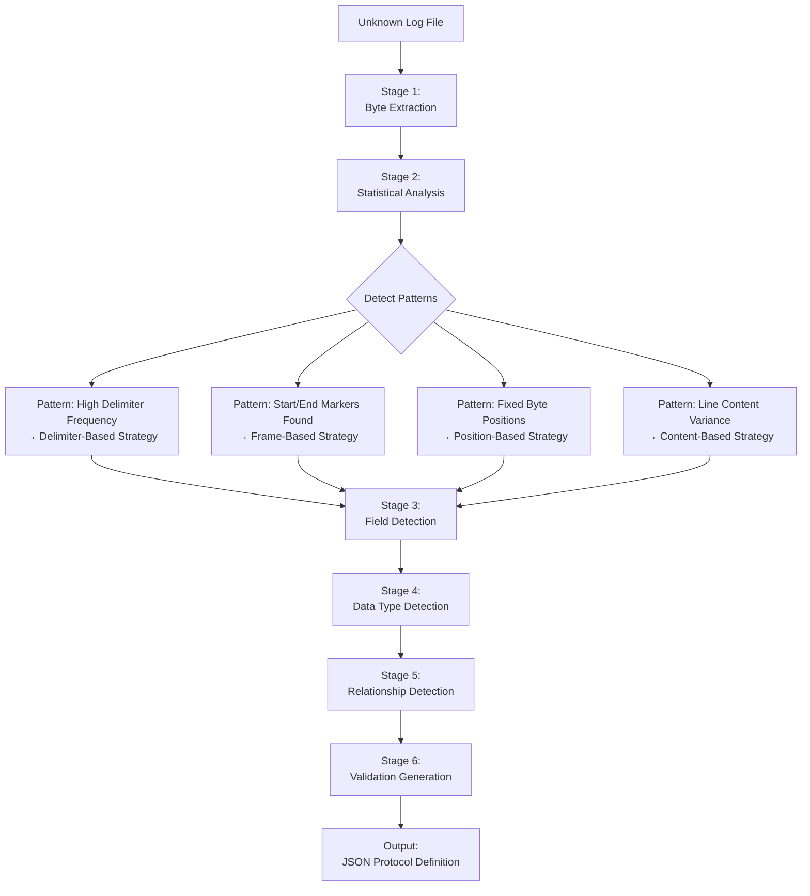

# Parsing Strategy Analysis

**Purpose**: Define algorithms to **automatically detect** parsing strategies from unknown log files using pure pattern analysis.

**Core Principle**: The Protocol Analyzer knows **nothing** about devices beforehand. All strategies must be derived from **statistical analysis** and **pattern detection** of raw log data.

**Related Documents**:
- **00-Requirements-Specification.md** - Requirements
- **02-System-Architecture.md** - System design
- **04-Data-Models-Design.md** - Data models
- **05-JSON-Schema-Design.md** - JSON examples (reference only)

---

## Table of Contents

1. [Overview](#overview)
2. [Input: Raw Log File Analysis](#input-raw-log-file-analysis)
3. [Pattern Detection Algorithms](#pattern-detection-algorithms)
4. [Proposed Parsing Strategy](#proposed-parsing-strategy)
5. [Implementation Considerations](#implementation-considerations)

---

## Overview

### The Challenge

Given an **unknown log file**, automatically:
1. Detect message boundaries
2. Identify field structure
3. Determine parsing strategy
4. Generate JSON protocol definition

**No prior knowledge allowed** - pure algorithm-based detection.

### Strategy Detection Pipeline



### Key Insight

Parsing strategies are detected through:
- **Frequency analysis** (delimiters, terminators, markers)
- **Position analysis** (fixed vs variable field locations)
- **Pattern analysis** (regex matching, content variance)
- **Structure analysis** (single-line vs multi-line messages)

---

## Input: Raw Log File Analysis

### Sample Log Files (Unknown Devices)

We have log files but **don't know** what devices they're from:

**Log File 1** (Unknown Device A):
```
-  1.640 kg    N
-  1.642 kg    N
-  1.638 kg    N
```

**Log File 2** (Unknown Device B):
```
^KJIK000
2023-11-07
17:19:38
  0.00 kg
  1.94 kg
0
0
  1.94 kg
  1.94 kg
    0 pcs


E
~P1
```

**Log File 3** (Unknown Device C):
```
+007.12/3 G S
+008.15/2 G S
+009.20/1 G S
```

**Question**: How do we automatically detect the parsing strategy for each?

---

## Pattern Detection Algorithms

### Algorithm 1: Message Boundary Detection

**Goal**: Determine where one message ends and another begins

**Input**: List of file lines (strings)

**Algorithm**:

```
FUNCTION DetectMessageBoundaries(lines):

    // ═══ STEP 1: Analyze Terminators ═══
    terminator_patterns = []

    FOR each line in lines:
        last_bytes = GetLastBytes(line, 4)  // Check last 4 bytes
        terminator_patterns.Add(last_bytes)

    // Find most common terminator
    common_terminator = MostFrequent(terminator_patterns)
    terminator_frequency = Count(common_terminator) / lines.Count

    // ═══ STEP 2: Detect Start/End Markers ═══

    potential_markers = []

    FOR each line in lines:
        first_char = line[0]

        // Check for special characters at start (^, ~, <, >, etc.)
        IF first_char IN ['^', '~', '<', '>', '@', '#', '$']:
            pattern = ExtractPattern(line)  // e.g., "^KJIK\d{3}"

            IF pattern NOT IN potential_markers:
                potential_markers[pattern] = {
                    count: 0,
                    positions: [],
                    line_samples: []
                }

            potential_markers[pattern].count++
            potential_markers[pattern].positions.Add(line_number)
            potential_markers[pattern].line_samples.Add(line)

    // ═══ STEP 3: Analyze Marker Positions ═══

    FOR each marker in potential_markers:
        positions = marker.positions
        gaps = CalculateGaps(positions)  // Distance between occurrences

        // Check if gaps are consistent
        gap_stddev = StandardDeviation(gaps)
        gap_average = Average(gaps)

        marker.confidence = 1.0 - gap_stddev / gap_average
        marker.expected_lines = gap_average

        // Check for corresponding end marker
        IF marker.pattern starts with '^' or '<':
            // This might be a start marker
            // Look for end marker at position + gap_average - 1

            FOR each position in marker.positions:
                expected_end_line = position + gap_average - 1

                IF expected_end_line < lines.Count:
                    potential_end = lines[expected_end_line]

                    // Check if this line has marker characteristics
                    IF potential_end.StartsWith('~') OR
                       potential_end.Length < 5:
                        marker.end_marker = potential_end
                        marker.is_frame = true

    // ═══ STEP 4: Decision Tree ═══

    best_marker = potential_markers.MaxBy(m => m.confidence)

    IF best_marker.confidence > 0.9 AND best_marker.expected_lines > 1:
        // Multi-line frame with markers detected
        RETURN {
            structure: "FrameBased",
            start_marker: best_marker.pattern,
            end_marker: best_marker.end_marker,
            lines_per_message: best_marker.expected_lines,
            confidence: best_marker.confidence
        }

    ELSE IF terminator_frequency > 0.95:
        // Single line per message
        RETURN {
            structure: "SingleLine",
            terminator: common_terminator,
            confidence: terminator_frequency
        }

    ELSE:
        // Content-based or variable structure
        RETURN {
            structure: "ContentBased",
            confidence: 0.7
        }
```

**Example Results**:

| Log File | Detected Structure | Confidence | Reasoning |
|----------|-------------------|-----------|-----------|
| Log 1 | SingleLine | 1.0 | Every line ends with CRLF, no markers |
| Log 2 | FrameBased | 1.0 | "^KJIK000" at line 1, 15, 29... Gap=14, End="~P1" |
| Log 3 | SingleLine | 1.0 | Every line ends with CRLF, no markers |

---

### Algorithm 2: Delimiter Detection

**Goal**: Find what separates fields within a line/message

**Input**: List of message lines

**Algorithm**:

```
FUNCTION DetectDelimiters(messages):

    delimiter_candidates = {
        ' ': 0,     // Space
        '\t': 0,    // Tab
        ',': 0,     // Comma
        ';': 0,     // Semicolon
        ':': 0,     // Colon
        '/': 0,     // Slash
        '|': 0      // Pipe
    }

    // ═══ STEP 1: Count Occurrences ═══

    FOR each message in messages:
        FOR each candidate_char in delimiter_candidates:
            count = CountOccurrences(message, candidate_char)
            delimiter_candidates[candidate_char] += count

    // ═══ STEP 2: Calculate Consistency ═══

    FOR each delimiter in delimiter_candidates:
        occurrences_per_message = []

        FOR each message in messages:
            count = CountOccurrences(message, delimiter)
            occurrences_per_message.Add(count)

        // Check consistency (should be same count per message)
        avg = Average(occurrences_per_message)
        stddev = StandardDeviation(occurrences_per_message)

        IF avg > 0:
            delimiter.consistency = 1.0 - (stddev / avg)
            delimiter.frequency = avg
        ELSE:
            delimiter.consistency = 0
            delimiter.frequency = 0

    // ═══ STEP 3: Detect Hierarchical Delimiters ═══

    // Check if multiple delimiters exist with high consistency
    high_consistency_delimiters = delimiter_candidates
        .Where(d => d.consistency > 0.8 AND d.frequency > 0)
        .OrderByDescending(d => d.frequency)

    IF high_consistency_delimiters.Count > 1:
        // Potential hierarchical delimiter structure
        RETURN {
            type: "Hierarchical",
            primary: high_consistency_delimiters[0],
            secondary: high_consistency_delimiters[1],
            confidence: Min(high_consistency_delimiters[0].consistency,
                           high_consistency_delimiters[1].consistency)
        }

    ELSE IF high_consistency_delimiters.Count == 1:
        RETURN {
            type: "Simple",
            delimiter: high_consistency_delimiters[0],
            confidence: high_consistency_delimiters[0].consistency
        }

    ELSE:
        RETURN {
            type: "None",
            confidence: 0
        }
```

**Example Results**:

| Log File | Primary Delimiter | Secondary | Type | Confidence |
|----------|------------------|-----------|------|-----------|
| Log 1 | Space (multiple) | None | Simple | 0.95 |
| Log 2 | None detected | None | None | 0 |
| Log 3 | "/" (1 per line) | Space (2 per line) | Hierarchical | 1.0 |

---

### Algorithm 3: Field Position Analysis

**Goal**: Determine if fields are at fixed positions or delimiter-separated

**Input**: List of messages, delimiter info

**Algorithm**:

```
FUNCTION AnalyzeFieldPositions(messages, delimiter_info):

    IF delimiter_info.type == "None":
        // No delimiters - check for fixed positions
        RETURN AnalyzeFixedPositions(messages)
    ELSE:
        // Delimiters found - analyze token positions
        RETURN AnalyzeDelimiterBased(messages, delimiter_info)


FUNCTION AnalyzeFixedPositions(messages):

    // ═══ Check for First-Byte Pattern ═══

    first_bytes = []
    FOR each message in messages:
        first_bytes.Add(message[0])

    unique_first_bytes = first_bytes.Distinct().ToList()

    // If limited set of first bytes, might be header-byte protocol
    IF unique_first_bytes.Count <= 10 AND unique_first_bytes.Count > 1:

        // Analyze each header byte type
        header_patterns = {}

        FOR each first_byte in unique_first_bytes:
            messages_with_byte = messages.Where(m => m[0] == first_byte)

            // Check if messages with same first byte have consistent length
            lengths = messages_with_byte.Select(m => m.Length)
            avg_length = Average(lengths)
            stddev_length = StandardDeviation(lengths)

            header_patterns[first_byte] = {
                count: messages_with_byte.Count,
                avg_length: avg_length,
                length_consistency: 1.0 - (stddev_length / avg_length)
            }

        // If high consistency, this is header-byte based
        avg_consistency = Average(header_patterns.Values.Select(p => p.length_consistency))

        IF avg_consistency > 0.9:
            RETURN {
                strategy: "HeaderByte",
                header_bytes: unique_first_bytes,
                patterns: header_patterns,
                confidence: avg_consistency
            }

    // ═══ Check for Fixed-Width Fields ═══

    // Look for consistent byte positions across messages
    message_length = messages[0].Length
    all_same_length = messages.All(m => m.Length == message_length)

    IF all_same_length:
        // Fixed length messages - analyze positions
        RETURN {
            strategy: "FixedWidth",
            message_length: message_length,
            confidence: 1.0
        }

    RETURN {
        strategy: "Unknown",
        confidence: 0
    }


FUNCTION AnalyzeDelimiterBased(messages, delimiter_info):

    delimiter = delimiter_info.delimiter

    field_counts = []
    fields_by_position = {}

    FOR each message in messages:

        IF delimiter_info.type == "Hierarchical":
            // Split by primary first
            parts1 = message.Split(delimiter_info.primary)

            // Then split each part by secondary
            all_fields = []
            FOR each part in parts1:
                parts2 = part.Split(delimiter_info.secondary)
                all_fields.AddRange(parts2)
        ELSE:
            // Simple split
            all_fields = message.Split(delimiter, RemoveEmptyEntries)

        field_counts.Add(all_fields.Count)

        // Track field values by position
        FOR i = 0 TO all_fields.Count - 1:
            IF i NOT IN fields_by_position:
                fields_by_position[i] = []

            fields_by_position[i].Add(all_fields[i])

    // Check field count consistency
    avg_field_count = Average(field_counts)
    stddev_field_count = StandardDeviation(field_counts)

    field_count_consistency = 1.0 - (stddev_field_count / avg_field_count)

    RETURN {
        strategy: "DelimiterBased",
        delimiter: delimiter,
        hierarchical: delimiter_info.type == "Hierarchical",
        avg_field_count: avg_field_count,
        field_count_consistency: field_count_consistency,
        fields_by_position: fields_by_position,
        confidence: field_count_consistency
    }
```

---

### Algorithm 4: Multi-Line Frame Field Extraction

**Goal**: For frame-based messages, extract fields from each line

**Input**: Framed messages (start marker to end marker)

**Algorithm**:

```
FUNCTION ExtractFieldsFromFrame(frames, start_marker, end_marker, lines_per_frame):

    fields_by_line_number = {}

    // Initialize: Create list for each line position
    FOR line_num = 1 TO lines_per_frame:
        fields_by_line_number[line_num] = []

    // ═══ STEP 1: Collect Samples for Each Line Position ═══

    FOR each frame in frames:
        FOR line_num = 1 TO frame.lines.Count:
            line_text = frame.lines[line_num - 1]
            fields_by_line_number[line_num].Add(line_text)

    // ═══ STEP 2: Analyze Each Line Position ═══

    line_patterns = []

    FOR line_num = 1 TO lines_per_frame:
        samples = fields_by_line_number[line_num]

        pattern = AnalyzeLinePattern(line_num, samples)
        line_patterns.Add(pattern)

    RETURN line_patterns


FUNCTION AnalyzeLinePattern(line_number, samples):

    // ═══ Check for Marker Lines ═══

    IF line_number == 1:
        // This should be start marker
        RETURN {
            line_number: line_number,
            field_type: "StartMarker",
            pattern: DetectRegexPattern(samples),
            action: "Validate",
            variance: CalculateVariance(samples)
        }

    // Check if this is end marker line
    unique_samples = samples.Distinct().ToList()

    IF unique_samples.Count == 1 AND unique_samples[0].Length < 5:
        // Likely end marker or fixed label
        RETURN {
            line_number: line_number,
            field_type: "Marker" OR "FixedLabel",
            pattern: unique_samples[0],
            action: "Validate",
            variance: 0
        }

    // ═══ Check for Empty/Whitespace Lines ═══

    IF samples.All(s => string.IsNullOrWhiteSpace(s)):
        RETURN {
            line_number: line_number,
            field_type: "Empty",
            pattern: "^\\s*$",
            action: "Skip",
            variance: 0
        }

    // ═══ Detect Data Patterns ═══

    // Try common patterns
    patterns_to_try = [
        { name: "Date-YYYYMMDD", regex: "^\d{4}-\d{2}-\d{2}$" },
        { name: "Date-DDMMYYYY", regex: "^\d{2}/\d{2}/\d{4}$" },
        { name: "Time-HHMMSS", regex: "^\d{2}:\d{2}:\d{2}$" },
        { name: "Decimal-WithUnit", regex: "^\s*[+-]?\d+\.\d+\s*[a-zA-Z]+\s*$" },
        { name: "Integer-WithUnit", regex: "^\s*\d+\s*[a-zA-Z]+\s*$" },
        { name: "Integer", regex: "^\s*\d+\s*$" },
        { name: "Decimal", regex: "^\s*[+-]?\d+\.\d+\s*$" }
    ]

    FOR each pattern_test in patterns_to_try:
        match_count = samples.Count(s => Regex.IsMatch(s, pattern_test.regex))
        match_rate = match_count / samples.Count

        IF match_rate > 0.9:  // 90%+ match

            // Extract sub-fields if this is compound (value + unit)
            IF pattern_test.name.Contains("WithUnit"):
                sub_fields = ExtractCompoundFields(samples, pattern_test.regex)

                RETURN {
                    line_number: line_number,
                    field_type: "CompoundData",
                    pattern: pattern_test.regex,
                    action: "Parse",
                    variance: CalculateVariance(samples),
                    sub_fields: sub_fields  // e.g., ["Value", "Unit"]
                }

            RETURN {
                line_number: line_number,
                field_type: pattern_test.name,
                pattern: pattern_test.regex,
                action: "Parse",
                variance: CalculateVariance(samples),
                sample_values: samples.Take(5).ToList()
            }

    // ═══ No Pattern Matched ═══

    // Check variance to determine if this is data or constant
    variance = CalculateVariance(samples)

    IF variance < 0.1:
        // Low variance - probably reserved/constant
        RETURN {
            line_number: line_number,
            field_type: "Reserved",
            pattern: ".*",
            action: "Skip",
            variance: variance
        }
    ELSE:
        // High variance - unknown data field
        RETURN {
            line_number: line_number,
            field_type: "UnknownData",
            pattern: ".*",
            action: "Parse",
            variance: variance,
            sample_values: samples.Take(5).ToList()
        }


FUNCTION CalculateVariance(samples):
    """
    Calculate how much variation exists in samples
    0.0 = all same
    1.0 = all different
    """
    unique_count = samples.Distinct().Count()
    total_count = samples.Count

    RETURN unique_count / total_count


FUNCTION ExtractCompoundFields(samples, pattern):
    """
    For patterns like "1.94 kg", extract value and unit separately
    """

    // Try to split value from unit
    value_samples = []
    unit_samples = []

    FOR each sample in samples:
        match = Regex.Match(sample, pattern)

        IF match.Success:
            // Extract numeric part
            numeric_match = Regex.Match(sample, "[+-]?\d+\.?\d*")
            IF numeric_match.Success:
                value_samples.Add(numeric_match.Value)

            // Extract unit part
            unit_match = Regex.Match(sample, "[a-zA-Z]+")
            IF unit_match.Success:
                unit_samples.Add(unit_match.Value)

    RETURN [
        {
            name: "Value",
            dataType: "Decimal",
            pattern: "[+-]?\d+\.?\d*",
            samples: value_samples
        },
        {
            name: "Unit",
            dataType: "String",
            pattern: "[a-zA-Z]+",
            samples: unit_samples
        }
    ]
```

---

### Algorithm 5: Field Relationship Detection

**Goal**: Detect if fields are related (combined, calculated, split)

**Input**: Detected fields with sample values

**Algorithm**:

```
FUNCTION DetectFieldRelationships(fields):

    relationships = []

    // ═══ 1. Detect Date + Time Combination ═══

    date_fields = fields.Where(f => f.field_type.Contains("Date"))
    time_fields = fields.Where(f => f.field_type.Contains("Time"))

    FOR each date_field in date_fields:
        FOR each time_field in time_fields:

            // Check if they are adjacent line numbers
            IF Abs(date_field.line_number - time_field.line_number) == 1:

                relationships.Add({
                    type: "Combine",
                    source_fields: [date_field.name, time_field.name],
                    target_field: "DateTime",
                    operation: "Date.Date + Time",
                    confidence: 1.0,
                    reason: "Adjacent date and time fields detected"
                })

    // ═══ 2. Detect Split Fields (Compound → Multiple) ═══

    compound_fields = fields.Where(f => f.field_type == "CompoundData")

    FOR each compound_field in compound_fields:
        IF compound_field.sub_fields.Count > 1:

            relationships.Add({
                type: "Split",
                source_field: $"Line{compound_field.line_number}",
                target_fields: compound_field.sub_fields.Select(sf => sf.name).ToList(),
                operations: compound_field.sub_fields.Select(sf => sf.pattern).ToList(),
                confidence: 1.0,
                reason: "Compound field with extractable sub-components"
            })

    // ═══ 3. Detect Calculated Fields (Formula) ═══

    numeric_fields = fields.Where(f => f.dataType == "Decimal" OR f.dataType == "Integer")

    // Try common formulas
    IF numeric_fields.Count >= 3:

        // Check for Weight formulas: GW - TW = NW pattern
        // Need at least 3 weight fields

        FOR i = 0 TO numeric_fields.Count - 3:
            field1 = numeric_fields[i]
            field2 = numeric_fields[i + 1]
            field3 = numeric_fields[i + 2]

            // Get sample values
            samples_match_count = 0
            total_samples = Min(field1.samples.Count, field2.samples.Count, field3.samples.Count)

            FOR j = 0 TO total_samples - 1:
                val1 = ParseDecimal(field1.samples[j])
                val2 = ParseDecimal(field2.samples[j])
                val3 = ParseDecimal(field3.samples[j])

                // Test formula: val1 - val2 ≈ val3
                IF Abs((val1 - val2) - val3) < 0.01:
                    samples_match_count++

            match_rate = samples_match_count / total_samples

            IF match_rate > 0.95:  // 95%+ samples match formula

                relationships.Add({
                    type: "Calculate",
                    source_fields: [field1.name, field2.name],
                    target_field: field3.name + "_Calculated",
                    operation: $"{field1.name} - {field2.name}",
                    confidence: match_rate,
                    reason: $"Formula holds for {match_rate*100}% of samples"
                })

    RETURN relationships
```

---

### Algorithm 6: Validation Rule Generation

**Goal**: Auto-generate validation rules from sample data

**Input**: Fields with sample values, relationships

**Algorithm**:

```
FUNCTION GenerateValidationRules(fields, relationships):

    rules = []

    // ═══ 1. Range Validation for Numeric Fields ═══

    numeric_fields = fields.Where(f => f.dataType IN ["Integer", "Decimal"])

    FOR each field in numeric_fields:
        IF field.sample_values.Count > 0:

            values = field.sample_values.Select(v => ParseNumeric(v))

            min_val = values.Min()
            max_val = values.Max()

            // Add 10% buffer
            range_min = min_val - (max_val - min_val) * 0.1
            range_max = max_val + (max_val - min_val) * 0.1

            // Clamp to reasonable values (0 for weights, etc.)
            IF field.name.Contains("Weight") OR field.name.Contains("Value"):
                range_min = Max(0, range_min)

            rules.Add({
                name: field.name + "Range",
                type: "Range",
                field: field.name,
                min_value: range_min,
                max_value: range_max,
                severity: "Error",
                message: $"{field.name} must be between {range_min} and {range_max}"
            })

    // ═══ 2. DateTime Range Validation ═══

    datetime_fields = fields.Where(f => f.field_type.Contains("Date"))

    FOR each field in datetime_fields:
        rules.Add({
            name: field.name + "Valid",
            type: "DateTimeRange",
            field: field.name,
            min_date: "2020-01-01",
            max_date: "2099-12-31",
            severity: "Error",
            message: $"{field.name} must be between 2020 and 2099"
        })

    // ═══ 3. Formula Validation from Calculate Relationships ═══

    calc_relationships = relationships.Where(r => r.type == "Calculate")

    FOR each rel in calc_relationships:
        rules.Add({
            name: rel.target_field + "Formula",
            type: "Formula",
            formula: rel.operation + " = " + rel.target_field,
            tolerance: 0.01,
            severity: "Error",
            message: $"Formula validation: {rel.operation} should equal {rel.target_field}"
        })

    // ═══ 4. Field Relationship Validation ═══

    // For weight fields, GrossWeight >= TareWeight
    weight_fields = fields.Where(f => f.name.Contains("Weight"))

    IF weight_fields.Count >= 2:
        // Assume first is tare, second is gross (or detect from position)
        tare = weight_fields.FirstOrDefault(f => f.line_number < weight_fields.Max(wf => wf.line_number))
        gross = weight_fields.FirstOrDefault(f => f.line_number > tare.line_number)

        IF tare != null AND gross != null:
            rules.Add({
                name: "GrossVsTare",
                type: "FieldRelationship",
                condition: $"{gross.name} >= {tare.name}",
                severity: "Error",
                message: "Gross weight must be >= tare weight"
            })

    RETURN rules
```

---

## Proposed Parsing Strategy

### 6-Stage Universal Pipeline

```
Stage 1: Byte Extraction
│
├─ Input: Raw log file
├─ Output: List<LogEntry> with bytes and text
└─ Algorithm: Parse HEX/Text columns, extract bytes
    ↓
Stage 2: Message Boundary Detection
│
├─ Input: List<LogEntry>
├─ Output: List<Message> (grouped entries)
└─ Algorithm: Marker detection, terminator analysis
    ↓
Stage 3: Field Structure Analysis
│
├─ Input: List<Message>
├─ Output: List<FieldInfo> with positions/patterns
└─ Algorithm: Delimiter detection, position analysis, frame line analysis
    ↓
Stage 4: Field Classification
│
├─ Input: List<FieldInfo>
├─ Output: Enhanced FieldInfo with data types
└─ Algorithm: Pattern matching, data type inference, variance analysis
    ↓
Stage 5: Relationship Detection
│
├─ Input: List<FieldInfo>
├─ Output: List<FieldRelationship>
└─ Algorithm: Date+Time detection, formula verification, split detection
    ↓
Stage 6: Validation Generation
│
├─ Input: FieldInfo + Relationships
├─ Output: List<ValidationRule>
└─ Algorithm: Range calculation, formula rules, relationship rules
    ↓
Final Output: JSON Protocol Definition
```

---

## Implementation Considerations

### 1. Confidence Scoring

Every detection should return a confidence score (0-1):

```csharp
public class DetectionResult
{
    public string DetectedPattern { get; set; }
    public double Confidence { get; set; }  // 0.0 - 1.0
    public string Reason { get; set; }
}
```

**Confidence Thresholds**:
- **>= 0.95**: High confidence - auto-apply
- **0.80 - 0.94**: Medium confidence - apply with user confirmation
- **< 0.80**: Low confidence - show to user for manual decision

### 2. Multi-Strategy Support

Some protocols may use multiple strategies:

```csharp
public class ProtocolStrategy
{
    public List<Strategy> Strategies { get; set; }
}

public class Strategy
{
    public StrategyType Type { get; set; }  // Delimiter, Frame, Position, Hybrid
    public double Confidence { get; set; }
    public Dictionary<string, object> Parameters { get; set; }
}
```

### 3. User Feedback Loop

If confidence is low, ask user:

```
┌─ Pattern Detection Results ─────────────────────────┐
│                                                       │
│ Detected: Frame-Based Protocol                      │
│ Confidence: 87%                                      │
│                                                       │
│ Start Marker: "^KJIK000" (found at lines 1, 15, 29) │
│ End Marker: "~P1" (found at lines 14, 28, 42)       │
│ Lines per frame: 14                                  │
│                                                       │
│ Does this look correct?                              │
│ [ Yes, apply ] [ No, manual edit ] [ Show samples ] │
└───────────────────────────────────────────────────────┘
```

### 4. Sample Size Requirements

Minimum samples needed for confidence:

| Analysis Type | Min Samples | Recommended |
|--------------|-------------|-------------|
| Message boundary | 5 messages | 20+ messages |
| Delimiter detection | 10 messages | 50+ messages |
| Field pattern | 20 samples | 100+ samples |
| Formula validation | 10 samples | 50+ samples |

### 5. Error Handling

```csharp
public class AnalysisResult
{
    public bool Success { get; set; }
    public List<DetectionResult> Detections { get; set; }
    public List<AnalysisWarning> Warnings { get; set; }
    public List<AnalysisError> Errors { get; set; }
}

public class AnalysisWarning
{
    public string Message { get; set; }
    public double AffectedConfidence { get; set; }
}
```

---

## Summary

### Universal Detection Principles

1. **No Device Knowledge Required**: All strategies derived from statistical analysis
2. **Pattern-First Approach**: Detect patterns, then infer structure
3. **Confidence Scoring**: Every decision has measurable confidence
4. **User Validation**: Low confidence requires user confirmation
5. **Algorithm-Based**: Pure data structure and pattern matching

### Success Criteria

- ✅ **95%+ accuracy** on known log files (validation)
- ✅ **Works on unknown devices** without prior knowledge
- ✅ **Generates valid JSON** definitions automatically
- ✅ **Confidence scores** for all detections
- ✅ **User feedback** when confidence is low

---

**Document Version**: 4.0
**Last Updated**: 2025-10-21
**Status**: Universal Algorithm Design
**Changes**:
- v1.0-2.1: Production code based (WRONG APPROACH)
- v3.0: Production code integrated (STILL WRONG)
- v4.0: **COMPLETE REDESIGN** - Universal algorithm approach, no device assumptions
