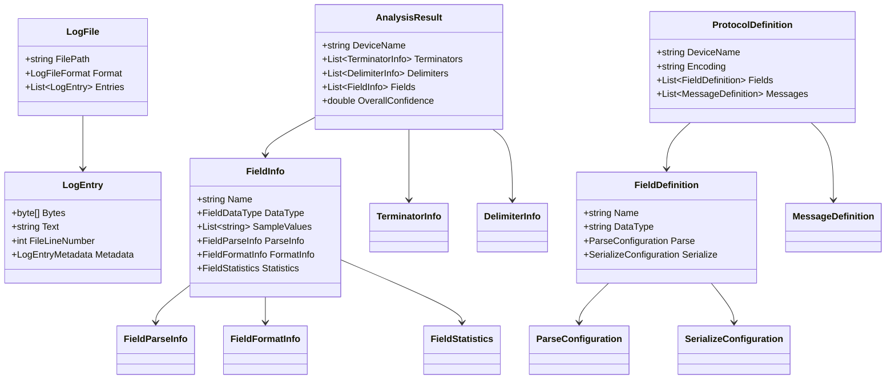
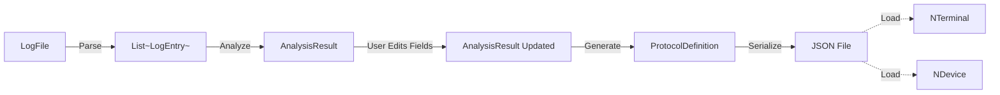

# Data Models Design

## NSerialCommTools - Protocol Analyzer Data Models

**Document Version**: 2.3
**Last Updated**: 2025-10-27
**Status**: Design Phase

**Related Documents**:
- **00-Requirements-Specification.md** - Requirements
- **01-Production-Code-Analysis.md** - Production code patterns
- **02-System-Architecture.md** - System architecture
- **03-Parsing-Strategy-Analysis.md** - Parsing strategies

---

## Table of Contents

1. [Overview](#overview)
2. [Core Data Models](#core-data-models)
3. [Analysis Models](#analysis-models)
4. [Protocol Definition Models](#protocol-definition-models)
5. [Supporting Types](#supporting-types)
6. [Enumerations](#enumerations)
7. [Relationships](#relationships)

---

## Overview

This document defines all C# classes and data structures used in the Protocol Analyzer system. These models enable:
- Parsing log files into normalized format
- Analyzing protocol patterns
- Generating JSON definition files
- Runtime parsing/serialization with NTerminal<T> and NDevice<T>

### Design Principles

1. **Separation of Concerns**: Analysis models vs runtime models
2. **Immutability**: Use readonly where possible
3. **Validation**: Built-in validation logic
4. **Serialization-Ready**: Support JSON serialization
5. **.NET 4.7.2 Compatible**: No modern C# features

### Terminology Clarification

**IMPORTANT: Log File Structure vs Protocol Structure**

This document uses two different conceptual structures:

| Concept | What It Represents | Terminology | Purpose |
|---------|-------------------|-------------|---------|
| **Log File Structure** | Text files captured from serial tools | "Lines" in file | Human-readable format for debugging |
| **Protocol Structure** | Device communication format | "Packages" and "Segments" | Actual device protocol organization |

**Example**:
```
Log File (capture.txt):
  Line 1: 53 54 2C 47 53 20 20 20 20 32 30 2E 37 67 0D 0A  ← Text file line
  Line 2: 55 53 2C 47 53 20 20 20 20 32 31 2E 31 67 0D 0A  ← Text file line

Protocol Structure:
  Package {                                               ← Protocol package
    Segment 1: "ST"                                       ← Protocol segment
    Segment 2: "GS"                                       ← Protocol segment
    Segment 3: "20.7g"                                    ← Protocol segment
  }
```

**Key Properties**:
- `FileLineNumber` = Line in the TEXT FILE (for error reporting)
- `SegmentIndex` = Position within PROTOCOL PACKAGE (for parsing)

**Why Both?**
- Log files are TEXT files (with "lines") because they're captured by 3rd-party tools
- Protocol structure uses "Packages/Segments" for binary compatibility
- The analyzer reads log file LINES and extracts protocol BYTES

---

## Core Data Models

### LogEntry Class

**Purpose**: Normalized representation of one log file entry after parsing.

**Important Distinction**:
- **Log File Structure**: Text files with "lines" (file format for human readability)
- **Protocol Structure**: Packages with "Segments" (device communication format)

This class represents entries from the LOG FILE (text file), not the protocol structure.
The `FileLineNumber` property refers to the line number in the text file, used for error reporting.

**Namespace**: `NLib.Serial.Protocol.Analyzer.Models`

```csharp
/// <summary>
/// Represents a single entry from the log file after parsing.
/// Used internally during analysis phase.
///
/// NOTE: Log files are TEXT files with "lines" for human readability.
/// The protocol itself uses "Packages" and "Segments" (not related to file lines).
/// This class bridges the gap: reads from log file lines, extracts protocol bytes.
/// </summary>
public class LogEntry
{
    #region Properties

    /// <summary>
    /// Raw bytes extracted from this log entry.
    /// This is the actual protocol data.
    /// </summary>
    public byte[] Bytes { get; set; }

    /// <summary>
    /// Text representation of the bytes (for display).
    /// May be ASCII conversion or from log file text column.
    /// </summary>
    public string Text { get; set; }

    /// <summary>
    /// Line number in the original LOG FILE (1-based).
    /// Used for error reporting and debugging the log file itself.
    ///
    /// IMPORTANT: This refers to the TEXT FILE structure, NOT the protocol structure.
    /// - Log files are TEXT files with "lines" (human-readable format)
    /// - Protocol structure uses "Packages" and "Segments" (device communication)
    ///
    /// Example: "Parse error at line 47 in capture.txt"
    /// </summary>
    public int FileLineNumber { get; set; }

    /// <summary>
    /// Timestamp if available in log file.
    /// Optional - not all log formats include timestamps.
    /// </summary>
    public DateTime? Timestamp { get; set; }

    /// <summary>
    /// Direction indicator (TX/RX) if available in log.
    /// Optional - used for analysis only.
    /// </summary>
    public DataDirection? Direction { get; set; }

    /// <summary>
    /// Metadata about this log entry.
    /// </summary>
    public LogEntryMetadata Metadata { get; set; }

    #endregion

    #region Constructor

    public LogEntry()
    {
        Metadata = new LogEntryMetadata();
    }

    #endregion

    #region Methods

    /// <summary>
    /// Gets the bytes as hex string for display.
    /// </summary>
    public string GetHexString()
    {
        if (Bytes == null || Bytes.Length == 0)
            return string.Empty;

        return BitConverter.ToString(Bytes).Replace("-", " ");
    }

    /// <summary>
    /// Gets the last N bytes (for terminator detection).
    /// </summary>
    public byte[] GetLastBytes(int count)
    {
        if (Bytes == null || Bytes.Length < count)
            return Bytes;

        byte[] result = new byte[count];
        Array.Copy(Bytes, Bytes.Length - count, result, 0, count);
        return result;
    }

    #endregion
}
```

---

### LogEntryMetadata Class

**Purpose**: Additional metadata about the log entry.

```csharp
/// <summary>
/// Metadata about a log entry.
/// </summary>
public class LogEntryMetadata
{
    /// <summary>
    /// Original log file format.
    /// </summary>
    public LogFileFormat Format { get; set; }

    /// <summary>
    /// Encoding used to interpret bytes as text.
    /// </summary>
    public string Encoding { get; set; }

    /// <summary>
    /// Was this entry a comment or separator in the log file?
    /// </summary>
    public bool IsComment { get; set; }

    /// <summary>
    /// Original raw entry from file (before parsing).
    /// </summary>
    public string OriginalLine { get; set; }

    public LogEntryMetadata()
    {
        Format = LogFileFormat.Unknown;
        Encoding = "ASCII";
        IsComment = false;
    }
}
```

---

## Analysis Models

### DetectionConfiguration Class

**Purpose**: User-configured or auto-detected protocol detection settings used to constrain analysis algorithms.

**Added in**: Version 2.3 (Session 7 completion)

```csharp
/// <summary>
/// User-configured or auto-detected protocol detection settings.
/// Used to constrain and guide analysis algorithms.
/// Configured in Page 1 (LogDataPage) and passed to Page 2 (AnalyzerPage).
/// </summary>
public class DetectionConfiguration
{
    #region Package-Level Terminators

    /// <summary>
    /// Package terminator bytes (REQUIRED).
    /// Marks the end of a complete package/message.
    /// Example: 0x0D 0x0A (CRLF) for most text protocols.
    /// </summary>
    public byte[] PackageTerminator { get; set; }

    #endregion

    #region Segment-Level Separators (Mutually Exclusive)

    /// <summary>
    /// Segment delimiter bytes (OPTIONAL).
    /// Separates fields/segments within a package (delimiter-based protocols).
    /// Example: 0x2C (comma) for CSV-like protocols.
    ///
    /// NOTE: Use EITHER SegmentDelimiter OR SegmentTerminator, not both.
    /// </summary>
    public byte[] SegmentDelimiter { get; set; }

    /// <summary>
    /// Segment terminator bytes (OPTIONAL - NEW in v2.3).
    /// Marks the end of each segment within a package (PackageBased protocols).
    /// Example: 0x0D (CR) for JIK6CAB protocol with multi-level terminators.
    ///
    /// NOTE: Use EITHER SegmentDelimiter OR SegmentTerminator, not both.
    /// </summary>
    public byte[] SegmentTerminator { get; set; }

    #endregion

    #region Frame Markers (Optional)

    /// <summary>
    /// Start marker bytes (OPTIONAL).
    /// Marks the beginning of a package (e.g., STX = 0x02).
    /// Null if no start marker.
    /// </summary>
    public byte[] StartMarker { get; set; }

    /// <summary>
    /// End marker bytes (OPTIONAL).
    /// Marks the end of a package, in addition to terminator (e.g., ETX = 0x03).
    /// Null if no end marker.
    /// </summary>
    public byte[] EndMarker { get; set; }

    #endregion

    #region Encoding

    /// <summary>
    /// Text encoding type (REQUIRED).
    /// Default: ASCII
    /// </summary>
    public EncodingType Encoding { get; set; }

    #endregion

    #region Detection Metadata

    /// <summary>
    /// Detection mode and confidence information for each setting.
    /// Tracks whether each value was auto-detected or manually configured.
    /// </summary>
    public DetectionModeInfo ModeInfo { get; set; }

    #endregion

    #region Constructor

    public DetectionConfiguration()
    {
        Encoding = EncodingType.ASCII;
        ModeInfo = new DetectionModeInfo();
    }

    #endregion

    #region Validation Methods

    /// <summary>
    /// Validates the detection configuration.
    /// Returns true if valid, false otherwise.
    /// </summary>
    public bool Validate(out List<string> errors)
    {
        errors = new List<string>();

        // Package Terminator is REQUIRED
        if (PackageTerminator == null || PackageTerminator.Length == 0)
        {
            errors.Add("Package terminator is required.");
        }

        // Segment Delimiter and Segment Terminator are mutually exclusive
        if (SegmentDelimiter != null && SegmentDelimiter.Length > 0 &&
            SegmentTerminator != null && SegmentTerminator.Length > 0)
        {
            errors.Add("Cannot have both Segment Delimiter and Segment Terminator. Choose one.");
        }

        // Validate byte ranges
        if (!ValidateBytes(PackageTerminator, "Package Terminator", errors)) return false;
        if (!ValidateBytes(SegmentDelimiter, "Segment Delimiter", errors)) return false;
        if (!ValidateBytes(SegmentTerminator, "Segment Terminator", errors)) return false;
        if (!ValidateBytes(StartMarker, "Start Marker", errors)) return false;
        if (!ValidateBytes(EndMarker, "End Marker", errors)) return false;

        return errors.Count == 0;
    }

    private bool ValidateBytes(byte[] bytes, string fieldName, List<string> errors)
    {
        if (bytes == null) return true; // Null is OK for optional fields

        if (bytes.Length == 0)
        {
            errors.Add($"{fieldName}: Cannot be empty array if specified.");
            return false;
        }

        if (bytes.Length > 8)
        {
            errors.Add($"{fieldName}: Maximum 8 bytes allowed.");
            return false;
        }

        return true;
    }

    /// <summary>
    /// Gets a human-readable description of the configuration.
    /// </summary>
    public string GetDescription()
    {
        var sb = new System.Text.StringBuilder();
        sb.AppendLine("Detection Configuration:");
        sb.AppendLine($"  Package Terminator: {BytesToString(PackageTerminator)}");

        if (SegmentDelimiter != null && SegmentDelimiter.Length > 0)
            sb.AppendLine($"  Segment Delimiter: {BytesToString(SegmentDelimiter)}");

        if (SegmentTerminator != null && SegmentTerminator.Length > 0)
            sb.AppendLine($"  Segment Terminator: {BytesToString(SegmentTerminator)}");

        if (StartMarker != null && StartMarker.Length > 0)
            sb.AppendLine($"  Start Marker: {BytesToString(StartMarker)}");

        if (EndMarker != null && EndMarker.Length > 0)
            sb.AppendLine($"  End Marker: {BytesToString(EndMarker)}");

        sb.AppendLine($"  Encoding: {Encoding}");

        return sb.ToString();
    }

    private string BytesToString(byte[] bytes)
    {
        if (bytes == null || bytes.Length == 0) return "(none)";
        return string.Join(" ", bytes.Select(b => $"0x{b:X2}"));
    }

    #endregion
}
```

### DetectionModeInfo Class

**Purpose**: Metadata about how each detection setting was configured (auto vs manual).

```csharp
/// <summary>
/// Detection mode and confidence information for each configuration setting.
/// Tracks whether values were auto-detected or manually entered.
/// </summary>
public class DetectionModeInfo
{
    #region Package Terminator

    public DetectionMode PackageTerminatorMode { get; set; }
    public double PackageTerminatorConfidence { get; set; }

    #endregion

    #region Segment Separators

    public DetectionMode SegmentDelimiterMode { get; set; }
    public double SegmentDelimiterConfidence { get; set; }

    /// <summary>
    /// NEW in v2.3: Segment terminator detection mode.
    /// </summary>
    public DetectionMode SegmentTerminatorMode { get; set; }

    /// <summary>
    /// NEW in v2.3: Segment terminator detection confidence.
    /// </summary>
    public double SegmentTerminatorConfidence { get; set; }

    #endregion

    #region Markers

    public DetectionMode StartMarkerMode { get; set; }
    public DetectionMode EndMarkerMode { get; set; }

    #endregion

    #region Encoding

    public DetectionMode EncodingMode { get; set; }

    #endregion

    #region Constructor

    public DetectionModeInfo()
    {
        // Default all to Auto mode
        PackageTerminatorMode = DetectionMode.Auto;
        SegmentDelimiterMode = DetectionMode.None;
        SegmentTerminatorMode = DetectionMode.None;
        StartMarkerMode = DetectionMode.None;
        EndMarkerMode = DetectionMode.None;
        EncodingMode = DetectionMode.Auto;
    }

    #endregion
}
```

### DetectionMode Enum

**Purpose**: Indicates whether a detection setting was auto-detected, manually entered, or not applicable.

```csharp
/// <summary>
/// Detection mode for a configuration setting.
/// </summary>
public enum DetectionMode
{
    /// <summary>
    /// Value was automatically detected by the system.
    /// </summary>
    Auto,

    /// <summary>
    /// Value was manually specified by the user.
    /// </summary>
    Manual,

    /// <summary>
    /// Setting is not applicable or not used (e.g., no delimiter).
    /// </summary>
    None
}
```

---

### AnalysisResult Class

**Purpose**: Results from protocol analysis - what the analyzer detected.

```csharp
/// <summary>
/// Results from analyzing a log file.
/// Contains all detected patterns, delimiters, and field information.
/// </summary>
public class AnalysisResult
{
    #region Properties

    /// <summary>
    /// Detected or user-provided device name.
    /// </summary>
    public string DeviceName { get; set; }

    /// <summary>
    /// Date/time when analysis was performed.
    /// </summary>
    public DateTime AnalysisDate { get; set; }

    /// <summary>
    /// Source log file path.
    /// </summary>
    public string SourceFile { get; set; }

    /// <summary>
    /// Total number of log entries analyzed.
    /// </summary>
    public int TotalEntries { get; set; }

    /// <summary>
    /// Detected message terminators with confidence scores.
    /// </summary>
    public List<TerminatorInfo> Terminators { get; set; }

    /// <summary>
    /// Detected field delimiters with confidence scores.
    /// </summary>
    public List<DelimiterInfo> Delimiters { get; set; }

    /// <summary>
    /// Detected message patterns (header/footer markers).
    /// </summary>
    public List<MessagePatternInfo> MessagePatterns { get; set; }

    /// <summary>
    /// Detected fields with their characteristics.
    /// </summary>
    public List<FieldInfo> Fields { get; set; }

    /// <summary>
    /// Detected encoding (ASCII, UTF-8, etc.).
    /// </summary>
    public string DetectedEncoding { get; set; }

    /// <summary>
    /// Message structure type.
    /// </summary>
    public MessageStructureType MessageStructure { get; set; }

    /// <summary>
    /// Overall confidence score (0-1).
    /// Average of all detection confidence scores.
    /// </summary>
    public double OverallConfidence { get; set; }

    /// <summary>
    /// Analysis warnings or issues.
    /// </summary>
    public List<string> Warnings { get; set; }

    #endregion

    #region Constructor

    public AnalysisResult()
    {
        AnalysisDate = DateTime.Now;
        Terminators = new List<TerminatorInfo>();
        Delimiters = new List<DelimiterInfo>();
        MessagePatterns = new List<MessagePatternInfo>();
        Fields = new List<FieldInfo>();
        Warnings = new List<string>();
        DetectedEncoding = "ASCII";
    }

    #endregion

    #region Methods

    /// <summary>
    /// Gets the highest confidence terminator.
    /// </summary>
    public TerminatorInfo GetBestTerminator()
    {
        return Terminators
            .OrderByDescending(t => t.Confidence)
            .FirstOrDefault();
    }

    /// <summary>
    /// Gets the highest confidence delimiter.
    /// </summary>
    public DelimiterInfo GetBestDelimiter()
    {
        return Delimiters
            .OrderByDescending(d => d.Confidence)
            .FirstOrDefault();
    }

    /// <summary>
    /// Checks if analysis meets accuracy threshold.
    /// </summary>
    public bool MeetsAccuracyThreshold(double threshold = 0.95)
    {
        return OverallConfidence >= threshold;
    }

    #endregion
}
```

---

### FieldInfo Class

**Purpose**: Information about a detected field.

```csharp
/// <summary>
/// Information about a detected field in the protocol.
/// </summary>
public class FieldInfo
{
    #region Properties

    /// <summary>
    /// Field name (starts as auto-generated, user can edit).
    /// Example: "Field1" → user edits to → "NetWeight"
    /// </summary>
    public string Name { get; set; }

    /// <summary>
    /// Detected data type.
    /// </summary>
    public FieldDataType DataType { get; set; }

    /// <summary>
    /// Position/order in message (0-based).
    /// </summary>
    public int Position { get; set; }

    /// <summary>
    /// Sample values from log file (for user review).
    /// Limited to first 10 unique values.
    /// </summary>
    public List<string> SampleValues { get; set; }

    /// <summary>
    /// Confidence score for this field detection (0-1).
    /// </summary>
    public double Confidence { get; set; }

    /// <summary>
    /// Parse information (how to extract value from bytes).
    /// </summary>
    public FieldParseInfo ParseInfo { get; set; }

    /// <summary>
    /// Format information (how to serialize value to bytes).
    /// </summary>
    public FieldFormatInfo FormatInfo { get; set; }

    /// <summary>
    /// Optional description (user-provided).
    /// </summary>
    public string Description { get; set; }

    /// <summary>
    /// Is this field required in every message?
    /// </summary>
    public bool IsRequired { get; set; }

    /// <summary>
    /// Statistical information about field values.
    /// </summary>
    public FieldStatistics Statistics { get; set; }

    #endregion

    #region Constructor

    public FieldInfo()
    {
        SampleValues = new List<string>();
        ParseInfo = new FieldParseInfo();
        FormatInfo = new FieldFormatInfo();
        Statistics = new FieldStatistics();
        IsRequired = true;
        Confidence = 0.0;
    }

    #endregion

    #region Methods

    /// <summary>
    /// Validates the field name as valid C# identifier.
    /// </summary>
    public bool IsValidName()
    {
        if (string.IsNullOrWhiteSpace(Name))
            return false;

        // Must start with letter or underscore
        if (!char.IsLetter(Name[0]) && Name[0] != '_')
            return false;

        // Rest must be letters, digits, or underscores
        for (int i = 1; i < Name.Length; i++)
        {
            if (!char.IsLetterOrDigit(Name[i]) && Name[i] != '_')
                return false;
        }

        // Check if it's a C# keyword
        string[] keywords = { "class", "int", "string", "void", "public", "private", "return", "if", "else", "for", "while" };
        return !keywords.Contains(Name.ToLower());
    }

    /// <summary>
    /// Suggests a field name based on sample values.
    /// </summary>
    public string SuggestName()
    {
        // If all values are numbers, suggest "Value" or "Measurement"
        if (DataType == FieldDataType.Decimal || DataType == FieldDataType.Integer)
        {
            // Check if values look like weights
            if (SampleValues.Any(v => v.Contains(".") && double.TryParse(v, out double d) && d > 0 && d < 10000))
                return "Weight";

            return "Value";
        }

        // If values are unit strings
        if (SampleValues.All(v => v.Length <= 3 && v.All(char.IsLetter)))
            return "Unit";

        // If values are single characters
        if (SampleValues.All(v => v.Length == 1))
            return "Status";

        // Default
        return $"Field{Position + 1}";
    }

    #endregion
}
```

---

### FieldParseInfo Class

**Purpose**: How to parse (extract) a field value from bytes.

```csharp
/// <summary>
/// Information for parsing a field from bytes.
/// Used by NTerminal<T> to extract values.
/// </summary>
public class FieldParseInfo
{
    /// <summary>
    /// Parse method to use.
    /// </summary>
    public ParseMethod Method { get; set; }

    /// <summary>
    /// Regex pattern (if Method = Regex).
    /// </summary>
    public string Pattern { get; set; }

    /// <summary>
    /// Regex group number to extract (if Method = Regex).
    /// </summary>
    public int RegexGroup { get; set; }

    /// <summary>
    /// Fixed byte offset (if Method = FixedPosition).
    /// </summary>
    public int Offset { get; set; }

    /// <summary>
    /// Fixed byte length (if Method = FixedPosition).
    /// </summary>
    public int Length { get; set; }

    /// <summary>
    /// Delimiter to split on (if Method = Delimited).
    /// </summary>
    public string Delimiter { get; set; }

    /// <summary>
    /// Index after split (if Method = Delimited).
    /// </summary>
    public int DelimiterIndex { get; set; }

    /// <summary>
    /// Should trim whitespace?
    /// </summary>
    public bool TrimWhitespace { get; set; }

    /// <summary>
    /// Encoding to use for text conversion.
    /// </summary>
    public string Encoding { get; set; }

    public FieldParseInfo()
    {
        Method = ParseMethod.Unknown;
        RegexGroup = 1;
        TrimWhitespace = true;
        Encoding = "ASCII";
    }
}
```

---

### FieldFormatInfo Class

**Purpose**: How to format (serialize) a field value to bytes.

```csharp
/// <summary>
/// Information for formatting a field to bytes.
/// Used by NDevice<T> to serialize values.
/// </summary>
public class FieldFormatInfo
{
    /// <summary>
    /// Format string (e.g., "F3" for decimal, "D2" for int).
    /// </summary>
    public string FormatString { get; set; }

    /// <summary>
    /// Padding direction (left/right).
    /// </summary>
    public PaddingDirection Padding { get; set; }

    /// <summary>
    /// Padding character (usually space).
    /// </summary>
    public char PaddingChar { get; set; }

    /// <summary>
    /// Total width after padding.
    /// </summary>
    public int Width { get; set; }

    /// <summary>
    /// Text alignment (left/right).
    /// </summary>
    public TextAlignment Alignment { get; set; }

    /// <summary>
    /// Encoding to use for text conversion.
    /// </summary>
    public string Encoding { get; set; }

    public FieldFormatInfo()
    {
        PaddingChar = ' ';
        Padding = PaddingDirection.None;
        Alignment = TextAlignment.Left;
        Encoding = "ASCII";
    }
}
```

---

### FieldStatistics Class

**Purpose**: Statistical analysis of field values.

```csharp
/// <summary>
/// Statistical information about field values.
/// Used for classification and confidence scoring.
/// </summary>
public class FieldStatistics
{
    /// <summary>
    /// Total number of occurrences.
    /// </summary>
    public int TotalCount { get; set; }

    /// <summary>
    /// Number of unique values.
    /// </summary>
    public int UniqueCount { get; set; }

    /// <summary>
    /// Minimum value (if numeric).
    /// </summary>
    public double? MinValue { get; set; }

    /// <summary>
    /// Maximum value (if numeric).
    /// </summary>
    public double? MaxValue { get; set; }

    /// <summary>
    /// Average value (if numeric).
    /// </summary>
    public double? AverageValue { get; set; }

    /// <summary>
    /// Minimum length (if text).
    /// </summary>
    public int MinLength { get; set; }

    /// <summary>
    /// Maximum length (if text).
    /// </summary>
    public int MaxLength { get; set; }

    /// <summary>
    /// Variance ratio (UniqueCount / TotalCount).
    /// 0 = always same, 1 = always different.
    /// </summary>
    public double VarianceRatio
    {
        get
        {
            return TotalCount > 0 ? (double)UniqueCount / TotalCount : 0.0;
        }
    }

    /// <summary>
    /// Field classification based on variance.
    /// </summary>
    public FieldClassification GetClassification()
    {
        double ratio = VarianceRatio;

        if (ratio == 0.0)
            return FieldClassification.FixedLabel;
        else if (ratio < 0.1)
            return FieldClassification.StatusCode;
        else if (ratio < 0.9)
            return FieldClassification.DataField;
        else
            return FieldClassification.UniqueIdentifier;
    }
}
```

---

### TerminatorInfo Class

**Purpose**: Information about a detected message terminator.

```csharp
/// <summary>
/// Information about a detected message terminator.
/// </summary>
public class TerminatorInfo
{
    /// <summary>
    /// Terminator bytes (e.g., 0x0D, 0x0A, 0x0D 0x0A).
    /// </summary>
    public byte[] Bytes { get; set; }

    /// <summary>
    /// Hex string representation (e.g., "0D 0A").
    /// </summary>
    public string HexString
    {
        get
        {
            return Bytes != null ? BitConverter.ToString(Bytes).Replace("-", " ") : string.Empty;
        }
    }

    /// <summary>
    /// Text representation (e.g., "\r\n").
    /// </summary>
    public string TextRepresentation { get; set; }

    /// <summary>
    /// Confidence score (0-1).
    /// Based on frequency of occurrence.
    /// </summary>
    public double Confidence { get; set; }

    /// <summary>
    /// Number of times this terminator was found.
    /// </summary>
    public int Occurrences { get; set; }

    /// <summary>
    /// Total messages analyzed.
    /// </summary>
    public int TotalMessages { get; set; }

    /// <summary>
    /// Percentage of messages with this terminator.
    /// </summary>
    public double Percentage
    {
        get
        {
            return TotalMessages > 0 ? (double)Occurrences / TotalMessages * 100.0 : 0.0;
        }
    }
}
```

---

### DelimiterInfo Class

**Purpose**: Information about a detected field delimiter.

```csharp
/// <summary>
/// Information about a detected field delimiter.
/// </summary>
public class DelimiterInfo
{
    /// <summary>
    /// Delimiter bytes (e.g., 0x20 for space, 0x2F for slash).
    /// </summary>
    public byte[] Bytes { get; set; }

    /// <summary>
    /// Text representation (e.g., " ", "/", ",").
    /// </summary>
    public string TextRepresentation { get; set; }

    /// <summary>
    /// Delimiter type.
    /// </summary>
    public DelimiterType Type { get; set; }

    /// <summary>
    /// Confidence score (0-1).
    /// </summary>
    public double Confidence { get; set; }

    /// <summary>
    /// Number of times this delimiter was found.
    /// </summary>
    public int Occurrences { get; set; }

    /// <summary>
    /// Is this delimiter used for nested splitting?
    /// (e.g., WeightQA uses "/" then " ")
    /// </summary>
    public bool IsNestedDelimiter { get; set; }

    /// <summary>
    /// Parent delimiter (if nested).
    /// </summary>
    public DelimiterInfo ParentDelimiter { get; set; }
}
```

---

### MessagePatternInfo Class

**Purpose**: Information about message header/footer patterns.

```csharp
/// <summary>
/// Information about a detected message pattern (header/footer).
/// </summary>
public class MessagePatternInfo
{
    /// <summary>
    /// Pattern type (header, footer, etc.).
    /// </summary>
    public PatternType Type { get; set; }

    /// <summary>
    /// Pattern bytes.
    /// </summary>
    public byte[] Bytes { get; set; }

    /// <summary>
    /// Text representation.
    /// </summary>
    public string TextRepresentation { get; set; }

    /// <summary>
    /// Is this a fixed pattern or regex?
    /// </summary>
    public bool IsRegex { get; set; }

    /// <summary>
    /// Regex pattern (if IsRegex = true).
    /// </summary>
    public string RegexPattern { get; set; }

    /// <summary>
    /// Confidence score (0-1).
    /// </summary>
    public double Confidence { get; set; }

    /// <summary>
    /// Position where pattern appears (start/end of message).
    /// </summary>
    public PatternPosition Position { get; set; }
}
```

---

## Protocol Definition Models

### ProtocolDefinition Class

**Purpose**: In-memory representation of the JSON definition file.

```csharp
/// <summary>
/// Protocol definition - in-memory representation of JSON file.
/// This is what gets serialized to JSON and loaded by NTerminal/NDevice.
/// </summary>
public class ProtocolDefinition
{
    #region Device Information

    /// <summary>
    /// Device name.
    /// </summary>
    public string DeviceName { get; set; }

    /// <summary>
    /// Definition version.
    /// </summary>
    public string Version { get; set; }

    /// <summary>
    /// Date when definition was generated.
    /// </summary>
    public DateTime GeneratedDate { get; set; }

    /// <summary>
    /// Description or notes.
    /// </summary>
    public string Description { get; set; }

    #endregion

    #region Protocol Information

    /// <summary>
    /// Encoding (ASCII, UTF-8, etc.).
    /// </summary>
    public string Encoding { get; set; }

    /// <summary>
    /// Message terminator (hex string, e.g., "0D 0A").
    /// </summary>
    public string MessageTerminator { get; set; }

    /// <summary>
    /// Message structure type.
    /// </summary>
    public string MessageStructure { get; set; }

    /// <summary>
    /// Header pattern (if multi-segment packages).
    /// </summary>
    public string MessageHeader { get; set; }

    /// <summary>
    /// Footer pattern (if multi-segment packages).
    /// </summary>
    public string MessageFooter { get; set; }

    #endregion

    #region Field Definitions

    /// <summary>
    /// List of field definitions.
    /// </summary>
    public List<FieldDefinition> Fields { get; set; }

    #endregion

    #region Message Definitions

    /// <summary>
    /// List of message types (if protocol has multiple message types).
    /// </summary>
    public List<MessageDefinition> Messages { get; set; }

    #endregion

    #region Commands (Optional)

    /// <summary>
    /// Commands that can be sent to device (optional).
    /// </summary>
    public List<CommandDefinition> Commands { get; set; }

    #endregion


    #region Field Relationships (Optional)

    /// <summary>
    /// Field relationships for combined/calculated fields (optional).
    /// Example: Combine Date + Time fields into single DateTime property.
    /// </summary>
    public List<FieldRelationship> FieldRelationships { get; set; }

    #endregion

    #region Constructor

    public ProtocolDefinition()
    {
        Version = "1.0";
        GeneratedDate = DateTime.Now;
        Encoding = "ASCII";
        Fields = new List<FieldDefinition>();
        Messages = new List<MessageDefinition>();
        Commands = new List<CommandDefinition>();
        FieldRelationships = new List<FieldRelationship>();
    }

    #endregion

    #region Methods

    /// <summary>
    /// Validates the definition.
    /// </summary>
    public List<string> Validate()
    {
        List<string> errors = new List<string>();

        if (string.IsNullOrWhiteSpace(DeviceName))
            errors.Add("DeviceName is required");

        if (Fields == null || Fields.Count == 0)
            errors.Add("At least one field is required");

        // Check for duplicate field names
        var duplicates = Fields
            .GroupBy(f => f.Name)
            .Where(g => g.Count() > 1)
            .Select(g => g.Key);

        foreach (var dup in duplicates)
            errors.Add($"Duplicate field name: {dup}");

        // Validate each field
        foreach (var field in Fields)
        {
            var fieldErrors = field.Validate();
            errors.AddRange(fieldErrors);
        }

        return errors;
    }

    #endregion
}
```

---

### FieldDefinition Class

**Purpose**: Field definition in the protocol definition file.

```csharp
/// <summary>
/// Field definition for JSON protocol definition file.
/// Contains both parse and serialize information.
/// </summary>
public class FieldDefinition
{
    /// <summary>
    /// Field name (maps to T property name).
    /// </summary>
    public string Name { get; set; }

    /// <summary>
    /// Data type (decimal, int, string, datetime, etc.).
    /// </summary>
    public string DataType { get; set; }

    /// <summary>
    /// Position/order in message.
    /// </summary>
    public int Position { get; set; }

    /// <summary>
    /// Is this field required?
    /// </summary>
    public bool Required { get; set; }

    /// <summary>
    /// Description or notes.
    /// </summary>
    public string Description { get; set; }

    /// <summary>
    /// Parse configuration (Device → Application).
    /// </summary>
    public ParseConfiguration Parse { get; set; }

    /// <summary>
    /// Serialize configuration (Application → Device).
    /// </summary>
    public SerializeConfiguration Serialize { get; set; }

    public FieldDefinition()
    {
        Required = true;
        Parse = new ParseConfiguration();
        Serialize = new SerializeConfiguration();
    }

    /// <summary>
    /// Validates this field definition.
    /// </summary>
    public List<string> Validate()
    {
        List<string> errors = new List<string>();

        if (string.IsNullOrWhiteSpace(Name))
            errors.Add($"Field at position {Position}: Name is required");

        if (string.IsNullOrWhiteSpace(DataType))
            errors.Add($"Field {Name}: DataType is required");

        return errors;
    }
}
```

---

### ParseConfiguration Class

**Purpose**: Parse configuration for a field (used by NTerminal).

```csharp
/// <summary>
/// Parse configuration - how to extract field value from bytes.
/// </summary>
public class ParseConfiguration
{
    /// <summary>
    /// Parse method (regex, fixed-position, delimited, etc.).
    /// </summary>
    public string Method { get; set; }

    /// <summary>
    /// Regex pattern (if method = regex).
    /// </summary>
    public string Pattern { get; set; }

    /// <summary>
    /// Regex group to extract (if method = regex).
    /// </summary>
    public int? Group { get; set; }

    /// <summary>
    /// Byte offset (if method = fixed-position).
    /// </summary>
    public int? Offset { get; set; }

    /// <summary>
    /// Byte length (if method = fixed-position).
    /// </summary>
    public int? Length { get; set; }

    /// <summary>
    /// Delimiter (if method = delimited).
    /// </summary>
    public string Delimiter { get; set; }

    /// <summary>
    /// Index after split (if method = delimited).
    /// </summary>
    public int? Index { get; set; }

    /// <summary>
    /// Trim whitespace?
    /// </summary>
    public bool Trim { get; set; }

    /// <summary>
    /// Format string for parsing (e.g., DateTime format).
    /// </summary>
    public string Format { get; set; }

    public ParseConfiguration()
    {
        Trim = true;
    }
}
```

---

### SerializeConfiguration Class

**Purpose**: Serialize configuration for a field (used by NDevice).

```csharp
/// <summary>
/// Serialize configuration - how to format field value to bytes.
/// </summary>
public class SerializeConfiguration
{
    /// <summary>
    /// Format string (e.g., "F3", "D2", "yyyy-MM-dd").
    /// </summary>
    public string Format { get; set; }

    /// <summary>
    /// Padding direction (left/right/none).
    /// </summary>
    public string Padding { get; set; }

    /// <summary>
    /// Padding character (default space).
    /// </summary>
    public string PaddingChar { get; set; }

    /// <summary>
    /// Total width after padding.
    /// </summary>
    public int? Width { get; set; }

    /// <summary>
    /// Text alignment (left/right).
    /// </summary>
    public string Alignment { get; set; }

    public SerializeConfiguration()
    {
        PaddingChar = " ";
        Padding = "none";
        Alignment = "left";
    }
}
```

---

### MessageDefinition Class

**Purpose**: Defines a message type (if protocol has multiple types).

```csharp
/// <summary>
/// Message definition (for protocols with multiple message types).
/// </summary>
public class MessageDefinition
{
    /// <summary>
    /// Message ID/name.
    /// </summary>
    public string MessageId { get; set; }

    /// <summary>
    /// Message type (request, response, event, etc.).
    /// </summary>
    public string MessageType { get; set; }

    /// <summary>
    /// Pattern to identify this message type.
    /// </summary>
    public string Pattern { get; set; }

    /// <summary>
    /// Fields in this message.
    /// </summary>
    public List<string> FieldNames { get; set; }

    /// <summary>
    /// Message-specific terminator (if different from default).
    /// </summary>
    public string Terminator { get; set; }

    public MessageDefinition()
    {
        FieldNames = new List<string>();
    }
}
```

---

### CommandDefinition Class

**Purpose**: Defines a command that can be sent to device.

```csharp
/// <summary>
/// Command definition (optional - for devices that accept commands).
/// </summary>
public class CommandDefinition
{
    /// <summary>
    /// Command name.
    /// </summary>
    public string Name { get; set; }

    /// <summary>
    /// Command bytes (hex string).
    /// </summary>
    public string SendBytes { get; set; }

    /// <summary>
    /// Does this command expect a response?
    /// </summary>
    public bool ExpectResponse { get; set; }

    /// <summary>
    /// Response timeout (milliseconds).
    /// </summary>
    public int? ResponseTimeout { get; set; }

    /// <summary>
    /// Description.
    /// </summary>
    public string Description { get; set; }
}
```

---

## Supporting Types

### LogFile Class

**Purpose**: Represents a loaded log file.

```csharp
/// <summary>
/// Represents a loaded log file.
/// </summary>
public class LogFile
{
    /// <summary>
    /// File path.
    /// </summary>
    public string FilePath { get; set; }

    /// <summary>
    /// File name only.
    /// </summary>
    public string FileName
    {
        get { return System.IO.Path.GetFileName(FilePath); }
    }

    /// <summary>
    /// Detected log file format.
    /// </summary>
    public LogFileFormat Format { get; set; }

    /// <summary>
    /// Raw file content.
    /// </summary>
    public string RawContent { get; set; }

    /// <summary>
    /// Parsed log entries.
    /// </summary>
    public List<LogEntry> Entries { get; set; }

    /// <summary>
    /// File size in bytes.
    /// </summary>
    public long FileSize { get; set; }

    /// <summary>
    /// Number of lines in file.
    /// </summary>
    public int LineCount { get; set; }

    public LogFile()
    {
        Entries = new List<LogEntry>();
    }
}
```

---

### FieldRelationship Class

**Purpose**: Defines relationships between fields (combining, splitting, calculating).

```csharp
/// <summary>
/// Defines relationships between multiple fields.
/// Used for combined fields (e.g., Date + Time → DateTime) or calculated fields.
/// </summary>
public class FieldRelationship
{
    /// <summary>
    /// Relationship name (unique identifier).
    /// </summary>
    public string Name { get; set; }

    /// <summary>
    /// Relationship type.
    /// </summary>
    public RelationshipType Type { get; set; }

    /// <summary>
    /// Source field names (fields to combine/use in calculation).
    /// </summary>
    public List<string> SourceFields { get; set; }

    /// <summary>
    /// Target field name (result of combination/calculation).
    /// </summary>
    public string TargetField { get; set; }

    /// <summary>
    /// Operation to perform.
    /// </summary>
    public string Operation { get; set; }

    /// <summary>
    /// Description of this relationship.
    /// </summary>
    public string Description { get; set; }

    public FieldRelationship()
    {
        Type = RelationshipType.Unknown;
        SourceFields = new List<string>();
    }

    /// <summary>
    /// Validates the relationship configuration.
    /// </summary>
    public List<string> Validate()
    {
        List<string> errors = new List<string>();

        if (string.IsNullOrWhiteSpace(Name))
            errors.Add("FieldRelationship: Name is required");

        if (Type == RelationshipType.Unknown)
            errors.Add($"FieldRelationship {Name}: Type must be specified");

        if (SourceFields == null || SourceFields.Count == 0)
            errors.Add($"FieldRelationship {Name}: At least one source field required");

        if (string.IsNullOrWhiteSpace(TargetField))
            errors.Add($"FieldRelationship {Name}: TargetField is required");

        return errors;
    }
}
```

---

### SegmentSequenceConfig Class

**Purpose**: Configuration for sequential segment parsing (state machine approach).

```csharp
/// <summary>
/// Configuration for sequential segment-by-segment parsing.
/// Used for complex multi-segment package protocols like JIK6CAB.
/// </summary>
public class SegmentSequenceConfig
{
    /// <summary>
    /// Sequence name.
    /// </summary>
    public string Name { get; set; }

    /// <summary>
    /// Segment definitions in order.
    /// </summary>
    public List<SegmentDefinition> Segments { get; set; }

    /// <summary>
    /// Start marker pattern (e.g., "^KJIK000").
    /// </summary>
    public string StartMarker { get; set; }

    /// <summary>
    /// End marker pattern (e.g., "~P1").
    /// </summary>
    public string EndMarker { get; set; }

    /// <summary>
    /// Total number of segments in complete sequence.
    /// </summary>
    public int ExpectedSegmentCount { get; set; }

    /// <summary>
    /// Timeout for incomplete sequences (milliseconds).
    /// </summary>
    public int TimeoutMs { get; set; }

    public SegmentSequenceConfig()
    {
        Segments = new List<SegmentDefinition>();
        TimeoutMs = 5000;
    }
}
```

---

### SegmentDefinition Class

**Purpose**: Defines a single segment in a sequential parsing sequence.

```csharp
/// <summary>
/// Definition of a single segment in a multi-segment package sequence.
/// </summary>
public class SegmentDefinition
{
    /// <summary>
    /// Segment index (0-based position in sequence).
    /// </summary>
    public int SegmentIndex { get; set; }

    /// <summary>
    /// Field name to extract from this segment.
    /// Null if segment should be skipped.
    /// </summary>
    public string FieldName { get; set; }

    /// <summary>
    /// Segment action (parse, skip, validate).
    /// </summary>
    public SegmentAction Action { get; set; }

    /// <summary>
    /// Pattern to match this segment (for validation).
    /// </summary>
    public string Pattern { get; set; }

    /// <summary>
    /// Total width after padding (output formatting).
    /// </summary>
    public int? Width { get; set; }

    /// <summary>
    /// Should this segment be shown in the editor UI?
    /// True = show in editor, False = hide from editor (internal/reserved)
    /// </summary>
    public bool ShowInEditor { get; set; }

    /// <summary>
    /// Is this segment required?
    /// </summary>
    public bool Required { get; set; }

    /// <summary>
    /// Description of this segment.
    /// </summary>
    public string Description { get; set; }

    public SegmentDefinition()
    {
        Action = SegmentAction.Parse;
        Required = true;
        ShowInEditor = true;
    }
}
```

---

## Enumerations

### LogFileFormat Enum

```csharp
/// <summary>
/// Log file format types.
/// </summary>
public enum LogFileFormat
{
    Unknown = 0,
    HexText = 1,    // HEX bytes + text representation
    HexOnly = 2,    // HEX bytes only (with optional comments)
    TextOnly = 3    // Plain text only
}
```

### DataDirection Enum

```csharp
/// <summary>
/// Data direction (TX/RX).
/// </summary>
public enum DataDirection
{
    Unknown = 0,
    Transmit = 1,   // TX - sent to device
    Receive = 2     // RX - received from device
}
```

### FieldDataType Enum

```csharp
/// <summary>
/// Field data types.
/// </summary>
public enum FieldDataType
{
    Unknown = 0,
    Integer = 1,
    Decimal = 2,
    String = 3,
    Character = 4,
    DateTime = 5,
    TimeSpan = 6,
    Boolean = 7,
    Binary = 8      // Raw bytes
}
```

### ParseMethod Enum

```csharp
/// <summary>
/// Parse methods for field extraction.
/// </summary>
public enum ParseMethod
{
    Unknown = 0,
    Regex = 1,          // Use regex pattern
    FixedPosition = 2,  // Fixed byte offset/length
    Delimited = 3,      // Split by delimiter
    HeaderByte = 4      // Switch on first byte (like TFO1)
}
```

### MessageStructureType Enum

```csharp
/// <summary>
/// Message structure types.
/// </summary>
public enum MessageStructureType
{
    Unknown = 0,
    SinglePackage = 1,      // One segment = one package
    MultiPackage = 2,       // Multi-segment package with header/footer
    PackageBlock = 3,       // Fixed number of segments per package
    VariableLength = 4      // Variable-length packages
}
```

### DelimiterType Enum

```csharp
/// <summary>
/// Delimiter types.
/// </summary>
public enum DelimiterType
{
    Unknown = 0,
    Space = 1,
    Tab = 2,
    Comma = 3,
    Slash = 4,
    Pipe = 5,
    Semicolon = 6,
    Custom = 7,
    FixedWidth = 8  // No delimiter - fixed-width fields
}
```

### FieldClassification Enum

```csharp
/// <summary>
/// Field classification based on variance.
/// </summary>
public enum FieldClassification
{
    Unknown = 0,
    FixedLabel = 1,         // Always same value (0% variance)
    StatusCode = 2,         // Few values (<10% variance)
    DataField = 3,          // Many values (10-90% variance)
    UniqueIdentifier = 4    // Always different (>90% variance)
}
```

### PatternType Enum

```csharp
/// <summary>
/// Message pattern types.
/// </summary>
public enum PatternType
{
    Unknown = 0,
    Header = 1,
    Footer = 2,
    Separator = 3
}
```

### PatternPosition Enum

```csharp
/// <summary>
/// Pattern position in message.
/// </summary>
public enum PatternPosition
{
    Unknown = 0,
    Start = 1,
    End = 2,
    Both = 3
}
```

### PaddingDirection Enum

```csharp
/// <summary>
/// Padding direction.
/// </summary>
public enum PaddingDirection
{
    None = 0,
    Left = 1,
    Right = 2
}
```

### TextAlignment Enum

```csharp
/// <summary>
/// Text alignment.
/// </summary>
public enum TextAlignment
{
    Left = 0,
    Right = 1,
    Center = 2
}
```

### RelationshipType Enum

```csharp
/// <summary>
/// Field relationship types.
/// </summary>
public enum RelationshipType
{
    Unknown = 0,
    Combine = 1,        // Combine multiple fields into one (e.g., Date + Time → DateTime)
    Split = 2,          // Split one field into multiple (e.g., "1.94 kg" → Value + Unit)
    Calculate = 3,      // Calculate field from others (e.g., NetWeight = Gross - Tare)
    Derive = 4          // Derive field from another (e.g., Unit from Weight string)
}
```

### SegmentAction Enum

```csharp
/// <summary>
/// Action to perform on a segment in sequential parsing.
/// </summary>
public enum SegmentAction
{
    Unknown = 0,
    Parse = 1,          // Parse and extract field value
    Skip = 2,           // Skip this segment (don't parse)
    Validate = 3,       // Validate segment exists but don't extract value
    Marker = 4          // Segment is a start/end marker
}
```

### ParsingStrategy Enum

```csharp
/// <summary>
/// Overall parsing strategy for the protocol.
/// </summary>
public enum ParsingStrategy
{
    Unknown = 0,
    SinglePackage = 1,      // One segment = one package, parse all fields from single segment
    PackageBased = 2,       // Multi-segment package with header/footer markers
    SequentialSegments = 3, // State machine - parse segments sequentially (like JIK6CAB)
    ContentBased = 4,       // Detect segment type by content (like PHMeter)
    HeaderByte = 5          // Switch on first byte (like TFO1)
}
```

---

## Relationships

### Class Diagram



### Data Flow



---

## Summary

This document defines all data models needed for the Protocol Analyzer:

### Analysis Phase Models:
- **LogFile** - Loaded log file
- **LogEntry** - Normalized log entry
- **AnalysisResult** - Detection results
- **FieldInfo** - Detected field with statistics

### Definition Phase Models:
- **ProtocolDefinition** - JSON definition (root)
- **FieldDefinition** - Field in definition
- **ParseConfiguration** - How to parse
- **SerializeConfiguration** - How to serialize
- **FieldRelationship** - Combined/calculated fields

### State Machine Models:
- **SegmentSequenceConfig** - Sequential segment parsing configuration
- **SegmentDefinition** - Single segment in sequence with Width and ShowInEditor properties

### Supporting Models:
- **13 enumerations** for type safety
- Statistics and confidence scoring classes
- Validation methods

### Features Supported:
- ✅ **Field Relationships** - Combine Date+Time, split Value+Unit, calculate fields
- ✅ **State Machine Parsing** - Sequential segment-by-segment parsing (JIK6CAB pattern)
- ✅ **Skip Segments** - Mark segments as parse/skip/validate
- ✅ **Editor Visibility** - ShowInEditor property controls UI display
- ✅ **Multi-Field Units** - Separate value and unit fields

All models are:
- ✅ .NET 4.7.2 compatible
- ✅ JSON serialization ready
- ✅ Include validation logic
- ✅ Support bidirectional operations
- ✅ Based on production code patterns
- ✅ Support complex protocols (JIK6CAB, TFO1, PHMeter)

---

**Document Version**: 2.2
**Last Updated**: 2025-10-26
**Status**: Complete - Terminology Updated & Clarified
**Changes**:
- v1.0: Initial complete data models
- v2.0: Added ValidationRule, FieldRelationship, LineSequenceConfig, 6 new enums
- v2.1: **REMOVED ValidationRules** (feature cancelled), Updated LineDefinition with Width and ShowInEditor properties
- v2.2: **Terminology Update** - Line→Segment, Frame→Package terminology applied; Added "Terminology Clarification" section explaining Log File Structure vs Protocol Structure distinction; Enhanced FileLineNumber documentation
