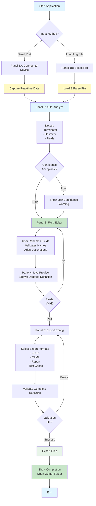

# Protocol Analyzer Tool - Complete Application UI Design

**Document:** Unified Protocol Analyzer Application UI Design
**Version:** 1.0 (Comprehensive, Full Application)
**Date:** 2025-10-21
**Status:** Complete Application Design
**Scope:** All UI components integrated into single cohesive application

---

## Table of Contents
1. [Application Overview](#application-overview)
2. [Main Application Window](#main-application-window)
3. [Input Methods (Serial Port & Log File)](#input-methods)
4. [Analysis & Results Panel](#analysis--results-panel)
5. [Field Editor Component](#field-editor-component)
6. [Output & Export](#output--export)
7. [Integrated Workflow](#integrated-workflow)
8. [Data Models & Classes](#data-models--classes)
9. [UI Implementation](#ui-implementation)

---

## Application Overview

**Protocol Analyzer Tool** is a complete solution for analyzing serial device protocols:

```
┌─────────────────────────────────────────────┐
│ Input Methods                               │
│ ├─ Serial Port (Real-time capture)         │
│ └─ Log File (Pre-captured data)             │
└─────────────────────────────────────────────┘
                     ↓
┌─────────────────────────────────────────────┐
│ Pattern Detection & Analysis                │
│ ├─ Terminator Detection                     │
│ ├─ Delimiter Detection                      │
│ ├─ Field Analysis                           │
│ └─ Type Inference                           │
└─────────────────────────────────────────────┘
                     ↓
┌─────────────────────────────────────────────┐
│ Field Editor & Refinement                   │
│ ├─ Rename fields to meaningful names        │
│ ├─ Validate field types                     │
│ ├─ Add descriptions                         │
│ └─ Preview updated definition               │
└─────────────────────────────────────────────┘
                     ↓
┌─────────────────────────────────────────────┐
│ Export & Output                             │
│ ├─ JSON Protocol Definition                 │
│ ├─ YAML Format                              │
│ ├─ Analysis Report                          │
│ └─ Test Cases                               │
└─────────────────────────────────────────────┘
```

---

## Main Application Window

### Full Application Layout

The application uses **TabControl** for clean separation of workflow stages:

```
╔════════════════════════════════════════════════════════════════════════════╗
║  Protocol Analyzer Tool                                        [ _ □ X ]    ║
╠════════════════════════════════════════════════════════════════════════════╣
║                                                                             ║
║  ┌─ TOOLBAR ──────────────────────────────────────────────────────────────┐ ║
║  │ [New] [Open Log] [Import] [Save] [Export] | [Settings] [Help] [About] │ ║
║  └─────────────────────────────────────────────────────────────────────────┘ ║
║                                                                             ║
║  ┌─ TABCONTROL ───────────────────────────────────────────────────────────┐ ║
║  │ [▶ Input] [Analysis] [Field Editor] [Export]                          │ ║
║  ├─────────────────────────────────────────────────────────────────────────┤ ║
║  │                                                                         │ ║
║  │  ┌─ INPUT TAB ─────────────────────────────────────────────────────┐   │ ║
║  │  │                                                                │   │ ║
║  │  │  [Serial Port ▼] [Log File]                                 │   │ ║
║  │  │                                                                │   │ ║
║  │  │  ┌─ Serial Port Mode ────────────────────────────────────┐   │   │ ║
║  │  │  │                                                        │   │   │ ║
║  │  │  │ Port: [COM3        ▼]  [Refresh]                      │   │   │ ║
║  │  │  │ Baud: [9600        ▼]  [◉ Connected] [○ Disconnected] │   │   │ ║
║  │  │  │ Bits: [8 ▼] Parity: [None ▼] Stop: [1 ▼]             │   │   │ ║
║  │  │  │                                                        │   │   │ ║
║  │  │  │ [Connect] [Disconnect] [Test Connection]             │   │   │ ║
║  │  │  │                                                        │   │   │ ║
║  │  │  └────────────────────────────────────────────────────────┘   │   │ ║
║  │  │                                                                │   │ ║
║  │  │  ┌─ Live Capture Display ────────────────────────────────┐   │   │ ║
║  │  │  │ Status: ▶ Capturing...                               │   │   │ ║
║  │  │  │ Messages: 1247  |  Bytes: 18,942  |  Avg: 15 bytes   │   │   │ ║
║  │  │  │                                                        │   │   │ ║
║  │  │  │ Hex Dump:                                             │   │   │ ║
║  │  │  │ 53 54 2C 47 53 20 20 20 20 32 30 2E 37 67 20 20 0D   │   │   │ ║
║  │  │  │ 0A 55 53 2C 47 53 20 20 20 20 32 30 2E 39 67 20 20   │   │   │ ║
║  │  │  │                                                        │   │   │ ║
║  │  │  │ [Pause] [Resume] [Clear] [Save to File]              │   │   │ ║
║  │  │  │                                                        │   │   │ ║
║  │  │  └────────────────────────────────────────────────────────┘   │   │ ║
║  │  │                                                                │   │ ║
║  │  │  [◀ Back] [▶ Next: Analyze]                                 │   │ ║
║  │  │                                                                │   │ ║
║  │  └────────────────────────────────────────────────────────────────┘   │ ║
║  │                                                                         │ ║
║  └─────────────────────────────────────────────────────────────────────────┘ ║
║                                                                             ║
║  │  ┌─ Log File Mode ────────────────────────────────────────────┐   │   │ ║
║  │  │ [Browse...] [Open Recent ▼]                                │   │   │ ║
║  │  │                                                             │   │   │ ║
║  │  │ File: [________________________________________] [Browse]  │   │   │ ║
║  │  │                                                             │   │   │ ║
║  │  │ Format: ◉ Auto-detect  ○ Hex+ASCII  ○ Pure Hex  ○ Text    │   │   │ ║
║  │  │                                                             │   │   │ ║
║  │  │ ┌─ Preview ──────────────────────────────────────────────┐│   │   │ ║
║  │  │ │ 53 54 2C 47 53 20 20 20 20 32 30 2E 37 67 20 20 0D 0A ││   │   │ ║
║  │  │ │ 55 53 2C 47 53 20 20 20 20 32 30 2E 39 67 20 20 0D 0A ││   │   │ ║
║  │  │ │ ...                                                      ││   │   │ ║
║  │  │ └────────────────────────────────────────────────────────┘│   │   │ ║
║  │  │                                                             │   │   │ ║
║  │  │ [◀ Back] [▶ Next: Analyze]                                │   │   │ ║
║  │  │                                                             │   │   │ ║
║  │  └─────────────────────────────────────────────────────────────┘   │   │ ║
║  │                                                                     │   │ ║
║  └─────────────────────────────────────────────────────────────────────┘   │ ║
║                                                                             ║
║  ┌─ TABCONTROL (continued) ──────────────────────────────────────────────┐  ║
║  │ [Input] [▶ Analysis] [Field Editor] [Export]                        │  ║
║  ├──────────────────────────────────────────────────────────────────────┤  ║
║  │                                                                      │  ║
║  │  Protocol Type:                                                    │  ║
║  │  ☑ Single-package streaming  ☐ Multi-segment package  ☐ Command-response│  ║
║  │                                                                      │  ║
║  │  ┌─ Terminator Analysis ─────────────────────────────────────┐     │  ║
║  │  │ Type: \r\n (CRLF)                                         │     │  ║
║  │  │ Bytes: 0x0D 0x0A                                          │     │  ║
║  │  │ Frequency: 1247/1247 (100%)                               │     │  ║
║  │  │ Confidence: 100%  ████████████████████░░                 │     │  ║
║  │  └────────────────────────────────────────────────────────────┘     │  ║
║  │                                                                      │  ║
║  │  ┌─ Delimiter Analysis ──────────────────────────────────────┐     │  ║
║  │  │ Delimiter | Frequency | Confidence | Structural         │     │  ║
║  │  │ Comma (,) | 100%      | 100%       | Yes               │     │  ║
║  │  │ Space ( ) | 100%      | 70%        | No                │     │  ║
║  │  └────────────────────────────────────────────────────────────┘     │  ║
║  │                                                                      │  ║
║  │  ┌─ Fields Detected ─────────────────────────────────────────┐     │  ║
║  │  │ Field 0: Status (string) - Confidence: 95%               │     │  ║
║  │  │ Field 1: Mode (string) - Confidence: 98%                 │     │  ║
║  │  │ Field 2: Weight (decimal) - Confidence: 90%              │     │  ║
║  │  └────────────────────────────────────────────────────────────┘     │  ║
║  │                                                                      │  ║
║  │  Overall Confidence: 95%  ████████░░                              │  ║
║  │                                                                      │  ║
║  │  [◀ Back] [▶ Next: Edit Fields]                                    │  ║
║  │                                                                      │  ║
║  └──────────────────────────────────────────────────────────────────────┘  ║
║                                                                             ║
║  ┌─ TABCONTROL (continued) ──────────────────────────────────────────────┐  ║
║  │ [Input] [Analysis] [▶ Field Editor] [Export]                         │  ║
║  ├──────────────────────────────────────────────────────────────────────┤  ║
║  │                                                                      │  ║
║  │  ┌─ Fields Table (Editable) ────────────────────────────────┐       │  ║
║  │  │ Pos │ Current Name │ New Name      │ Type    │ Sample     │       │  ║
║  │  ├─────┼──────────────┼───────────────┼─────────┼────────────┤       │  ║
║  │  │  0  │ Field0       │ [Status     ]│ string  │ ST, US     │       │  ║
║  │  │  1  │ Field1       │ [Mode       ]│ string  │ GS         │       │  ║
║  │  │  2  │ Field2       │ [Weight     ]│ decimal │ 20.7, 85.5 │       │  ║
║  │  └─────────────────────────────────────────────────────────────────┘       │  ║
║  │                                                                      │  ║
║  │  [Suggest Names] [Validate] [Undo] [Redo]                         │  ║
║  │                                                                      │  ║
║  │  ┌─ Selected Field Details ──────────────────────────────────┐     │  ║
║  │  │ Name: Status           Description: [____________]        │     │  ║
║  │  │ Type: string           Unit: [        ]                  │     │  ║
║  │  │ Allowed Values: ST, US (from data)                       │     │  ║
║  │  │ ☑ Required  ☐ Is Constant  ☐ Contains Unit              │     │  ║
║  │  └────────────────────────────────────────────────────────────┘     │  ║
║  │                                                                      │  ║
║  │  ┌─ Live Definition Preview ────────────────────────────────┐       │  ║
║  │  │ {                                                        │       │  ║
║  │  │   "protocol": {                                          │       │  ║
║  │  │     "fields": [                                          │       │  ║
║  │  │       { "name": "Status", "type": "string" },            │       │  ║
║  │  │       { "name": "Mode", "type": "string" },              │       │  ║
║  │  │       { "name": "Weight", "type": "decimal" }            │       │  ║
║  │  │     ]                                                    │       │  ║
║  │  │   }                                                      │       │  ║
║  │  │ }                                                        │       │  ║
║  │  └────────────────────────────────────────────────────────────┘     │  ║
║  │                                                                      │  ║
║  │  [◀ Back] [▶ Next: Export]                                         │  ║
║  │                                                                      │  ║
║  └──────────────────────────────────────────────────────────────────────┘  ║
║                                                                             ║
║  ┌─ TABCONTROL (continued) ──────────────────────────────────────────────┐  ║
║  │ [Input] [Analysis] [Field Editor] [▶ Export]                         │  ║
║  ├──────────────────────────────────────────────────────────────────────┤  ║
║  │                                                                      │  ║
║  │  Status: ✓ All fields valid (3 fields, 100% confidence)             │  ║
║  │                                                                      │  ║
║  │  Validation Results:                                                │  ║
║  │  ✓ Field names are valid C# identifiers                             │  ║
║  │  ✓ All field names are unique                                       │  ║
║  │  ✓ Definition can parse 100% of test messages                       │  ║
║  │                                                                      │  ║
║  │  ┌─ Export Configuration ────────────────────────────────────┐      │  ║
║  │  │ Device Name: [TScaleNHB              ]                   │      │  ║
║  │  │ Output Folder: [C:\Protocols\  Browse]                   │      │  ║
║  │  │                                                           │      │  ║
║  │  │ Export Formats:                                           │      │  ║
║  │  │ ☑ JSON  ☑ YAML  ☑ Analysis Report  ☑ Test Cases         │      │  ║
║  │  └────────────────────────────────────────────────────────────┘      │  ║
║  │                                                                      │  ║
║  │  [◀ Back] [▶ Export] [Save Draft] [Exit]                           │  ║
║  │                                                                      │  ║
║  └──────────────────────────────────────────────────────────────────────┘  ║
║                                                                             ║
║  Status Bar: Ready | 1247 messages | 95% confidence | All valid           ║
║                                                                             ║
╚════════════════════════════════════════════════════════════════════════════╝
```

---

## Input Methods

### Panel 1A: Serial Port Mode

```csharp
public class SerialPortInputPanel : UserControl
{
    private SerialPortReader _reader;
    private ObservableCollection<string> _availablePorts;
    private DispatcherTimer _captureTimer;

    private TextBox _portComboBox;
    private TextBox _baudRateComboBox;
    private TextBox _hexDumpTextBox;
    private Label _statusLabel;
    private Label _messageCountLabel;
    private Label _bytesCountLabel;

    public event EventHandler<CaptureCompletedEventArgs> CaptureCompleted;

    public void InitializeSerialPort()
    {
        _reader = new SerialPortReader();
        _reader.DataReceived += OnDataReceived;
        _reader.ConnectionStatusChanged += OnConnectionStatusChanged;

        RefreshAvailablePorts();
    }

    private void OnDataReceived(object sender, DataReceivedEventArgs e)
    {
        Dispatcher.Invoke(() =>
        {
            _hexDumpTextBox.AppendText($"{e.HexData}\r\n");

            _messageCountLabel.Content = _reader.GetCapturedData().MessageCount;
            _bytesCountLabel.Content = _reader.GetCapturedData().TotalBytes;

            UpdateCaptureStatistics();
        });
    }

    private void Connect_Click(object sender, RoutedEventArgs e)
    {
        var settings = new SerialPortReader.ConnectionSettings
        {
            PortName = (string)_portComboBox.SelectedItem,
            BaudRate = int.Parse((string)_baudRateComboBox.SelectedItem)
        };

        _reader.Connect(settings);
    }

    public LogData GetCapturedData()
    {
        return _reader.GetCapturedData();
    }

    public void SaveCaptureToFile(string filePath)
    {
        _reader.SaveCaptureToFile(filePath);
    }
}
```

### Panel 1B: Log File Mode

```csharp
public class LogFileInputPanel : UserControl
{
    private HexLogParser _parser;
    private TextBox _filePathTextBox;
    private TextBox _hexPreviewTextBox;

    public event EventHandler<FileLoadedEventArgs> FileLoaded;

    private void BrowseButton_Click(object sender, RoutedEventArgs e)
    {
        var dialog = new OpenFileDialog
        {
            Filter = "Text files (*.txt)|*.txt|All files (*.*)|*.*",
            Title = "Select Serial Log File"
        };

        if (dialog.ShowDialog() == true)
        {
            LoadLogFile(dialog.FileName);
        }
    }

    private void LoadLogFile(string filePath)
    {
        try
        {
            byte[] rawBytes = _parser.ParseLogFile(filePath);
            LogData data = ExtractMessages(rawBytes);

            FileLoaded?.Invoke(this, new FileLoadedEventArgs { LogData = data });

            // Show preview
            DisplayPreview(filePath, rawBytes);
        }
        catch (Exception ex)
        {
            MessageBox.Show($"Error loading file: {ex.Message}");
        }
    }

    private void DisplayPreview(string filePath, byte[] data)
    {
        var hex = BitConverter.ToString(data, 0, Math.Min(500, data.Length));
        _hexPreviewTextBox.Text = hex.Replace("-", " ");
        _filePathTextBox.Text = filePath;
    }
}
```

---

## Analysis & Results Panel

### Panel 2: Automatic Pattern Detection

```csharp
public class AnalysisResultsPanel : UserControl
{
    private PatternAnalyzer _analyzer;
    private AnalysisResult _currentAnalysis;

    public void AnalyzeLogData(LogData logData)
    {
        _currentAnalysis = _analyzer.Analyze(logData);

        // Update UI with results
        UpdateProtocolType();
        UpdateTerminatorResults();
        UpdateDelimiterResults();
        UpdateFieldDetection();
        UpdateConfidenceScore();
    }

    private void UpdateProtocolType()
    {
        var protocolType = DetectProtocolType(_currentAnalysis);

        ProtocolTypeCheckBox1.IsChecked = (protocolType == ProtocolType.SingleLine);
        ProtocolTypeCheckBox2.IsChecked = (protocolType == ProtocolType.MultiLine);
        ProtocolTypeCheckBox3.IsChecked = (protocolType == ProtocolType.CommandResponse);
    }

    private void UpdateTerminatorResults()
    {
        TerminatorTypeLabel.Content = _currentAnalysis.Terminator.String;
        TerminatorConfidenceLabel.Content =
            $"{(_currentAnalysis.Terminator.Confidence * 100):F0}%";
    }

    private void UpdateDelimiterResults()
    {
        DelimiterListBox.ItemsSource = _currentAnalysis.Delimiters
            .OrderByDescending(d => d.Confidence)
            .Select(d => new
            {
                Character = d.Character,
                Frequency = $"{(d.Frequency * 100):F0}%",
                Confidence = $"{(d.Confidence * 100):F0}%"
            });
    }

    private void UpdateFieldDetection()
    {
        FieldCountLabel.Content = _currentAnalysis.Fields.Count;
    }

    private void UpdateConfidenceScore()
    {
        double confidence = _currentAnalysis.Confidence;
        ConfidenceProgressBar.Value = confidence * 100;
        ConfidenceLabel.Content = $"{(confidence * 100):F0}%";
    }
}
```

---

## Field Editor Component

### Panel 3: Integrated Field Editor

```csharp
public class FieldEditorPanel : UserControl
{
    private List<FieldDefinition> _fields;
    private DataGrid _fieldsGrid;
    private TextBox _fieldNameTextBox;
    private TextBox _fieldDescriptionTextBox;
    private ComboBox _fieldTypeComboBox;

    public event EventHandler FieldsChanged;

    public void LoadFields(List<FieldInfo> autoDetectedFields)
    {
        _fields = autoDetectedFields.Select((f, i) => new FieldDefinition
        {
            Position = f.Position,
            AutoGeneratedName = $"Field{i}",
            UserDefinedName = $"Field{i}",
            DataType = f.Type,
            SampleValues = f.SampleValues,
            Confidence = f.Confidence,
            IsValid = true
        }).ToList();

        RefreshFieldsGrid();
    }

    private void RefreshFieldsGrid()
    {
        _fieldsGrid.ItemsSource = null;
        _fieldsGrid.ItemsSource = _fields;
    }

    private void FieldsGrid_CellEditEnded(object sender, DataGridCellEditEndedEventArgs e)
    {
        var field = (FieldDefinition)e.Row.Item;

        // Validate field name as C# identifier
        if (!IsValidCSharpIdentifier(field.UserDefinedName))
        {
            MessageBox.Show("Invalid field name. Must be a valid C# identifier.");
            field.UserDefinedName = field.AutoGeneratedName;
            e.Row.Undo();
            return;
        }

        // Check uniqueness
        var duplicates = _fields.Where(f => f.UserDefinedName == field.UserDefinedName && f != field);
        if (duplicates.Any())
        {
            MessageBox.Show("Field name must be unique.");
            field.UserDefinedName = field.AutoGeneratedName;
            e.Row.Undo();
            return;
        }

        field.IsValid = true;
        FieldsChanged?.Invoke(this, EventArgs.Empty);
        RefreshDefinitionPreview();
    }

    private bool IsValidCSharpIdentifier(string name)
    {
        if (string.IsNullOrEmpty(name))
            return false;

        if (!char.IsLetter(name[0]) && name[0] != '_')
            return false;

        foreach (char c in name.Skip(1))
        {
            if (!char.IsLetterOrDigit(c) && c != '_')
                return false;
        }

        // Check for C# keywords
        var keywords = new[] { "class", "namespace", "public", "private", "int", "string", "bool" };
        return !keywords.Contains(name);
    }

    public FieldDefinition[] GetEditedFields()
    {
        return _fields.ToArray();
    }

    public class FieldDefinition
    {
        public int Position { get; set; }
        public string AutoGeneratedName { get; set; }
        public string UserDefinedName { get; set; }
        public string DataType { get; set; }
        public List<string> SampleValues { get; set; }
        public double Confidence { get; set; }
        public string Description { get; set; }
        public bool IsRequired { get; set; }
        public bool IsConstant { get; set; }
        public bool IsValid { get; set; }
    }
}
```

---

## Output & Export

### Panel 5: Export Configuration

```csharp
public class ExportPanel : UserControl
{
    private ProtocolDefinition _definition;
    private TextBox _deviceNameTextBox;
    private CheckBox _jsonCheckBox;
    private CheckBox _yamlCheckBox;
    private CheckBox _reportCheckBox;
    private CheckBox _testCasesCheckBox;
    private TextBox _outputFolderTextBox;

    public void PrepareExport(FieldEditorPanel.FieldDefinition[] fields, AnalysisResult analysis)
    {
        // Build protocol definition from edited fields
        _definition = BuildProtocolDefinition(fields, analysis);

        // Validate
        ValidateDefinition();

        // Show export options
        UpdateExportUI();
    }

    private ProtocolDefinition BuildProtocolDefinition(
        FieldEditorPanel.FieldDefinition[] fields,
        AnalysisResult analysis)
    {
        return new ProtocolDefinition
        {
            DeviceInfo = new DeviceInfo
            {
                Name = _deviceNameTextBox.Text,
                CreatedDate = DateTime.Now
            },
            Protocol = new ProtocolSpec
            {
                Type = "streaming",
                Terminator = analysis.Terminator.String,
                Fields = fields.Select(f => new FieldSpec
                {
                    Name = f.UserDefinedName,
                    Position = f.Position,
                    Type = f.DataType,
                    Description = f.Description,
                    Confidence = f.Confidence
                }).ToList()
            }
        };
    }

    private void ValidateDefinition()
    {
        var validation = ProtocolValidator.Validate(_definition);

        ValidationListBox.ItemsSource = validation.Messages;
        StatusLabel.Content = validation.IsValid
            ? "✓ All fields valid"
            : "✗ Validation errors found";
    }

    public void ExportDefinition()
    {
        string basePath = _outputFolderTextBox.Text;

        if (_jsonCheckBox.IsChecked.Value)
            ExportAsJson(basePath);

        if (_yamlCheckBox.IsChecked.Value)
            ExportAsYaml(basePath);

        if (_reportCheckBox.IsChecked.Value)
            ExportAsReport(basePath);

        if (_testCasesCheckBox.IsChecked.Value)
            ExportTestCases(basePath);

        MessageBox.Show("Export completed successfully!");
    }

    private void ExportAsJson(string basePath)
    {
        string json = JsonConvert.SerializeObject(_definition, Formatting.Indented);
        string filePath = Path.Combine(basePath, $"{_definition.DeviceInfo.Name}_Protocol.json");
        File.WriteAllText(filePath, json);
    }

    private void ExportAsYaml(string basePath)
    {
        var serializer = new SerializerBuilder().Build();
        string yaml = serializer.Serialize(_definition);
        string filePath = Path.Combine(basePath, $"{_definition.DeviceInfo.Name}_Protocol.yaml");
        File.WriteAllText(filePath, yaml);
    }
}
```

---

## Integrated Workflow

### Complete Application Flow



---

## Data Models & Classes

### Core Data Structures

```csharp
namespace NLib.Serial.ProtocolAnalyzer
{
    // Input: Captured or loaded log data
    public class LogData
    {
        public List<byte[]> Messages { get; set; }
        public int TotalBytes { get; set; }
        public int MessageCount { get; set; }
        public int AverageMessageLength { get; set; }
        public DateTime CapturedTime { get; set; }
    }

    // Analysis: Pattern detection results
    public class AnalysisResult
    {
        public TerminatorInfo Terminator { get; set; }
        public List<DelimiterInfo> Delimiters { get; set; }
        public List<FieldInfo> Fields { get; set; }
        public int MessageCount { get; set; }
        public double Confidence { get; set; }
        public string SuggestedStrategy { get; set; }
    }

    // Field: Detected field information
    public class FieldInfo
    {
        public int Position { get; set; }
        public string AutoName { get; set; }
        public string Type { get; set; }
        public List<string> SampleValues { get; set; }
        public double Confidence { get; set; }
    }

    // Output: Protocol definition
    public class ProtocolDefinition
    {
        public DeviceInfo DeviceInfo { get; set; }
        public ProtocolSpec Protocol { get; set; }
        public ParsingSpec Parsing { get; set; }
        public ValidationSpec Validation { get; set; }
        public List<TestCase> TestCases { get; set; }
    }

    public class DeviceInfo
    {
        public string Name { get; set; }
        public string Manufacturer { get; set; }
        public string Model { get; set; }
        public string Description { get; set; }
        public DateTime CreatedDate { get; set; }
        public double AnalysisConfidence { get; set; }
    }

    public class ProtocolSpec
    {
        public string Type { get; set; }
        public string Format { get; set; }
        public string Encoding { get; set; }
        public string Terminator { get; set; }
        public List<FieldSpec> Fields { get; set; }
    }

    public class FieldSpec
    {
        public string Name { get; set; }
        public int Position { get; set; }
        public string Type { get; set; }
        public string Description { get; set; }
        public List<string> AllowedValues { get; set; }
        public double Confidence { get; set; }
        public bool IsRequired { get; set; }
        public bool IsConstant { get; set; }
    }

    public class ParsingSpec
    {
        public string Strategy { get; set; }
        public string Delimiter { get; set; }
        public List<string> Steps { get; set; }
    }

    public class ValidationSpec
    {
        public List<string> Required { get; set; }
        public Dictionary<string, Constraint> Constraints { get; set; }
    }

    public class TestCase
    {
        public string Name { get; set; }
        public byte[] InputBytes { get; set; }
        public Dictionary<string, object> ExpectedOutput { get; set; }
    }
}
```

---

## UI Implementation

### Main Window Class

```csharp
public partial class MainWindow : Window
{
    private SerialPortInputPanel _panelSerialPort;
    private LogFileInputPanel _panelLogFile;
    private AnalysisResultsPanel _panelAnalysis;
    private FieldEditorPanel _panelFieldEditor;
    private ExportPanel _panelExport;

    private PatternAnalyzer _analyzer;
    private LogData _currentLogData;
    private AnalysisResult _currentAnalysis;

    public MainWindow()
    {
        InitializeComponent();
        InitializeAllPanels();
        SetupEventHandlers();
    }

    private void InitializeAllPanels()
    {
        _panelSerialPort = new SerialPortInputPanel();
        _panelLogFile = new LogFileInputPanel();
        _panelAnalysis = new AnalysisResultsPanel();
        _panelFieldEditor = new FieldEditorPanel();
        _panelExport = new ExportPanel();

        // Add panels to UI
        InputPanelHost.Children.Add(_panelSerialPort);
        AnalysisPanelHost.Children.Add(_panelAnalysis);
        FieldEditorPanelHost.Children.Add(_panelFieldEditor);
        ExportPanelHost.Children.Add(_panelExport);
    }

    private void SetupEventHandlers()
    {
        _panelSerialPort.CaptureCompleted += (s, e) =>
        {
            _currentLogData = e.LogData;
            AnalyzeData();
        };

        _panelLogFile.FileLoaded += (s, e) =>
        {
            _currentLogData = e.LogData;
            AnalyzeData();
        };

        _panelFieldEditor.FieldsChanged += (s, e) =>
        {
            _panelExport.PrepareExport(_panelFieldEditor.GetEditedFields(), _currentAnalysis);
        };
    }

    private void AnalyzeData()
    {
        _currentAnalysis = _analyzer.Analyze(_currentLogData);
        _panelAnalysis.AnalyzeLogData(_currentLogData);
        _panelFieldEditor.LoadFields(_currentAnalysis.Fields);
    }

    private void AnalyzeButton_Click(object sender, RoutedEventArgs e)
    {
        AnalyzeData();
        TabControl.SelectedIndex = 1; // Show Analysis panel
    }

    private void ExportButton_Click(object sender, RoutedEventArgs e)
    {
        _panelExport.ExportDefinition();
    }
}
```

---

## Summary

This comprehensive design ensures:

✅ **Unified UI** - All components integrated into one cohesive application
✅ **Data Flow** - Clear progression: Input → Analysis → Edit → Export
✅ **Compatibility** - All components work together seamlessly
✅ **User Experience** - Intuitive workflow with live previews
✅ **Extensibility** - Easy to add new features without breaking compatibility

**Next Implementation Steps:**
1. Build Main Window layout in WPF
2. Implement panel components
3. Connect event handlers for data flow
4. Add validation and error handling
5. Implement export functionality

