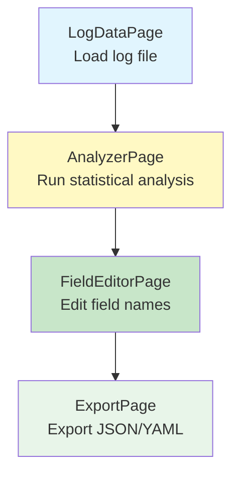
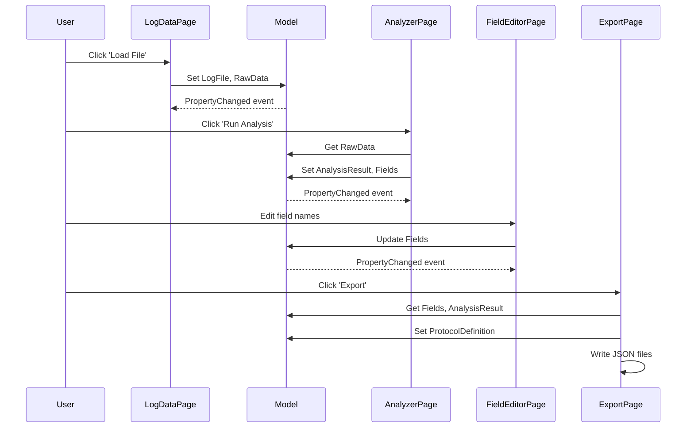

# Protocol Analyzer Tool - Complete Application UI Design

**Document:** Unified Protocol Analyzer Application UI Design
**Version:** 2.0 (Simplified, Clean Design)
**Date:** 2025-10-26
**Status:** Updated with DockPanel/StackPanel Architecture
**Scope:** All UI components integrated into single cohesive application

---

## Table of Contents
1. [Application Overview](#application-overview)
2. [Architecture Design](#architecture-design)
3. [Main Application Window](#main-application-window)
4. [Page 1: LogDataPage (Input)](#page-1-logdatapage-input)
5. [Page 2: AnalyzerPage (Analysis)](#page-2-analyzerpage-analysis)
6. [Page 3: FieldEditorPage (Field Editor)](#page-3-fieldeditorpage-field-editor)
7. [Page 4: ExportPage (Export)](#page-4-exportpage-export)
8. [Integrated Workflow](#integrated-workflow)
9. [Data Flow & Models](#data-flow--models)

---

## Application Overview

**Protocol Analyzer Tool** is a complete solution for analyzing serial device protocols:



### Workflow Steps

| Step | Page | Purpose | Input | Output |
|------|------|---------|-------|--------|
| 1 | **LogDataPage** | Load data from file | Log file path | byte[] raw data |
| 2 | **AnalyzerPage** | Analyze patterns | byte[] raw data | Analysis results |
| 3 | **FieldEditorPage** | Edit fields | Detected fields | Edited field definitions |
| 4 | **ExportPage** | Export definition | Field definitions | JSON/YAML files |

---

## Architecture Design

### Single Shared Model Pattern

All pages share a single `ProtocolAnalyzerModel` instance:

```csharp
MainWindow
    ↓ (creates & owns)
[ProtocolAnalyzerModel] ← Single instance
    ↓ (injected via Setup())
┌──────────┬──────────┬──────────┬──────────┐
│LogData   │Analyzer  │FieldEdit │Export    │
│Page      │Page      │Page      │Page      │
└──────────┴──────────┴──────────┴──────────┘
```

**Key Principles:**
- ✅ One model instance created in MainWindow
- ✅ All pages receive model via `Setup(model)` method
- ✅ Pages bind UI to model properties
- ✅ Model implements `INotifyPropertyChanged`
- ✅ Automatic UI updates across all pages

### Layout Strategy

**All layouts use DockPanel/StackPanel** (no Grid.RowDefinitions/ColumnDefinitions):

```
DockPanel (Main container)
├── DockPanel.Dock="Top" → Headers, buttons
├── DockPanel.Dock="Bottom" → Actions, status
└── (Center - fills remaining) → Main content
```

---

## Main Application Window

### Window Structure

```
┌──────────────────────────────────────────────────┐
│ Serial Protocol Analyzer              [_][□][X] │
├──────────────────────────────────────────────────┤
│ ┌─ TABS ───────────────────────────────────────┐│
│ │[1️⃣ Input][2️⃣ Analysis][3️⃣ Field Editor][4️⃣ Export]││
│ ├──────────────────────────────────────────────┤│
│ │                                              ││
│ │  (Page UserControl Content Here)            ││
│ │                                              ││
│ │                                              ││
│ └──────────────────────────────────────────────┘│
├──────────────────────────────────────────────────┤
│ Ready │ 0 entries │ Confidence: N/A             │
└──────────────────────────────────────────────────┘
```

### MainWindow.xaml

```xml
<Window x:Class="NLib.Serial.Protocol.Analyzer.MainWindow"
        xmlns="http://schemas.microsoft.com/winfx/2006/xaml/presentation"
        xmlns:x="http://schemas.microsoft.com/winfx/2006/xaml"
        xmlns:local="clr-namespace:NLib.Serial.Protocol.Analyzer.Pages"
        Title="Serial Protocol Analyzer"
        Height="700"
        Width="1000"
        WindowStartupLocation="CenterScreen">

    <DockPanel>

        <!-- STATUS BAR (Bottom) -->
        <StatusBar DockPanel.Dock="Bottom" Height="25" Background="#F0F0F0">
            <StatusBarItem>
                <StackPanel Orientation="Horizontal">
                    <TextBlock x:Name="StatusText" Text="Ready" Margin="5,0,20,0"/>
                    <TextBlock Text="│" Foreground="Gray" Margin="0,0,5,0"/>
                    <TextBlock x:Name="EntryCountText" Text="0 entries" Margin="5,0,20,0"/>
                    <TextBlock Text="│" Foreground="Gray" Margin="0,0,5,0"/>
                    <TextBlock x:Name="ConfidenceStatusText" Text="Confidence: N/A" Margin="5,0,0,0"/>
                </StackPanel>
            </StatusBarItem>
        </StatusBar>

        <!-- MAIN TABCONTROL (Center - fills space) -->
        <TabControl x:Name="MainTabControl"
                    Margin="10"
                    SelectionChanged="MainTabControl_SelectionChanged">

            <!-- Tab 1: Input -->
            <TabItem>
                <TabItem.Header>
                    <StackPanel Orientation="Horizontal">
                        <TextBlock Text="1️⃣" FontSize="16" Margin="0,0,5,0"/>
                        <TextBlock Text="Input Data" FontSize="13" VerticalAlignment="Center"/>
                    </StackPanel>
                </TabItem.Header>
                <local:LogDataPage x:Name="LogDataPage" />
            </TabItem>

            <!-- Tab 2: Analysis -->
            <TabItem>
                <TabItem.Header>
                    <StackPanel Orientation="Horizontal">
                        <TextBlock Text="2️⃣" FontSize="16" Margin="0,0,5,0"/>
                        <TextBlock Text="Analysis" FontSize="13" VerticalAlignment="Center"/>
                    </StackPanel>
                </TabItem.Header>
                <local:AnalyzerPage x:Name="AnalyzerPage" />
            </TabItem>

            <!-- Tab 3: Field Editor -->
            <TabItem>
                <TabItem.Header>
                    <StackPanel Orientation="Horizontal">
                        <TextBlock Text="3️⃣" FontSize="16" Margin="0,0,5,0"/>
                        <TextBlock Text="Field Editor" FontSize="13" VerticalAlignment="Center"/>
                    </StackPanel>
                </TabItem.Header>
                <local:FieldEditorPage x:Name="FieldEditorPage" />
            </TabItem>

            <!-- Tab 4: Export -->
            <TabItem>
                <TabItem.Header>
                    <StackPanel Orientation="Horizontal">
                        <TextBlock Text="4️⃣" FontSize="16" Margin="0,0,5,0"/>
                        <TextBlock Text="Export" FontSize="13" VerticalAlignment="Center"/>
                    </StackPanel>
                </TabItem.Header>
                <local:ExportPage x:Name="ExportPage" />
            </TabItem>

        </TabControl>

    </DockPanel>
</Window>
```

### MainWindow.xaml.cs

```csharp
public partial class MainWindow : Window
{
    // Single shared model instance
    private ProtocolAnalyzerModel _model;

    public MainWindow()
    {
        InitializeComponent();

        // Create THE model (single instance)
        _model = new ProtocolAnalyzerModel();

        // Subscribe to model property changes
        _model.PropertyChanged += Model_PropertyChanged;

        // Setup all pages with the model
        // Pages already exist (created by XAML), just call Setup()
        LogDataPage.Setup(_model);
        AnalyzerPage.Setup(_model);
        FieldEditorPage.Setup(_model);
        ExportPage.Setup(_model);

        // Initialize status bar
        UpdateStatusBar();
    }

    private void Model_PropertyChanged(object sender, PropertyChangedEventArgs e)
    {
        UpdateStatusBar();
    }

    private void UpdateStatusBar()
    {
        // Update entry count
        if (_model.LogFile != null && _model.LogFile.Entries != null)
            EntryCountText.Text = $"{_model.LogFile.Entries.Count} entries";
        else
            EntryCountText.Text = "0 entries";

        // Update confidence
        if (_model.AnalysisResult != null)
        {
            double confidence = _model.AnalysisResult.OverallConfidence * 100;
            ConfidenceStatusText.Text = $"Confidence: {confidence:F1}%";
        }
        else
            ConfidenceStatusText.Text = "Confidence: N/A";

        // Update general status
        if (_model.ProtocolDefinition != null)
            StatusText.Text = "✅ Ready to export";
        else if (_model.AnalysisResult != null)
            StatusText.Text = "✅ Analysis complete";
        else if (_model.LogFile != null)
            StatusText.Text = "✅ Data loaded";
        else
            StatusText.Text = "Ready";
    }

    private void MainTabControl_SelectionChanged(object sender, SelectionChangedEventArgs e)
    {
        // Validate data before allowing tab switch
        if (MainTabControl.SelectedIndex == 1) // Analysis tab
        {
            if (_model.LogFile == null || _model.RawData == null)
            {
                MessageBox.Show("Please load data first in the Input tab.");
                MainTabControl.SelectedIndex = 0;
            }
        }
        else if (MainTabControl.SelectedIndex == 2) // Field Editor tab
        {
            if (_model.AnalysisResult == null || _model.Fields == null)
            {
                MessageBox.Show("Please run analysis first in the Analysis tab.");
                MainTabControl.SelectedIndex = 1;
            }
        }
        else if (MainTabControl.SelectedIndex == 3) // Export tab
        {
            if (_model.Fields == null || _model.Fields.Count == 0)
            {
                MessageBox.Show("Please define fields first in the Field Editor tab.");
                MainTabControl.SelectedIndex = 2;
            }
        }
    }
}
```

---

## Page 1: LogDataPage (Input)

### Purpose
Load serial log data from files and display statistics.

### UI Layout

```
┌─────────────────────────────────────────────────┐
│ 📁 Log File Selection                           │
│ ┌─────────────────────────────────┐ [Browse...] │
│ │ C:\Logs\capture.txt             │             │
│ └─────────────────────────────────┘             │
│ ○ Auto-detect ○ HEX+Text ○ HEX Only ○ Text     │
│ [📂 Load File]                                  │
├─────────────────────────────────────────────────┤
│ 📊 File Statistics                              │
│ ┌──────┐ ┌──────┐ ┌──────┐ ┌──────┐           │
│ │ 1247 │ │18942 │ │  15  │ │42 KB │           │
│ │Entry │ │Bytes │ │Avg   │ │Size  │           │
│ └──────┘ └──────┘ └──────┘ └──────┘           │
├─────────────────────────────────────────────────┤
│ 🔍 Hex Preview (First 50 entries)              │
│ ┌─────────────────────────────────────────────┐│
│ │ Line 1: 53 54 2C 47 53 20 20 20 32 30 2E 37││
│ │ Line 2: 55 53 2C 47 53 20 20 20 32 31 2E 31││
│ │ ...                                         ││
│ └─────────────────────────────────────────────┘│
├─────────────────────────────────────────────────┤
│ 📝 Text Preview (ASCII)                        │
│ ┌─────────────────────────────────────────────┐│
│ │ ST,GS    20.7g                              ││
│ │ US,GS    21.1g                              ││
│ └─────────────────────────────────────────────┘│
├─────────────────────────────────────────────────┤
│                       [Clear] [▶ Next: Analyze] │
└─────────────────────────────────────────────────┘
```

### XAML Structure

```xml
<UserControl x:Class="...LogDataPage">
    <DockPanel Margin="10">

        <!-- ACTION BUTTONS (Bottom) -->
        <StackPanel DockPanel.Dock="Bottom" Orientation="Horizontal"
                    HorizontalAlignment="Right" Margin="0,10,0,0">
            <Button Content="Clear" Click="ClearButton_Click"/>
            <Button Content="▶ Next: Analyze" Click="NextButton_Click"/>
        </StackPanel>

        <!-- FILE SELECTION (Top) -->
        <GroupBox DockPanel.Dock="Top" Header="📁 Log File Selection">
            <StackPanel Margin="5">
                <DockPanel Margin="5">
                    <Button Content="Browse..." DockPanel.Dock="Right"
                            Click="BrowseButton_Click"/>
                    <TextBox x:Name="FilePathTextBox" IsReadOnly="True"/>
                </DockPanel>
                <StackPanel Orientation="Horizontal">
                    <RadioButton Content="Auto-detect" IsChecked="True"/>
                    <RadioButton Content="HEX + Text"/>
                    <!-- ... -->
                </StackPanel>
                <Button Content="📂 Load File" Click="LoadButton_Click"/>
            </StackPanel>
        </GroupBox>

        <!-- STATISTICS PANEL (Top) -->
        <GroupBox DockPanel.Dock="Top" Header="📊 File Statistics">
            <StackPanel Orientation="Horizontal">
                <!-- Stat cards (4 cards) -->
                <Border Width="180">
                    <StackPanel>
                        <TextBlock Text="Total Entries"/>
                        <TextBlock Text="{Binding LogFile.Entries.Count}"/>
                    </StackPanel>
                </Border>
                <!-- ... more cards ... -->
            </StackPanel>
        </GroupBox>

        <!-- MAIN CONTENT (Center - fills remaining) -->
        <DockPanel Margin="0,10,0,0">
            <!-- Text Preview (Bottom of center) -->
            <GroupBox DockPanel.Dock="Bottom" Header="📝 Text Preview">
                <TextBox x:Name="TextPreviewTextBox"/>
            </GroupBox>

            <!-- Hex Preview (Fills remaining) -->
            <GroupBox Header="🔍 Hex Preview">
                <TextBox x:Name="HexPreviewTextBox"/>
            </GroupBox>
        </DockPanel>

    </DockPanel>
</UserControl>
```

### Code-Behind Pattern

```csharp
public partial class LogDataPage : UserControl
{
    private ProtocolAnalyzerModel _model;
    private ParserService _parserService;

    public LogDataPage()
    {
        InitializeComponent();
        _parserService = new ParserService();
    }

    /// <summary>
    /// Setup method - called by MainWindow to inject model
    /// </summary>
    public void Setup(ProtocolAnalyzerModel model)
    {
        _model = model;
        DataContext = _model; // Bind UI to model
    }

    private void LoadButton_Click(object sender, RoutedEventArgs e)
    {
        // Use service to load data into model
        _model.LogFile = _parserService.ParseFile(FilePathTextBox.Text);
        _model.RawData = _model.LogFile.GetAllBytes();

        UpdatePreview();
    }
}
```

---

## Page 2: AnalyzerPage (Analysis)

### Purpose
Run statistical analysis and display detected patterns.

### UI Layout

```
┌─────────────────────────────────────────────────┐
│ [🔬 Run Analysis]  Click 'Run Analysis' to start│
├─────────────────────────────────────────────────┤
│ 📈 Overall Analysis Confidence                  │
│ Confidence: 95%                                 │
│ ████████████████░░░░                           │
├─────────────────────────────────────────────────┤
│ ┌───────────┐ ┌───────────┐ ┌───────────┐    │
│ │🔚Terminator│ │✂️Delimiter│ │📋Protocol │    │
│ │           │ │           │ │Type      │    │
│ │0x0D 0x0A  │ │Char│Freq │ │Single-   │    │
│ │CRLF       │ │ ,  │100% │ │Package   │    │
│ │Occurs:    │ │ SP │70%  │ │          │    │
│ │1247/1247  │ └───────────┘ │Strategy: │    │
│ │Conf: 100% │               │Delimiter │    │
│ └───────────┘               │Fields: 5 │    │
│                             └───────────┘    │
├─────────────────────────────────────────────────┤
│ 📊 Detected Fields Preview                     │
│ ┌───┬────────┬────────┬────────────┬────┬───┐│
│ │Pos│Name    │Type    │Sample Vals │Conf│Var││
│ ├───┼────────┼────────┼────────────┼────┼───┤│
│ │ 0 │Field0  │String  │ST, US      │95% │░░░││
│ │ 1 │Field1  │String  │GS          │98% │░  ││
│ │ 2 │Field2  │Decimal │20.7, 21.1  │90% │███││
│ └───┴────────┴────────┴────────────┴────┴───┘│
│ 💡 Variance: Low=constant, High=data field    │
└─────────────────────────────────────────────────┘
```

### XAML Structure

```xml
<UserControl x:Class="...AnalyzerPage">
    <DockPanel Margin="10">

        <!-- ANALYZE BUTTON (Top) -->
        <StackPanel DockPanel.Dock="Top" Orientation="Horizontal">
            <Button Content="🔬 Run Analysis" Click="AnalyzeButton_Click"/>
            <TextBlock x:Name="AnalysisStatusText"/>
        </StackPanel>

        <!-- OVERALL CONFIDENCE (Top) -->
        <GroupBox DockPanel.Dock="Top" Header="📈 Overall Confidence">
            <StackPanel>
                <StackPanel Orientation="Horizontal">
                    <TextBlock Text="Confidence: "/>
                    <TextBlock x:Name="ConfidenceText" Text="0%"/>
                </StackPanel>
                <ProgressBar x:Name="ConfidenceProgressBar"/>
            </StackPanel>
        </GroupBox>

        <!-- FIELD PREVIEW (Bottom) -->
        <GroupBox DockPanel.Dock="Bottom" Header="📊 Detected Fields">
            <DockPanel>
                <DataGrid x:Name="FieldsPreviewDataGrid"/>
                <Border DockPanel.Dock="Bottom" Background="#FFFACD">
                    <TextBlock Text="💡 Variance: Low=constant, High=data"/>
                </Border>
            </DockPanel>
        </GroupBox>

        <!-- DETECTION RESULTS (Center - 3 panels side-by-side) -->
        <StackPanel Orientation="Horizontal">
            <GroupBox Header="🔚 Terminator" Width="280">
                <!-- Terminator info -->
            </GroupBox>
            <GroupBox Header="✂️ Delimiter" Width="300">
                <!-- Delimiter DataGrid -->
            </GroupBox>
            <GroupBox Header="📋 Protocol Type" Width="260">
                <!-- Protocol info -->
            </GroupBox>
        </StackPanel>

    </DockPanel>
</UserControl>
```

---

## Page 3: FieldEditorPage (Field Editor)

### Purpose
Edit field names, types, and properties.

### UI Layout

```
┌─────────────────────────────────────────────────┐
│ ✏️ Edit Field Names    [🔤 Suggest] [✔️ Validate]│
│ Double-click to edit. Must be valid C# names.  │
├─────────────────────────────────────────────────┤
│ 📋 Field List                                   │
│ ┌───┬────────┬──────────┬────┬──────────┬───┐ │
│ │Pos│Auto    │✏️ Name   │Type│Samples   │OK?││
│ ├───┼────────┼──────────┼────┼──────────┼───┤ │
│ │ 0 │Field0  │[Status  ]│Str │ST, US    │✅ ││
│ │ 1 │Field1  │[Mode    ]│Str │GS        │✅ ││
│ │ 2 │Field2  │[Weight  ]│Dec │20.7, 21.1│✅ ││
│ └───┴────────┴──────────┴────┴──────────┴───┘ │
├─────────────────────────────────────────────────┤
│ 🔍 Selected Field Details                      │
│ ┌──────────┐ ┌──────────┐ ┌──────────┐       │
│ │Properties│ │Statistics│ │Samples   │       │
│ │Name:     │ │Total: 1247│ │ST       │       │
│ │[Status  ]│ │Unique: 5 │ │US       │       │
│ │Type:     │ │Variance: │ │...      │       │
│ │[String▼]│ │0.004     │ │         │       │
│ │☑Required│ │Conf: 95% │ │         │       │
│ └──────────┘ └──────────┘ └──────────┘       │
└─────────────────────────────────────────────────┘
```

### XAML Structure

```xml
<UserControl x:Class="...FieldEditorPage">
    <DockPanel Margin="10">

        <!-- HEADER & ACTIONS (Top) -->
        <DockPanel DockPanel.Dock="Top">
            <StackPanel DockPanel.Dock="Right" Orientation="Horizontal">
                <Button Content="🔤 Suggest Names" Click="SuggestNamesButton_Click"/>
                <Button Content="✔️ Validate All" Click="ValidateButton_Click"/>
            </StackPanel>
            <StackPanel>
                <TextBlock Text="✏️ Edit Field Names and Properties"/>
                <TextBlock Text="Double-click a cell to edit..."/>
            </StackPanel>
        </DockPanel>

        <!-- SELECTED FIELD DETAILS (Bottom) -->
        <GroupBox DockPanel.Dock="Bottom" Header="🔍 Selected Field Details">
            <StackPanel Orientation="Horizontal">
                <!-- 3 panels: Properties, Statistics, Samples -->
                <StackPanel Width="300">
                    <TextBox x:Name="FieldNameTextBox"/>
                    <ComboBox x:Name="DataTypeComboBox"/>
                    <CheckBox x:Name="RequiredCheckBox"/>
                </StackPanel>
                <StackPanel Width="250">
                    <!-- Statistics -->
                </StackPanel>
                <StackPanel>
                    <ListBox x:Name="SampleValuesListBox"/>
                </StackPanel>
            </StackPanel>
        </GroupBox>

        <!-- FIELDS GRID (Center - fills remaining) -->
        <GroupBox Header="📋 Field List">
            <DataGrid x:Name="FieldsDataGrid"
                      SelectionChanged="FieldsDataGrid_SelectionChanged"
                      CellEditEnding="FieldsDataGrid_CellEditEnding"/>
        </GroupBox>

    </DockPanel>
</UserControl>
```

---

## Page 4: ExportPage (Export)

### Purpose
Validate protocol definition and export to files.

### UI Layout

```
┌─────────────────────────────────────────────────┐
│ ✅ Validation Status: All Valid                 │
│ ✓ All field names are valid C# identifiers     │
│ ✓ All field names are unique                   │
│ ✓ All required fields are defined              │
├─────────────────────────────────────────────────┤
│ 💾 Export Configuration                         │
│ Output: [C:\Exports\  ] [Browse...]            │
│ Formats: ☑JSON ☐YAML ☐HTML Report ☐Test Cases│
├─────────────────────────────────────────────────┤
│ ┌──────────────┐ ┌──────────────┐             │
│ │📋 Protocol   │ │📊 Fields     │             │
│ │Summary       │ │Summary       │             │
│ │              │ │              │             │
│ │Device: Scale │ │#│Name│Type  │             │
│ │Type: Single  │ │0│Stat│String│             │
│ │Encoding: ASCII│ │1│Mode│String│             │
│ │Terminator:   │ │2│Wght│Decimal             │
│ │  0x0D 0x0A   │ │              │             │
│ │Delimiter:    │ │              │             │
│ │  0x2C (,)    │ │              │             │
│ │Fields: 5     │ │              │             │
│ │Confidence:   │ │              │             │
│ │  95%         │ │              │             │
│ └──────────────┘ └──────────────┘             │
├─────────────────────────────────────────────────┤
│                     [◀ Back] [💾 Export Files]  │
└─────────────────────────────────────────────────┘
```

### XAML Structure

```xml
<UserControl x:Class="...ExportPage">
    <DockPanel Margin="10">

        <!-- ACTION BUTTONS (Bottom) -->
        <StackPanel DockPanel.Dock="Bottom" Orientation="Horizontal"
                    HorizontalAlignment="Right">
            <Button Content="◀ Back" Click="BackButton_Click"/>
            <Button Content="💾 Export Files" Click="ExportButton_Click"/>
        </StackPanel>

        <!-- EXPORT CONFIGURATION (Bottom) -->
        <GroupBox DockPanel.Dock="Bottom" Header="💾 Export Configuration">
            <StackPanel>
                <DockPanel>
                    <Button Content="Browse..." DockPanel.Dock="Right"/>
                    <TextBlock Text="Output Folder:" DockPanel.Dock="Left"/>
                    <TextBox x:Name="OutputFolderTextBox"/>
                </DockPanel>
                <StackPanel Orientation="Horizontal">
                    <CheckBox Content="📄 JSON" IsChecked="True"/>
                    <CheckBox Content="📄 YAML"/>
                    <CheckBox Content="📊 Analysis Report"/>
                </StackPanel>
            </StackPanel>
        </GroupBox>

        <!-- VALIDATION STATUS (Top) -->
        <Border DockPanel.Dock="Top" x:Name="ValidationStatusBorder"
                Background="LightGreen">
            <StackPanel>
                <StackPanel Orientation="Horizontal">
                    <TextBlock Text="✅"/>
                    <TextBlock Text="Validation Status: "/>
                    <TextBlock x:Name="ValidationStatusText" Text="All Valid"/>
                </StackPanel>
                <StackPanel>
                    <TextBlock Text="✓ All field names are valid..."/>
                    <!-- ... more validation items ... -->
                </StackPanel>
            </StackPanel>
        </Border>

        <!-- PROTOCOL SUMMARY (Center - 2 panels side-by-side) -->
        <StackPanel Orientation="Horizontal">
            <GroupBox Header="📋 Protocol Summary" Width="380">
                <StackPanel>
                    <TextBox x:Name="DeviceNameTextBox"/>
                    <DockPanel>
                        <TextBlock Text="Protocol Type:"/>
                        <TextBlock x:Name="ProtocolTypeText"/>
                    </DockPanel>
                    <!-- ... more properties ... -->
                </StackPanel>
            </GroupBox>

            <GroupBox Header="📊 Fields Summary">
                <DataGrid x:Name="FieldsSummaryDataGrid"/>
            </GroupBox>
        </StackPanel>

    </DockPanel>
</UserControl>
```

---

## Integrated Workflow

### Complete User Journey

```mermaid
graph TD
    Start[User starts app] --> Tab1[Tab 1: Input Data]

    Tab1 --> Load[Click 'Load File']
    Load --> Browse[Browse for log file]
    Browse --> Parse[File parsed]
    Parse --> Stats[Statistics displayed]
    Stats --> Next1[Click 'Next: Analyze']

    Next1 --> Tab2[Tab 2: Analysis]
    Tab2 --> Analyze[Click 'Run Analysis']
    Analyze --> Detect[Statistical detection runs]
    Detect --> Results[Results displayed]
    Results --> Review[User reviews results]
    Review --> Next2[Switch to Field Editor]

    Next2 --> Tab3[Tab 3: Field Editor]
    Tab3 --> Edit[User edits field names]
    Edit --> Validate[Validation checks]
    Validate --> Next3[Switch to Export]

    Next3 --> Tab4[Tab 4: Export]
    Tab4 --> Verify[Validation status shown]
    Verify --> Configure[Configure export]
    Configure --> Export[Click 'Export Files']
    Export --> Files[JSON/YAML files created]
    Files --> Done[Done!]

    style Tab1 fill:#E1F5FE
    style Tab2 fill:#FFF9C4
    style Tab3 fill:#C8E6C9
    style Tab4 fill:#E8F5E9
    style Done fill:#4CAF50,color:#FFF
```



### Tab Validation Logic

MainWindow prevents users from skipping steps:

| Current Tab | User Tries to Go To | Validation | Action |
|-------------|---------------------|------------|---------|
| Input | Analysis | Check if data loaded | If no data → show warning, stay on Input |
| Analysis | Field Editor | Check if analysis done | If no analysis → show warning, go to Analysis |
| Field Editor | Export | Check if fields defined | If no fields → show warning, go to Editor |

---

## Data Flow & Models

### ProtocolAnalyzerModel (Shared)

```csharp
public class ProtocolAnalyzerModel : INotifyPropertyChanged
{
    // Step 1: Input Data
    public LogFile LogFile { get; set; }
    public byte[] RawData { get; set; }

    // Step 2: Analysis Results
    public AnalysisResult AnalysisResult { get; set; }

    // Step 3: Edited Fields
    public List<FieldInfo> Fields { get; set; }

    // Step 4: Final Definition
    public ProtocolDefinition ProtocolDefinition { get; set; }

    public event PropertyChangedEventHandler PropertyChanged;
}
```

### Services (Logic)

```csharp
// ParserService - Parse log files
public class ParserService
{
    public LogFile ParseFile(string filePath) { ... }
}

// AnalyzerService - Run statistical analysis
public class AnalyzerService
{
    public AnalysisResult Analyze(byte[] rawData) { ... }
}

// ExportService - Export protocol definition
public class ExportService
{
    public void ExportAsJson(ProtocolDefinition def, string path) { ... }
}
```

### Data Flow Diagram



---

## Summary

### Key Features

✅ **Ultra-Clean Design**
- No Toolbar
- No Header/Banner
- Maximum content space
- Minimal distractions

✅ **DockPanel/StackPanel Architecture**
- No Grid.RowDefinitions/ColumnDefinitions
- Simpler XAML
- Easier to maintain
- Flexible layouts

✅ **Single Shared Model**
- One `ProtocolAnalyzerModel` instance
- All pages share the same data
- Automatic UI updates via `INotifyPropertyChanged`
- Clear data flow

✅ **Workflow Validation**
- Can't skip steps
- User-friendly warnings
- Guided workflow

✅ **Rich Visualizations**
- Statistics cards with color coding
- Progress bars for confidence
- DataGrids for field/delimiter display
- Color-coded validation status

### Folder Structure

```
09.App/NLib.Serial.Protocol.Analyzer/
├── MainWindow.xaml              → TabControl + StatusBar only
├── MainWindow.xaml.cs           → Model setup, tab validation
│
├── Pages/                       → UserControl pages
│   ├── LogDataPage.xaml         → DockPanel layout
│   ├── LogDataPage.xaml.cs      → Setup(model) method
│   ├── AnalyzerPage.xaml
│   ├── AnalyzerPage.xaml.cs
│   ├── FieldEditorPage.xaml
│   ├── FieldEditorPage.xaml.cs
│   ├── ExportPage.xaml
│   └── ExportPage.xaml.cs
│
├── Models/
│   └── ProtocolAnalyzerModel.cs → Shared data model
│
└── Services/
    ├── ParserService.cs         → File parsing logic
    ├── AnalyzerService.cs       → Statistical analysis
    └── ExportService.cs         → JSON/YAML export
```

---

**Document Version**: 2.0
**Last Updated**: 2025-10-26
**Status**: Complete - Simplified Architecture with DockPanel/StackPanel
**Changes**:
- v1.0: Initial comprehensive UI design with Toolbar
- v2.0: **Complete redesign** - Removed Toolbar/Header, DockPanel/StackPanel architecture, Single shared model pattern, Detailed page layouts with visualization
