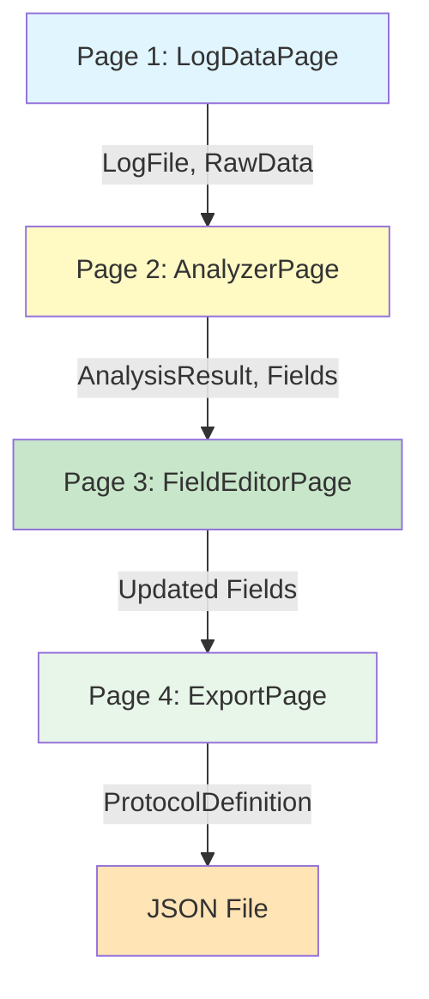

# Protocol Analyzer - Page Content Overview

**Document:** Comprehensive overview of content displayed on each page
**Version:** 1.0
**Date:** 2025-10-26
**Purpose:** Quick reference guide showing what information is displayed on each page

---

## Table of Contents

1. [Page 1: LogDataPage (Input)](#page-1-logdatapage-input)
2. [Page 2: AnalyzerPage (Analysis)](#page-2-analyzerpage-analysis)
3. [Page 3: FieldEditorPage (Field Editor)](#page-3-fieldeditorpage-field-editor)
4. [Page 4: ExportPage (Export)](#page-4-exportpage-export)
5. [Data Flow Between Pages](#data-flow-between-pages)

---

## Page 1: LogDataPage (Input)

### Primary Purpose
Load serial communication log files and display basic file information.

### Content Sections (Top to Bottom)

#### 1. **File Selection Section** 📁
**Location:** Top of page

**Content Displayed:**
- File path textbox (shows selected file path)
- Browse button (opens file dialog)
- Format selection radio buttons:
  - ○ Auto-detect (default)
  - ○ HEX + Text format
  - ○ HEX Only format
  - ○ Text Only format
- "Load File" button

**User Actions:**
- Click Browse to select log file
- Choose format (or use auto-detect)
- Click "Load File" to parse

---

#### 2. **File Statistics Cards** 📊
**Location:** Below file selection

**Content Displayed:** 4 color-coded cards in horizontal layout

| Card # | Label | Data Displayed | Color | Example |
|--------|-------|----------------|-------|---------|
| 1 | Total Entries | Count of log entries | Light Blue | 1,247 entries |
| 2 | Total Bytes | Total byte count | Light Green | 18,942 bytes |
| 3 | Average | Average bytes per entry | Orange | 15 bytes/entry |
| 4 | File Size | File size in KB | Purple | 42 KB |

**Data Source:** `LogFile.Entries.Count`, `LogFile.GetAllBytes().Length`

---

#### 3. **Hex Preview** 🔍
**Location:** Main content area (takes most space)

**Content Displayed:**
- First 50 log entries in hexadecimal format
- Format: "Line X: HH HH HH HH HH..."
- Scrollable if more than 50 entries
- Each line shows up to 16 bytes in hex

**Example:**
```
Line 1: 53 54 2C 47 53 20 20 20 20 32 30 2E 37 67 0D 0A
Line 2: 55 53 2C 47 53 20 20 20 20 32 31 2E 31 67 0D 0A
Line 3: 53 54 2C 47 53 20 20 20 20 32 30 2E 38 67 0D 0A
```

**Data Source:** `LogFile.Entries[0-49].HexData`

---

#### 4. **Text Preview** 📝
**Location:** Bottom of main area

**Content Displayed:**
- ASCII conversion of hex data
- First 50 entries
- Shows human-readable text
- Non-printable characters shown as dots (.)

**Example:**
```
ST,GS    20.7g
US,GS    21.1g
ST,GS    20.8g
```

**Data Source:** `LogFile.Entries[0-49].TextData`

---

#### 5. **Action Buttons** ▶️
**Location:** Bottom right corner

**Buttons:**
- **Clear** - Clears loaded data
- **▶ Next: Analyze** - Navigates to Analysis page

**Validation:** "Next" button disabled if no data loaded

---

### Data Model Properties Used

| Property | Type | Purpose |
|----------|------|---------|
| `LogFile` | `LogFile` | Complete parsed log file |
| `RawData` | `byte[]` | All bytes from file |
| `LogFile.Entries` | `List<LogEntry>` | Individual log entries |
| `LogFile.Format` | `FileFormat` | Detected format |

---

## Page 2: AnalyzerPage (Analysis)

### Primary Purpose
Run statistical analysis on loaded data and display detected protocol patterns.

### Content Sections (Top to Bottom)

#### 1. **Analyze Button & Status** 🔬
**Location:** Top of page

**Content Displayed:**
- "Run Analysis" button (large, prominent)
- Status text (e.g., "Analyzing...", "Complete", "Ready")
- Progress indicator during analysis

**User Actions:**
- Click "Run Analysis" to start detection

---

#### 2. **Overall Confidence Panel** 📈
**Location:** Below analyze button

**Content Displayed:**
- Overall confidence percentage (0-100%)
- Progress bar (visual representation)
- Color coding:
  - Red: 0-60% (low confidence)
  - Yellow: 60-80% (medium confidence)
  - Green: 80-100% (high confidence)

**Example:**
```
Confidence: 95.3%
[████████████████████░] 95%
```

**Data Source:** `AnalysisResult.OverallConfidence`

---

#### 3. **Detection Results - Three Panels** 🔍
**Location:** Center of page (3 panels side-by-side)

##### Panel A: **Terminator Detection** 🔚 (280px width)

**Content Displayed:**

| Field | Data Displayed | Example |
|-------|----------------|---------|
| Detected Bytes | Hex representation | 0x0D 0x0A |
| Character Display | ASCII or description | \r\n (CRLF) |
| Occurrences | Count found | 1,247 |
| Confidence | Percentage | 98.5% |
| Regularity | Interval variance | σ = 0.02 |

**Data Source:** `AnalysisResult.TerminatorInfo`

---

##### Panel B: **Delimiter Detection** ✂️ (300px width)

**Content Displayed:**
DataGrid with detected delimiter candidates, sorted by confidence (highest first)

**Columns:**

| Column | Width | Data | Example |
|--------|-------|------|---------|
| Byte | 60px | Hex value | 0x2C |
| Char | 50px | ASCII | , |
| Count | 70px | Occurrences | 3,741 |
| Conf% | 60px | Confidence | 95.2% |

**Rows:** Top 10 delimiter candidates

**Data Source:** `AnalysisResult.DelimiterCandidates`

---

##### Panel C: **Protocol Type** 📋 (260px width)

**Content Displayed:**

| Field | Data Displayed | Example |
|-------|----------------|---------|
| Protocol Type | Detected type | SinglePackage |
| Encoding | Detected encoding | ASCII |
| Strategy | Parsing strategy | DelimiterBased |
| Confidence | Type confidence | 92% |

**Protocol Types:**
- SinglePackage (simple messages)
- PackageBased (multi-segment)
- StateMachine (position-dependent)

**Data Source:** `AnalysisResult.ProtocolType`, `AnalysisResult.EncodingType`

---

#### 4. **Detected Fields Preview** 📊
**Location:** Bottom section (largest area)

**Content Displayed:**
DataGrid showing all detected fields with detailed statistics

**Columns:**

| Column | Width | Data Displayed | Example |
|--------|-------|----------------|---------|
| Pos | 40px | Position index | 0, 1, 2... |
| Name | 100px | Auto-generated name | Field0, Field1 |
| Type | 80px | Detected data type | String, Decimal, Int |
| Samples | 150px | Sample values (first 3) | ST, US, GS |
| Unique | 60px | Unique value count | 5 |
| Conf% | 60px | Detection confidence | 95.2% |
| Variance | 80px | Visual variance bar | ░░░███ |

**Variance Visualization:**
- Progress bar showing variance (0.0-1.0)
- Color coding:
  - Red (low variance): Constant field (0.0-0.1)
  - Green (high variance): Data field (0.8-1.0)

**Info Tooltip:**
```
💡 Variance: Low=constant field, High=data field
Example: "ST" always appears → Low variance (constant)
         Weight values vary → High variance (data)
```

**Data Source:** `AnalysisResult.DetectedFields`

---

### Data Model Properties Used

| Property | Type | Purpose |
|----------|------|---------|
| `AnalysisResult` | `AnalysisResult` | Complete analysis output |
| `AnalysisResult.OverallConfidence` | `double` | Overall confidence (0-1) |
| `AnalysisResult.TerminatorInfo` | `TerminatorInfo` | Terminator detection |
| `AnalysisResult.DelimiterCandidates` | `List<DelimiterCandidate>` | Delimiter candidates |
| `AnalysisResult.ProtocolType` | `ProtocolType` | Detected protocol type |
| `AnalysisResult.DetectedFields` | `List<FieldInfo>` | Field detection results |

---

## Page 3: FieldEditorPage (Field Editor)

### Primary Purpose
Edit detected field names, types, and properties with validation feedback.

### Content Sections (Top to Bottom)

#### 1. **Header & Action Buttons** ✏️
**Location:** Top of page

**Content Displayed:**
- Title: "✏️ Edit Field Names and Properties"
- Instructions: "Double-click a cell to edit. Must be valid C# identifiers."
- Action buttons:
  - **🔤 Suggest Names** - AI-based name suggestions
  - **✔️ Validate All** - Validate all field names

---

#### 2. **Fields DataGrid** 📋
**Location:** Main content area (editable)

**Content Displayed:**
Editable DataGrid with all detected fields

**Columns:**

| Column | Width | Editable | Data Displayed | Example |
|--------|-------|----------|----------------|---------|
| Position | 50px | No | Field position (0-based) | 0, 1, 2... |
| Auto Name | 100px | No | Auto-generated name | Field0, Field1 |
| **✏️ Name** | 120px | **Yes** | User-defined name | Status, Mode, Weight |
| Type | 100px | No | Data type | String, Decimal, Int |
| Samples | 150px | No | Sample values (first 3) | ST, US, GS |
| OK? | 40px | No | Validation icon | ✅ or ❌ |

**Validation Icons:**
- ✅ Green checkmark - Valid C# identifier, unique
- ❌ Red X - Invalid name or duplicate

**Validation Rules:**
1. Must be valid C# identifier (letters, digits, underscore)
2. Must start with letter or underscore
3. Must be unique (no duplicates)
4. Cannot be C# reserved keyword

**User Actions:**
- Double-click "Name" column cell to edit
- Type new name
- Press Enter to confirm
- Validation runs automatically

**Data Source:** `Fields` (List<FieldInfo>)

---

#### 3. **Selected Field Details Panel** 🔍
**Location:** Bottom section (3 sub-panels side-by-side)

##### Sub-Panel 1: **Properties** (300px width)

**Content Displayed:**

| Control | Type | Purpose | Example |
|---------|------|---------|---------|
| Name | TextBox | Edit field name | "Weight" |
| Type | ComboBox | Select data type | String, Decimal, Int, Byte, Bool |
| Required | CheckBox | Mark as required | ☑ Required |
| Show in Export | CheckBox | Include in export | ☑ Show |

**User Actions:**
- Edit name directly
- Select type from dropdown
- Toggle checkboxes

---

##### Sub-Panel 2: **Statistics** (250px width)

**Content Displayed:**

| Statistic | Data Displayed | Example |
|-----------|----------------|---------|
| Total Occurrences | Entry count | 1,247 |
| Unique Values | Distinct values | 5 |
| Variance | Variance value (0-1) | 0.004 |
| Confidence | Detection confidence | 95.2% |
| Min Length | Shortest value | 2 bytes |
| Max Length | Longest value | 2 bytes |

**Data Source:** `FieldInfo.TotalOccurrences`, `FieldInfo.UniqueValues`, etc.

---

##### Sub-Panel 3: **Sample Values** (200px width)

**Content Displayed:**
- ListBox showing first 20 unique sample values
- Scrollable if more than 20 unique values
- Shows actual data from log file

**Example:**
```
ST
US
GS
N
T
```

**Data Source:** `FieldInfo.SampleValues`

---

### Data Model Properties Used

| Property | Type | Purpose |
|----------|------|---------|
| `Fields` | `List<FieldInfo>` | All detected fields |
| `FieldInfo.Position` | `int` | Position in package (0-based) |
| `FieldInfo.Name` | `string` | User-defined name |
| `FieldInfo.DataType` | `DataType` | Field data type |
| `FieldInfo.IsRequired` | `bool` | Required flag |
| `FieldInfo.SampleValues` | `List<string>` | Sample data values |

---

## Page 4: ExportPage (Export)

### Primary Purpose
Validate protocol definition and export to JSON file.

### Content Sections (Top to Bottom)

#### 1. **Validation Status Banner** ✅
**Location:** Top of page (spans full width)

**Content Displayed:**

**When Valid (Green Background):**
```
✅ Validation Status: All Valid
✓ All field names are valid C# identifiers
✓ All field names are unique
✓ All required fields are defined
✓ Protocol type detected successfully
```

**When Invalid (Red Background):**
```
❌ Validation Status: 3 errors found
✗ Duplicate field name: "Field1"
✗ Invalid identifier: "123abc"
✗ Protocol type not detected
```

**Color Coding:**
- Green background (#90EE90) - All valid
- Red background (#FFB6C1) - Errors found

**Data Source:** Validation logic checking `Fields`, `ProtocolDefinition`

---

#### 2. **Protocol Summary & Fields** 📋
**Location:** Center area (2 panels side-by-side)

##### Panel 1: **Protocol Summary** (380px width)

**Content Displayed:**

| Field | Control Type | Data Displayed | Example |
|-------|-------------|----------------|---------|
| Device Name | TextBox (editable) | User-defined device name | "Weight Scale QA" |
| Protocol Type | TextBlock (read-only) | Detected type | SinglePackage |
| Encoding | TextBlock (read-only) | Detected encoding | ASCII |
| Terminator | TextBlock (read-only) | Terminator bytes | 0x0D 0x0A (\r\n) |
| Delimiter | TextBlock (read-only) | Delimiter bytes | 0x2C (,) |
| Field Count | TextBlock (read-only) | Total fields | 5 fields |
| Overall Confidence | TextBlock (read-only) | Confidence % | 95.2% |

**Data Source:** `ProtocolDefinition`

---

##### Panel 2: **Fields Summary** (fills remaining width)

**Content Displayed:**
DataGrid showing all fields (read-only preview)

**Columns:**

| Column | Width | Data Displayed | Example |
|--------|-------|----------------|---------|
| # | 40px | Position number | 0, 1, 2... |
| Name | 120px | Field name | Status, Mode, Weight |
| Type | 80px | Data type | String, Decimal |
| Required | 60px | Required flag | Yes / No |

**Data Source:** `ProtocolDefinition.Fields`

---

#### 3. **Export Configuration** 💾
**Location:** Bottom section

**Content Displayed:**
- Label: "Output Folder:"
- TextBox showing output path (editable)
- Browse button (opens folder dialog)
- Default path: "C:\Exports\"

**Note:** JSON format is implicit - no format selection needed

**User Actions:**
- Click Browse to select output folder
- Or manually edit path in textbox

---

#### 4. **Action Buttons** 💾
**Location:** Bottom right corner

**Buttons:**
- **◀ Back** - Return to Field Editor page
- **💾 Export Files** - Generate and save JSON file

**Export Button Behavior:**
- Disabled if validation fails
- Enabled only when all validations pass
- On click: Creates JSON file in output folder
- Filename: `{DeviceName}-Protocol.json`

---

### Export Output

**File Created:**
- Filename: `[DeviceName]-Protocol.json`
- Location: Output folder path
- Format: JSON with proper indentation
- Content: Complete protocol definition

**Example Filename:**
```
Weight-Scale-QA-Protocol.json
```

---

### Data Model Properties Used

| Property | Type | Purpose |
|----------|------|---------|
| `ProtocolDefinition` | `ProtocolDefinition` | Complete protocol definition |
| `ProtocolDefinition.DeviceName` | `string` | Device name |
| `ProtocolDefinition.ProtocolType` | `ProtocolType` | Protocol type |
| `ProtocolDefinition.Encoding` | `EncodingType` | Text encoding |
| `ProtocolDefinition.Terminator` | `byte[]` | Terminator bytes |
| `ProtocolDefinition.Delimiter` | `byte[]` | Delimiter bytes |
| `ProtocolDefinition.Fields` | `List<FieldDefinition>` | Field definitions |

---

## Data Flow Between Pages

### Overall Workflow



### Data Transfer Details

| From Page | To Page | Data Transferred | Model Property |
|-----------|---------|------------------|----------------|
| Page 1 | Page 2 | Loaded log data | `LogFile`, `RawData` |
| Page 2 | Page 3 | Analysis results | `AnalysisResult`, `Fields` |
| Page 3 | Page 4 | Edited fields | `Fields` (updated) |
| Page 4 | File | Protocol definition | `ProtocolDefinition` |

### Shared Model Properties

**All pages access the same `ProtocolAnalyzerModel` instance:**

```csharp
public class ProtocolAnalyzerModel : INotifyPropertyChanged
{
    // Page 1 → Page 2
    public LogFile LogFile { get; set; }
    public byte[] RawData { get; set; }

    // Page 2 → Page 3
    public AnalysisResult AnalysisResult { get; set; }
    public List<FieldInfo> Fields { get; set; }

    // Page 3 → Page 4
    // (Fields updated by user)

    // Page 4 → Export
    public ProtocolDefinition ProtocolDefinition { get; set; }
}
```

---

## Quick Reference: What Each Page Shows

| Page | Primary Content | Key Data Points |
|------|----------------|-----------------|
| **1. LogDataPage** | File statistics & preview | Entry count, byte count, hex/text preview |
| **2. AnalyzerPage** | Detection results | Terminator, delimiter, protocol type, fields |
| **3. FieldEditorPage** | Field editing | Field names, types, validation, samples |
| **4. ExportPage** | Summary & validation | Protocol summary, field list, export path |

---

## Navigation & Validation Rules

### Tab Validation

**MainWindow prevents skipping steps:**

| Attempting to Open | Requires | Error Message |
|-------------------|----------|---------------|
| Page 2 (Analysis) | Data loaded | "Please load data first in the Input tab." |
| Page 3 (Field Editor) | Analysis complete | "Please run analysis first in the Analysis tab." |
| Page 4 (Export) | Fields defined | "Please define fields first in the Field Editor tab." |

### Status Bar Updates

**Bottom status bar shows:**
- Entry count (updates after Page 1)
- Confidence percentage (updates after Page 2)
- General status:
  - "Ready" (no data)
  - "✅ Data loaded" (after Page 1)
  - "✅ Analysis complete" (after Page 2)
  - "✅ Ready to export" (after Page 4)

---

**Document Version**: 1.0
**Last Updated**: 2025-10-26
**Related Documents**:
- 06-Protocol-Analyzer-Complete-UI.md - Complete UI design with XAML
- 04-Data-Models-Design.md - Data model class definitions
- 02-System-Architecture.md - System architecture overview
