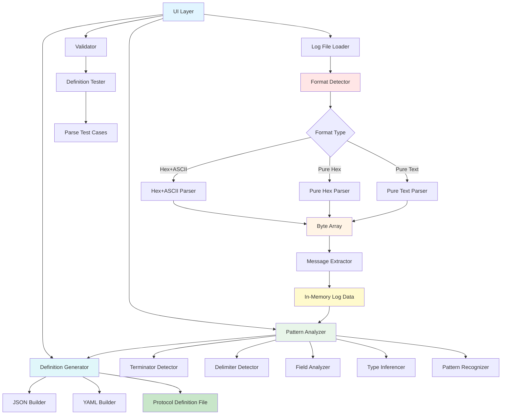
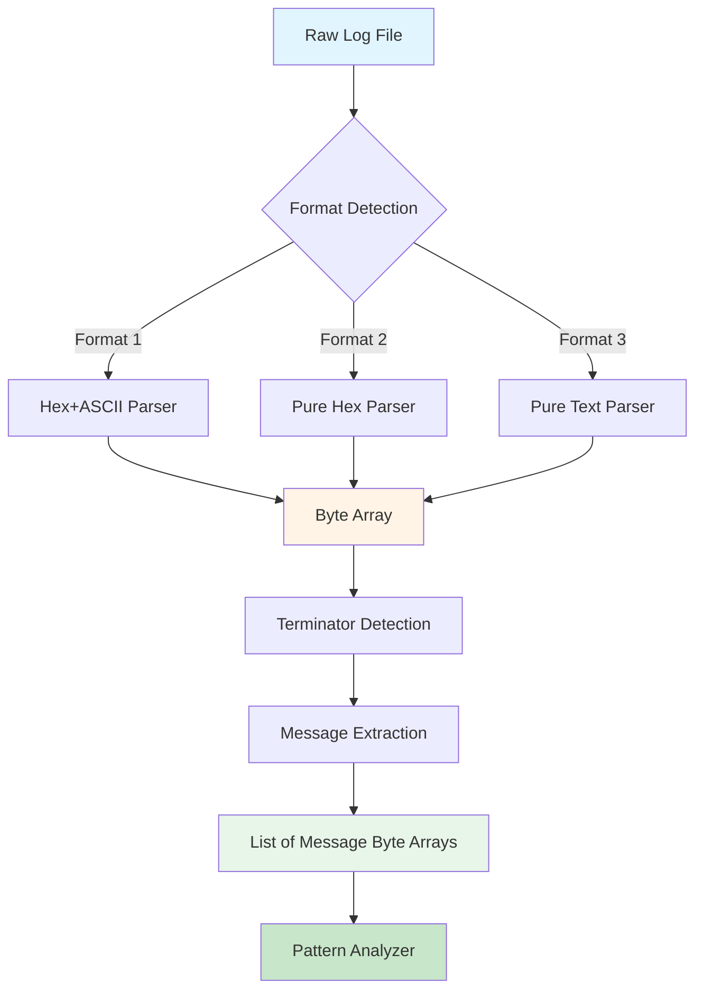
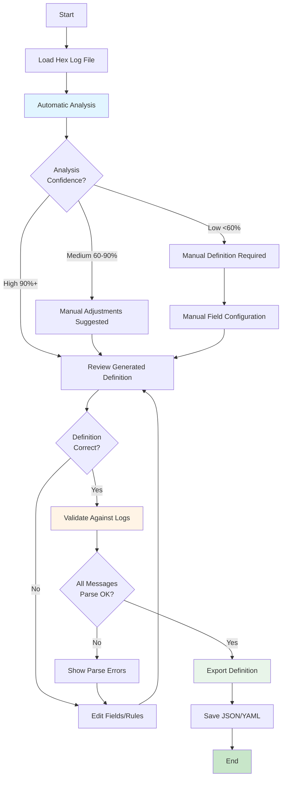

# Protocol Analyzer Tool - Design Specification

**Document:** Protocol Analyzer Tool Design
**Version:** 1.0
**Date:** 2025-10-18
**Status:** Design Phase

---

## Table of Contents
1. [Overview](#overview)
2. [Tool Architecture](#tool-architecture)
3. [Pattern Detection Algorithms](#pattern-detection-algorithms)
4. [User Interface Design](#user-interface-design)
5. [Output Generation](#output-generation)

---

## Overview

### Purpose

The **Protocol Analyzer Tool** automatically analyzes hex dump log files captured from serial devices and generates protocol definition files with minimal human intervention.

### Key Features

- 📁 Load hex log files (text or binary formats)
- 🔍 Automatic pattern detection
- 📊 Visual analysis and statistics
- 🤖 AI-suggested protocol definitions
- ✏️ Manual override and refinement
- 💾 Export to JSON/YAML protocol definitions
- ✅ Validation and testing

### Input/Output

**Input (Three Supported Formats):**

1. **Hex + ASCII Format** (Most Common)
   - Example: `TFO1/Serial_Log.txt`
   - Format: `46 20 20 20 20 20 20 30 2E 30 0D    F      0.0.`
   - Left: Hex bytes, Right: ASCII representation

2. **Pure Hex Format**
   - Example: `JIK6CAB/jik_hex_1.txt`
   - Format: `5E 4B 4A 49 4B 30 30 30 0D 0A 32 30 32 33`
   - Only hex bytes (no ASCII column)

3. **Pure Text Format**
   - Example: `TScaleNHB/NHB.txt`
   - Format: `ST,GS    20.7g  `
   - Direct ASCII text (already decoded)

**Output:**
- Protocol definition JSON file
- Analysis report (statistics, patterns found, confidence scores)
- Test cases for validation
- Human-readable summary

---

## Tool Architecture

### Component Diagram



### Class Structure

```csharp
namespace NLib.Serial.ProtocolAnalyzer
{
    // Main application entry
    public class MainWindow : Window
    {
        private LogFileLoader _loader;
        private PatternAnalyzer _analyzer;
        private DefinitionGenerator _generator;
        private ProtocolValidator _validator;
    }

    // Loads and parses hex log files
    public class LogFileLoader
    {
        public LogData LoadFile(string path);
        public LogData ParseHexDump(string content);
        public LogData ParseBinaryFile(string path);
    }

    // Represents loaded log data
    public class LogData
    {
        public List<byte[]> Messages { get; set; }
        public Dictionary<string, int> Statistics { get; set; }
        public byte[] MostCommonTerminator { get; set; }
    }

    // Analyzes patterns in log data
    public class PatternAnalyzer
    {
        public AnalysisResult Analyze(LogData data);

        private TerminatorInfo DetectTerminator(LogData data);
        private DelimiterInfo DetectDelimiters(LogData data);
        private List<FieldInfo> AnalyzeFields(LogData data);
        private Dictionary<string, TypeInfo> InferTypes(List<FieldInfo> fields);
    }

    // Results of pattern analysis
    public class AnalysisResult
    {
        public TerminatorInfo Terminator { get; set; }
        public List<DelimiterInfo> Delimiters { get; set; }
        public List<FieldInfo> Fields { get; set; }
        public int MessageCount { get; set; }
        public int AverageLength { get; set; }
        public double Confidence { get; set; }  // 0-100%
    }

    // Generates protocol definition from analysis
    public class DefinitionGenerator
    {
        public ProtocolDefinition Generate(AnalysisResult analysis);
        public string ToJson(ProtocolDefinition def);
        public string ToYaml(ProtocolDefinition def);
    }
}
```

---

## Hex Log Preprocessor

### Overview

Before pattern analysis can begin, raw hex log files must be preprocessed to extract the actual byte data. Serial terminal tools can capture data in three different formats, and the Preprocessor must handle all of them.

### Supported Log Formats

#### Format 1: Hex + ASCII (Most Common)
```
46 20 20 20 20 20 20 30 2E 30 0D 48 20 20 20 20    F      0.0.H
20 20 30 2E 30 0D 51 20 20 20 20 20 20 30 2E 30      0.0.Q      0.0
0D 58 20 20 20 20 20 20 30 2E 30 0D 41 20 20 20    .X      0.0.A
```
**Characteristics:**
- Left side: Hex bytes (space-separated)
- Right side: ASCII representation
- Separator: Multiple spaces (typically 4-8)
- Non-printable bytes shown as dots or special chars
- Example: `Documents\LuckyTex Devices\TFO1\Serial_Log.txt`

#### Format 2: Pure Hex Only
```
5E 4B 4A 49 4B 30 30 30 0D 0A 32 30 32 33 2D 31
31 2D 30 37 0D 0A 31 37 3A 31 39 3A 32 36 0D 0A
20 20 30 2E 30 30 20 6B 67 0D 0A 20 20 31 2E 39
```
**Characteristics:**
- Only hex bytes (space-separated)
- No ASCII column
- 16 bytes per line typically
- Example: `Documents\LuckyTex Devices\JIK6CAB\jik_hex_1.txt`

#### Format 3: Pure Text/ASCII Only
```
ST,GS    20.7g
US,GS    20.9g
ST,GS    85.5g
```
**Characteristics:**
- Direct ASCII text
- No hex encoding
- Already decoded
- Example: `Documents\LuckyTex Devices\TScaleNHB\NHB.txt`

---

### Format Detection Algorithm

```csharp
public enum LogFileFormat
{
    Unknown,
    HexAndAscii,    // Format 1
    PureHex,        // Format 2
    PureText        // Format 3
}

public class LogFormatDetector
{
    public LogFileFormat DetectFormat(string filePath)
    {
        string[] lines = File.ReadAllLines(filePath).Take(10).ToArray();

        foreach (string line in lines)
        {
            if (string.IsNullOrWhiteSpace(line))
                continue;

            // Check for Format 1: Hex + ASCII
            // Pattern: "XX XX XX ... (4+ spaces) ASCII text"
            var hexAsciiMatch = Regex.Match(line,
                @"^([0-9A-Fa-f]{2}\s+){8,}\s{4,}.+$");
            if (hexAsciiMatch.Success)
                return LogFileFormat.HexAndAscii;

            // Check for Format 2: Pure Hex
            // Pattern: "XX XX XX XX" (only hex bytes)
            var pureHexMatch = Regex.Match(line,
                @"^([0-9A-Fa-f]{2}\s*)+$");
            if (pureHexMatch.Success && line.Length > 16)
                return LogFileFormat.PureHex;

            // Check for Format 3: Pure Text
            // Pattern: Contains non-hex characters
            if (!Regex.IsMatch(line, @"^[0-9A-Fa-f\s]+$"))
                return LogFileFormat.PureText;
        }

        return LogFileFormat.Unknown;
    }
}
```

---

### Hex Log Parser Implementation

```csharp
public class HexLogParser
{
    private LogFormatDetector _detector = new LogFormatDetector();

    public byte[] ParseLogFile(string filePath)
    {
        LogFileFormat format = _detector.DetectFormat(filePath);
        string content = File.ReadAllText(filePath);

        switch (format)
        {
            case LogFileFormat.HexAndAscii:
                return ParseHexAndAscii(content);

            case LogFileFormat.PureHex:
                return ParsePureHex(content);

            case LogFileFormat.PureText:
                return ParsePureText(content);

            default:
                throw new InvalidOperationException(
                    "Unable to detect log file format");
        }
    }

    // Format 1: Hex + ASCII Parser
    private byte[] ParseHexAndAscii(string content)
    {
        List<byte> bytes = new List<byte>();
        string[] lines = content.Split(new[] { '\r', '\n' },
            StringSplitOptions.RemoveEmptyEntries);

        foreach (string line in lines)
        {
            // Split by multiple spaces (4+) to separate hex from ASCII
            string[] parts = Regex.Split(line, @"\s{4,}");

            if (parts.Length < 1)
                continue;

            // Extract hex part (left side)
            string hexPart = parts[0].Trim();

            // Parse hex bytes
            string[] hexBytes = hexPart.Split(new[] { ' ', '\t' },
                StringSplitOptions.RemoveEmptyEntries);

            foreach (string hex in hexBytes)
            {
                if (hex.Length == 2 &&
                    byte.TryParse(hex, NumberStyles.HexNumber,
                        CultureInfo.InvariantCulture, out byte b))
                {
                    bytes.Add(b);
                }
            }
        }

        return bytes.ToArray();
    }

    // Format 2: Pure Hex Parser
    private byte[] ParsePureHex(string content)
    {
        List<byte> bytes = new List<byte>();

        // Extract all hex patterns (XX format)
        MatchCollection matches = Regex.Matches(content, @"[0-9A-Fa-f]{2}");

        foreach (Match match in matches)
        {
            if (byte.TryParse(match.Value, NumberStyles.HexNumber,
                CultureInfo.InvariantCulture, out byte b))
            {
                bytes.Add(b);
            }
        }

        return bytes.ToArray();
    }

    // Format 3: Pure Text Parser
    private byte[] ParsePureText(string content)
    {
        // Already in text format, just convert to bytes
        return Encoding.ASCII.GetBytes(content);
    }
}
```

---

### Message Extraction

After parsing hex to bytes, we need to split into individual messages:

```csharp
public class MessageExtractor
{
    public List<byte[]> ExtractMessages(byte[] rawBytes,
        byte[] terminator = null)
    {
        // If terminator not specified, try to detect
        if (terminator == null)
            terminator = DetectTerminator(rawBytes);

        List<byte[]> messages = new List<byte[]>();
        List<byte> currentMessage = new List<byte>();

        for (int i = 0; i < rawBytes.Length; i++)
        {
            currentMessage.Add(rawBytes[i]);

            // Check if we have a terminator match
            if (EndsWithTerminator(currentMessage, terminator))
            {
                messages.Add(currentMessage.ToArray());
                currentMessage.Clear();
            }
        }

        // Add remaining bytes if any
        if (currentMessage.Count > 0)
            messages.Add(currentMessage.ToArray());

        return messages;
    }

    private byte[] DetectTerminator(byte[] bytes)
    {
        // Try common terminators
        byte[] crLf = new byte[] { 0x0D, 0x0A };
        byte[] lf = new byte[] { 0x0A };
        byte[] cr = new byte[] { 0x0D };

        int crLfCount = CountOccurrences(bytes, crLf);
        int lfCount = CountOccurrences(bytes, lf);
        int crCount = CountOccurrences(bytes, cr);

        if (crLfCount > 0 && crLfCount >= lfCount / 2)
            return crLf;
        else if (lfCount > crCount)
            return lf;
        else if (crCount > 0)
            return cr;

        return crLf; // Default
    }

    private int CountOccurrences(byte[] data, byte[] pattern)
    {
        int count = 0;
        for (int i = 0; i <= data.Length - pattern.Length; i++)
        {
            bool match = true;
            for (int j = 0; j < pattern.Length; j++)
            {
                if (data[i + j] != pattern[j])
                {
                    match = false;
                    break;
                }
            }
            if (match)
            {
                count++;
                i += pattern.Length - 1;
            }
        }
        return count;
    }

    private bool EndsWithTerminator(List<byte> message, byte[] terminator)
    {
        if (message.Count < terminator.Length)
            return false;

        for (int i = 0; i < terminator.Length; i++)
        {
            if (message[message.Count - terminator.Length + i] != terminator[i])
                return false;
        }

        return true;
    }
}
```

---

### Complete Preprocessing Pipeline



---

### Updated LogFileLoader Class

```csharp
public class LogFileLoader
{
    private HexLogParser _parser = new HexLogParser();
    private MessageExtractor _extractor = new MessageExtractor();

    public LogData LoadFile(string path)
    {
        // Step 1: Parse hex log to byte array
        byte[] rawBytes = _parser.ParseLogFile(path);

        // Step 2: Extract individual messages
        List<byte[]> messages = _extractor.ExtractMessages(rawBytes);

        // Step 3: Build LogData object
        LogData data = new LogData
        {
            Messages = messages,
            TotalBytes = rawBytes.Length,
            MessageCount = messages.Count,
            AverageMessageLength = messages.Count > 0
                ? rawBytes.Length / messages.Count
                : 0
        };

        return data;
    }
}

public class LogData
{
    public List<byte[]> Messages { get; set; }
    public int TotalBytes { get; set; }
    public int MessageCount { get; set; }
    public int AverageMessageLength { get; set; }
    public Dictionary<string, int> Statistics { get; set; }
}
```

---

### Example Processing

**Input File:** `TFO1\Serial_Log.txt` (Format 1: Hex+ASCII)
```
46 20 20 20 20 20 20 30 2E 30 0D 48 20 20 20 20    F      0.0.H
20 20 30 2E 30 0D 51 20 20 20 20 20 20 30 2E 30      0.0.Q      0.0
```

**Processing Steps:**

1. **Format Detection:** → `HexAndAscii`

2. **Hex Parsing:**
   ```
   46 20 20 20 20 20 20 30 2E 30 0D 48 20 20 20 20 20 20 30 2E 30 0D ...
   → [0x46, 0x20, 0x20, 0x20, 0x20, 0x20, 0x20, 0x30, 0x2E, 0x30, 0x0D, ...]
   ```

3. **ASCII Conversion:**
   ```
   [0x46, 0x20, ..., 0x0D] → "F      0.0\r"
   ```

4. **Message Extraction (by 0x0D terminator):**
   ```
   Message 1: "F      0.0\r"
   Message 2: "H      0.0\r"
   Message 3: "Q      0.0\r"
   ```

5. **Output:** `LogData` with 3 messages ready for pattern analysis

---

## Pattern Detection Algorithms

### Algorithm 1: Terminator Detection

**Purpose:** Identify message boundary markers (CR, LF, CRLF, custom)

```csharp
public class TerminatorDetector
{
    public TerminatorInfo DetectTerminator(LogData data)
    {
        // Step 1: Find most common 1-4 byte sequences at end of messages
        var endSequences = new Dictionary<string, int>();

        foreach (var message in data.Messages)
        {
            // Check last 1-4 bytes
            for (int len = 1; len <= 4 && len <= message.Length; len++)
            {
                byte[] ending = message.Skip(message.Length - len).ToArray();
                string key = BitConverter.ToString(ending);

                if (!endSequences.ContainsKey(key))
                    endSequences[key] = 0;
                endSequences[key]++;
            }
        }

        // Step 2: Find most frequent ending
        var mostCommon = endSequences.OrderByDescending(x => x.Value).First();

        // Step 3: Validate (should appear in 90%+ of messages)
        double frequency = (double)mostCommon.Value / data.Messages.Count;

        if (frequency < 0.9)
            return new TerminatorInfo {
                Detected = false,
                Confidence = frequency
            };

        // Step 4: Decode common terminators
        byte[] terminatorBytes = ParseHexString(mostCommon.Key);
        string terminatorString = DecodeTerminator(terminatorBytes);

        return new TerminatorInfo
        {
            Detected = true,
            Bytes = terminatorBytes,
            String = terminatorString,  // e.g., "\r\n"
            Frequency = frequency,
            Confidence = frequency
        };
    }

    private string DecodeTerminator(byte[] bytes)
    {
        // Common patterns
        if (bytes.SequenceEqual(new byte[] { 0x0D, 0x0A }))
            return "\\r\\n";
        if (bytes.SequenceEqual(new byte[] { 0x0A }))
            return "\\n";
        if (bytes.SequenceEqual(new byte[] { 0x0D }))
            return "\\r";

        // Custom terminator
        return BitConverter.ToString(bytes);
    }
}
```

**Example Output:**
```json
{
  "terminator": {
    "detected": true,
    "bytes": "0D 0A",
    "string": "\\r\\n",
    "frequency": 1.0,
    "confidence": 100
  }
}
```

---

### Algorithm 2: Delimiter Detection

**Purpose:** Find field separators (comma, space, tab, semicolon)

```csharp
public class DelimiterDetector
{
    public List<DelimiterInfo> DetectDelimiters(LogData data)
    {
        // Common delimiters to check
        var candidates = new Dictionary<byte, string>
        {
            { 0x2C, "," },      // Comma
            { 0x20, " " },      // Space
            { 0x09, "\t" },     // Tab
            { 0x3B, ";" },      // Semicolon
            { 0x7C, "|" },      // Pipe
        };

        var results = new List<DelimiterInfo>();

        foreach (var candidate in candidates)
        {
            int totalCount = 0;
            int messagesWithDelimiter = 0;
            List<int> positionsInMessages = new List<int>();

            foreach (var message in data.Messages)
            {
                int count = message.Count(b => b == candidate.Key);
                if (count > 0)
                {
                    messagesWithDelimiter++;
                    totalCount += count;

                    // Find positions
                    for (int i = 0; i < message.Length; i++)
                    {
                        if (message[i] == candidate.Key)
                            positionsInMessages.Add(i);
                    }
                }
            }

            if (messagesWithDelimiter > data.Messages.Count * 0.5)
            {
                double frequency = (double)messagesWithDelimiter / data.Messages.Count;
                double avgPerMessage = (double)totalCount / data.Messages.Count;

                results.Add(new DelimiterInfo
                {
                    Character = candidate.Value,
                    Byte = candidate.Key,
                    Frequency = frequency,
                    AverageCount = avgPerMessage,
                    Confidence = frequency * 100,
                    IsConsistent = CheckConsistentPositions(positionsInMessages)
                });
            }
        }

        return results.OrderByDescending(x => x.Confidence).ToList();
    }

    private bool CheckConsistentPositions(List<int> positions)
    {
        // If delimiter appears at same position in 80%+ messages,
        // it's likely a structural delimiter
        var grouped = positions.GroupBy(x => x);
        return grouped.Any(g => (double)g.Count() / positions.Count > 0.8);
    }
}
```

**Example Output:**
```json
{
  "delimiters": [
    {
      "character": ",",
      "byte": "2C",
      "frequency": 1.0,
      "averageCount": 1.5,
      "confidence": 95,
      "isConsistent": true
    },
    {
      "character": " ",
      "byte": "20",
      "frequency": 1.0,
      "averageCount": 8.2,
      "confidence": 70,
      "isConsistent": false
    }
  ]
}
```

---

### Algorithm 3: Field Analyzer

**Purpose:** Identify distinct fields and their characteristics

```csharp
public class FieldAnalyzer
{
    public List<FieldInfo> AnalyzeFields(LogData data, DelimiterInfo primaryDelimiter)
    {
        var fields = new List<FieldInfo>();

        // Parse all messages using delimiter
        var parsedMessages = new List<string[]>();
        foreach (var message in data.Messages)
        {
            string text = Encoding.ASCII.GetString(message);
            string[] parts = text.Split(new[] { primaryDelimiter.Character },
                                        StringSplitOptions.None);
            parsedMessages.Add(parts);
        }

        // Analyze each field position
        int fieldCount = parsedMessages.Max(m => m.Length);

        for (int i = 0; i < fieldCount; i++)
        {
            var fieldValues = parsedMessages
                .Where(m => m.Length > i)
                .Select(m => m[i].Trim())
                .ToList();

            var fieldInfo = new FieldInfo
            {
                Position = i,
                Name = $"Field{i}",
                SampleValues = fieldValues.Take(10).ToList(),
                UniqueValues = fieldValues.Distinct().Count(),
                TotalValues = fieldValues.Count,
                MinLength = fieldValues.Min(v => v.Length),
                MaxLength = fieldValues.Max(v => v.Length),
                AverageLength = fieldValues.Average(v => v.Length),
                Type = InferType(fieldValues),
                IsConstant = IsConstant(fieldValues),
                IsNumeric = IsNumeric(fieldValues),
                ContainsUnit = DetectUnit(fieldValues)
            };

            fields.Add(fieldInfo);
        }

        return fields;
    }

    private string InferType(List<string> values)
    {
        // Check if all values are numeric
        if (values.All(v => decimal.TryParse(v.TrimEnd('g', 'k', ' '),
                                             NumberStyles.Any,
                                             CultureInfo.InvariantCulture,
                                             out _)))
            return "decimal";

        // Check if all values are integers
        if (values.All(v => int.TryParse(v, out _)))
            return "integer";

        // Check if datetime
        if (values.All(v => DateTime.TryParse(v, out _)))
            return "datetime";

        // Default to string
        return "string";
    }

    private bool IsConstant(List<string> values)
    {
        return values.Distinct().Count() == 1;
    }

    private bool IsNumeric(List<string> values)
    {
        return values.All(v => v.Any(char.IsDigit));
    }

    private string DetectUnit(List<string> values)
    {
        // Common units
        var units = new[] { "g", "kg", "pH", "°C", "pcs", "mm", "cm" };

        foreach (var unit in units)
        {
            if (values.Any(v => v.EndsWith(unit, StringComparison.OrdinalIgnoreCase)))
                return unit;
        }

        return null;
    }
}
```

**Example Output:**
```json
{
  "fields": [
    {
      "position": 0,
      "name": "Status",
      "type": "string",
      "isConstant": false,
      "uniqueValues": 2,
      "sampleValues": ["ST", "US", "ST", "ST"],
      "suggestedName": "StatusIndicator",
      "confidence": 90
    },
    {
      "position": 1,
      "name": "Mode",
      "type": "string",
      "isConstant": true,
      "uniqueValues": 1,
      "sampleValues": ["GS", "GS", "GS"],
      "confidence": 95
    },
    {
      "position": 2,
      "name": "Weight",
      "type": "decimal",
      "isNumeric": true,
      "unit": "g",
      "min": 0.0,
      "max": 250.0,
      "average": 125.3,
      "confidence": 85
    }
  ]
}
```

---

### Algorithm 4: Pattern Recognition

**Purpose:** Identify repeating patterns and protocol types

```csharp
public class PatternRecognizer
{
    public ProtocolType RecognizeProtocolType(AnalysisResult analysis)
    {
        // Single-line streaming (e.g., TScale, DEFENDER3000)
        if (analysis.MessageCount > 50 &&
            analysis.AverageLength < 50 &&
            analysis.Terminator.String == "\\r\\n")
        {
            return ProtocolType.StreamingSingleLine;
        }

        // Multi-line package (e.g., JIK6CAB)
        if (HasPackageMarkers(analysis))
        {
            return ProtocolType.MultiLinePackage;
        }

        // Command-response
        if (HasCommandResponsePattern(analysis))
        {
            return ProtocolType.CommandResponse;
        }

        return ProtocolType.Unknown;
    }

    private bool HasPackageMarkers(AnalysisResult analysis)
    {
        // Look for package start/end markers
        var firstMessages = analysis.Fields
            .FirstOrDefault()?
            .SampleValues
            .Take(5);

        if (firstMessages != null)
        {
            // Check if starts with special character
            return firstMessages.All(v => v.StartsWith("^") ||
                                          v.StartsWith("~") ||
                                          v.StartsWith("$"));
        }

        return false;
    }

    public ParsingStrategy SuggestParsingStrategy(AnalysisResult analysis)
    {
        // CSV-like (comma or semicolon delimited)
        if (analysis.Delimiters.Any(d => d.Character == "," || d.Character == ";"))
        {
            return new ParsingStrategy
            {
                Type = "split",
                Delimiter = analysis.Delimiters.First(d => d.Character == "," ||
                                                           d.Character == ";").Character
            };
        }

        // Space-delimited
        if (analysis.Delimiters.Any(d => d.Character == " " && d.IsConsistent))
        {
            return new ParsingStrategy
            {
                Type = "split",
                Delimiter = " ",
                RemoveEmptyEntries = true
            };
        }

        // Fixed-width (no clear delimiter, consistent positions)
        if (!analysis.Delimiters.Any())
        {
            return new ParsingStrategy
            {
                Type = "fixed-width",
                FieldPositions = CalculateFieldPositions(analysis)
            };
        }

        return new ParsingStrategy { Type = "regex" };
    }
}
```

---

## User Interface Design

### Main Window Layout

```
╔══════════════════════════════════════════════════════════════════╗
║  Protocol Analyzer                                    [ _ □ X ]  ║
╠══════════════════════════════════════════════════════════════════╣
║  ┌─────────────────────────────────────────────────────────────┐ ║
║  │  File: D:\...\TScaleNHB\NHB.txt            [Browse] [Load]  │ ║
║  └─────────────────────────────────────────────────────────────┘ ║
║                                                                   ║
║  ┌─ Log Data ────────────────────┐ ┌─ Analysis Results ────────┐║
║  │                                │ │                            │║
║  │ Messages: 460                  │ │ Protocol Type:             │║
║  │ Avg Length: 18 bytes           │ │ ☑ Single-line streaming   │║
║  │ Format: Hex dump               │ │ ☐ Multi-line package      │║
║  │                                │ │ ☐ Command-response        │║
║  │ Sample Message (1 of 460):     │ │                            │║
║  │ 53 54 2C 47 53 20 20 20 20    │ │ Terminator:                │║
║  │ 32 30 2E 37 67 20 20 0D 0A    │ │ Type: \r\n (CRLF)         │║
║  │                                │ │ Confidence: 100%           │║
║  │ ASCII:                         │ │                            │║
║  │ ST,GS    20.7g  ␍␊             │ │ Delimiters:                │║
║  │                                │ │ 1. Comma (,) - 100%        │║
║  │ [Prev] [Next] [Export]         │ │ 2. Space ( ) - 100%        │║
║  │                                │ │                            │║
║  └────────────────────────────────┘ │ Fields Detected: 3         │║
║                                     │                            │║
║  ┌─ Field Analysis ──────────────────────────────────────────┐  │║
║  │ ┌─────────────────────────────────────────────────────┐  │  │║
║  │ │ Pos │ Name    │ Type    │ Samples       │ Conf.    │  │  │║
║  │ ├─────┼─────────┼─────────┼───────────────┼──────────┤  │  │║
║  │ │  0  │ Status  │ string  │ ST, US        │ 95%      │  │  │║
║  │ │  1  │ Mode    │ string  │ GS            │ 98% (C)  │  │  │║
║  │ │  2  │ Weight  │ decimal │ 20.7g, 85.5g  │ 90%      │  │  │║
║  │ └─────────────────────────────────────────────────────┘  │  │║
║  │                                                           │  │║
║  │ [Edit Field] [Add Field] [Remove Field]                  │  │║
║  └───────────────────────────────────────────────────────────┘  │║
║                                                                   ║
║  ┌─ Generated Definition Preview ─────────────────────────────┐ ║
║  │ {                                                           │ ║
║  │   "deviceName": "TScaleNHB",                               │ ║
║  │   "protocol": {                                            │ ║
║  │     "type": "streaming",                                   │ ║
║  │     "terminator": "\\r\\n",                                │ ║
║  │     "fields": [                                            │ ║
║  │       {                                                    │ ║
║  │         "name": "Status",                                  │ ║
║  │         "type": "string",                                  │ ║
║  │         "values": ["ST", "US"]                             │ ║
║  │       },                                                   │ ║
║  │       ...                                                  │ ║
║  │     ]                                                      │ ║
║  │   }                                                        │ ║
║  │ }                                                          │ ║
║  └─────────────────────────────────────────────────────────────┘ ║
║                                                                   ║
║  [← Back] [Validate] [Test] [Export JSON] [Export YAML]          ║
╚══════════════════════════════════════════════════════════════════╝
```

### Workflow Steps



---

## Output Generation

### Generated Protocol Definition

**Example: TScaleNHB.json**

```json
{
  "_comment": "Generated by Protocol Analyzer v1.0 on 2025-10-18",
  "_sourceLog": "Documents/LuckyTex Devices/TScaleNHB/NHB.txt",
  "_analysisConfidence": 95,

  "deviceInfo": {
    "name": "TScaleNHB",
    "manufacturer": "T&T",
    "model": "NHB",
    "description": "Weight scale with CSV-like protocol"
  },

  "protocol": {
    "type": "streaming",
    "format": "csv-like",
    "encoding": "ASCII",
    "terminator": "\\r\\n",
    "terminatorBytes": "0D 0A",

    "fields": [
      {
        "name": "Status",
        "position": 0,
        "type": "string",
        "length": 2,
        "separator": ",",
        "values": ["ST", "US"],
        "description": "Stability indicator - ST=Stable, US=Unstable",
        "confidence": 95
      },
      {
        "name": "Mode",
        "position": 1,
        "type": "string",
        "length": 2,
        "separator": " ",
        "values": ["GS"],
        "isConstant": true,
        "description": "Mode indicator - GS=Gross/Stable",
        "confidence": 98
      },
      {
        "name": "Weight",
        "position": 2,
        "type": "decimal",
        "format": "F1",
        "alignment": "right",
        "padding": " ",
        "unit": "g",
        "unitAttached": true,
        "min": 0.0,
        "max": 250.0,
        "description": "Weight value in grams",
        "confidence": 90
      }
    ]
  },

  "parsing": {
    "strategy": "split",
    "delimiter": ",",
    "trim": true,
    "steps": [
      "Split line by comma",
      "Extract status from part[0]",
      "Split part[1] by space to get mode and weight",
      "Scan backward in weight string to separate unit",
      "Parse weight value as decimal"
    ],
    "errorHandling": {
      "onParseError": "log",
      "onInvalidValue": "useDefault",
      "onMissingField": "useDefault"
    }
  },

  "serialization": {
    "template": "{Status},{Mode}    {Weight:F1}{Unit}  \\r\\n",
    "padding": {
      "Weight": {
        "alignment": "right",
        "totalWidth": 8,
        "paddingChar": " "
      }
    }
  },

  "validation": {
    "required": ["Status", "Weight"],
    "constraints": {
      "Status": {
        "allowedValues": ["ST", "US"]
      },
      "Weight": {
        "min": 0,
        "max": 10000
      }
    }
  },

  "testCases": [
    {
      "input": "53 54 2C 47 53 20 20 20 20 32 30 2E 37 67 20 20 0D 0A",
      "expected": {
        "Status": "ST",
        "Mode": "GS",
        "Weight": 20.7,
        "Unit": "g"
      }
    },
    {
      "input": "55 53 2C 47 53 20 20 20 20 38 35 2E 35 67 20 20 0D 0A",
      "expected": {
        "Status": "US",
        "Mode": "GS",
        "Weight": 85.5,
        "Unit": "g"
      }
    }
  ]
}
```

### Analysis Report

**Example output from analyzing TScaleNHB log file:**

#### Protocol Analysis Report

**File:** TScaleNHB/NHB.txt
**Date:** 2025-10-18 15:30:00
**Tool Version:** 1.0

#### Summary

- **Messages Analyzed:** 460
- **Protocol Type:** Single-line streaming
- **Overall Confidence:** 95%
- **Recommended Strategy:** Split parsing

#### Terminator Analysis

- **Detected:** ✓ Yes
- **Type:** CRLF (\r\n)
- **Bytes:** 0x0D 0x0A
- **Frequency:** 460/460 (100%)
- **Confidence:** 100%

#### Delimiter Analysis

| Delimiter | Character | Frequency | Avg Count | Confidence | Structural |
|-----------|-----------|-----------|-----------|------------|------------|
| Comma | , | 100% | 1.0 | 100% | ✓ Yes |
| Space | (space) | 100% | 8.2 | 70% | ✗ No |

#### Field Analysis

**Field 0: Status**
- **Type:** String
- **Length:** 2 characters
- **Unique Values:** 2 (ST, US)
- **Frequency:** ST=98%, US=2%
- **Confidence:** 95%
- **Suggested Name:** StatusIndicator

**Field 1: Mode**
- **Type:** String (Constant)
- **Length:** 2 characters
- **Unique Values:** 1 (GS)
- **Frequency:** GS=100%
- **Confidence:** 98%
- **Suggested Name:** ModeIndicator

**Field 2: Weight**
- **Type:** Decimal
- **Unit:** g (attached)
- **Min:** 20.7
- **Max:** 106.2
- **Average:** 64.3
- **Std Dev:** 28.5
- **Confidence:** 90%
- **Suggested Name:** WeightValue

#### Recommendations

1. ✓ Use split parsing strategy with comma delimiter
2. ✓ Fields are well-defined and consistent
3. ⚠ Unit is attached to weight - requires post-processing
4. ✓ High confidence - minimal manual adjustment needed

#### Generated Definition

- **File:** TScaleNHB.json
- **Status:** ✓ Valid
- **Test Cases:** 2 generated
- **Validation:** ✓ All messages parse successfully

---

## Validation & Testing

### Definition Validator

```csharp
public class ProtocolValidator
{
    public ValidationResult Validate(ProtocolDefinition definition, LogData testData)
    {
        var result = new ValidationResult();

        // 1. Schema validation
        ValidateSchema(definition, result);

        // 2. Parse all test messages
        var engine = new ProtocolEngine(definition);
        int successCount = 0;

        foreach (var message in testData.Messages)
        {
            try
            {
                var parsed = engine.Parse(message);
                successCount++;

                // Validate field types
                foreach (var field in definition.Protocol.Fields)
                {
                    if (!ValidateFieldType(parsed[field.Name], field.Type))
                    {
                        result.Warnings.Add($"Field {field.Name} type mismatch");
                    }
                }
            }
            catch (Exception ex)
            {
                result.Errors.Add($"Parse error: {ex.Message}");
            }
        }

        result.ParseSuccessRate = (double)successCount / testData.Messages.Count;
        result.IsValid = result.Errors.Count == 0 && result.ParseSuccessRate > 0.95;

        return result;
    }
}

public class ValidationResult
{
    public bool IsValid { get; set; }
    public double ParseSuccessRate { get; set; }
    public List<string> Errors { get; set; } = new List<string>();
    public List<string> Warnings { get; set; } = new List<string>();
}
```

---

## Next Steps

1. → Implement Log File Loader
2. → Build pattern detection algorithms
3. → Create UI in WPF
4. → Add manual editing capabilities
5. → Implement validation engine
6. → Test with existing log files

---

## Related Documents

- [System Architecture](01-System-Architecture.md)
- [Protocol Definition Schema](03-Protocol-Definition-Schema.md)
- [Protocol Examples](04-Protocol-Examples.md)
