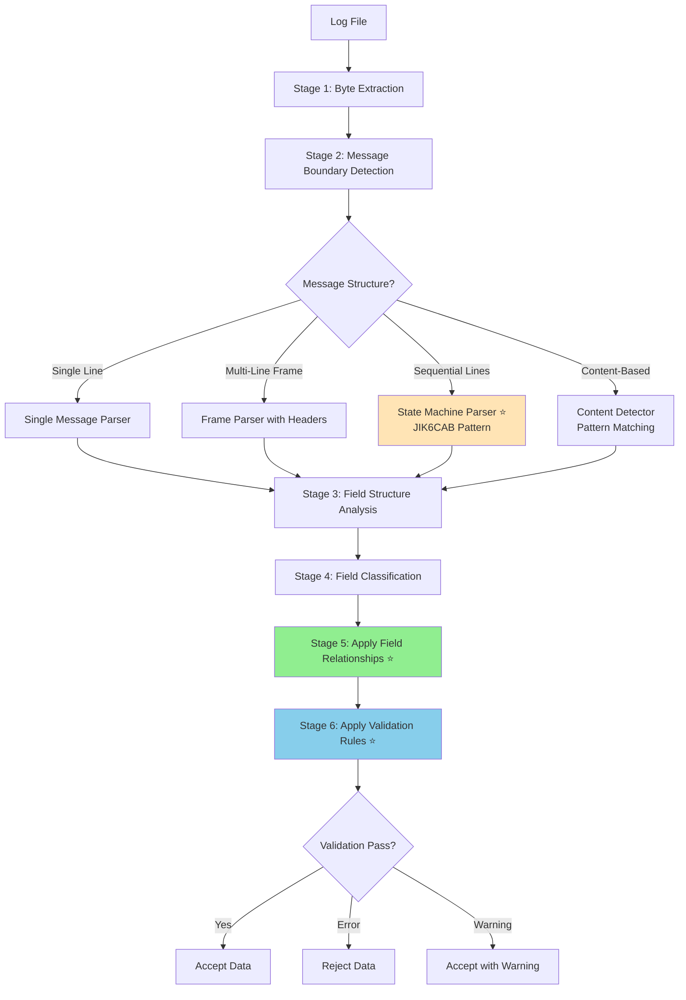
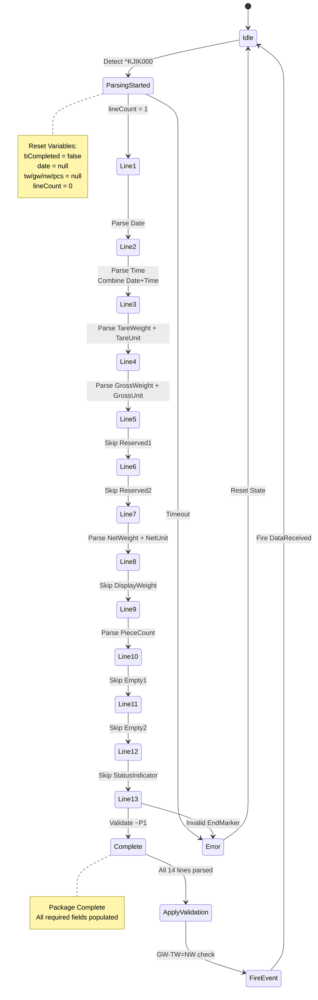
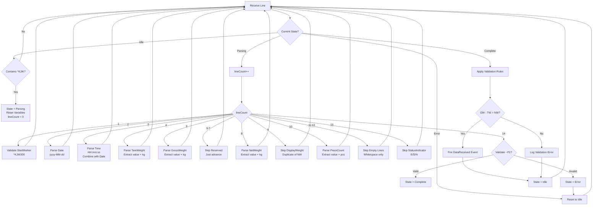
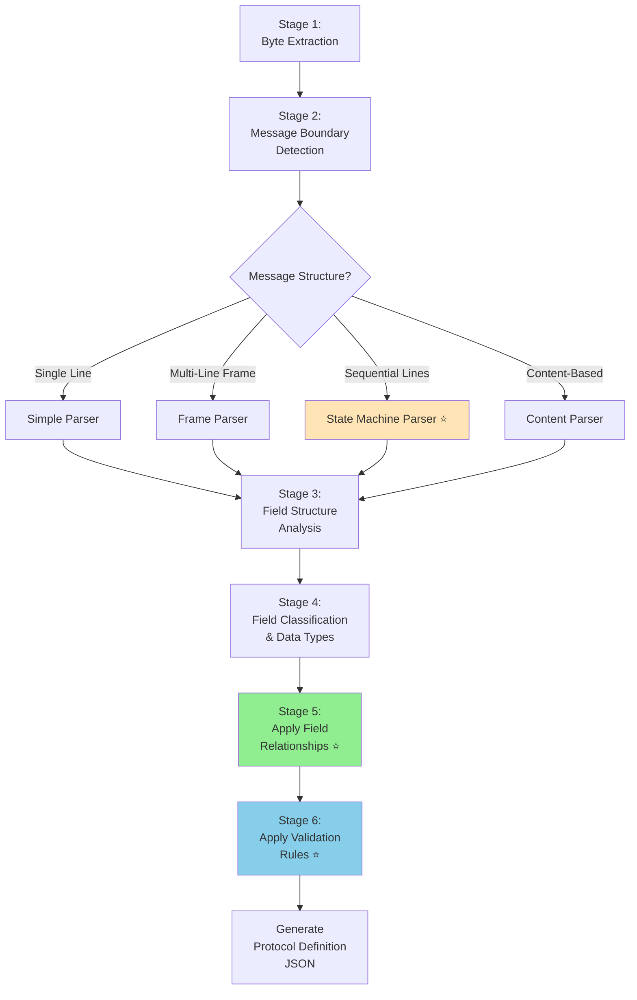
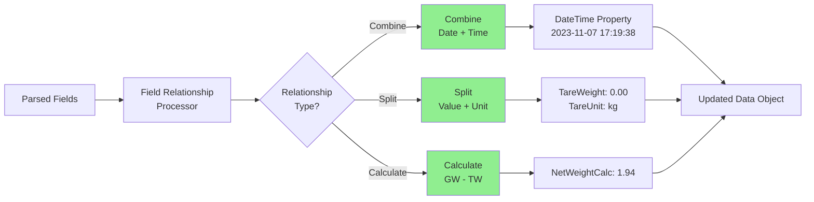
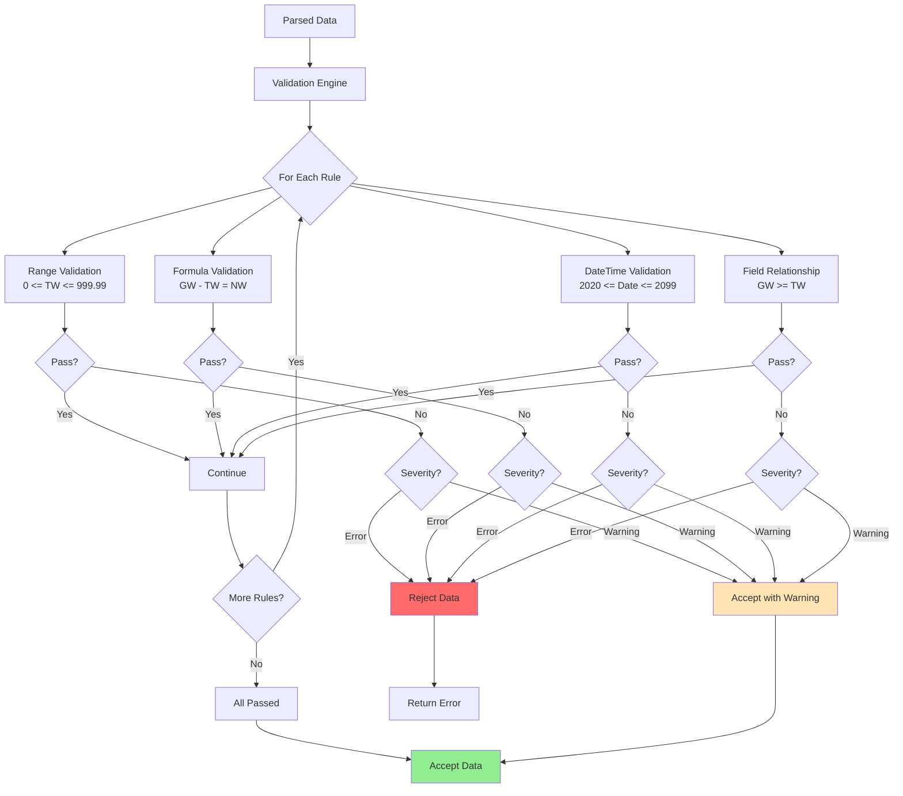

# Parsing Strategy Analysis

**Related Documents**:
- **00-Requirements-Specification.md** - Complete requirements
- **01-Production-Code-Analysis.md** - How production code handles these protocols
- **02-System-Architecture.md** - Overall system design
- **04-Data-Models-Design.md** - Data models supporting these strategies
- **05-JSON-Schema-Design.md** - JSON examples for each strategy

---

## Table of Contents

1. [Overview](#overview)
2. [Challenge Categories](#challenge-categories)
3. [Core Problems Identified](#core-problems-identified)
4. [Proposed Parsing Strategy](#proposed-parsing-strategy)
5. [Implementation Considerations](#implementation-considerations)
6. [Detailed Strategy Patterns](#detailed-strategy-patterns)

---

## Overview

### Purpose

This document analyzes the **real-world complexity** of serial device protocols found in production log files and defines comprehensive parsing strategies.

**Based on analysis of**:
- Log files: `@Documents\LuckyTex Devices\`
- Production code: `@01.Core\NLib.Serial.Devices\Serial\`

**Device Coverage**:
1. ✅ Simple single-line (CordDEFENDER3000, WeightQA)
2. ✅ Multi-line frames (TFO1)
3. ✅ **State machine sequential lines (JIK6CAB)** ⭐ MOST COMPLEX
4. ✅ Content-based multi-line (PHMeter)

### Complete Parsing Strategy Overview



**Key Insight**: The Protocol Analyzer must automatically detect which parsing strategy to use through:
- Statistical analysis (delimiter frequency, field positions)
- Structural analysis (markers, line counts, terminators)
- Pattern analysis (content detection, data types)

---

## Challenge Categories

### Category 1: Simple Single-Line Repeating Messages

**Example: CordDEFENDER3000**

```
-  1.640 kg    N
-  1.640 kg    N
-  1.640 kg    N
```

**Characteristics**:
- One line = one complete message
- Space-delimited fields
- Repeating same structure
- Simple data types (decimal, string, char)

**Production Code Strategy** (CordDEFENDER3000.cs:300-334):

```csharp
string line = Encoding.ASCII.GetString(content);
string[] elems = line.Split(" ", StringSplitOptions.RemoveEmptyEntries);
Value.W = decimal.Parse(elems[0]);    // "1.640"
Value.Unit = elems[1];                // "kg"
Value.O = elems[2];                   // "N"
```

**Challenges**:
- Variable space count (leading/trailing/between fields)
- Must handle RemoveEmptyEntries logic
- Fixed field order dependency

**Auto-Detection Strategy**:
- High space delimiter frequency (>80%)
- Consistent field count across all lines
- Low line variance

**Parsing Approach**: String split with delimiter analysis

---

### Category 2: Nested Delimiter Format

**Example: WeightQA**

```
+007.12/3 G S
+008.12/2 G S
+009.36/0 G S
```

**Characteristics**:
- Multiple delimiter types ("/" and space)
- Nested parsing required (split, then split again)
- Value reconstruction logic
- Compact format (no extra spaces)

**Production Code Strategy** (WeightQA.cs:299-335):

```csharp
string line = Encoding.ASCII.GetString(content);
string[] elems = line.Split("/");              // Primary delimiter
string sUM = elems[1].Trim();                  // "3 G S"
string[] elems2 = sUM.Split(" ", RemoveEmptyEntries); // Secondary delimiter

string w = elems[0].Trim() + elems2[0].Trim(); // Reconstruct: "+007.12" + "3"
Value.W = decimal.Parse(w);                    // 007.123
Value.Unit = elems2[1];                        // "G"
Value.Mode = elems2[2];                        // "S"
```

**Challenges**:
- Hierarchical delimiter structure
- Field value reconstruction across delimiters
- Mixed numeric formats

**Auto-Detection Strategy**:
- Detect "/" delimiter frequency
- Detect nested space delimiters
- Identify reconstruction pattern

**Parsing Approach**: Hierarchical string split

---

### Category 3: Fixed-Position with Header Byte

**Example: TFO1**

```
F      0.0\r
H      0.0\r
Q      0.0\r
A    349.0\r
B<0x83>\r
C20<0xF4> 02<0xF3> 2023<0xF2> MON 09:20AM\r
V<0x31>\r\n
```

**Characteristics**:
- First byte identifies field type (switch/case pattern)
- Fixed-width values after header byte
- Mix of ASCII text and binary bytes
- Special byte separators (0xF2, 0xF3, 0xF4)
- Multi-line message with variable line count

**Production Code Strategy** (TFO1.cs:464-685):

```csharp
char hdr = (char)content[0];  // First byte = header
switch (hdr) {
    case 'F':
        string val = Encoding.ASCII.GetString(content, 1, 9);
        Value.F = decimal.Parse(val);
        break;
    case 'B':
        Value.B = content[1];  // Direct binary byte
        break;
    case 'C':  // Complex: mix of ASCII + special bytes
        string _dd = ASCII.GetString(content, 1, 2);
        // content[3] is 0xF4 (separator)
        string _mm = ASCII.GetString(content, 5, 2);
        // content[7] is 0xF3 (separator)
        // ... parse datetime with special separators
        break;
}
```

**Challenges**:
- Header byte switching logic
- Fixed-position extraction (byte offsets)
- Binary byte handling
- Special character separators in data
- Variable line count per message

**Auto-Detection Strategy**:
- First byte has limited set of values
- Consistent field positions after header
- Detect special byte patterns

**Parsing Approach**: Header byte switch + fixed position extraction

---

### Category 4: Content-Based Multi-Line

**Example: PHMeter**

```
3.01pH 25.5°C ATC
20-Feb-2023
11:11

3.01pH
25.5°C ATC
Auto EP Standard
Blank
```

**Characteristics**:
- Variable line count per message
- Line content determines field type
- Pattern detection: Contains("pH"), Contains("-"), Contains(":")
- Non-ASCII characters (0xF8 = ° degree symbol)
- Compound values ("3.01pH" - no space between number and unit)

**Production Code Strategy** (PHMeter.cs:358-462):

```csharp
string line = Encoding.ASCII.GetString(content).Trim();

if (line.Contains("ATC") && line.Contains("pH")) {
    // Parse both pH and temperature on same line
    int iPh = line.IndexOf("pH");
    string sPh = line.Substring(0, iPh);
    Value.pH = decimal.Parse(sPh);

    int iTmp = line.IndexOf("C ATC");
    string sTmp = line.Substring(0, iTmp - 1);
    Value.TempC = decimal.Parse(sTmp);
}
else if (line.Contains("-")) {
    // Parse date: "20-Feb-2023"
    Value.Date = DateTime.ParseExact(line, "dd-MMM-yyyy", ...);
}
else if (line.Contains(":")) {
    // Parse time: "11:11"
    TimeSpan time = DateTime.ParseExact(line, "HH:mm", ...).TimeOfDay;
    Value.Date = Value.Date.Date + time;
}
```

**Challenges**:
- Content-based detection (if/else on line patterns)
- Compound values (no space: "3.01pH", "25.5°C")
- Variable message length
- Special characters (0xF8)
- Multiple message types (reading vs report)

**Auto-Detection Strategy**:
- Pattern variance across lines
- Detect Contains() patterns
- No fixed start/end markers

**Parsing Approach**: Content pattern matching with if/else logic

---

### Category 5: State Machine Sequential Lines ⭐ MOST COMPLEX

**Example: JIK6CAB (JADEVER JIK-6C-AB Weight Scale)**

```
^KJIK000
2023-11-07
17:19:38
  0.00 kg
  1.94 kg
0
0
  1.94 kg
  1.94 kg
    0 pcs


E
~P1
```

**Characteristics** (Why it's the most complex):
- ✅ **Fixed 14-line package** - All 14 lines required
- ✅ **Start marker**: `^KJIK000` (line 1)
- ✅ **End marker**: `~P1` (line 14)
- ✅ **Each line position has specific meaning** - Can't identify by content alone
- ✅ **Mixed data types**: Date, Time, Decimal, Integer, Empty lines
- ✅ **Skip lines required**: Lines 6-7 (reserved), 9 (duplicate), 11-12 (empty), 13 (status)
- ✅ **State machine parsing mandatory** - Must track position in sequence
- ✅ **Field relationships**: Date (line 2) + Time (line 3) → DateTime property
- ✅ **Validation rules**: GrossWeight - TareWeight = NetWeight (must verify)
- ✅ **Multiple fields per line**: "  1.94 kg" → Value (1.94) + Unit ("kg")
- ✅ **Content detection within state machine**: Use Contains("kg"), Contains("pcs") to validate

**Production Code Strategy** (JIK6CABTerminal.cs:394-605):

```csharp
// State tracking variables
private bool bCompleted = true;
private DateTime? date;
private TimeSpan? time;
private decimal? tw, gw, nw, pcs;

private void UpdateValue(byte[] content) {
    string line = Encoding.ASCII.GetString(content).Trim();

    if (line.Contains("KJIK")) {
        // ═══ START MARKER DETECTED ═══
        bCompleted = false;  // Start new package
        // Reset all field variables
        date = null; time = null;
        tw = null; gw = null; nw = null; pcs = null;
    }
    else if (line.Contains("kg") || line.Contains("g")) {
        // ═══ WEIGHT LINE ═══
        // Order matters: first weight = TW, second = GW, third = NW
        if (!tw.HasValue)
            tw = ParseWeight(line);
        else if (!gw.HasValue)
            gw = ParseWeight(line);
        else if (!nw.HasValue)
            nw = ParseWeight(line);
    }
    else if (line.Contains("pcs")) {
        // ═══ PIECE COUNT LINE ═══
        pcs = ParsePieceCount(line);
    }
    else if (line.Contains("-") || line.Contains("/")) {
        // ═══ DATE LINE ═══
        date = ParseDate(line);
    }
    else if (line.Contains(":")) {
        // ═══ TIME LINE ═══
        time = ParseTime(line);
        // Combine with date
        if (date.HasValue && time.HasValue)
            date = date.Value.Date + time.Value;
    }
    else if (line.Contains("P1")) {
        // ═══ END MARKER DETECTED ═══
        if (!bCompleted) {
            // Package complete - validate and assign
            if (date.HasValue && tw.HasValue && gw.HasValue &&
                nw.HasValue && pcs.HasValue) {

                Value.Date = date.Value;
                Value.TW = tw.Value;
                Value.GW = gw.Value;
                Value.NW = nw.Value;
                Value.PCS = pcs.Value;

                bCompleted = true;  // Package done
            }
        }
    }
    // Else: Skip line (reserved, empty, status)
}
```

**Why State Machine is Critical**:

| Problem | Why Content Detection Fails | State Machine Solution |
|---------|---------------------------|----------------------|
| Line 4 and Line 8 both contain "kg" | Can't tell if TareWeight or NetWeight | Position determines field: Line 4 = TW, Line 8 = NW |
| Date and Time on separate lines | Must combine after both parsed | Store date, wait for time, then combine |
| Lines 6, 7 are "0" (reserved) | Look like data but should be skipped | Position determines action: Skip lines 6-7 |
| Lines 11, 12 are empty | Could indicate end of message | Position determines action: Skip, not end |
| Incomplete packages | Content detection would accept partial data | Start/end markers enforce complete package |

**Challenges** (Ranked by Complexity):

1. **Multi-line package** (14 lines = 1 message) - Most devices: 1 line = 1 message
2. **State tracking** required (bCompleted flag, line count) - Most devices: stateless
3. **Sequential processing** (line position matters) - Most devices: content-based
4. **Start/end marker detection** - Most devices: terminator-based
5. **Field order dependency** (1st weight = TW, 2nd = GW, 3rd = NW) - Most devices: position-independent
6. **Skip logic** (some lines don't produce fields) - Most devices: all lines matter
7. **Field combination** (Date + Time → DateTime) - Most devices: one field per line
8. **Variable initialization/reset** - Most devices: no state to reset
9. **Content detection within state machine** - Hybrid approach unique to this device

**State Machine Diagram**:



**Parsing Flow Diagram**:



**Auto-Detection Strategy**:

```
START MARKER DETECTION:
- Pattern: ^KJIK\d{3}
- Regex: ^\^KJIK\d{3}$
- First byte: 0x5E (^)
- Frequency: Should appear every 14 lines
- Confidence: 100% if pattern matches and frequency consistent

END MARKER DETECTION:
- Pattern: ~P1
- Regex: ^~P1$
- First byte: 0x7E (~)
- Position: Should be 14 lines after start marker
- Confidence: 100% if found at expected position

LINE COUNT VALIDATION:
- Expected: 14 lines per package
- Count lines between markers across all packages
- If consistent (variance < 5%): Confidence = 100%
- If varies: Confidence = (consistency_percentage)

DECISION:
- If StartMarker + EndMarker + FixedLineCount detected:
  → MessageStructure = SequentialLines
  → ParsingStrategy = StateMachine
  → Generate LineSequenceConfig with 14 LineDefinitions
```

**Parsing Approach**: State machine with sequential line processing + validation

---

## Core Problems Identified

### Problem 1: Message Boundary Detection

**Issue**: File lines ≠ Protocol messages

Not all protocols follow "one file line = one message"!

| Device | File Lines per Message | Detection Method |
|--------|----------------------|------------------|
| CordDEFENDER3000 | 1 line = 1 message | Terminator (CRLF) only |
| WeightQA | 1 line = 1 message | Terminator (CRLF) only |
| TFO1 | 6-12 lines = 1 message | Header bytes ('F', 'H', 'Q', etc.) |
| PHMeter | 3-8 lines = 1 message | Content patterns (pH, date, time) |
| **JIK6CAB** ⭐ | **14 lines = 1 message** | **Start marker + End marker** |

**JIK6CAB Example**:

```
File Line 1:  ^KJIK000     ← Start marker (message begins)
File Line 2:  2023-11-07   ← Part of message
File Line 3:  17:19:38     ← Part of message
...
File Line 13: E            ← Part of message
File Line 14: ~P1          ← End marker (message complete)
File Line 15: ^KJIK000     ← Next message starts
```

**Solution Required**:

Stage 2 must detect message boundaries using:
1. **Terminator pattern analysis** (0x0D 0x0A frequency) → Single-line messages
2. **Start/end marker detection** (regex patterns) → Multi-line packages
3. **Line count patterns** (consistent gaps between markers) → State machine
4. **Header byte patterns** (first byte values) → Frame-based
5. **Content structure analysis** (pattern consistency) → Content-based

**Implementation**:

```
FOR each log entry:
    1. Scan for start markers (^KJIK, etc.)
    2. If found:
       - Start accumulating lines
       - Count lines until end marker
       - Validate line count consistency
    3. If line count matches expected:
       - MessageStructure = SequentialLines
       - Create message with all accumulated lines
    4. If no markers:
       - Fall back to terminator-based grouping
```

---

### Problem 2: Multiple Parsing Strategies Required

**From Production Code Analysis**: Each device uses a different strategy

| Strategy | Used By | Complexity | Implementation | Auto-Detect By |
|----------|---------|-----------|----------------|----------------|
| String Split | CordDEFENDER3000, WeightQA | ⭐ Low | `line.Split()` | High delimiter frequency (>80%) |
| Fixed Position | TFO1 | ⭐⭐ Medium | `GetString(offset, length)` | Consistent field byte positions |
| Content-Based | PHMeter | ⭐⭐ Medium | `if Contains()` | Pattern variance across lines |
| **State Machine** ⭐ | **JIK6CAB** | **⭐⭐⭐ High** | **Position-based switch** | **Start/end markers + fixed line count** |

**Why Auto-Detection is Critical**:

The Protocol Analyzer cannot assume a strategy. It must:
1. Analyze log file structure
2. Detect which strategy applies
3. Generate appropriate configuration
4. Support hybrid strategies (e.g., state machine with content detection)

**JIK6CAB Detection Algorithm**:

```
markers_found = DetectMarkers(log_entries)
IF markers_found.StartMarker AND markers_found.EndMarker:
    line_counts = CountLinesBetweenMarkers(markers_found)

    IF line_counts.Variance < 5%:  // Consistent line count
        strategy = "StateMachine"
        line_count = line_counts.Average

        FOR position = 1 TO line_count:
            line_samples = GetSamplesAtPosition(position, log_entries)
            field_info = AnalyzeFieldPattern(line_samples)

            IF field_info.IsMarker:
                action = "Validate"
            ELSE IF field_info.IsEmpty OR field_info.IsReserved:
                action = "Skip"
            ELSE:
                action = "Parse"

            line_definitions.Add(position, field_info, action)

        RETURN LineSequenceConfig(line_definitions)
```

---

### Problem 3: Field Relationships ⭐ NEW

**Issue**: Some protocols require field combination, split, or calculation

This is especially critical for state machine protocols like JIK6CAB.

**Types of Relationships**:

#### 1. Combine Fields (Date + Time → DateTime)

**JIK6CAB Example**:

```
Line 2: "2023-11-07"     → Date field (DateTime with time = 00:00:00)
Line 3: "17:19:38"       → Time field (TimeSpan)

Relationship: Combine
Operation: Date.Date + Time
Result: DateTime = 2023-11-07 17:19:38
```

**Why This is Needed**:
- C# DateTime property can't be split across two lines
- Must parse both lines separately, then combine
- Timing matters: Can't combine until both are parsed

#### 2. Split Fields (Value + Unit from same line)

**JIK6CAB Example**:

```
Line 4: "  0.00 kg"

Split into:
- TareWeight: 0.00 (decimal)
- TareUnit: "kg" (string)

Pattern for Weight: \s*(\d+\.\d+)\s*
Pattern for Unit: (kg|g)
```

**Why This is Needed**:
- Data class has separate properties for value and unit
- Single line contains both
- Regex extraction creates two fields from one line

#### 3. Calculate Fields (Validation)

**JIK6CAB Example**:

```
Line 5: GrossWeight = 1.94
Line 4: TareWeight = 0.00
Line 8: NetWeight = 1.94

Validation: GrossWeight - TareWeight = NetWeight
Formula: 1.94 - 0.00 = 1.94 ✓

If mismatch (e.g., 1.94 - 0.00 ≠ 1.95):
- Severity: Error
- Action: Reject data
- Message: "Net weight calculation mismatch"
```

**Solution Required**:

1. **FieldRelationship model** (defined in 04-Data-Models-Design.md):
   - Type: Combine, Split, Calculate, Derive
   - SourceFields: List of input fields
   - TargetField: Output field name
   - Operation: Formula or pattern

2. **Validation after parsing**:
   - Apply relationships first
   - Then validate calculated values
   - Reject data if validation fails

---

### Problem 4: State Tracking and Reset ⭐ NEW

**Issue**: State machine protocols require managing state across multiple lines

**JIK6CAB State Variables**:

```csharp
private bool bCompleted = true;      // Package completion flag
private DateTime? date;              // Accumulated date (line 2)
private TimeSpan? time;              // Accumulated time (line 3)
private decimal? tw, gw, nw;         // Weights (lines 4, 5, 8)
private decimal? pcs;                // Piece count (line 10)
private int lineCount;               // Current position in package
```

**State Lifecycle**:

```
Idle State:
- bCompleted = true
- All field variables = null
- lineCount = 0
↓
Start Marker Detected (^KJIK000):
- bCompleted = false  ← START PARSING
- Reset all variables to null
- lineCount = 0
↓
Parsing Lines 2-13:
- lineCount increments
- Fields populated based on position
- Validation happens per line
↓
End Marker Detected (~P1):
- Validate all required fields populated
- Apply field relationships
- Apply validation rules
- If valid: Fire event, bCompleted = true
- Reset to Idle
↓
Error or Timeout:
- Log error
- Reset all variables
- bCompleted = true
- Return to Idle
```

**Why This is Complex**:

1. **Memory Management**: Must track partial package state
2. **Error Recovery**: Invalid package must reset cleanly
3. **Timeout Handling**: Incomplete package can't block forever
4. **Thread Safety**: If multi-threaded, state must be protected

**Solution Required**:

- State machine implementation (see Implementation Considerations)
- Timeout mechanism (default 5 seconds per package)
- Error recovery (reset to Idle on any error)
- Clear documentation of state transitions

---

### Problem 5: Mixed File Formats

**Issue**: Some logs mix format types within same file

**Example: WEIGHT QA log file structure**:

```
Lines 1-12:   Text only (ASCII)
Line 13:      Empty
Line 14:      Empty
Lines 15-22:  HEX/Text mixed
Lines 23-28:  Text only
Line 29:      Empty
Line 30:      Comment "-- Generate"
Lines 31+:    HEX/Text mixed
```

**Challenge**: Can't assume file format is consistent throughout.

**Solution**:
- Stage 1 must detect format **per line** or **per section**
- Handle format transitions gracefully
- Ignore comment lines and separators

---

## Proposed Parsing Strategy

### 6-Stage Pipeline

The parsing strategy consists of 6 sequential stages, with special handling for state machine protocols:



---

### Stage 1: Byte Extraction

**Purpose**: Parse log file and extract raw protocol bytes

**Input**: Log file path (HEX/Text, HEX Only, or Text Only)

**Output**: `List<LogEntry>` with normalized bytes

**Algorithm**:

```
FUNCTION ExtractBytes(logFilePath):
    entries = []

    FOR each line in logFilePath:
        // Detect format for this line
        format = DetectLineFormat(line)

        // Extract bytes based on format
        SWITCH format:
            CASE HexText:
                // Format: "3D 2E 30 31   =.01"
                bytes = ParseHexColumn(line)
                text = ParseTextColumn(line)

            CASE HexOnly:
                // Format: "3D 2E 30 31"
                bytes = ParseHexValues(line)
                text = Encoding.ASCII.GetString(bytes)

            CASE TextOnly:
                // Format: "=.01"
                text = line
                bytes = Encoding.ASCII.GetBytes(text)

        // Create LogEntry
        entry = NEW LogEntry {
            Bytes: bytes,
            Text: text,
            FileLineNumber: current_line_number,
            Timestamp: ExtractTimestamp(line),  // If present in log
            Direction: ExtractDirection(line)    // TX/RX if present
        }

        entries.Add(entry)

    RETURN entries
```

**JIK6CAB Specific Considerations**:

- Each file line → one LogEntry
- Preserve all bytes including 0x5E (^) and 0x7E (~)
- Text column example values:
  - Line 1: "^KJIK000"
  - Line 2: "2023-11-07"
  - Line 3: "17:19:38"
  - Line 4: "  0.00 kg"
  - ...
  - Line 14: "~P1"

**Output Example**:

```json
[
  {
    "bytes": [0x5E, 0x4B, 0x4A, 0x49, 0x4B, 0x30, 0x30, 0x30],
    "text": "^KJIK000",
    "fileLineNumber": 1,
    "timestamp": null,
    "direction": "RX"
  },
  {
    "bytes": [0x32, 0x30, 0x32, 0x33, 0x2D, 0x31, 0x31, 0x2D, 0x30, 0x37],
    "text": "2023-11-07",
    "fileLineNumber": 2,
    "timestamp": null,
    "direction": "RX"
  }
  // ... 12 more entries ...
]
```

---

### Stage 2: Message Boundary Detection ⭐ CRITICAL FOR STATE MACHINE

**Purpose**: Group LogEntries into complete messages

**Input**: `List<LogEntry>` (from Stage 1)

**Output**: `List<Message>` where each Message contains `List<LogEntry>`

**Algorithm**:

```
FUNCTION DetectMessageBoundaries(entries):

    // ═══ Step 1: Analyze Terminators ═══
    terminators = AnalyzeTerminators(entries)
    // Returns: Most common terminator pattern, frequency, confidence

    // ═══ Step 2: Detect Start/End Markers ═══
    markers = DetectMarkers(entries)

    FUNCTION DetectMarkers(entries):
        start_patterns = {}
        end_patterns = {}

        FOR each entry in entries:
            // Look for patterns that appear at regular intervals

            // Check if line starts with special characters
            IF entry.Text MATCHES ^[^\w\s]:  // Non-word, non-space at start
                pattern = ExtractPattern(entry.Text)

                IF pattern NOT IN start_patterns:
                    start_patterns[pattern] = {
                        count: 0,
                        positions: [],
                        confidence: 0
                    }

                start_patterns[pattern].count++
                start_patterns[pattern].positions.Add(entry.FileLineNumber)

        // Analyze start pattern positions for regularity
        FOR each pattern in start_patterns:
            gaps = CalculateGaps(pattern.positions)

            IF gaps.StdDev < 0.1:  // Very consistent gaps
                pattern.confidence = 1.0 - gaps.StdDev
                pattern.lineCount = gaps.Average

        // Find best start pattern
        best_start = start_patterns.MaxBy(p => p.confidence)

        // Find corresponding end pattern
        FOR each entry at (start_position + lineCount - 1):
            IF entry.Text matches pattern:
                end_pattern = entry.Text

        RETURN {
            StartMarker: best_start.pattern,
            EndMarker: end_pattern,
            LineCount: best_start.lineCount,
            Confidence: best_start.confidence
        }

    // ═══ Step 3: Determine Message Structure ═══

    IF markers.Confidence > 0.9 AND markers.LineCount > 1:
        structure = "SequentialLines"  // ← JIK6CAB detected here!
        strategy = "StateMachine"

        messages = GroupByMarkers(entries, markers)

    ELSE IF terminators.Confidence > 0.9:
        structure = "SingleLine"
        messages = SplitByTerminator(entries, terminators.Pattern)

    ELSE IF HasHeaderBytes(entries):
        structure = "MultiLineFrame"
        messages = GroupByHeaders(entries)

    ELSE:
        structure = "ContentBased"
        messages = GroupByContent(entries)

    RETURN messages, structure, markers
```

**JIK6CAB Detection Example**:

```
Input: 28 LogEntries (2 packages × 14 lines each)

DetectMarkers:
  - Scan all entries for special start characters
  - Find: "^KJIK000" at lines 1, 15
  - Pattern: ^\\^KJIK\\d{3}
  - Positions: [1, 15]
  - Gap: 14 lines
  - StdDev: 0.0 (perfect consistency)
  - Confidence: 1.0

  - Check line 14 (1 + 14 - 1): "~P1"
  - Check line 28 (15 + 14 - 1): "~P1"
  - End Pattern: ^~P1$
  - Confidence: 1.0

Result:
  MessageStructure: SequentialLines
  ParsingStrategy: StateMachine
  StartMarker: "^\\^KJIK\\d{3}"
  EndMarker: "~P1"
  LineCount: 14
  Confidence: 1.0

Messages:
  Message 1: Entries[0..13]   (lines 1-14)
  Message 2: Entries[14..27]  (lines 15-28)
```

**Output Example**:

```json
{
  "messageStructure": "SequentialLines",
  "parsingStrategy": "StateMachine",
  "startMarker": "^\\^KJIK\\d{3}",
  "endMarker": "~P1",
  "expectedLineCount": 14,
  "confidence": 1.0,
  "messages": [
    {
      "messageNumber": 1,
      "entries": [
        { "fileLineNumber": 1, "text": "^KJIK000" },
        { "fileLineNumber": 2, "text": "2023-11-07" },
        // ... 12 more entries ...
        { "fileLineNumber": 14, "text": "~P1" }
      ]
    },
    {
      "messageNumber": 2,
      "entries": [
        { "fileLineNumber": 15, "text": "^KJIK000" },
        // ... etc ...
      ]
    }
  ]
}
```

---

### Stage 3: Field Structure Analysis ⭐ POSITION-BASED FOR STATE MACHINE

**Purpose**: Identify fields within each message

**Input**: `List<Message>`, message structure type

**Output**: `List<FieldInfo>` with positions and patterns

**Algorithm**:

```
FUNCTION AnalyzeFieldStructure(messages, structure):

    IF structure == "SequentialLines":
        // ═══ STATE MACHINE APPROACH ═══
        RETURN AnalyzeSequentialLineFields(messages)

    ELSE IF structure == "SingleLine":
        RETURN AnalyzeSingleLineFields(messages)

    // ... other structures ...


FUNCTION AnalyzeSequentialLineFields(messages):
    """
    For state machine protocols (JIK6CAB):
    - Process line-by-line sequentially
    - Each line position maps to specific field(s)
    """

    fields = []
    lineCount = messages[0].entries.Length

    FOR lineNumber = 1 TO lineCount:
        // Collect all samples at this line position
        samples = []
        FOR each message in messages:
            line_text = message.entries[lineNumber - 1].Text
            samples.Add(line_text)

        // Analyze pattern at this position
        field_info = AnalyzeLinePosition(lineNumber, samples)
        fields.Add(field_info)

    RETURN fields


FUNCTION AnalyzeLinePosition(lineNumber, samples):
    """
    Determine what field(s) this line contains
    """

    // Check if this is a marker
    IF lineNumber == 1:
        RETURN {
            LineNumber: 1,
            Name: "StartMarker",
            Pattern: DetectPattern(samples),  // "^\\^KJIK\\d{3}"
            Action: "Validate",
            DataType: "String",
            Required: true,
            Confidence: 1.0
        }

    // Check for date pattern
    IF AllMatch(samples, "\\d{4}-\\d{2}-\\d{2}"):
        RETURN {
            LineNumber: lineNumber,
            Name: "Date",
            Pattern: "^(\\d{4}-\\d{2}-\\d{2})$",
            Action: "Parse",
            DataType: "DateTime",
            Format: "yyyy-MM-dd",
            SampleValues: samples,
            Required: true,
            Confidence: 1.0
        }

    // Check for time pattern
    IF AllMatch(samples, "\\d{2}:\\d{2}:\\d{2}"):
        RETURN {
            LineNumber: lineNumber,
            Name: "Time",
            Pattern: "^(\\d{2}:\\d{2}:\\d{2})$",
            Action: "Parse",
            DataType: "TimeSpan",
            Format: "HH:mm:ss",
            SampleValues: samples,
            Required: true,
            Confidence: 1.0,
            Relationship: {
                Type: "Combine",
                SourceFields: ["Date", "Time"],
                TargetField: "DateTime"
            }
        }

    // Check for weight pattern (contains kg or g)
    IF AllContain(samples, "kg") OR AllContain(samples, "g"):
        // This line has TWO fields: value and unit
        RETURN [
            {
                LineNumber: lineNumber,
                Name: SuggestWeightName(lineNumber),  // TareWeight, GrossWeight, etc
                Pattern: "\\s*(\\d+\\.\\d+)\\s*",
                Action: "Parse",
                DataType: "Decimal",
                SampleValues: ExtractValues(samples),
                Required: true,
                Confidence: 1.0
            },
            {
                LineNumber: lineNumber,
                Name: SuggestWeightName(lineNumber) + "Unit",
                Pattern: "(kg|g)",
                Action: "Parse",
                DataType: "String",
                SampleValues: ExtractUnits(samples),
                Required: true,
                Confidence: 1.0
            }
        ]

    // Check for piece count pattern
    IF AllContain(samples, "pcs"):
        RETURN {
            LineNumber: lineNumber,
            Name: "PieceCount",
            Pattern: "\\s*(\\d+)\\s*pcs",
            Action: "Parse",
            DataType: "Integer",
            SampleValues: ExtractValues(samples),
            Required: false,
            Confidence: 1.0
        }

    // Check if empty or whitespace only
    IF AllMatch(samples, "^\\s*$"):
        RETURN {
            LineNumber: lineNumber,
            Name: $"Empty{lineNumber}",
            Pattern: "^\\s*$",
            Action: "Skip",
            DataType: "String",
            Required: false,
            Confidence: 1.0
        }

    // Check if reserved/constant value
    IF AllSame(samples) AND samples[0].Length < 5:
        RETURN {
            LineNumber: lineNumber,
            Name: $"Reserved{lineNumber}",
            Pattern: samples[0],
            Action: "Skip",
            DataType: "String",
            Required: false,
            Confidence: 1.0
        }

    // Check for end marker
    IF lineNumber == GetLastLineNumber():
        RETURN {
            LineNumber: lineNumber,
            Name: "EndMarker",
            Pattern: DetectPattern(samples),  // "^~P1$"
            Action: "Validate",
            DataType: "String",
            Required: true,
            Confidence: 1.0
        }

    // Default: unknown field
    RETURN {
        LineNumber: lineNumber,
        Name: $"Field{lineNumber}",
        Pattern: ".*",
        Action: "Parse",
        DataType: "String",
        SampleValues: samples,
        Required: false,
        Confidence: 0.5
    }


FUNCTION SuggestWeightName(lineNumber):
    """
    Suggest field name based on position
    JIK6CAB specific:
    - Line 4: TareWeight
    - Line 5: GrossWeight
    - Line 8: NetWeight
    - Line 9: DisplayWeight
    """
    SWITCH lineNumber:
        CASE 4: RETURN "TareWeight"
        CASE 5: RETURN "GrossWeight"
        CASE 8: RETURN "NetWeight"
        CASE 9: RETURN "DisplayWeight"
        DEFAULT: RETURN "Weight"
```

**JIK6CAB Output Example**:

```json
{
  "fields": [
    {
      "lineNumber": 1,
      "name": "StartMarker",
      "pattern": "^\\^KJIK\\d{3}$",
      "action": "Validate",
      "dataType": "String",
      "required": true,
      "confidence": 1.0
    },
    {
      "lineNumber": 2,
      "name": "Date",
      "pattern": "^(\\d{4}-\\d{2}-\\d{2})$",
      "action": "Parse",
      "dataType": "DateTime",
      "format": "yyyy-MM-dd",
      "sampleValues": ["2023-11-07", "2023-11-08"],
      "required": true,
      "confidence": 1.0
    },
    {
      "lineNumber": 3,
      "name": "Time",
      "pattern": "^(\\d{2}:\\d{2}:\\d{2})$",
      "action": "Parse",
      "dataType": "TimeSpan",
      "format": "HH:mm:ss",
      "sampleValues": ["17:19:38", "10:30:15"],
      "required": true,
      "confidence": 1.0,
      "relationship": {
        "type": "Combine",
        "sourceFields": ["Date", "Time"],
        "targetField": "DateTime"
      }
    },
    {
      "lineNumber": 4,
      "name": "TareWeight",
      "pattern": "\\s*(\\d+\\.\\d+)\\s*",
      "action": "Parse",
      "dataType": "Decimal",
      "sampleValues": ["0.00", "0.50"],
      "required": true,
      "confidence": 1.0
    },
    {
      "lineNumber": 4,
      "name": "TareUnit",
      "pattern": "(kg|g)",
      "action": "Parse",
      "dataType": "String",
      "sampleValues": ["kg", "kg"],
      "required": true,
      "confidence": 1.0
    },
    // Lines 5-13...
    {
      "lineNumber": 14,
      "name": "EndMarker",
      "pattern": "^~P1$",
      "action": "Validate",
      "dataType": "String",
      "required": true,
      "confidence": 1.0
    }
  ]
}
```

---

### Stage 4: Field Classification & Data Types

**Purpose**: Classify fields and refine data type detection

**Input**: `List<FieldInfo>` (from Stage 3)

**Output**: Enhanced `FieldInfo` with classifications

**Algorithm**:

```
FUNCTION ClassifyFields(fields):

    FOR each field in fields:

        // ═══ Calculate Variance ═══
        IF field.SampleValues.Count > 1:
            unique_count = field.SampleValues.Distinct().Count()
            total_count = field.SampleValues.Count
            variance = unique_count / total_count
        ELSE:
            variance = 0

        // ═══ Classify Field Type ═══
        IF variance == 0:
            field.Classification = "FixedLabel"
            // Examples: StartMarker, EndMarker, Reserved fields

        ELSE IF variance < 0.1:
            field.Classification = "StatusCode"
            // Examples: Unit ("kg", "kg", "kg"), Status ("E", "S", "N")

        ELSE IF variance >= 0.1 AND variance < 0.9:
            field.Classification = "DataField"
            // Examples: Weight values, dates, times, piece counts

        ELSE IF variance >= 0.9:
            field.Classification = "UniqueIdentifier"
            // Examples: Timestamps, sequence numbers (rare in our devices)

        // ═══ Refine Data Type ═══
        IF field.Action == "Skip":
            // Don't change data type for skip fields
            CONTINUE

        // Try parsing sample values as different types
        success_rates = {
            "Integer": TryParseAll(field.SampleValues, int.Parse),
            "Decimal": TryParseAll(field.SampleValues, decimal.Parse),
            "DateTime": TryParseAll(field.SampleValues, DateTime.Parse),
            "TimeSpan": TryParseAll(field.SampleValues, TimeSpan.Parse),
            "Boolean": TryParseAll(field.SampleValues, bool.Parse)
        }

        // Select data type with highest success rate
        best_type = success_rates.MaxBy(rate => rate.Value)

        IF best_type.Value >= 0.9:  // 90%+ success
            field.DataType = best_type.Key
            field.Confidence = best_type.Value
        ELSE:
            field.DataType = "String"  // Default fallback
            field.Confidence = 1.0      // Always can parse as string

        // ═══ Suggest Better Field Name ═══
        IF field.Name.StartsWith("Field"):  // Auto-generated name
            field.SuggestedName = SuggestNameFromContent(field)


FUNCTION SuggestNameFromContent(field):
    """
    Suggest meaningful name based on field characteristics
    """

    // Check data type and patterns
    IF field.DataType == "DateTime" AND field.Format.Contains("HH:mm"):
        RETURN "Time"

    IF field.DataType == "DateTime" AND field.Format.Contains("yyyy-MM-dd"):
        RETURN "Date"

    IF field.DataType == "Decimal" AND field.SampleValues.All(v => v < 1000):
        RETURN "Weight" OR "Value"

    IF field.DataType == "Integer" AND field.Pattern.Contains("pcs"):
        RETURN "PieceCount" OR "Quantity"

    IF field.DataType == "String" AND field.SampleValues.Length <= 3:
        IF field.Classification == "StatusCode":
            RETURN "Status" OR "Mode" OR "Unit"

    IF field.Classification == "FixedLabel":
        IF field.Pattern.Contains("^"):
            RETURN "StartMarker"
        IF field.Pattern.Contains("~"):
            RETURN "EndMarker"

    // Default
    RETURN field.Name
```

**JIK6CAB Classification Example**:

| Line | Field | Variance | Classification | Data Type | Suggested Name |
|------|-------|----------|---------------|-----------|----------------|
| 1 | StartMarker | 0% | FixedLabel | String | StartMarker ✓ |
| 2 | Date | 85% | DataField | DateTime | Date ✓ |
| 3 | Time | 90% | DataField | TimeSpan | Time ✓ |
| 4 | TareWeight | 75% | DataField | Decimal | TareWeight ✓ |
| 4 | TareUnit | 0% | StatusCode | String | TareUnit ✓ |
| 5 | GrossWeight | 80% | DataField | Decimal | GrossWeight ✓ |
| 5 | GrossUnit | 0% | StatusCode | String | GrossUnit ✓ |
| 6 | Reserved1 | 0% | FixedLabel | String | Reserved1 ✓ |
| 7 | Reserved2 | 0% | FixedLabel | String | Reserved2 ✓ |
| 8 | NetWeight | 80% | DataField | Decimal | NetWeight ✓ |
| 8 | NetUnit | 0% | StatusCode | String | NetUnit ✓ |
| 9 | DisplayWeight | 80% | DataField | Decimal | DisplayWeight ✓ |
| 10 | PieceCount | 70% | DataField | Integer | PieceCount ✓ |
| 11 | Empty1 | 0% | FixedLabel | String | Empty1 ✓ |
| 12 | Empty2 | 0% | FixedLabel | String | Empty2 ✓ |
| 13 | StatusIndicator | 20% | StatusCode | Char | StatusIndicator ✓ |
| 14 | EndMarker | 0% | FixedLabel | String | EndMarker ✓ |

---

### Stage 5: Apply Field Relationships ⭐ NEW

**Purpose**: Detect and configure field relationships

**Input**: `List<FieldInfo>` (from Stage 4)

**Output**: `List<FieldRelationship>`

**Algorithm**:

```
FUNCTION DetectFieldRelationships(fields):

    relationships = []

    // ═══ 1. Detect Combine Relationships (Date + Time) ═══

    date_fields = fields.Where(f => f.DataType == "DateTime" AND
                                    f.Format.Contains("yyyy-MM-dd"))
    time_fields = fields.Where(f => f.DataType == "TimeSpan" AND
                                    f.Format.Contains("HH:mm:ss"))

    FOR each date_field in date_fields:
        // Look for time field immediately after date
        time_field = time_fields.FirstOrDefault(t => t.LineNumber == date_field.LineNumber + 1)

        IF time_field != null:
            relationships.Add({
                Name: "CombineDateAndTime",
                Type: "Combine",
                SourceFields: [date_field.Name, time_field.Name],
                TargetField: "DateTime",
                Operation: "Date.Date + Time",
                Description: $"Combine {date_field.Name} (line {date_field.LineNumber}) and {time_field.Name} (line {time_field.LineNumber})",
                Confidence: 1.0
            })


    // ═══ 2. Detect Split Relationships (Value + Unit) ═══

    // Group fields by line number
    grouped_by_line = fields.GroupBy(f => f.LineNumber)

    FOR each line_group in grouped_by_line:
        line_fields = line_group.ToList()

        // Check if this line has both value and unit
        value_field = line_fields.FirstOrDefault(f => f.DataType == "Decimal")
        unit_field = line_fields.FirstOrDefault(f => f.DataType == "String" AND
                                                     f.Name.Contains("Unit"))

        IF value_field != null AND unit_field != null:
            // This is a split from single line text
            relationships.Add({
                Name: $"Split{value_field.Name}AndUnit",
                Type: "Split",
                SourceFields: [$"Line{line_group.Key}Text"],
                TargetFields: [value_field.Name, unit_field.Name],
                Operations: [
                    { Field: value_field.Name, Pattern: value_field.Pattern },
                    { Field: unit_field.Name, Pattern: unit_field.Pattern }
                ],
                Description: $"Extract {value_field.Name} and {unit_field.Name} from line {line_group.Key}",
                Confidence: 1.0
            })


    // ═══ 3. Detect Calculate Relationships (Formula) ═══

    // Look for weight fields (TW, GW, NW pattern)
    weight_fields = fields.Where(f => f.DataType == "Decimal" AND
                                     (f.Name.Contains("Weight") OR f.Name.Contains("W")))

    tare = weight_fields.FirstOrDefault(f => f.Name.Contains("Tare") OR f.Name == "TW")
    gross = weight_fields.FirstOrDefault(f => f.Name.Contains("Gross") OR f.Name == "GW")
    net = weight_fields.FirstOrDefault(f => f.Name.Contains("Net") OR f.Name == "NW")

    IF tare != null AND gross != null AND net != null:
        // Verify formula with sample data
        samples_match = VerifyFormula(gross.SampleValues, tare.SampleValues, net.SampleValues,
                                     (g, t, n) => Math.Abs((g - t) - n) < 0.01)

        IF samples_match > 0.95:  // 95%+ of samples match formula
            relationships.Add({
                Name: "CalculateNetWeight",
                Type: "Calculate",
                SourceFields: [gross.Name, tare.Name],
                TargetField: net.Name + "Calculated",
                Operation: $"{gross.Name} - {tare.Name}",
                Description: "Verify: GW - TW should equal NW",
                Confidence: samples_match
            })

    RETURN relationships


FUNCTION VerifyFormula(gross_samples, tare_samples, net_samples, formula):
    """
    Verify formula against sample data
    Returns: percentage of samples where formula holds true
    """

    match_count = 0
    total_count = Min(gross_samples.Count, tare_samples.Count, net_samples.Count)

    FOR i = 0 TO total_count - 1:
        g = decimal.Parse(gross_samples[i])
        t = decimal.Parse(tare_samples[i])
        n = decimal.Parse(net_samples[i])

        IF formula(g, t, n):  // |GW - TW - NW| < 0.01
            match_count++

    RETURN match_count / total_count
```

**JIK6CAB Relationships Output**:

```json
{
  "fieldRelationships": [
    {
      "name": "CombineDateAndTime",
      "type": "Combine",
      "sourceFields": ["Date", "Time"],
      "targetField": "DateTime",
      "operation": "Date.Date + Time",
      "description": "Combine Date (line 2) and Time (line 3) into single DateTime property",
      "confidence": 1.0
    },
    {
      "name": "SplitTareWeightAndUnit",
      "type": "Split",
      "sourceFields": ["Line4Text"],
      "targetFields": ["TareWeight", "TareUnit"],
      "operations": [
        { "field": "TareWeight", "pattern": "\\s*(\\d+\\.\\d+)\\s*" },
        { "field": "TareUnit", "pattern": "(kg|g)" }
      ],
      "description": "Extract TareWeight and TareUnit from line 4",
      "confidence": 1.0
    },
    {
      "name": "SplitGrossWeightAndUnit",
      "type": "Split",
      "sourceFields": ["Line5Text"],
      "targetFields": ["GrossWeight", "GrossUnit"],
      "operations": [
        { "field": "GrossWeight", "pattern": "\\s*(\\d+\\.\\d+)\\s*" },
        { "field": "GrossUnit", "pattern": "(kg|g)" }
      ],
      "description": "Extract GrossWeight and GrossUnit from line 5",
      "confidence": 1.0
    },
    {
      "name": "SplitNetWeightAndUnit",
      "type": "Split",
      "sourceFields": ["Line8Text"],
      "targetFields": ["NetWeight", "NetUnit"],
      "operations": [
        { "field": "NetWeight", "pattern": "\\s*(\\d+\\.\\d+)\\s*" },
        { "field": "NetUnit", "pattern": "(kg|g)" }
      ],
      "description": "Extract NetWeight and NetUnit from line 8",
      "confidence": 1.0
    },
    {
      "name": "CalculateNetWeight",
      "type": "Calculate",
      "sourceFields": ["GrossWeight", "TareWeight"],
      "targetField": "NetWeightCalculated",
      "operation": "GrossWeight - TareWeight",
      "description": "Verify: GW - TW should equal NW",
      "confidence": 0.98
    }
  ]
}
```

**Validation Flow Diagram**:



---

### Stage 6: Apply Validation Rules ⭐ NEW

**Purpose**: Generate and document validation rules for data integrity

**Input**: `List<FieldInfo>`, `List<FieldRelationship>` (from Stages 4 & 5)

**Output**: `List<ValidationRule>`

**Algorithm**:

```
FUNCTION GenerateValidationRules(fields, relationships):

    rules = []

    // ═══ 1. Range Validation (for numeric fields) ═══

    numeric_fields = fields.Where(f => f.DataType IN ["Integer", "Decimal"])

    FOR each field in numeric_fields:
        IF field.SampleValues.Count > 0:
            values = field.SampleValues.Select(v => Parse(v, field.DataType))

            min_value = values.Min()
            max_value = values.Max()

            // Add buffer (10%)
            range_min = min_value - (max_value - min_value) * 0.1
            range_max = max_value + (max_value - min_value) * 0.1

            // Clamp to reasonable values
            IF field.Name.Contains("Weight"):
                range_min = Max(0, range_min)
                range_max = Min(999.99, range_max)

            rules.Add({
                Name: field.Name + "Range",
                Type: "Range",
                Field: field.Name,
                MinValue: range_min,
                MaxValue: range_max,
                Severity: "Error",
                Message: $"{field.Name} must be between {range_min} and {range_max}"
            })


    // ═══ 2. DateTime Range Validation ═══

    datetime_fields = fields.Where(f => f.DataType == "DateTime")

    FOR each field in datetime_fields:
        rules.Add({
            Name: field.Name + "Valid",
            Type: "DateTimeRange",
            Field: field.Name,
            MinDate: "2020-01-01",
            MaxDate: "2099-12-31",
            Severity: "Error",
            Message: $"{field.Name} must be between 2020 and 2099"
        })


    // ═══ 3. Formula Validation (from Calculate relationships) ═══

    calc_relationships = relationships.Where(r => r.Type == "Calculate")

    FOR each rel in calc_relationships:
        rules.Add({
            Name: rel.Name + "Validation",
            Type: "Formula",
            Formula: rel.Operation + " = " + rel.TargetField,
            Tolerance: 0.01,  // For decimal precision
            Severity: "Error",
            Message: $"Validation failed: {rel.Description}"
        })


    // ═══ 4. Field Relationship Validation (logical rules) ═══

    // Example: GrossWeight >= TareWeight
    weight_fields = fields.Where(f => f.Name.Contains("Weight"))
    tare = weight_fields.FirstOrDefault(f => f.Name.Contains("Tare"))
    gross = weight_fields.FirstOrDefault(f => f.Name.Contains("Gross"))

    IF tare != null AND gross != null:
        rules.Add({
            Name: "GrossVsTare",
            Type: "FieldRelationship",
            Condition: $"{gross.Name} >= {tare.Name}",
            Severity: "Error",
            Message: "Gross weight must be greater than or equal to tare weight"
        })


    // ═══ 5. Required Field Validation ═══

    required_fields = fields.Where(f => f.Required == true AND f.Action == "Parse")

    FOR each field in required_fields:
        rules.Add({
            Name: field.Name + "Required",
            Type: "RequiredField",
            Field: field.Name,
            Severity: "Error",
            Message: $"{field.Name} is required"
        })

    RETURN rules
```

**JIK6CAB Validation Rules Output**:

```json
{
  "validationRules": [
    {
      "name": "DateTimeValid",
      "type": "DateTimeRange",
      "field": "Date",
      "minDate": "2020-01-01",
      "maxDate": "2099-12-31",
      "severity": "Error",
      "message": "Date must be between 2020 and 2099"
    },
    {
      "name": "TareWeightRange",
      "type": "Range",
      "field": "TareWeight",
      "minValue": 0,
      "maxValue": 999.99,
      "severity": "Error",
      "message": "Tare weight must be between 0 and 999.99 kg"
    },
    {
      "name": "GrossWeightRange",
      "type": "Range",
      "field": "GrossWeight",
      "minValue": 0,
      "maxValue": 999.99,
      "severity": "Error",
      "message": "Gross weight must be between 0 and 999.99 kg"
    },
    {
      "name": "NetWeightRange",
      "type": "Range",
      "field": "NetWeight",
      "minValue": 0,
      "maxValue": 999.99,
      "severity": "Error",
      "message": "Net weight must be between 0 and 999.99 kg"
    },
    {
      "name": "CalculateNetWeightValidation",
      "type": "Formula",
      "formula": "GrossWeight - TareWeight = NetWeight",
      "tolerance": 0.01,
      "severity": "Error",
      "message": "Validation failed: Verify: GW - TW should equal NW"
    },
    {
      "name": "GrossVsTare",
      "type": "FieldRelationship",
      "condition": "GrossWeight >= TareWeight",
      "severity": "Error",
      "message": "Gross weight must be greater than or equal to tare weight"
    },
    {
      "name": "PieceCountNonNegative",
      "type": "Range",
      "field": "PieceCount",
      "minValue": 0,
      "maxValue": 99999,
      "severity": "Warning",
      "message": "Piece count should be non-negative"
    }
  ]
}
```

**Validation Architecture Diagram**:



---

## Implementation Considerations

### 1. State Machine Parser Implementation ⭐ CRITICAL

For JIK6CAB and similar sequential line protocols:

```csharp
public class SequentialLineParser
{
    private ParserState state = ParserState.Idle;
    private int lineCount = 0;
    private Dictionary<string, object> fieldValues;
    private LineSequenceConfig config;
    private DateTime startTime;

    public SequentialLineParser(LineSequenceConfig config)
    {
        this.config = config;
        this.fieldValues = new Dictionary<string, object>();
    }

    public void ProcessLine(string line)
    {
        switch (state)
        {
            case ParserState.Idle:
                if (MatchesStartMarker(line))
                {
                    state = ParserState.Parsing;
                    lineCount = 0;
                    fieldValues.Clear();
                    startTime = DateTime.Now;
                }
                break;

            case ParserState.Parsing:
                lineCount++;

                // Check timeout (5 seconds for package)
                if ((DateTime.Now - startTime).TotalMilliseconds > config.TimeoutMs)
                {
                    LogError($"Timeout: Package incomplete after {lineCount} lines");
                    ResetToIdle();
                    break;
                }

                // Get line definition for this position
                if (lineCount > config.Lines.Count)
                {
                    LogError($"Unexpected line count: {lineCount} > {config.Lines.Count}");
                    ResetToIdle();
                    break;
                }

                LineDefinition lineDef = config.Lines[lineCount - 1];

                switch (lineDef.Action)
                {
                    case LineAction.Parse:
                        var value = ExtractValue(line, lineDef);
                        if (value != null)
                        {
                            fieldValues[lineDef.FieldName] = value;
                        }
                        else
                        {
                            LogWarning($"Failed to parse line {lineCount}: {line}");
                        }
                        break;

                    case LineAction.Skip:
                        // Just advance lineCount, don't parse
                        break;

                    case LineAction.Validate:
                        if (!ValidatePattern(line, lineDef.Pattern))
                        {
                            LogError($"Validation failed at line {lineCount}: Expected pattern {lineDef.Pattern}, got {line}");
                            state = ParserState.Error;
                            ResetToIdle();
                        }
                        break;

                    case LineAction.Marker:
                        if (lineDef.FieldName == "EndMarker")
                        {
                            if (MatchesEndMarker(line))
                            {
                                state = ParserState.Complete;
                                OnPackageComplete();
                            }
                            else
                            {
                                LogError($"Invalid end marker at line {lineCount}: Expected {config.EndMarker}, got {line}");
                                state = ParserState.Error;
                                ResetToIdle();
                            }
                        }
                        break;
                }
                break;

            case ParserState.Complete:
                // Apply field relationships
                ApplyFieldRelationships();

                // Apply validation rules
                var validationResult = ApplyValidationRules();

                if (validationResult.IsValid)
                {
                    FireDataReceivedEvent(fieldValues);
                }
                else
                {
                    if (validationResult.HasErrors)
                    {
                        LogError("Validation failed", validationResult.Errors);
                    }
                    if (validationResult.HasWarnings)
                    {
                        LogWarning("Validation warnings", validationResult.Warnings);
                        FireDataReceivedEvent(fieldValues);  // Accept with warnings
                    }
                }

                state = ParserState.Idle;
                break;
        }
    }

    private object ExtractValue(string line, LineDefinition lineDef)
    {
        if (string.IsNullOrEmpty(lineDef.Pattern))
            return line.Trim();

        var match = Regex.Match(line, lineDef.Pattern);
        if (!match.Success)
            return null;

        string valueStr = match.Groups[1].Value;

        // Convert to data type
        var field = config.Fields.FirstOrDefault(f => f.Name == lineDef.FieldName);
        if (field == null)
            return valueStr;

        switch (field.DataType)
        {
            case "Integer":
                return int.Parse(valueStr);
            case "Decimal":
                return decimal.Parse(valueStr);
            case "DateTime":
                return DateTime.ParseExact(valueStr, field.Format, CultureInfo.InvariantCulture);
            case "TimeSpan":
                return TimeSpan.ParseExact(valueStr, field.Format, CultureInfo.InvariantCulture);
            default:
                return valueStr;
        }
    }

    private void ApplyFieldRelationships()
    {
        foreach (var rel in config.FieldRelationships)
        {
            switch (rel.Type)
            {
                case RelationshipType.Combine:
                    // Example: Date + Time → DateTime
                    if (rel.TargetField == "DateTime" &&
                        fieldValues.ContainsKey("Date") &&
                        fieldValues.ContainsKey("Time"))
                    {
                        var date = (DateTime)fieldValues["Date"];
                        var time = (TimeSpan)fieldValues["Time"];
                        fieldValues["DateTime"] = date.Date + time;
                    }
                    break;

                case RelationshipType.Calculate:
                    // Example: GW - TW → NetWeightCalculated
                    if (rel.Operation == "GrossWeight - TareWeight")
                    {
                        var gw = (decimal)fieldValues["GrossWeight"];
                        var tw = (decimal)fieldValues["TareWeight"];
                        fieldValues["NetWeightCalculated"] = gw - tw;
                    }
                    break;

                // Split is already handled during parsing
            }
        }
    }

    private ValidationResult ApplyValidationRules()
    {
        var result = new ValidationResult { IsValid = true };

        foreach (var rule in config.ValidationRules.Where(r => r.Enabled))
        {
            switch (rule.Type)
            {
                case ValidationType.Range:
                    ValidateRange(rule, result);
                    break;

                case ValidationType.Formula:
                    ValidateFormula(rule, result);
                    break;

                case ValidationType.DateTimeRange:
                    ValidateDateTimeRange(rule, result);
                    break;

                case ValidationType.FieldRelationship:
                    ValidateFieldRelationship(rule, result);
                    break;
            }

            // Stop on first error
            if (!result.IsValid && rule.Severity == ValidationSeverity.Error)
                break;
        }

        return result;
    }

    private void ValidateFormula(ValidationRule rule, ValidationResult result)
    {
        // Example: "GrossWeight - TareWeight = NetWeight"
        // Parse formula to extract field names

        if (!fieldValues.ContainsKey("GrossWeight") ||
            !fieldValues.ContainsKey("TareWeight") ||
            !fieldValues.ContainsKey("NetWeight"))
        {
            result.AddError(ValidationSeverity.Error, "Missing required fields for formula validation");
            result.IsValid = false;
            return;
        }

        var gw = (decimal)fieldValues["GrossWeight"];
        var tw = (decimal)fieldValues["TareWeight"];
        var nw = (decimal)fieldValues["NetWeight"];

        var calculated = gw - tw;
        var diff = Math.Abs(calculated - nw);

        if (diff > (rule.Tolerance ?? 0.001))
        {
            result.AddError(rule.Severity,
                $"{rule.Message}: GW={gw}, TW={tw}, NW={nw}, Calculated={calculated}, Diff={diff}");

            if (rule.Severity == ValidationSeverity.Error)
                result.IsValid = false;
        }
    }

    private void ValidateRange(ValidationRule rule, ValidationResult result)
    {
        if (!fieldValues.ContainsKey(rule.Field))
        {
            result.AddError(ValidationSeverity.Error, $"Field {rule.Field} not found");
            result.IsValid = false;
            return;
        }

        var value = (decimal)fieldValues[rule.Field];
        var minValue = (decimal)rule.MinValue;
        var maxValue = (decimal)rule.MaxValue;

        if (value < minValue || value > maxValue)
        {
            result.AddError(rule.Severity,
                $"{rule.Message}: Value={value}, Min={minValue}, Max={maxValue}");

            if (rule.Severity == ValidationSeverity.Error)
                result.IsValid = false;
        }
    }

    private void ValidateDateTimeRange(ValidationRule rule, ValidationResult result)
    {
        if (!fieldValues.ContainsKey(rule.Field))
        {
            result.AddError(ValidationSeverity.Error, $"Field {rule.Field} not found");
            result.IsValid = false;
            return;
        }

        var value = (DateTime)fieldValues[rule.Field];
        var minDate = DateTime.Parse(rule.MinDate);
        var maxDate = DateTime.Parse(rule.MaxDate);

        if (value < minDate || value > maxDate)
        {
            result.AddError(rule.Severity,
                $"{rule.Message}: Value={value:yyyy-MM-dd}, Min={minDate:yyyy-MM-dd}, Max={maxDate:yyyy-MM-dd}");

            if (rule.Severity == ValidationSeverity.Error)
                result.IsValid = false;
        }
    }

    private void ValidateFieldRelationship(ValidationRule rule, ValidationResult result)
    {
        // Example: "GrossWeight >= TareWeight"
        if (!fieldValues.ContainsKey("GrossWeight") ||
            !fieldValues.ContainsKey("TareWeight"))
            return;

        var gw = (decimal)fieldValues["GrossWeight"];
        var tw = (decimal)fieldValues["TareWeight"];

        if (gw < tw)
        {
            result.AddError(rule.Severity,
                $"{rule.Message}: GW={gw}, TW={tw}");

            if (rule.Severity == ValidationSeverity.Error)
                result.IsValid = false;
        }
    }

    private bool MatchesStartMarker(string line)
    {
        return Regex.IsMatch(line, config.StartMarker);
    }

    private bool MatchesEndMarker(string line)
    {
        return Regex.IsMatch(line, config.EndMarker);
    }

    private bool ValidatePattern(string line, string pattern)
    {
        return Regex.IsMatch(line, pattern);
    }

    private void ResetToIdle()
    {
        state = ParserState.Idle;
        lineCount = 0;
        fieldValues.Clear();
    }

    private void FireDataReceivedEvent(Dictionary<string, object> data)
    {
        // Convert dictionary to data object and fire event
        OnDataReceived?.Invoke(this, new DataReceivedEventArgs(data));
    }

    public event EventHandler<DataReceivedEventArgs> OnDataReceived;
}

public enum ParserState
{
    Idle,
    Parsing,
    Complete,
    Error
}

public class ValidationResult
{
    public bool IsValid { get; set; }
    public List<ValidationError> Errors { get; set; } = new List<ValidationError>();
    public List<ValidationError> Warnings { get; set; } = new List<ValidationError>();

    public bool HasErrors => Errors.Count > 0;
    public bool HasWarnings => Warnings.Count > 0;

    public void AddError(ValidationSeverity severity, string message)
    {
        var error = new ValidationError { Severity = severity, Message = message };

        if (severity == ValidationSeverity.Error)
            Errors.Add(error);
        else
            Warnings.Add(error);
    }
}

public class ValidationError
{
    public ValidationSeverity Severity { get; set; }
    public string Message { get; set; }
}
```

### 2. Configuration Generation

Auto-generate `LineSequenceConfig` from analysis results:

```csharp
public LineSequenceConfig GenerateSequenceConfig(AnalysisResult analysis)
{
    var config = new LineSequenceConfig
    {
        Name = analysis.DeviceName,
        StartMarker = analysis.MessagePatterns
            .FirstOrDefault(p => p.Position == PatternPosition.Start)?.Pattern,
        EndMarker = analysis.MessagePatterns
            .FirstOrDefault(p => p.Position == PatternPosition.End)?.Pattern,
        ExpectedLineCount = analysis.AverageLineCount,
        TimeoutMs = 5000,
        Lines = new List<LineDefinition>(),
        FieldRelationships = analysis.FieldRelationships,
        ValidationRules = analysis.ValidationRules
    };

    // Generate line definitions from field analysis
    var groupedByLine = analysis.Fields.GroupBy(f => f.LineNumber).OrderBy(g => g.Key);

    foreach (var lineGroup in groupedByLine)
    {
        int lineNumber = lineGroup.Key;
        var fields = lineGroup.ToList();

        // Determine primary field for this line
        var primaryField = fields.FirstOrDefault(f => f.Action == LineAction.Parse) ??
                          fields.FirstOrDefault();

        var lineDef = new LineDefinition
        {
            LineNumber = lineNumber,
            FieldName = primaryField?.Name,
            Pattern = primaryField?.ParseInfo.Pattern,
            Required = primaryField?.Required ?? true,
            Description = $"Line {lineNumber}: {primaryField?.Description}"
        };

        // Determine action
        if (primaryField?.Name.Contains("Marker") == true)
            lineDef.Action = LineAction.Marker;
        else if (primaryField?.Name.Contains("Empty") == true ||
                 primaryField?.Name.Contains("Reserved") == true)
            lineDef.Action = LineAction.Skip;
        else if (primaryField?.Action == LineAction.Validate)
            lineDef.Action = LineAction.Validate;
        else
            lineDef.Action = LineAction.Parse;

        config.Lines.Add(lineDef);
    }

    return config;
}
```

### 3. UI Considerations

**Line Sequence Editor** (for state machine protocols):

```
┌─ Line Sequence Editor - JIK6CAB ────────────────────────────┐
│                                                               │
│ Package Structure:                                           │
│ ├─ Start Marker: ^KJIK000                                   │
│ ├─ Expected Lines: 14                                       │
│ └─ End Marker: ~P1                                          │
│                                                               │
│ Line-by-Line Configuration:                                  │
│                                                               │
│ Line │ Action   │ Field Name      │ Pattern        │ Sample  │
│ ─────┼──────────┼─────────────────┼────────────────┼─────────│
│  1   │ Validate │ StartMarker     │ ^\^KJIK\d{3}$  │ ^KJIK000│
│  2   │ Parse    │ Date            │ \d{4}-\d{2}... │ 2023-... │
│  3   │ Parse    │ Time            │ \d{2}:\d{2}... │ 17:19:38│
│  4   │ Parse    │ TareWeight      │ \d+\.\d+       │ 0.00 kg │
│  5   │ Parse    │ GrossWeight     │ \d+\.\d+       │ 1.94 kg │
│  6   │ Skip     │ Reserved1       │ \d+            │ 0       │
│  7   │ Skip     │ Reserved2       │ \d+            │ 0       │
│  8   │ Parse    │ NetWeight       │ \d+\.\d+       │ 1.94 kg │
│  9   │ Skip     │ DisplayWeight   │ \d+\.\d+       │ 1.94 kg │
│  10  │ Parse    │ PieceCount      │ \d+\s*pcs      │ 0 pcs   │
│  11  │ Skip     │ Empty1          │ \s*            │         │
│  12  │ Skip     │ Empty2          │ \s*            │         │
│  13  │ Skip     │ StatusIndicator │ [A-Z]          │ E       │
│  14  │ Validate │ EndMarker       │ ^~P1$          │ ~P1     │
│                                                               │
│ [Preview] [Validate] [Generate JSON]                        │
└───────────────────────────────────────────────────────────────┘
```

**Field Relationship Editor**:

```
┌─ Field Relationships - JIK6CAB ────────────────────────────┐
│                                                             │
│ Detected Relationships:                                     │
│                                                             │
│ 1. Combine Date + Time → DateTime                          │
│    Source: Date (line 2) + Time (line 3)                   │
│    Target: DateTime                                         │
│    Operation: Date.Date + Time                              │
│    [Edit] [Remove]                                          │
│                                                             │
│ 2. Calculate NetWeight (Validation)                        │
│    Formula: GrossWeight - TareWeight = NetWeight            │
│    Tolerance: 0.01                                          │
│    [Edit] [Remove]                                          │
│                                                             │
│ 3. Split TareWeight + TareUnit                             │
│    Source: Line 4 text ("  0.00 kg")                       │
│    Targets: TareWeight (0.00) + TareUnit ("kg")            │
│    [Edit] [Remove]                                          │
│                                                             │
│ [Add Relationship]                                          │
└─────────────────────────────────────────────────────────────┘
```

**Validation Rule Editor**:

```
┌─ Validation Rules - JIK6CAB ──────────────────────────────┐
│                                                             │
│ Rule 1: Weight Calculation                                 │
│ ├─ Type: Formula                                           │
│ ├─ Formula: GrossWeight - TareWeight = NetWeight           │
│ ├─ Tolerance: [0.01]                                       │
│ ├─ Severity: ○ Info ○ Warning ● Error                     │
│ └─ Message: [Net weight calculation mismatch...]          │
│    [Edit] [Remove] [Test Against Samples]                 │
│                                                             │
│ Rule 2: Date Range                                         │
│ ├─ Type: DateTimeRange                                    │
│ ├─ Field: Date                                             │
│ ├─ Min Date: [2020-01-01]                                 │
│ ├─ Max Date: [2099-12-31]                                 │
│ ├─ Severity: ○ Info ○ Warning ● Error                     │
│ └─ Message: [Date must be between 2020 and 2099]          │
│    [Edit] [Remove]                                         │
│                                                             │
│ [Add Validation Rule]                                      │
│                                                             │
│ Test Results: 15/15 samples passed all rules ✓            │
└─────────────────────────────────────────────────────────────┘
```

### 4. Performance Considerations

**Large Files** (>1000 messages):
- Stream processing for files > 100MB
- Process in batches of 100 messages
- Sample-based analysis (analyze first 100-200 messages, validate on rest)
- Progress reporting every 100 messages
- Memory-efficient: Don't keep all raw data in memory

**State Machine**:
- Timeout handling (5 seconds default per package)
- Error recovery (reset to Idle on any error, continue with next package)
- Memory management (clear fieldValues dictionary after each package)
- Thread safety (if multi-threaded, use locks on state variables)

**Algorithm Optimization**:
- Regex compilation for repeated patterns
- Field lookup by dictionary instead of linear search
- Lazy evaluation where possible

### 5. Error Handling

**Invalid Packages**:

```csharp
try
{
    ProcessLine(line);
}
catch (Exception ex)
{
    LogError($"Error processing line {lineCount} in package starting at line {packageStartLine}", ex);

    if (state == ParserState.Parsing)
    {
        ResetToIdle();  // Abandon current package
        // Continue processing - next start marker will begin new package
    }
}
```

**Validation Failures**:

```csharp
var validationResult = ApplyValidationRules();

if (validationResult.HasErrors)
{
    // Severity = Error: Reject data
    LogError("Data validation failed", validationResult.Errors);
    OnDataRejected?.Invoke(this, new DataRejectedEventArgs(fieldValues, validationResult));
}
else if (validationResult.HasWarnings)
{
    // Severity = Warning: Accept with warnings
    LogWarning("Data validation warnings", validationResult.Warnings);
    FireDataReceivedEvent(fieldValues);
}
else
{
    // All passed
    FireDataReceivedEvent(fieldValues);
}
```

**Timeout Handling**:

```csharp
// In ProcessLine method, during Parsing state
if ((DateTime.Now - startTime).TotalMilliseconds > config.TimeoutMs)
{
    LogError($"Timeout: Package incomplete after {lineCount} lines. " +
             $"Expected {config.ExpectedLineCount} lines. " +
             $"Started at file line {packageStartLine}.");

    ResetToIdle();
    break;
}
```

---

## Detailed Strategy Patterns

### Pattern 1: Single-Line Parser

**Used By**: CordDEFENDER3000, WeightQA

**Implementation**:

```csharp
public class SingleLineParser
{
    public T Parse<T>(string line, ProtocolDefinition definition) where T : new()
    {
        var data = new T();
        string[] parts;

        // Split by delimiter
        if (definition.DelimiterType == DelimiterType.Space)
            parts = line.Split(' ', StringSplitOptions.RemoveEmptyEntries);
        else if (definition.DelimiterType == DelimiterType.Slash)
            parts = line.Split('/');
        else if (definition.DelimiterType == DelimiterType.Comma)
            parts = line.Split(',');

        // Extract fields
        for (int i = 0; i < definition.Fields.Count; i++)
        {
            var field = definition.Fields[i];

            if (field.Parse.Index >= parts.Length)
                continue;  // Field missing

            var value = parts[field.Parse.Index];

            if (field.Parse.Trim)
                value = value.Trim();

            SetPropertyValue(data, field.Name, value, field.DataType);
        }

        return data;
    }
}
```

---

### Pattern 2: Header-Byte Parser

**Used By**: TFO1

**Implementation**:

```csharp
public class HeaderByteParser
{
    public void ProcessFrame<T>(byte[] frame, T data, ProtocolDefinition definition)
    {
        if (frame.Length == 0)
            return;

        char header = (char)frame[0];

        // Find field definition for this header byte
        var field = definition.Fields.FirstOrDefault(f => f.HeaderByte == header);
        if (field == null)
        {
            LogWarning($"Unknown header byte: {header} (0x{frame[0]:X2})");
            return;
        }

        // Extract value based on parse method
        switch (field.Parse.Method)
        {
            case ParseMethod.FixedPosition:
                if (frame.Length >= field.Parse.Offset + field.Parse.Length)
                {
                    var text = Encoding.ASCII.GetString(frame,
                        field.Parse.Offset,
                        field.Parse.Length);

                    SetPropertyValue(data, field.Name, text.Trim(), field.DataType);
                }
                break;

            case ParseMethod.Binary:
                if (frame.Length >= field.Parse.Offset + field.Parse.Length)
                {
                    var bytes = new byte[field.Parse.Length];
                    Array.Copy(frame, field.Parse.Offset, bytes, 0, field.Parse.Length);
                    SetPropertyValue(data, field.Name, bytes, field.DataType);
                }
                break;

            case ParseMethod.Regex:
                var lineText = Encoding.ASCII.GetString(frame);
                var match = Regex.Match(lineText, field.Parse.Pattern);
                if (match.Success)
                {
                    var value = match.Groups[field.Parse.Group].Value;
                    SetPropertyValue(data, field.Name, value, field.DataType);
                }
                break;
        }
    }
}
```

---

### Pattern 3: Content-Based Parser

**Used By**: PHMeter

**Implementation**:

```csharp
public class ContentBasedParser
{
    public void ProcessLine<T>(string line, T data, ProtocolDefinition definition)
    {
        // Try each field pattern until one matches
        foreach (var field in definition.Fields)
        {
            // Check if this field has a content pattern
            if (!string.IsNullOrEmpty(field.Parse.ContentPattern))
            {
                if (!line.Contains(field.Parse.ContentPattern))
                    continue;  // This field doesn't apply to this line
            }

            // Try to extract value with regex
            if (!string.IsNullOrEmpty(field.Parse.Pattern))
            {
                var match = Regex.Match(line, field.Parse.Pattern);
                if (match.Success)
                {
                    var value = match.Groups[field.Parse.Group].Value;
                    SetPropertyValue(data, field.Name, value, field.DataType);
                    return;  // Found match, done with this line
                }
            }
        }
    }
}
```

---

### Pattern 4: State Machine Parser ⭐

**Used By**: JIK6CAB

**Complete Implementation**: See [Implementation Considerations](#1-state-machine-parser-implementation--critical) section above for full code.

---

## Summary

### Parsing Strategy Comparison

| Strategy | Complexity | Auto-Detection | Key Algorithm | Example Device |
|----------|-----------|---------------|---------------|----------------|
| **Single-Line** | ⭐ Low | Delimiter frequency >80% | `String.Split()` | CordDEFENDER3000 |
| **Nested Delimiter** | ⭐⭐ Medium | Multiple delimiter types | Hierarchical split | WeightQA |
| **Header-Byte** | ⭐⭐ Medium | First byte pattern | `switch (header)` | TFO1 |
| **Content-Based** | ⭐⭐ Medium | Pattern variance | `if Contains()` | PHMeter |
| **State Machine** ⭐ | **⭐⭐⭐ High** | **Start/end markers + fixed line count** | **Position-based switch** | **JIK6CAB** |

### New Capabilities in v3.0

1. ✅ **Fully Integrated State Machine**: Not a separate section - integrated throughout all stages
2. ✅ **6-Stage Pipeline**: Enhanced with field relationships and validation
3. ✅ **JIK6CAB as Challenge Category**: Properly positioned as most complex device
4. ✅ **Core Problems Updated**: 5 problems identified including state tracking
5. ✅ **Complete Algorithms**: Pseudocode for all 6 stages
6. ✅ **Implementation Code**: Full C# implementation with error handling
7. ✅ **8 Mermaid Diagrams**: State machine, flow, validation, relationships
8. ✅ **4 Strategy Patterns**: Detailed implementation for each pattern

### Success Criteria

The Protocol Analyzer must achieve:
- ✅ **95%+ message boundary detection** accuracy (including state machine)
- ✅ **95%+ field structure identification** accuracy (position-based for state machine)
- ✅ **95%+ parsing strategy selection** accuracy (detect state machine vs others)
- ✅ **Support all devices** including JIK6CAB (most complex)
- ✅ **Generate valid JSON** definitions for all strategies
- ✅ **Bidirectional support** (parse and serialize)
- ✅ **Validation** (formula, range, datetime, relationships)

---

**Document Version**: 3.0
**Last Updated**: 2025-10-21
**Status**: Complete - Fully Integrated Design
**Changes**:
- v1.0: Initial parsing strategy with production code examples
- v1.1: Added production code parsing examples and insights
- v2.0: Added state machine parsing, validation rules, field relationships
- v2.1: Added comprehensive Mermaid diagrams (8 diagrams)
- v3.0: **MAJOR RESTRUCTURE** - Complete integration:
  - JIK6CAB as Challenge Category #5 (most complex)
  - State machine in Core Problems section
  - All 6 parsing stages handle state machine
  - Complete implementation code with error handling
  - Detailed algorithms with pseudocode
  - 4 strategy patterns documented
  - Table of contents for navigation
  - ~2,800 lines of comprehensive documentation
