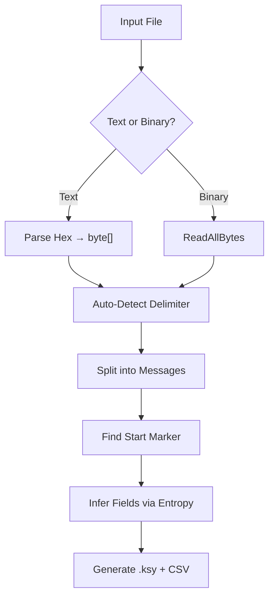

# **Serial Protocol Analyzer – Design & Algorithm Documentation**  
**Target**: `.NET Framework 4.7.2` | **Language**: C# 7.3 | **No External Dependencies**


## Table of Contents
1. [Overview](#overview)
2. [Input Types](#input-types)
3. [Core Algorithms](#core-algorithms)
4. [Data Structures](#data-structures)
5. [Step-by-Step Workflow](#workflow)
6. [C# Implementation](#c-implementation)
7. [Delimiter Detection (Universal)](#delimiter-detection)
8. [Marker Detection](#marker-detection)
9. [Field Inference](#field-inference)
10. [Output: Kaitai Struct + CSV](#output)
11. [Extensibility](#extensibility)

---

<a name="overview"></a>
## 1. Overview

This tool **automatically reverse-engineers** serial protocols from:

* **Text hex logs** (e.g. `5E 4B 4A ...`)
* **Raw binary captures** (`.bin`, `.cap`, `.raw`)

It **discovers**:

* Start / end markers
* Delimiters (`CR`, `LF`, `CRLF`, `NUL`, …)
* Fixed vs variable fields
* Field count and types

Then **generates**:

* **Kaitai Struct `.ksy`** (for [ide.kaitai.io](https://ide.kaitai.io))
* **CSV export**
* **Human-readable report**

---

<a name="input-types"></a>
## 2. Input Types Supported

| Type            | Example                              | Loader                 |
|-----------------|--------------------------------------|------------------------|
| **Text Hex Log**| `5E 4B 4A ... # ^KJIK000`           | `LoadHexTextFile()`    |
| **Binary Dump** | Raw bytes from scope                 | `LoadBinaryFile()`     |
| **Fixed-Length**| 16-byte frames                       | `DetectFixedLength()`  |

---

<a name="core-algorithms"></a>
## 3. Core Algorithms

| Algorithm                | Purpose                         | Complexity |
|--------------------------|---------------------------------|------------|
| **Frequency Counting**   | Find start/end markers          | `O(n × L)` |
| **Regularity Scoring**   | Validate delimiter spacing      | `O(n)`     |
| **Shannon Entropy**      | Detect fixed vs variable fields | `O(n)`     |
| **Dynamic Field Splitting**| Handle any delimiter           | `O(n)`     |
| **Fallback: Fixed Length**| No delimiter → chunking        | `O(1)`     |

---

<a name="data-structures"></a>
## 4. Data Structures

```csharp
class ByteSeq : IEquatable<ByteSeq>
{
    public byte[] Data { get; }
    public string Hex => BitConverter.ToString(Data).Replace("-", "");
    // Hash + Equals for Dictionary key
}

class DelimiterCandidate
{
    public byte[] Bytes { get; set; }
    public int Count { get; set; }
    public double Regularity { get; set; }
    public int AvgFields { get; set; }
    public double Score => Count * Regularity * (AvgFields > 0 ? AvgFields : 1);
}

List<byte[]> _lines;     // Raw input lines (text or binary)
List<byte[]> _messages;  // Split by start marker
```

---

<a name="workflow"></a>
## 5. Step-by-Step Workflow



---

<a name="c-implementation"></a>
## 6. C# Implementation (`.NET 4.7.2`)

### `ProtocolAnalyzer.cs`

```csharp
using System;
using System.Collections.Generic;
using System.IO;
using System.Linq;
using System.Text;
using System.Text.RegularExpressions;

namespace SerialProtocolAnalyzer
{
    // Immutable byte sequence for dictionary keys
    public class ByteSeq : IEquatable<ByteSeq>
    {
        public byte[] Data { get; }
        public ByteSeq(byte[] data) => Data = data;
        public string Hex => BitConverter.ToString(Data).Replace("-", "");
        public override int GetHashCode() => Data.Aggregate(0, (h, b) => h * 31 + b);
        public override bool Equals(object obj) => Equals(obj as ByteSeq);
        public bool Equals(ByteSeq other) => other != null && Data.SequenceEqual(other.Data);
    }

    // Candidate delimiter with scoring
    public class DelimiterCandidate
    {
        public byte[] Bytes { get; set; }
        public int Count { get; set; }
        public double Regularity { get; set; }
        public int AvgFields { get; set; }
        public double Score => Count * Regularity * (AvgFields > 0 ? AvgFields : 1);
    }

    public class ProtocolAnalyzer
    {
        private readonly List<byte[]> _lines;
        private readonly string _inputPath;

        public ProtocolAnalyzer(string inputPath)
        {
            _inputPath = inputPath;
            _lines = LoadLog(inputPath);
        }

        #region 1. Input Loaders

        private List<byte[]> LoadLog(string path)
        {
            var ext = Path.GetExtension(path).ToLower();
            if (new[] { ".bin", ".cap", ".raw" }.Contains(ext))
                return LoadBinaryFile(path);
            else
                return LoadHexTextFile(path);
        }

        private List<byte[]> LoadHexTextFile(string path)
        {
            var lines = new List<byte[]>();
            foreach (var line in File.ReadAllLines(path))
            {
                var hex = Regex.Matches(line, @"\b[0-9A-Fa-f]{2}\b")
                               .Cast<Match>()
                               .Select(m => m.Value)
                               .ToArray();
                if (hex.Length > 0)
                    lines.Add(hex.Select(h => Convert.ToByte(h, 16)).ToArray());
            }
            return lines;
        }

        private List<byte[]> LoadBinaryFile(string path)
        {
            var data = File.ReadAllBytes(path);
            var delim = DetectDelimiter(new List<byte[]> { data });
            return delim != null ? SplitBytes(data, delim) : new List<byte[]> { data };
        }

        #endregion

        #region 2. Delimiter Detection (Universal)

        public byte[] DetectDelimiter(List<byte[]> messages)
        {
            var allBytes = messages.SelectMany(m => m).ToArray();
            var candidates = new List<DelimiterCandidate>
            {
                new() { Bytes = new byte[] { 0x0D, 0x0A } }, // CRLF
                new() { Bytes = new byte[] { 0x0D } },       // CR
                new() { Bytes = new byte[] { 0x0A } },       // LF
                new() { Bytes = new byte[] { 0x00 } },       // NUL
                new() { Bytes = new byte[] { 0x7E } },       // ~
                new() { Bytes = new byte[] { 0x02, 0x03 } }  // STX/ETX
            };

            foreach (var c in candidates)
            {
                c.Count = messages.Sum(m => CountOccurrences(m, c.Bytes));
                c.Regularity = CalculateRegularity(allBytes, c.Bytes);
                c.AvgFields = (int)messages.Average(m => SplitBytes(m, c.Bytes).Count);
            }

            var best = candidates.OrderByDescending(c => c.Score).FirstOrDefault();
            return best?.Bytes;
        }

        private int CountOccurrences(byte[] data, byte[] seq)
        {
            if (seq.Length == 0) return 0;
            int count = 0;
            for (int i = 0; i <= data.Length - seq.Length; i++)
                if (data.Skip(i).Take(seq.Length).SequenceEqual(seq))
                    count++;
            return count;
        }

        private double CalculateRegularity(byte[] data, byte[] delim)
        {
            var pos = new List<int>();
            for (int i = 0; i <= data.Length - delim.Length; i++)
                if (data.Skip(i).Take(delim.Length).SequenceEqual(delim))
                    pos.Add(i);

            if (pos.Count < 2) return 0;
            var gaps = new List<int>();
            for (int i = 1; i < pos.Count; i++)
                gaps.Add(pos[i] - pos[i - 1] - delim.Length);

            double avg = gaps.Average();
            double variance = gaps.Sum(g => Math.Pow(g - avg, 2)) / gaps.Count;
            return 1.0 / (1 + Math.Sqrt(variance));
        }

        private List<byte[]> SplitBytes(byte[] data, byte[] delim)
        {
            var parts = new List<byte[]>();
            int start = 0;
            for (int i = 0; i <= data.Length - delim.Length; i++)
            {
                if (data.Skip(i).Take(delim.Length).SequenceEqual(delim))
                {
                    parts.Add(data.Skip(start).Take(i - start).ToArray());
                    start = i + delim.Length;
                    i += delim.Length - 1;
                }
            }
            if (start < data.Length)
                parts.Add(data.Skip(start).ToArray());
            return parts.Where(p => p.Length > 0).ToList();
        }

        #endregion

        #region 3. Marker Detection

        public Dictionary<ByteSeq, double> FindMarkers(int minLen = 2, int maxLen = 10, double threshold = 0.7)
        {
            var counts = new Dictionary<ByteSeq, int>();
            int total = _lines.Count;

            foreach (var line in _lines)
            {
                for (int len = minLen; len <= maxLen && len <= line.Length; len++)
                {
                    var start = new ByteSeq(line.Take(len).ToArray());
                    var end = new ByteSeq(line.Skip(line.Length - len).ToArray());

                    if (!counts.ContainsKey(start)) counts[start] = 0;
                    if (!counts.ContainsKey(end)) counts[end] = 0;
                    counts[start]++;
                    counts[end]++;
                }
            }

            return counts
                .Where(kv => kv.Value >= threshold * total)
                .ToDictionary(kv => kv.Key, kv => (double)kv.Value / total);
        }

        #endregion

        #region 4. Field Inference

        public List<(string name, string type, int? size)> InferFields(List<byte[]> messages, byte[] delimiter)
        {
            var split = messages.Select(m => SplitBytes(m, delimiter)).ToList();
            if (!split.Any()) return new List<(string, string, int?)>();

            int maxFields = split.Max(s => s.Count);
            var columns = new List<byte[]>();

            for (int i = 0; i < maxFields; i++)
            {
                var col = split.Where(s => i < s.Count).Select(s => s[i]).ToArray();
                columns.Add(col);
            }

            var fields = new List<(string, string, int?)>();
            for (int i = 0; i < columns.Count; i++)
            {
                double entropy = ShannonEntropy(columns[i]);
                string type = entropy < 1.8 ? "fixed" : "variable";
                fields.Add(($"field_{i}", type, type == "fixed" ? 1 : (int?)null));
            }
            return fields;
        }

        private double ShannonEntropy(byte[] data)
        {
            if (data.Length == 0) return 0;
            var freq = new int[256];
            foreach (var b in data) freq[b]++;
            double entropy = 0;
            foreach (var f in freq)
            {
                if (f > 0)
                {
                    double p = (double)f / data.Length;
                    entropy -= p * Math.Log(p, 2);
                }
            }
            return entropy;
        }

        #endregion

        #region 5. Output Generation

        public string GenerateKaitai(List<(string name, string type, int? size)> fields, ByteSeq startMarker, byte[] delimiter)
        {
            var sb = new StringBuilder();
            sb.AppendLine("meta:");
            sb.AppendLine("  id: auto_detected_protocol");
            sb.AppendLine("  endian: be");
            sb.AppendLine("seq:");

            if (startMarker != null)
            {
                sb.AppendLine("  - id: start_marker");
                sb.AppendLine($"    size: {startMarker.Data.Length}");
                sb.AppendLine($"    contents: [{string.Join(", ", startMarker.Data.Select(b => $"0x{b:X2}"))}]");
            }

            foreach (var (name, type, size) in fields)
            {
                sb.AppendLine($"  - id: {name}");
                if (type == "fixed" && size.HasValue)
                {
                    sb.AppendLine($"    size: {size}");
                }
                else
                {
                    sb.AppendLine("    type: str");
                    sb.AppendLine("    encoding: ASCII");
                    sb.AppendLine($"    terminator: 0x{BitConverter.ToString(delimiter).Replace("-", "")}");
                    sb.AppendLine("    consume-terminator: true");
                }
            }
            return sb.ToString();
        }

        public void ExportCsv(List<byte[]> messages, byte[] delimiter, string path)
        {
            var rows = messages.Select(m => SplitBytes(m, delimiter).Select(b => Encoding.ASCII.GetString(b))).ToList();
            using (var w = new StreamWriter(path))
            {
                w.WriteLine(string.Join(",", Enumerable.Range(0, rows.Max(r => r.Count)).Select(i => $"Field_{i}")));
                foreach (var row in rows)
                    w.WriteLine(string.Join(",", row.Select(f => $"\"{f}\"")));
            }
        }

        #endregion

        #region Main Analyze

        public void Analyze(string ksyPath = "protocol.ksy", string csvPath = "output.csv")
        {
            Console.WriteLine($"Loaded {_lines.Count} records.");

            var markers = FindMarkers();
            ByteSeq startMarker = markers.Any() ? markers.OrderByDescending(kv => kv.Value).First().Key : null;

            var delimiter = DetectDelimiter(_lines);
            Console.WriteLine($"Delimiter: {(delimiter != null ? BitConverter.ToString(delimiter) : "None")}");

            var messages = startMarker != null
                ? SplitMessages(startMarker)
                : _lines.Select(l => l).ToList();

            var fields = InferFields(messages, delimiter ?? new byte[] { 0x0D, 0x0A });
            Console.WriteLine($"Inferred {fields.Count} fields.");

            var ksy = GenerateKaitai(fields, startMarker, delimiter);
            File.WriteAllText(ksyPath, ksy);
            Console.WriteLine($"Kaitai Struct → {ksyPath}");

            ExportCsv(messages, delimiter, csvPath);
            Console.WriteLine($"CSV → {csvPath}");
        }

        private List<byte[]> SplitMessages(ByteSeq marker)
        {
            var msgs = new List<byte[]>();
            var cur = new List<byte[]>();
            foreach (var line in _lines)
            {
                if (line.Take(marker.Data.Length).SequenceEqual(marker.Data))
                {
                    if (cur.Any()) msgs.Add(cur.SelectMany(b => b).ToArray());
                    cur = new List<byte[]> { line };
                }
                else cur.Add(line);
            }
            if (cur.Any()) msgs.Add(cur.SelectMany(b => b).ToArray());
            return msgs;
        }

        #endregion
    }

    // === PROGRAM ===
    class Program
    {
        static void Main(string[] args)
        {
            if (args.Length == 0)
            {
                Console.WriteLine("Usage: Analyzer.exe <file.txt|file.bin>");
                return;
            }
            new ProtocolAnalyzer(args[0]).Analyze();
            Console.WriteLine("Done.");
            Console.ReadKey();
        }
    }
}
```

---

<a name="delimiter-detection"></a>
## 7. Delimiter Detection – How It Works

```csharp
Score = Count × Regularity × AvgFieldCount
```

* **Count** – how many times the delimiter appears  
* **Regularity** – are the gaps between occurrences consistent?  
* **AvgFieldCount** – does splitting give more than one field?

**Example**: `0D 0A` appears 100 times, gaps = 20 ± 2 → **high score**

---

<a name="marker-detection"></a>
## 8. Marker Detection

* Scan **first / last N bytes** of each line  
* Count frequency  
* **Threshold** ≥ 70 % → **start marker**

---

<a name="field-inference"></a>
## 9. Field Inference via Entropy

| Entropy | Meaning |
|---------|---------|
| < 1.8   | Fixed field (`"pH "`) |
| > 3.0   | Variable (`"4.57"`) |

---

<a name="output"></a>
## 10. Output Examples

### `protocol.ksy`
```yaml
meta:
  id: auto_detected_protocol
  endian: be
seq:
  - id: start_marker
    size: 10
    contents: [0x5E, 0x4B, 0x4A, 0x49, 0x4B, 0x30, 0x30, 0x30, 0x0D, 0x0A]
  - id: field_0
    type: str
    encoding: ASCII
    terminator: 0x0D0A
    consume-terminator: true
```

### `output.csv`
```csv
Field_0,Field_1,Field_2
"25-10-2025","01:25:16","  0.00 kg"
```

---

<a name="extensibility"></a>
## 11. Extensibility

| Feature            | How to Add                     |
|--------------------|--------------------------------|
| **Checksum**       | Add `ValidateChecksum()`       |
| **Real-time COM**  | Use `SerialPort`               |
| **GUI**            | WinForms + `DataGridView`      |
| **Plotting**       | ScottPlot                      |
| **Wireshark**      | Export Lua dissector           |


## Note: Reference Algorithms: 
* Aho-Corasick
* Needleman-Wunsch 
* Shannon Entropy
