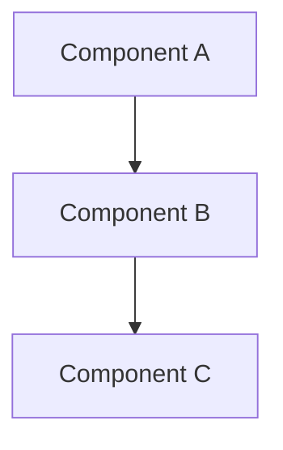

# NSerialCommTools Documentation Project Instructions

## Project Overview
This is a .NET 4.7.x serial communication project with multiple components.

## Project Structure

### Projects to FOCUS ON:
1. **NLib.Serial.Devices** (01.Core folder)
   - Core serial communication classes
   - Device implementations for various serial devices
   - Located at: `01.Core\NLib.Serial.Devices\`

2. **NLib.Serial.Emulator.App** (09.App folder)
   - Serial device emulator application
   - Located at: `09.App\NLib.Serial.Emulator.App\`

3. **NLib.Serial.Terminal.App** (09.App folder)
   - Serial terminal application for testing/usage
   - Located at: `09.App\NLib.Serial.Terminal.App\`

### Projects to IGNORE:
- **NLib** (00.NLib folder) - Foundation library, do not analyze

### Reference Materials:
- **Documents/LuckyTex Devices/** - Contains log data captured from third-party tools
  - Used as reference for implementing the Core serial classes
  - Folders: DEFENDER3000, JIK6CAB, MS204TS00, PH Meter, TFO1, TFO3, WEIGHT QA, WEIGHT SPUN

## Technology Stack
- .NET Framework 4.7.x ONLY
- NO .NET Core code
- C# Windows Forms/WPF applications

## Documentation Requirements

### Task: Generate Comprehensive Documentation

Create detailed documentation that explains how the code works, including:

1. **Architecture Overview**
   - System components and their relationships
   - Project dependencies

2. **Mermaid Diagrams** (multiple types):
   - Component diagrams
   - Flowcharts
   - Sequence diagrams
   - Class diagrams
   - State diagrams

3. **Code Analysis**
   - How each device implementation works
   - Serial communication protocols used
   - Data flow and processing logic

4. **Device Implementations**
   - Document each device class in NLib.Serial.Devices:
     - CordDEFENDER3000
     - CordJIK6CAB
     - MettlerMS204TS00
     - PHMeter
     - SerialDevices (base classes)
     - TFO1
     - WeightQA
     - WeightSPUN

## CRITICAL DOCUMENTATION STANDARDS

### Diagram Requirements
**ALL DIAGRAMS MUST USE MERMAID SYNTAX ONLY**
- ❌ NO ASCII art diagrams (using characters like ┌─┐│└)
- ❌ NO plain text box diagrams
- ✅ ONLY Mermaid diagram syntax in code blocks

### Mermaid Diagram Types to Use:
- **Component/Architecture:** `graph TD` or `graph LR`
- **Flowcharts:** `flowchart TD` or `flowchart LR`
- **Sequence:** `sequenceDiagram`
- **Class:** `classDiagram`
- **State:** `stateDiagram-v2`
- **Entity Relationship:** `erDiagram`

### Example Format:

## Documentation Process

### IMPORTANT: Use Tracking File
1. **Before generating documentation:**
   - Create a tracking file to manage documentation tasks
   - Break down into sub-tasks for each component/diagram type

2. **During generation:**
   - Mark each sub-task as completed when done
   - Update the tracking file after each completion

3. **Tracking file should include:**
   - Task breakdown for each project
   - Diagram types needed for each component
   - Status for each sub-task (pending/in-progress/completed)

## Workflow
1. Analyze the three main projects
2. Create detailed task breakdown in tracking file
3. Generate documentation incrementally
4. Update tracking file as each task completes
5. Reference log data in Documents folder for device protocol understanding

## Output Location
- Documentation should be created in an appropriate location (suggest: `Documents/Generated/` or similar)
- Keep tracking file easily accessible

## Session Continuity
This `claude.md` file contains instructions that can be referenced in future sessions to maintain context and continue documentation work.
